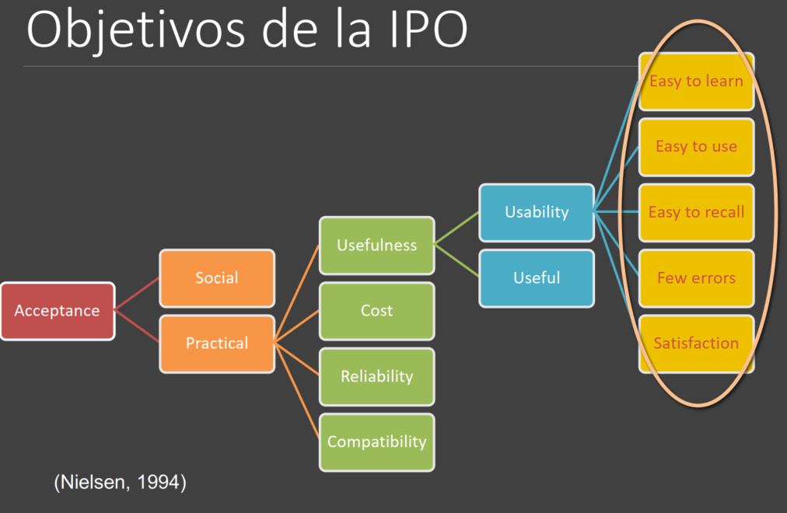

# Interfaces de Usuario

# Información

[Notas](https://www.notion.so/Notas-c5d8e9e57e2446a884c4add67cb65874)

Magistral: Ana Tajadura Jimenez

Practicas: Teresa Onorati tonorati@uc3m.es Tutorias: Martes 12:30-14:00 pero flexible Online

# Teoría

- TEMA 1

    [tema1-hci.pdf](IU/tema1-hci.pdf)

    # Interacción Persona-Ordenador:

    - Estamos desde el punto de vista del usuario, para ver como de accesible y fáciles de usar son los productos interactivos.
      
        - Primero se llamó Man-Machine Interface, después Human-Computer Interaction - HCI ó IPO.
    - Los productos interactivos: Aquellos que al recibir datos del usuario realizan acciones o devuelven un resultado. Pueden tener diferente tamaño, uso y características.
      
        - Un lenguaje de entrada para el usuario, de salida para el sistema y un protocolo de interacción.
    - Los productos están diseñados para desempeñar una tarea, pero no siempre se tiene en cuentas las personas reales que los utilizan, hay que tener en cuenta quien y como lo van a utilizar.
    - Lo primero es pensar en el usuario, saber a quién va dirigido y escuchar sus necesidades.
        - Factores:
            - Visibilidad.
            - Causalidad.
            - Restricciones visibles.
            - Coincidencia (“Mapping”): Debe reflejar la relación natural entre las cosas (Que se pueda asociar observando)
            - Efectos de transferencia.
            - Estereotipos de los usuarios.
            - Modelos conceptuales.
            - Diferencias individuales, culturales.
        - Los controles necesitan ser visibles (visibilidad) con una buena representación de sus efectos (causalidad) , y su diseño debería sugerir su funcionalidad (mapping).
        - La gente tiene modelos mentales de cómo funcionan las cosas por asociación con otras y pueden simular mentalmente la operación, pero pueden ser erróneos y hay que buscar un equilibrio entre utilidad y diseño.
            - Ejem: Buen IPO Volante, deja simple un sistema complejo.  Mal IPO Control video, no se asocia lo que hace con los símbolos.
    - La primera IPO fue con el ratón, que permitía interactuar con el sistema mediante un dispositivo externo con una interfaz.
    - El objetivo de la IPO es desarrollar o mejorar:
        - Seguridad – en el trabajo.
        - Utilidad – qué puede hacer el sistema.
        - Efectividad – Lograr su función.
        - Eficiencia – Emplear menos recursos.
        - Usabilidad o la capacidad de ser usados – fácil de usar, fácil aprendizaje y libre de errores.
            - Para obtener una buena usabilidad, es necesario encontrar los factores que determinen como se usan, desarrollar las herramientas y técnicas que ayuden a los diseñadores a crear sistemas eficientes, efectivos y seguros para el usuario.
                - Diagrama

                    

    - Factores relacionados con HCI
        - Diagrama

            

    - Es multidisciplinar, implica diseño, evaluación e implementación sistemas interactivos y el estudio de los grandes fenómenos alrededor del dicho sistema.
        - Sociología - Entender como la estructura social y la organización de las personas afectan a la manera de las personas de realizar las tareas.
        - Psicología - El comportamiento humano y sus procesos mentales.
        - Ciencias de la información - Lenguaje e internacionalización.
        - Computer Science - Entender la tecnología y técnicas de diseño, desarrollo y administración de sistemas de ordenadores
        - Ergonomía o factores humanos - Adaptarse a las capacidades de los humanos, vista, peso, altura, etc.
    - Interacción: Es el proceso de comunicación que se establece entre el usuario y el sistema. Es un diálogo para completar una tarea.
        - El sistema realiza, simplifica o da soporte a alguna tarea.
        - La interfaz funciona como intermediario entre ambos, mediante ella se produce la comunicación y debe diseñarse para que la interacción tenga éxito.
    - Modelo: Es una representación abstracta de una realidad compleja que se utiliza para facilitar su compresión y el estudio de su comportamiento. Simplifican los factores a tener en cuenta. Los hay de muchos tipos.

    ## Modelos de interacción:

    - Algunos ayudan a comprender el proceso de interacción, otros a identificar los problema que se pueden producir, pero ambos simplifican la tarea de pensar en todos los posible factores que pueden afectar a la interacción, siguiendo solo unas pautas.
    - Términos:
        - Dominio: Área de habilidad y conocimiento en alguna actividad del mundo real. Área de personas que engloba.
        - Meta: Qué se quiere conseguir.
        - Tarea: Cómo quieres conseguir tu meta, por medio de qué o haciendo qué.
        - Acciones: Tarea que no implica la resolución de problemas.
        - Plan: Conjunto de tareas para conseguir una meta.

    ### Modelo de Norman:

    - Se basa en: Ejecución y Evaluación.
        - El usuario formula un plan de acciones que ejecuta utilizado la interfaz del sistema.
        - Cuando el plan, o parte del plan, se ha ejecutado, el usuario observa la interfaz para evaluar el resultado y comprobar si hacen falta más acciones.
    - Hay dos lenguajes:
        - Lenguaje del sistema: El del núcleo, representa el estado del sistema.
        - Lenguaje del usuario: El de la tarea, representa el estado del usuario.
    - Ciclo:
        1. Establecer meta.
        2. Formular intención.
        3. Especificar las acciones que nos moverán a través de la interfaz.
        4. Ejecutar las acciones.
        5. Percibir el estado del mundo.
        6. Interpretar el estado del mundo.
        7. Evaluar el estado del mundo respecto a la meta.
    - Problemas para el usuario:
        - Abismo de ejecución (execution gulf): Diferencia entre las acciones que el usuario quiere realizar para alcanzar su objetivo y las que el sistema permite.
        - Abismo de evaluación (evaluation gulf): Diferencia entre la presentación física del estado del sistema y lo que esperaba el usuario.
        - Distancia semántica: La relación entre el significado de los elementos en la interfaz y el objetivo que el usuario quiere. La diferencia entre lo que hace ese elemento y lo esperábamos por su representación
        - Distancia articulada: El número de acciones de más que requiere una acción de las pensadas con respecto al significado de los elementos de la interfaz.

    ### Modelo de Abowd & Beale:

    - Respecto al modelo de Norman se influye la IU de forma explícita, que realiza la traducción entre lenguaje de usuario y lenguaje del sistema y viceversa.
        - Diagrama

            

- TEMA 2 - Interfaces de Usuario

    [tema2-1-InterfazUsuario.pdf](IU/tema2-1-InterfazUsuario.pdf)

    # Interfaz de usuario

    - Es el canal a través del cual se produce la comunicación entre el usuario y el ordenador, física (ergonómica) en dispositivos y Lógica (usable y fácil) en dispositivos y sistemas. La interacción es un dialogo para completar una tarea.
    - Debe ser diseñada para ser eficiente y satisfactoria. El dialogo lo más fluido posible.
    - Es importante para transformar la complejidad tecnológica en un producto útil, utilizable y atractivo para sus usuarios.
    - Tipos:
        - Textual.
        - Gráfica
        - Multimedia
        - Multimodal
        - Conversacional
        - ...
    - Tipos de interfaces interactivas:
        - Comandos: Cada comando se ejecuta en un terminal y el sistema responde con el resultado correspondiente.
            - Eficiente, precisa y veloz, a pesar de ser difícil de aprender.
            - Utilizada como alternativa para personas con discapacidad visual.
        - WIMP y GUI – Graphic User Interface
            - Ventanas: Se puede minimizar, maximizar, cambiar el tamaño y estilo.
                - Se inventaron para superar las limitaciones físicas de la pantalla de un ordenador para visualizar más información y ejecutar más tareas.
                - Si se abren demasiadas ventanas podrían resultar difícil de gestionar, para ello se pueden reducir a un icono en la barra de tareas, listar todas o moverse fácilmente.
                - Tipos:
                    - Tiled Windows: Ventanas en forma de baldosas, que se pueden coger y arrastrar.
                    - Overlapping Windows: Ventanas sobrepuestas, hace uso eficiente de todo el espacio de la pantalla, pero difícil de manejar.
                    - Cascading Windows: Ventanas en cascada, hace uso eficiente de todo el espacio de la pantalla y fácilmente organizables.
                - Posibles interfaces:
                    - Multiple Document Interface – MDI:
                        - Centrada en la aplicación.
                        - Una aplicación lanza una ventana principal que funciona como espacio de trabajo para todos los documentos.
                        - Las ventanas hijo pueden minimizarse dentro de las padres.
                        - Ventajas:
                            - Recursos del sistema se conservan.
                            - No abarrotamiento visual.
                            - Ver múltiples documentos a la vez.
                        - Desventajas:
                            - Los menús cambian según el documento.
                            - Todos los documentos dentro del área de trabajo.
                            - Las ventanas hijo están dentro de la padre y puede ser complejo visualmente.
                    - Single Document Interface – SDI:
                        - Centrada en el documento. Una ventana para cada documento.
                        - Ventajas:
                            - Todos los menús y barras de herramientas reflejan la visión del usuario.
                            - Menos complejo visualmente.
                        - Desventajas:
                            - No se pueden agrupar ventanas, las barra de tareas puede aparecer llena.
                            - La transición entre ventanas puede ser compleja.
                    - Tabbed Document Interface – TDI:
                        - Variante de MDI.
                        - Incorpora el uso de pestañas para cambiar entre documentos.
                        - Algunas fijas el tamaño a máximo y otras permiten cambiar el tamaño y minimizar las ventanas de documento y se convierten en MDI.
                    - Cajas de dialogo:
                        - Espacio en el que llevar a cabo funcionalidades relacionadas pero secundarias, como:
                            - Gestionar las propiedades de un objeto
                            - Ejecutar funciones o procesos
                            - Confirmar acciones
                            - Alertar errores.
                        - Pueden ser:
                            - Modales: El usuario no puede hacer otra cosa hasta que haya terminado las acciones por la que se abrió.
                            - No modales: El usuario puede acceder a otras funcionalidades del programa mientras el dialogo está abierto.
                        - Se pueden encadenar cajas de dialogo para proporcionar acceso a funcionalidades avanzadas.
                    - Otros elementos:
                        - Paneles:
                            - Agrupación visual de funcionalidades relacionadas.
                            - Forma eficiente de acceder a las funcionalidades sin usar menús.
                        - Marcos:
                            - Pueden minimizarse y cambiarse de tamaño.
                            - Suelen usarse para separar áreas de navegación.
                        - Pestañas:
                            - Permiten incrementar el tamaño del dialogo apilando niveles y facilitan que se acceda a más elementos.
            - Iconos: Representan aplicaciones, objetos, comandos y herramientas que se pueden ejecutar al hacer clic.
                - Son más fáciles de aprender y recordar que los comandos. Son muy utilizados.
                - Ocupan poco espacio y permiten moverse en la pantalla.
                - Tipos:
                    - Similar:
                    - Analógica: Se asocia mentalmente.
                    - Arbitraria: No hay relación.
            - Menús: Lista de opciones que pueden ser exploradas.
                - Tipos:
                    - Listas: Ideal pocas opciones que se quieren visualizar al mismos tiempo y en una pantalla pequeña.
                    - Expansible: Ideal para muchas opciones. Enseñar múltiples opciones en una sola pantalla.
                    - Contextual: Las opciones ofrecidas dependen del contexto de la tarea.
            - Puntero: Un ratón lo controla para entrar en una ventana, un menú o unos iconos en pantalla.
            - El nuevo objetivo es diseñar interfaces óptimas para tablets, smartphones y smartwatches.
        - Multimedia
            - Combinación de diferentes media en la misma interfaz ofreciendo distintos modos de interactuar.
            - Facilita el acceso a diferentes tipos de información.
            - Mejora el aprendizaje y al aceptación por parte de los usuarios.
        - Realidad Virtual
            - Es una simulación gráfica generada por ordenador que genera la ilusión de participar en un entorno no real.
            - Los usuarios pueden interactuar con los objetos y navegar en un entorno 3D con un alto sentido de presencia.
        - Tableros gráficos
            - Utilizados para visualizar datos complejos.
            - Mejoran la capacidad de pensamiento y aprendizaje de los usuarios que pueden reconocer patrones o anomalías en los datos.
            - Técnicas:
                - Mapas interactivos 3D.
                - Arboles
                - Clusters
            - Hay que tomar decisiones de diseño para ofrecer la información de la mejor manera.
        - Movil
            - Pensados para utilizarse en movimiento a lo largo del día.
            - Hay que tener en cuenta las reducidas dimensiones de las pantallas.
            - Muchas aplicaciones son para la diversión y no contestar una necesidad.
        - Voz
            - Se utiliza para acceder algún tipo específico de información.
            - También para facilitar la interacción con personas con algún tipo de discapacidad.
        - Compartida
            - Diseñadas para ser utilizadas por más usuarios y recibir varios inputs al mismo tiempo.
            - Se suelen utilizar pantallas de grandes dimensiones, deben tener en cuenta el tamaño de las pantallas
        - Cerebro-ordenador
            - Permiten establecer una comunicación bidireccional entre las ondas cerebrales del usuario y un dispositivo exterior.
            - Se utilizan para juegos o para permitir a las personas paralelizadas.
            - Los usuario deben estar concentrados, ya que detecta cambios en las funcione neuronales.
    - La interfaz que debemos utilizar depende del tipo de tarea, usuario, contexto, coste, características que se quieren garantizar.
    - También hay que tener en cuenta que hoy en día los móviles se utilizan más que los ordenadores, queremos hacer más cosas al mismo tiempo y se usan interfaces basadas en comando vocales.
    - Las interfaces compartidas y táctiles son bastante comunes en espacios como casas, escuelas, lugares públicos y de trabajo.

    # Usabilidad

    El primer diseño no es el bueno, hay que implicar al usuario e iterar la consulta al usuario y el diseño.

    - Usabilidad: Es la cualidad de un sistema respecto a la facilidad de uso, la facilidad de aprendizaje y la satisfacción del usuario. Fácil de usar, fácil de aprender, efectivo, eficiente, útil y seguro.
    - Es la propiedad que refleja la facilidad de uso de un sistema informático.
        - Un buen diseño hace que sea fácil de entender y utilizar.
        - Un diseño pobre hace que sea difícil de utilizar
    - Beneficios:
        - Reducción de costes de aprendizaje, de asistencia y ayuda al usuario.
        - Mejora la aceptación, la calidad de vida de los usuarios, el prestigio y la imagen del sistema.
        - Reducción de los coses de producir y aumento de la productividad.
    - Usabilidad vs User Experience:
        - La experiencia del usuario representa todos los aspectos de la interacción del usuario final con la empresa, servicio y productos.
        - La usabilidad representa lo fácil de aprender, eficiente de usar, agradable de un producto. La experiencia total es más amplia.
    - Es necesario que el sistema hable el mismo lenguaje del usuario:
        - Demasiadas opciones representan una carga adicional de información, el usuario tendrá que hacer un esfuerzo extra para aprender, entender y buscar.
        - La información, así como las funcionalidades del sistema se deben presentar con un lenguaje natural e iconos fáciles de entender.
        - Hay que garantizar una correspondencia entre lo que visualiza el sistema y el modelo metal del usuario.
        - Hay que analizar las necesidades del usuario y su entorno.
    - El diseño de la interfaz de usuario se basa en el uso de diferentes metáforas:
        - Las metáforas podrían tener problemas de internacionalización.
        - Hay que tener en cuenta el bagaje cultural de los usuarios.
        - Las evaluaciones con los usuarios son necesarias para valorar el significado de las metáforas definidas.
    - Hay que tener en cuenta varios factores relacionados con el ser humano para poder diseñar una interfaz usable:
        - La percepción visual: Depende del ángulo de visión, nos permite conocer el tamaño y de la profundidad de un objeto.
            - Leyes de la Gestalt: Son un conjunto de principios sobre como las personas perciben y organizan los elementos.
                - Ley de cierre: La imaginación tiende a completar las imágenes.
                - Ley de la figura y fondo: El fondo tiende a no ser percibido.
                - Ley de la simplicidad: Los elemento se perciben de la forma más simple.
            - Brillo: Cantidad de luminancia perceptible que proporciona un objeto.
                - Mayor luminancia más agudeza visual y frecuencia de parpadeo.
            - Contraste: Relación entre el brillo del texto y el del fondo.
                - El contraste negativo se lee mejor, pero produce más cansancio.
            - Color: Compuesto por matiz, intensidad y saturación ( cantidad de blanco).
                - Se aconseja usar entre 5 y 7 colores, los grises más idóneos.
                - Debe ser accesible en blanco y negro.
                - Utilizar para categorizar, diferenciar o evidenciar.
                - Teoría del color: No existe una receta para hacer buenas combinaciones de colores, pero si propiedades.
                    - Colores primarios: Amarillo, rojo y azul.
                    - Colores complementarios: Aquellos que están opuestos en el circulo cromático que generan gran contraste.
                    - Colores análogos: Colores a ambos lados de cualquier color. Son la base de los esquemas armónicos.
                    - Triada: 3 colores equidistantes. Armónico y con contraste.
                    - Split complementario: Un color y los adyacentes a su complementario. Mucho contraste.
                    - Tetradica: Dos colores y sus complementarios
        - La lectura
        - El oído
        - El tacto
        - El movimiento: Hay factores relevantes relacionados con el movimiento de la mano, los brazos, etc. Como la velocidad de reacción y precisión.
            - Ambas mejoran con la práctica y disminuyen con el cansancio.
        - La memoria:
            - Memoria sensorial: icónica, ambiental, del tacto…
            - Memoria a corto plazo: Información fugaz y capacidad limitada.
            - Memoria a largo plazo: Tiempo indefinido y capacidad ilimitada. Información experimental y comportamientos.
        - El pensamiento:
            - El razonamiento es el proceso por el cual el conocimiento que tenemos infiere algo nuevo sobre el dominio.
            - Tipos de razonamiento:
                - Deductivo: Derivación lógica.
                - Inductivo: Generalización de casos.
                - Abductivo: Explicación para efectos observados, acumulación de observaciones.
            - Se gana habilidad con el uso de los sistemas.
            - La resolución de problemas es el proceso de encontrar solución a una tarea no familiar utilizando el conocimiento previo.

    # Principios de diseño

    Son abstracciones generalizables que sirven para orientar a los diseñadores. Proceden de la teoría, la experiencia y el sentido común, aunque no existe una regla que siempre funcione.

    - Hay que entender al usuario, hacer las interfaces intuitivas y mantener la consistencia. Debemos buscar la claridad y la simplicidad.
    - Proporcionar pistas visuales y auditivas
        - Organizar los controles y opciones.
        - Esconder lo que no se puede utilizar.
        - Ofrecer diferentes feedback para informar del estado actual.
    - Ayudar a la legibilidad.
    - Proporcionar soporte con el teclado.
    - La pantalla: La información visualizada en pantalla siempre tiene elementos artísticos y que requieren creación.
        - Principios básicos:
            - Elegancia y simplicidad.
            - Estilo refinado, unitario y adecuado.
            - Escala, contraste y proporción.
            - Armonía entre los elementos.
            - La información debe estar agrupada, jerarquías y relaciones.
    - Mensajes de error: Deben ser claros, específicos y ayudar a resolver el problema.
        - Se debe incluir el diseño de estos mensajes dentro del proceso de desarrollo.
        - Deben contener consejos constructivos y el tono debe ser positivo.
    - Tipos de artefactos:
        - Heurísticas: Abstracciones generalizables basadas en la experiencia, el sentido común o la teoría.
            - Las heurísticas más importantes son las de Nielsen:
                1. Visibilidad del estado del sistema
                2. Coincidencia entre el sistema y el mundo real
                3. Control del usuario y libertad
                4. Consistencia y estandarización
                5. Prevención de errores
                6. Reconocimiento antes que recuerdo
                7. Flexibilidad y eficiencia de uso
                8. Estética y diseño minimalista
                9. Ayudar a los usuarios a reconocer, diagnosticar y recuperar la situación cuando se produce un error
                10. Ayuda y documentación
        - Guías de diseño: Recomendaciones de diseño basadas en la experiencia y orientadas a mejorar la experiencia de uso de la interfaz.
        - Patrones de diseño: Soluciones que se han demostrado que no satisfactorias a problemas recurrentes y que están recopiladas de forma sistemática.
            - Documentan la solución a un problema frecuente, de tal manera que no solo dejan constancia de esa experiencia, sino que posibilitan su reutilización.
            - Los patrones de diseño son documentos que capturan la práctica(no la teoría), presentando el diseño a diferentes niveles. Asisten en el desarrollo de diseños completos. Son intuitivos y legibles.
            - Tienen siempre el mismo formato predefinido:
                - Nombre
                - Exposición del problema
                - Solución
                - Ventajas y desventajas de la solución
                - Ejemplos donde el patrón ha sido aplicado.
                - Patrones relacionados.
        - Métodos de inspección: Conjunto de procedimientos que permiten evaluar una interfaz de determinar su grado de usabilidad.

    # Metodología y Prototipado

    ## El proceso de diseño

    

    - What is wanted: Que conocen los usuarios y que necesitan.
        - Conocer al usuario:
            - Los usuarios o stakeholders son aquellos que lo van a usar o están afectado por el sistema.
            - Es importante hablar con ellos y observarlos, hay que identificarlos y crear perfiles de usuarios del sistema. Se pueden definir personas.
            - Persona: Representación de un usuario ficticio típico, descripción detallada de un usuario típico del sistema, incluyendo objetivos, capacidades, actitudes, tareas y contexto.
        - Métodos etnográficos:
            - Cada acción está relacionada con el sitio, el contexto social y el momento en el que se lleva a cabo.
            - Se observa la interacción entre las personas y entre las personas y el contexto en el que se encuentran para tomar nota de la información más relevante y útil para el desarrollo del sistema.
            - El contexto puede estar relacionada a una situación particular.
    - Analysis: Analizamos los requisitos.
        - Conocer al usuario:
            - Analizar los resultados obtenidos de la observación de los usuarios y de las entrevistas.
            - Identificar los factores más relevantes de la fase de diseño.
            - Analizar como los usuarios llevan a cabo las tareas con sistemas similares.
            - Utilizar modelos cognitivos para representar la interacción entre los usuarios y los sistemas.
    - Design: Como y el que.
        - Diseño centrado en el usuario:
            1. El diseñador se hace una idea de cuáles son las necesidades del usuario y las tareas.
            2. El diseñador traslada sus ideas al diseño del sistema.
            3. El usuario interpreta la interfaz del sistema y se hace una idea propia de cómo funciona.
            - Cuando la idea no corresponde con la del diseñador, se rediseña o se frustrará.
            - El usuario es el centro del proceso de diseño.
            - El usuario tiene que entender la imagen del sistema definida por el diseñador.
                - User requirements: Entender y especificar el contexto de uso.
                  
                    - Identificar a los usuarios a los que se dirige el producto, para que lo usaran y en qué condiciones.
                - Analysis: Especificar requisitos.
                    - Identificar los objetivos del usuario que el producto deberá satisfacer.
                    - Se llevarán a cabo actividades que involucran el usuario, como entrevistar, grupos focales, etc.
                - Design: Producir varias soluciones de diseño a través de prototipos.
                  
                    - Los prototipos se podrán diseñar con varios niveles de detalles dependiente de las necesidades del diseñador.
                - Evaluation: La evolución es la fase más importante del proceso.
    
                    - Se validan los prototipos para comprobar si satisfacen los requisitos o por el contrario se detectan problemas de usabilidad.
- Diseño iPhone
  
  
    - Prototype: Creación de un prototipo para captar nuevos requisitos y cambios.
        - ¿Qué es?
            - Conjunto de bocetos de las pantallas.
            - Storyboard, escenas en estilo animado.
            - Presentación PowerPoint
            - Video de la simulación.
            - Objeto físico de algún material específico.
            - Mock-up en papel.
            - Sistema con un conjunto limitado de funcionalidades.
        - ¿Por qué?
            - Evaluar la idea del diseñador y recibir feedback.
            - Para que los stakeholder vean, toquen e interactúen.
            - Para tomar decisiones sobre el diseño más fácilmente.
            - Testear ideas.
        - The Rapid Prototyping Process: Proceso en tres fases para construir y mejorar prototipos rápidamente.
            1. Definir el prototipo especificando cualquier interacción o funcionalidad se quiere añadir.
            2. Evaluar el prototipo con o sin usuarios dependiendo del contexto y de la fase de diseño en, aunque nos encontramos.
            3. Redefinir el prototipo. Se pueden ir añadiendo más funcionalidades o más detalles.
            - Se itera el proceso hasta llegar a una versión adecuada.
        - Según cualidades:
            - Representación - forma física.
            - Fidelidad – precisión o el nivel de detalle y de realismo.
                - Fidelidad funcional: Prototipos horizontales, mayor número de funcionalidades, pero bajo nivel de detalle.
                - Fidelidad visual: Prototipos verticales, menor número de funcionalidades, pero alto nivel de detalle.
                1. Low visual + low functionality: Prototipos rápidos fáciles de realizar que se pueden usar durante las primeras fase del proceso de diseño para ir definiendo las funcionalidades y los requisitos del sistema.
                2. Low visual + high functionality: Wireframes que se realizan generalmente con algún tipo de herramienta específica para interacciones de bajo nivel. Permiten evaluar la usabilidad del sistema con y sin usuario y hacer pruebas de concepto.
                3. High visual + low functionality: Mock-ups a los que se añade alguna interacción mas avanzada. Se pueden usar animaciones para simular el cambio entre funcionalidades o cambio de pantalla. Sirve para evaluar el flujo del sistema.
                4. High visual + high functionality: Realizados durante el último paso antes del desarrollo del producto final. Se usan para evaluar la usabilidad de las funciones y de la interfaz tal y como será en el producto final.
            - Interacción – hasta qué punto el usuario puede interactuar con el prototipo.
            - Evolución – el ciclo de vida del prototipo.
- Implement and deploy: Creamos el producto y lo lanzamos.
  
# Accesibilidad

- Que se pueda utilizar por cualquier persona a pesar de limitaciones físicas, psíquicas o del contexto. Se trata de diseñar para todos los usuarios posibles.
- Los sistemas usables tienen como objetivo el satisfacer a personas con diferentes características, necesidades y requisitos.
    - Personas con discapacidad
    - Personas de todas las edades
    - Personas con diferentes habilidades y niveles de experiencia
    - Personas de todo el mundo que hablan idiomas distintos
    - Personas de diferentes cultura
- Tienen que tener en cuenta también el contexto en los que se utilizan, comunicación, trabajo, salud, cultura, etc.
- Tecnología adaptativa: Productos o dispositivos para mejorar o aumentar las capacidades funcionales de las personas con algún tipo de discapacidad.
    - Teclado adaptativo: Las teclas son más grandes que las de un teclado normal y tienen colores alegres.
        - Disposición clara y amigable para que los niños se familiaricen con el ordenador.
        - Útil para personas con discapacidad de aprendizaje o motora.
    - Footmouse – Ratón de pie: Un ratón que se puede utilizar con los pies, para mover el cursor y hacer clic.
    - Lectores de pantalla, pantallas Braille para ciegos, magnificadores de pantalla, dispositivos de entrada y salida para personas con problemas de movimiento.
- Diseño universal: Diseño de productos usables para tod@s, sin necesidad de ser adaptados o mejorados, no necesita dispositivos adaptativos.
    - Mejora la vida de tod@s, beneficios para todas las edades y habilidades.
    - Siete principios para el diseño universal:
        1. Uso equitativo: Diseño útil para todas las personas.
        2. Uso flexible: El diseño se acomoda a un amplio rango de preferencias.
        3. Uso simple e intuitivo: El uso del diseño es fácil de entender , sin importar la experiencia.
        4. Información perceptible: El diseño transmite la información necesaria de forma efectiva al usuario.
        5. Tolerancia al error: El diseño mínimiza riesgos y consecuencias de acciones involuntarias o accidentales.
        6. Mínimo esfuerzo físico: El diseño puede ser usado cómodamente y eficientemente.
        7. Tamaño de aproximación y uso: Tamaño y espacio adecuado para el alcance, manipulación y uso, independientemente del tamaño corporal, postura o movilidad del usuario.
- Design 4 All
    - Incluye el diseño accesible, diseño inclusivo, diseño sin barreras, diseño universal.
    - Aplica principios, métodos y herramientas específicas.
    - Desarrolla servicios y productos IT accesibles y usables para todos. No se necesitan adaptaciones a posteriori.
    - La comunicación entre los usuarios, los stakeholders y los equipos de diseños es fundamental.
        - Entrevistas, cuestionarios, prototipos, observación, etc.
- Calidades del diseño
    - Accesibilidad: Los productos tienen que tener en cuenta habilidades limitadas y específicas.
    - Usabilidad: Los productos tienen que cumplir con los requisitos y las necesidades de los usuarios.
- Factores de diversidad:
    - Diversidad de Usuarios:
        - Discapacidad: Grupos de usuarios con habilidades y necesidades comunes para adaptar el diseño de la interacción.
            - Percepción – discapacidad auditiva y visual.
            - Movimiento – discapacidad física.
            - Cognición – habilidades de la mente humana de procesar información, pensar, recordad, razonar y tomar decisiones.
        - Edad: Perciben y procesan la información de forma distinta dependiendo de su edad. Puede ayudar al diseñador a tomar decisiones sobre cómo presentar la información.
            - Niños.
            - Mayores y ancianos.
        - Experiencia: Dependen también de las experiencias y los conocimientos previos que tiene el usuario con la tecnología.
            - Opciones accesibles: Menú de ayuda, documentación más detallada, uso de etiquetas e iconos.
        - Cultura: Incluir detalles relacionados con la cultura del usuario, para hacer un sistema más inclusivo y tolerante.
            - Barreras del idioma.
            - Diferencias culturales al interpretar símbolos, colores, gestos…
        - Social: Condición social y las oportunidades educativas pueden crear barreras de acceso a la tecnología.
    - Diversidad Tecnológica: El entorno puede representar un impedimento a la hora de utilizar un sistema. El usuario podría resultar temporalmente discapacitado.
        - Web Accessibility: Garantizar que personas con discapacidad u otros grupos de usuarios vulnerables puedan acceder, entender, navegar e interpretar con el contenido disponible en internet. También para que puedan contribuir publicando nuevo contenido.
        - Guías Web de Accesibilidad:
            - WCAG: Hacer todo el contenido web accesible. Basada en una amplia experiencia de expertos en el dominio.
                - Son principios generales de diseño accesible.
                - 3 niveles: A, AA y AAA.
            - WAI-ARIA: Hacer el contenido dinámico y los controles avanzado de la interfaz de usuario accesibles. Los elementos web avanzados podrían afectar la accesibilidad.
            - Surgen limitaciones en la aplicación de las guías: Necesitan un entrenamiento extensivo y lleva tiempo aplicarlas.
            - Hay herramientas semiautomáticas para comprobar archivos HTML.
- Técnicas de interacción:
    - Voz: Manos del usuario están ocupadas o no puede utilizar ni el teclado ni el ratón.
        - Sistema de salida de voz.
        - Sistemas de reconocimiento de voz.
        - Sistemas de dialogo hablado, tanto entrada como salida.
    - Háptica: Cooperación entre sensores en la piel y sensores en los músculos. Exploración a través de las manos para recopilar información a través del tacto activo.
        - Tacto remoto, experiencia de un objeto distante.
        - Leer textos, equivalencia táctil de letras visuales.
        - Manipulación háptica de objetos.
    - Interacción basada en escaneo: Interacción a través de interruptores, el marcador de enfoque escanea la interfaz para resaltar objetos interactivos secuencialmente.
        - Es lento, pero útil.
        - Se puede activar mediante diferentes modalidades.
            - Mano, dedo, pie, lengua, cabeza, aliento, ojo, teclado, ratón.
        - Para usuarios con dificultades para usar dispositivos de entrada clásicos.
    - Eye tracking: Usar la mirada para comunicarse. Cuando la mirada es la única opción de comunicación disponible, se utiliza para seleccionar elementos.
        - Problemas: Movimientos oculares involuntarios o demasiado rápidos.
        - No se puede revisar lo que está escribiendo al mismo tiempo que se está escribiendo.
        - Aproximadamente 10 palabras por minuto.
    - Monitorización de gesto y cabeza: Los gestos como características importantes de las expresiones humanas.
        - Varios enfoques para el reconocimiento de gestos.
        - Interactuar mediante gestos.
        - No solo gestos con las manos, sino también con la cabeza y el cuerpo.
    - Interfaces cerebrales: Sistemas de comunicación en tiempo real para enviar mensajes usando bioseñales del cerebro.
        - Usuarios con partes de su cerebro activas, pero si ningún otro medio de comunicación.
        - Dos tipos:
            - Invasivos: Sondas dentro del cerebro.
            - No invasivo: Electrodos colocados externamente.
        - Los biopotenciales son señales eléctricas obtenidas del cuerpo, cada una tiene sus propias características.
    - Lenguaje de signos: Usuario que por determinadas circunstancias utiliza un lenguaje de señas para comunicarse.
        - Sistemas de traducción automática de texto en ingles a animaciones en lenguaje de signos.
        - Introducir comandos en un sistema informático usando lenguaje de signos y, com resultado obtener como salida, texto, voz o lengua de signos.
    - Interfaces multimodales: Dos o más modos de entrada.
        - Multisensorial: Múltiples modalidades sensoriales.
        - Multicanal: varios canales para la misma o diferentes modalidades.
        - Multitarea: Varias tareas al mismo tiempo.
        - Multiforma: Las mismas tareas de formas alternativas.

- TEMA 3 - Diseño Web

    ## Diseño Web

    - Evolución de la web: Hoy en día es un universo de aplicaciones y páginas web interconectadas llenas de contenido multimedia e interactivo.
    - Sitio web: Colección de páginas web relacionadas y comunes a un dominio de Internet o subdominio de la World Wide Web.
    - Principios básicos:
        - Debe satisfacer las necesidades del usuario.
        - Evitar la navegación lineal: Permite navegar sin seguir u orden estricto, moverse de una página a otra sin orden.
        - El usuario debe saber en todo momento donde se encuentra, que puede hacer y como desplazarse a otros contenidos.
        - Facilitar la búsqueda de contenidos.
    - Aspectos a considerar en el diseño del sitio:
        - Estructura de la información.

            

            - Centrada en las tareas del usuario.
            - Anteponer anchura frente a profundidad, poder ver las principales tareas primero, y si se quiere más información se profundiza.
                - 3 es un buen nivel de profundidad.
            - Agrupamientos lógicos de contenidos.
            - Un objetivo/ dos tareas: Que haya dos maneras de llegar a los objetivos por si se ha saltado uno de ellos.
            - Secciones:
                - Página principal – Homepage:
                    - Función: Indicar al usuario donde esta y funciones del sitio web.
                        - Información a mostrar:
                            - Logo de la organización.
                            - Nombre del sitio web.
                            - Introducción al sitio.
                            - Enlaces a las páginas principales del sitio.
                            - Resumen de los contenidos principales del sitio.
                            - Información de contacto / Políticas de uso / Condiciones de acceso.
                            - Resumen de últimas noticias / promociones / cambios en el sitio.
                - Secciones principales
                    - Mantener logo y nombre (reducir tamaño)
                    - Enlace a la página principal
                    - Elementos de ayuda a la navegación
                    - Enlaces al resto de secciones principales
                - Subsecciones
                    - Mantener logo y nombre del sitio web
                    - Indicar con claridad la sección principal a la que pertenece
                    - Indicar la localización con respecto a la estructura del sitio (¿dónde estoy?)
                    - Centrarse en el contenido más que en la navegación
                    - Facilitar la ejecución de acciones
        - Navegación por el sitio.
            - Navegación: Capacidad de moverse por el sitio web para conseguir los objetivos del usuario.
            - Es la forma básica de recogida de información en los sitios web.
              
                - Se puede hacer mediante: Enlaces u otro tipo de herramienta.
            - Estoy:
                - En la web como un todo, título de la página, breve introducción...
                - Respecto al propio sitio web, opción de menú destacada, migas de pan...
            - He estado:
                - Basándose en el navegador, botón atrás, historial…
                - Basándose en el diseño del sitio web, migas de pan, cookies…
            - Puedo ir:
              
                - Enlace y ayudas a la navegación
            - Tipos de enlaces
                - Estructurales
                    - Enlaces a otras páginas (del mismo sitio)
                    - Establecen la estructura del sitio
                - Asociativos
                    - Enlaces a otros contenidos de la propia página
                    - Facilita la navegación en textos extensos
                - Embebidos
                    - Enlaces a otras páginas o, incluso, otros sitios web
                    - Información adicional
            - Diseño de enlaces
                - Enlaces textuales: Lo que los identifica es el color, pero son una palabra o frase en el contenido.
                    - Color: Asegura la consistencia y los distingue del resto de contenido.
                    - Nombre: texto significativo y explicativo.
                    - Incluye ayudas contextuales.
                - Enlaces no textuales: No se trata de texto en color, sino que es otro elemento como:
                    - Botones
                    - Gráficos
                    - Listas desplegables
                    - Imágenes
                    - Mapa en el que se puede acceder a secciones del lugar.
                    - Migas de pan- bread crumbs.
- Ayudas a la navegación
                - Visita guiada

            - Problema
    - No indicar al usuario donde se encuentra
                    - Paginas en blanco
        - Uso del mismo título en varias paginas
                    - Inconsistencia entre nombre del enlace y título de la página asociada.
    - No indicar al usuario el camino
                    - Enlaces auto-referenciados
        - Exceso de enlaces embebidos.
                    - Profundidad excesiva/ Demasiados niveles de búsqueda.
    - No facilitar búsqueda adecuada
                    - Pobre navegación entre los resultados.
        - Resultados numerosos o poco relacionados.
            - Interacción.
- Diseño detallado del sitio, aspectos a considerar en:
                - Páginas: Cada uno de los documentos o espacios de interacción que conforman un sitio web.
        - Principios básicos:
                        - Dar preponderancia al contenido frente a la estética o la navegación
            - Separar contenido de presentación
                        - Independencia de plataforma
            - Asegurar la consistencia
                    - Layout
            - Crear agrupaciones intuitivas, de contenidos y de acciones.
                        - Destacar los componentes más importantes.
            - Hacer los controles visibles.
                        - Equilibrio entre estética y usabilidad.
                        - Usar el espacio en blanco a fin de facilitar la exploración de contenidos.
                    - Scrolling:
                        - Los contenidos más importantes por encima del tamaño de página.
                        - Páginas cortas para la pagina principal, navegación o de acceso inmediato.
                        - El contenido por encima del tamaño normal debe animar o mostrar la utilidad de hacer scroll.
                    - Reducir el scroll vertical a un par de desplazamientos.
                        - Evitar siempre el scroll horizontal.
            
                            
            
                - Widgets: componente software concebido para proveer información visual y facilitar una interacción determinada.
                    - Proceso de diseño basado en widgets
                        - Estructurar la interacción.
                    - Controlar la interacción.
                - Introducir información.
        - Contenidos: Conjunto de textos, imágenes, videos y, en general, elementos multimedia que determinan la información proporcionada por un sitio web.
            - Principios básicos:
                - Reducir el tiempo de descarga, inferior a 1s y máximo 10 s.
                - Facilitar la exploración frente a búsqueda exhaustiva.
                - Respetar los principios del diseño universal.
                - Evitar el uso de sonidos y locuciones siempre que no sean imprescindibles para dar feedback.
            - Texto:
                - Minimizar la extensión del texto, el necesario no poner información superflua.
                    - Eliminar párrafos introductorios.
                    - No incluir información superflua o de autobombo.
                    - Utilizar tablas y enumeraciones para organizar la información.
                - Ayudar al usuario a explorar la información.
                    - Incluir títulos en todas las páginas.
                    - Utilizar titulares para estructurar la información.
                    - Separa bloques de información extensos en secciones.
                    - Destacar la información de interés o más relevantes.
                - No utilizar jerga.
    - Utilidad vs Usabilidad
    - Relacionadas, pero no son lo mismo.
        - Utilidad se refiere únicamente al uso que se hace de un sistema.
        - Usabilidad incluye no solo la usabilidad, sino también la eficiencia, seguridad, memorabilidad, capacidad de aprendizaje y satisfacción.
    - Recomendaciones para mejorar la utilidad
        - El usuario puede realizar la tarea eficientemente
            - Sabe cómo llevarla a cabo.
            - La descomposición de la tarea en acciones y su secuenciación son adecuadas.
            - Reduce la ansiedad, mostrando el estado de la tarea.
            - Se le estimula para completar la tarea.
            - No se producen errores, y si se producen, tienen una solución muy sencilla.
            - No se producen retardos innecesarios.
            - Se eliminan las distracciones.
        - La utilidad de la herramienta (web o Sistema interactivo) es evidente
            - A primera vista el usuario debe saber que puede hacer.
            - Menús con las opciones principales.
        - Mantener el sistema accesible
            - Siempre debe dar una respuesta rápida.
            - Evitar sitios/páginas en construcción o que no redirigen al nuevo sitio web.
        - Eliminar cualquier tipo de reiteración, incertidumbre o sorpresa
        - Los contenidos multimedia no deben disminuir la utilidad de la aplicación
            - Los elementos multimedia ocupan mucho espacio y aumentan el tiempo de carga de la página
            - Se genera incertidumbre y aburrimiento en el usuario. Soluciones:
                - No embeber el material multimedia, hacerlo descargable
                - Incluir un enlace al material multimedia o un m-icon
            - Si se requiere alguna aplicación externa para acceder a algún tipo de contenido:
                - Advertirlo en la interfaz
                - Proporcionar un medio de acceder a ese software
    - Recomendaciones para mejorar la usabilidad
        - Orientar el diseño a los potenciales usuarios (características y necesidades).
            - El diseño de nuestra web debe estar orientado al usuario.
            - Hay que considerar las características y necesidades de los usuarios.
            
                - Edad, idioma, objetivos, requisitos de eficiencia o familiaridad.
- Diseño para todos: La usabilidad ha de garantizase para el máximo número de usuarios posibles, si necesidad de adaptación.
            
    - El fondo no debe dificultad la lectura.
      
        
        
        - Mantener la consistencia
            - Debe hacerse un uso semántico del color y de otros recursos audiovisuales.
            - Utilizar los nombres para referirse a las mismas cosas.
            - Mismas funcionalidades deben activarse siempre del mismo modo y producir el mismo tipo de resultados.
            - Iconos deben ser concretos y familiares, visual y conceptualmente distintos.
            - Utilizar pocos iconos y significativos
        - Las funciones y los datos del sistema tienen que ser tangibles.
            - La estructura de la información se puede hacer explicita:
                - Páginas auto contenidas.
                - Buen uso de los enlaces.
                - Usando los elementos multimedia para realzar el contenido de las páginas para que sean más fácilmente identificables.
                - Empleando herramientas de navegación que den una idea de la estructura global/parcial.
            - Las metáforas son simulaciones de entorno ya conocidos por el usuario
            - El escritorio, el libro electrónico, el carrito de compra...
                - Siguen patrones de uso reconocibles por los usuarios.
            - Incrementan la tangibilidad.
    
    ## Principio de diseño Web:
    
    - Son abstracciones generalizables que tienen como objetivo orientar a los diseñadores. Procesen de la teoría, la experiencia y el sentido común. No existe una regla de oro.
    - Tipos de artefactos:
        - Heurísticas: abstracciones generalizables basadas en la experiencia, el sentido común o la teoría.
            - Heurísticas de Schneiderman: No hace falta sabérselas.
            - Heurísticas de Nielsen y Molich: No hace falta sabérselas.
            - Heurísticas de Nielsen: Es en las que nos centraremos.
                - Visibilidad del estado del sistema: Barras de progreso o animaciones de carga.
                - Coincidencia entre el sistema y el mundo real: Relación de los elementos web con lo que conoce el usuario.
                - Control del usuario y libertad: El usuario puede confirmar, cancelar o cambiar el estado del sistema.
                - Consistencia y estandarización: Para que el usuario lo entienda al conocer lo estándar y que la información se muestre siempre de la misma manera.
                - Prevención de errores: Poner las cosas claras y diferenciadas para evitar errores. Sugerencias.
                - Reconocimiento antes que recuerdo: Mostrarlo visualmente en vez de hacer que recuerde su nombre, o parcialmente con auto rellenado.
                - Flexibilidad y eficiencia de uso: Permite hacer variaciones y usar comandos o métodos más rápidos de uso.
                - Estética y diseño minimalista: Que no esté abarrotado y se pueda ver de forma clara.
                - Ayudar a los usuarios a reconocer, diagnosticar y recuperar la situación cuando se produce un error: Avisamos al usuario par que lo resuelva y sepa de que se trata.
                - Ayuda y documentación: Sección de ayuda para que el usuario entienda el contexto de la web, sus elementos.
        - Guías de diseño: recomendaciones de diseño basadas en la experimentación y orientadas a mejorar la experiencia de uso de la interfaz
        - Patrones de diseño: soluciones que se han demostrado que son satisfactorias a problemas recurrentes y que están recopiladas de forma sistemática.
            - El incremento en la demanda de aplicaciones web más complejas implica:
                - conocimiento del dominio
                - sofisticadas estructuras de navegación
                - comportamientos interactivos
                - composiciones multimedia
                - personalización y accesibilidad
                - seguridad
            - Con los patrones se intenta contestar a las siguientes preguntas:
                - ¿Cómo ayudar al usuario a conseguir su objetivo?
                - ¿Cómo presentarle la información?
                - ¿En qué áreas debería dividir la interfaz?
                - ¿Qué cosas incluiría en cada una de ellas?
                - ¿Debería utilizar iconos?
                - ¿Cuántos y cuándo?
            - El tiempo de desarrollo e implantación de proyectos web < 3 meses.
            - Con los patrones se intenta contestar a las siguientes preguntas:
                - ¿Cómo ayudar al usuario a conseguir su objetivo?
                - ¿Cómo presentarle la información?
                - ¿En qué áreas debería dividir la interfaz?
                - ¿Qué cosas incluiría en cada una de ellas?
                - ¿Debería utilizar iconos?
                - ¿Cuántos y cuándo?
            - Un lenguaje es una colección de patrones interrelacionados y organizados como un todo que proporciona una solución detallada a un problema de diseño de gran escala.
                - Un meta-lenguaje para crear sitios web para el cliente/usuario/destinatario
                - Cada patrón tiene relaciones con otros patrones
                - El diseñador puede navegar por la estructura de patrones para ir diseñando su sitio web
            - Nosotros usaremos los de Van Duyne.
                - Estructura:
                    - Nombre y número de patrón
                    - Ejemplo
                    - Antecedentes
                    - Planteamiento del problema.
                    - Motivación y solución.
                    - Paradas
                    - Resumen solución.
                    - Diagrama de solución.
                - Patrones relacionados.
                - Familias:
                - A: Especificar el género de nuestro sitio web, para personalizar el contenido y garantizar la mejor experiencia.
    
                    
    
                - B: Crear un marco de navegación, llegar al sitio Web a traces de diferentes caminos. Cumpliendo sus objetivos.
    
                    
    
                - C: Crear una página principal poderosa, que transmita lo que hace esta web, es la más visitada del sitio web.
    
                    
    
                - D: Escribir y administración del contenido, gestionar un volumen elevado de contenidos y hacer accesible el sitio.
    
                    
    
                - E: Establecer una relación de confianza y credibilidad con el usuario, esenciales para establecer una relación.
    
                    
    
                - H: Ayudar el cliente a completar tareas, minimizar problemas e incrementar el ratio de tareas completadas.
    
                    
    
                - I: Conseguir que la estructura de la página sea eficiente, claras , predecibles y fáciles de entender.
    
                    
    
                - J: Ayudar al usuario a encontrar el contenido de forma rápida.
    
                    
    
                - K: Hacer fácil de navegación, técnicas para organizar y mostrar los elementos de navegación de manera fácil de encontrar y entender.
    
                    
    
                - L: Hacer que vaya rápido el sitio web, los sitios lentos son frustrantes.
    
                - 15 patrones comunes:
            
                    1. .
            - Proporcionan un vocabulario común
            - Proporcionan una forma efectiva de comunicar principios complejos
            - Ayudan a documentar las arquitecturas software.
            - Capturan las partes esenciales de un diseño de manera compacta
        - Muestran más de una solución
          
            - No proporcionan una solución exacta
        - No resuelven todos los problemas de diseño
    - Proceso de desarrollo: Los patrones de diseño web se pueden aplicar a lo largo de todo el proceso de desarrollo.
            
        
            
        
        - Métodos de inspección: conjunto de procedimientos que permiten evaluar una interfaz a fin de determinar su grado de usabilidad.
- TEMA 4 - Interacción con las interfaces

    [tema4-RequisitosyModelosInteraccion.pdf](IU/tema4-RequisitosyModelosInteraccion.pdf)

    # Diseño de la interacción

    - El diseño de la interacción debería tener en cuenta
        - las tareas llevadas a cabo por los usuarios,
        - sus objetivos, y
        - el contexto en el que la interacción ocurre.
    - El foco central hacia donde se direcciona el diseño de la interacción es comprender cómo los usuarios utilizarán el sistema propuesto.
    - Para formalizar este proceso, se toman en cuenta varios modelos, como los ciclos de vida ya utilizados en Ingeniería del Software.

    ## Ciclos de vida

    - Pasos cortos con muchas iteraciones.

    ### Modelo en Cascada

    - Enfoque linear y secuencial al desarrollo software.
    - Hay que primero tener en cuenta los requisitos del sistema y luego tener diseño básico antes de empezar la implementación y la fase de pruebas.

        

    - Los requisitos no se pueden cambiar durante las fases siguientes.
    - No es un modelo centrado en el usuario porque no toma en cuenta formalmente el usuario.

    ### Desarrollo ágil

    - Metodología que se centra en hacer que las cosas funcionen más que en documentarlas.
    - No hay un plan estricto, según se progresa se va cambiando.
    - Se centra en el individuo y la interacción antes que la herramienta a usar.
    - Colaborar con el usuario de forma continua, antes que firmar un contrato y

    ### Diseño ágil

    - Diseñamos e implementamos continuamente, se itera muchas veces.
    - FeedBack frecuentes de los clientes que se tienen en cuenta al momento para modificar el diseño del sistema.
    - El cliente es un miembro del equipo de desarrollo.
    - Reunión frecuentes entre los miembros del equipo de diseño.
    - Pruebas frecuentes.
    - Enfoque: Resolver los problemas o necesidades del cliente.

    ## Requisitos: Definición y tipos

    - Necesidades o funcionalidades que hay que cubrir.
    - Términos relacionados los requisitos:
        - Recogida de requisitos, tomar del entorno de los requisitos.
        - Pliego de requisitos.
        - Análisis de requisitos, analiza un conjunto inicial, para sacar los importantes y ver los duplicados.
        - Ingeniería de requisitos.
    - Es una declaración sobre un producto deseado que especifica qué debería hacer o cómo debería hacerlo.
        - Ejem: Tiempo de descarga de una página debe ser menor de 5.
    - Tienen muchas formas y muchos niveles de abstracción.
    - Tipos de requisitos:
        - Funcionales: Que debe hacer el sistema, relativo al usuario.
        - No funcionales: Restricciones del sistema y su desarrollo, relativo a especificación técnica.
    - Otra lista más exhaustiva de tipos de requisitos:
        - De datos: tipo, volatilidad, tamaño, persistencia, precisión y valor.
        - Del entorno: entorno físico (p.ej. luz y ruido), entorno social (p.ej. colaboración), entorno organizacional y entorno técnico (p.ej. compatibilidad).
        - Del usuario: talento y habilidades; casual o frecuente; experto o novato. (Perfil de usuario).
        - De usabilidad: efectividad, eficiencia, seguridad, utilidad y aprendizaje.

    ## Recogida de datos

    - El objetivo es recoger datos suficientes, relevantes y apropiados para definir un conjunto estable de requisitos. Entender al usuario y el entono para recoger los datos.
    - Si ya existe un conjunto de requisito, sirve para expandir, clarificar y confirmar ese conjunto.
    - Se deben conocer cómo se realizan las tareas en la actualidad, así como las metas asociadas, el contexto en el que se realizan y las razones de porqué las cosas son como son.
    - Técnicas para recoger información:
        - Cuestionarios.
            - QUIS - Questionnaire for User Interface Satisfaction.
                - Evalúa la satisfacción subjetiva con aspectos específicos de HCI.
                - Propósitos: Guiar el diseño y rediseño de sistemas; evaluar áreas y realizar evaluaciones.
            - CSUQ - Computer System Usability Questionnaire.
                - Mide con 19 preguntas la satisfacción del usuario con respecto a la usabilidad.
            - PUEU - Perceived Usefulness and Ease of Use.
                - Desarrollo para respaldar el modelo de aceptación de la tecnología, utilidad percibida y facilidad de uso.
            - NAU - Nielsen’s Attributes of Usability
                - "Learnability": los sistemas deberían ser fáciles de aprender.
                - Eficiencia: los sistemas deberían ser eficientes en su uso.
                - Memorabilidad: los sistemas deberían ser fáciles de recordar.
                - Errores: el sistema debe tener una baja tasa de errores.
                - Satisfacción: el sistema debe ser agradable de usar.
            - ASQ - After Scenario Questionnaire
                - Aborda tres componentes importantes de la satisfacción del usuario con la usabilidad del sistema: facilidad para completar tareas, tiempo para completar una tarea y adecuación de la información de soporte.
            - PUTQ - Purdue Usability Testing Questionnaire
                - Evalúa 8 factores relevantes en HCI.
            - SUMI - Software Usability Measurement Inventory
                - Evalúa la calidad del uso de un producto o prototipo de software. Puede ayudar a detectar fallos de usabilidad antes de enviar un producto.
            - SUS - System Usability Scale
                - Escala Likert de actitud de 10 elementos. Visión global de las evaluaciones subjetivas de usabilidad.
            - TAM - Technology Acceptance Model
                - Con un punto de vista totalmente diferente, más orientado a la tecnología desarrollada, y uno de los más usados hoy en día.
                    - Expectativa de rendimiento
                    - Expectativa de esfuerzo
                    - Actitud hacia el uso de la tecnología
                    - Influencia social
                    - Condiciones facilitadoras
                    - Autoeficacia
                    - Ansiedad
                    - Intención de usar el sistema.
            - Para diseñar un cuestionario efectivo hay que tener en cuenta el texto y la organización de las preguntas.
                - Si las preguntas son difíciles o ambiguas, no obtendrán datos útiles.
                - Validez: El cuestionario mide lo que se espera que mida. Han sido probado por mucho usuarios.
                - Fiabilidad: Se refiere a la consistencia del cuestionario. Se obtendrá una respuesta similar si lo realizase el usuario en varios momentos.
            - La parte más difícil de diseñar un cuestionario es diseñar el piloto
                - La primera versión de un cuestionario casi siempre no va a ser la definitiva. Los pilotos son versiones preliminares de los cuestionarios
                - Los pilotos se evalúan con una muestra de usuarios y permiten a los investigadores diseñar el cuestionario final identificando y solucionando posibles problemas.
            - Preguntas abiertas:
                - No tienen ningún tipo de opción para las respuestas.
                - Los usuarios tienen que escribir su respuesta. De esta forma los usuarios pueden expresar sus puntos de vista y son fáciles de preguntar.
                - Son bastante difíciles de analizar debido a la ambigüedad del lenguaje natural, y exigen más esfuerzo de los usuarios (por ejemplo, para pensar en la respuesta)
            - Preguntas cerradas:
                - vienen con unas opciones alternativas de respuestas
                    - Check-boxes e intervalos se usan típicamente para respuestas como Sí o No o edades (por ejemplo, <3 meses, entre 3 y 6 meses,> 6 meses)
                    - Las escalas Likert se usan para medir las opiniones de los usuarios (por ejemplo, totalmente de acuerdo, de acuerdo, muy en desacuerdo)
                    - Las escalas diferenciales semánticas se usan para medir las actitudes de los usuarios (por ejemplo, fácil 1- 2-3-4-5 difícil)
                    - Mas fáciles de analizar
        - Entrevistas.
            - Entrevistar es un intercambio interactivo de hacer preguntas y obtener respuestas.
            - Las entrevistas sólo revelan parte de la información.
            - Las entrevistas requieren mucho tiempo y pueden ser caras.
            - Las entrevistas requieren preparar el material con mucho cuidado para evitar la ambigüedad del lenguaje natural, teniendo en cuenta también la variabilidad de las personas y el coste de viajar al contexto de los usuarios.
            - El control que ejerce el entrevistador sobre la entrevista varía según el objetivo de la investigación.
            - Entrevistas estructuradas
                - Se llevan a cabo en una pequeña habitación.
                - Lista predeterminada de preguntas y respuestas (un cuestionario) que se lee en voz alta y el usuario tiene que responder. El entrevistador juega un papel neutral y toma mucho control sobre la entrevista.
                - El trabajo preparatorio es esencial para recoger datos de manera específica.
                - Las entrevistas se pueden repetir fácilmente y los resultados analizados (estudio estándar).
                - No tienen en cuenta la interacción social entre entrevistadores y entrevistados. También pueden ser entrevistas telefónicas y en centros comerciales y parques.
            - Entrevistas no estructuradas
                - Conversaciones centradas en un tema.
                - El guión utilizado sólo contiene temas principales a abordar en la entrevista.
                - Los temas se plantean generalmente a través de preguntas abiertas, a diferencia de las entrevistas estructuradas.
                - Otras cuestiones podrían surgir durante la entrevista.
                - Se pueden generar muchos datos contextuales, aún si su análisis requiere mucho tiempo por ser conversaciones libres.
                - Hay interacción social entre entrevistado y entrevistador.
            - Entrevistas semi-estructuradas
                - Combinan características de entrevistas estructuradas y no estructuradas.
                - El orden de las preguntas no es estricto, a diferencia de las entrevistas estructuradas. Otros temas que podrían plantear los entrevistados, se pueden añadir a la lista y ser abordados en la entrevista.
                - Se pueden incluir también preguntas abiertas, pero estas tienden a ser más específicas que las preguntas en entrevistas no estructuradas.
                - Los entrevistadores tienen una idea más definida acerca de los temas o información que debe recopilarse
            - Entrevistas en grupo (también conocidas como focus group o grupos focales)
                - Consisten en entrevistar a varios usuarios al mismo tiempo en un ambiente formal o informal.
                - Tomar el control sobre un grupo de personas es más difícil que controlar a una sola persona.
                - El control del entrevistador varía dependiendo del tipo de entrevista en grupo. Los focus groups son las entrevistas de grupo más usadas.
                - Hay otros tipos de entrevistas en grupo, por ejemplo, brainstorming, que requieren menos control que los grupos focales.
        - Grupos de interés y talleres.
        - Observación.
            - Observación de los usuarios
                - Observar las actividades y participar en ellas
                - Observaciones de primera mano: "lo que la gente dice que hace (es decir, en cuestionarios y entrevistas) y lo que realmente hacen tiende a no ser lo mismo”
                - Demasiado tiempo (en antropología, años, en sociología, años y meses)
                - Muchos datos
                - Puede ser manifiesta y encubierta
            - Revisión de documentos ("Document review"): Revisar los documentos de las distintas versiones, para ver si se encuentran mejores o alternativas.
                - Reglas y procedimientos.
                - Técnica cuantitativa.
                - Los usuarios no están realmente involucrados.
                - Rutina diaria versus procedimientos.
            - Análisis de registros ("Analysis of logs"): Ver registros de como el usuario ha usado el sistema.
                - Cómo funciona el sistema (métricas).
                - Técnica cuantitativa.
                - "Menos" participación del usuario.
                - Las opiniones no se tienen en cuenta.
        - Estudio de la documentación.
        - Software de Registro.
    - Hay que tener en cuenta que información queremos obtener y cuánto tiempo tenemos.
    - Aspectos a tener en cuanta:
        - La naturaleza de los datos: Cantidad de tiempo y nivel de detalle.
        - La tarea a ser estudiada: Es secuencial o se solapan las diferentes subtareas.
    - Guías para realizar la recogida de datos:
        - Enfocarla a la identificación de las necesidades de los usuarios.
        - Involucrar a todos los tipos de grupos de usuarios.
        - Involucrar a más de un usuario de esos grupos.
        - Combinación de técnicas.
        - Realizar una prueba piloto de recogida de datos.
        - Compromiso entre la situación idílica y las restricciones de la realidad.
        - Recogida de datos práctica.

    ## Interpretación y análisis de los datos.

    - El objetivo de la interpretación es estructurar y registrar descripciones de requisitos.
    - Es bueno definir modelos de requisitos que incluyan: identificador, tipo, descripción, razón, criterios de adecuación, satisfacción del usuario, dependencias, historia, ...
    - Esta información se incluye en documentos o diagramas que tienen enlaces al origen de esos requisitos.
    - El análisis tiene que ver con la investigación de los distintos aspectos del sistema de acuerdo con los requisitos establecidos y las técnicas para comprender las metas y los objetivos de los usuarios, y comprender en profundidad los requisitos.
        - Funcionales, de datos, diagramas de clases y de secuencia, ...
        - Descripción de tareas: Describen las tareas por las que el sistema va a ser aceptado.
        - Análisis de tareas: La información recogida establece la base de las prácticas de análisis para evaluar las tareas definidas, como en HTA y GOMS.

    ### Descripción de tareas

    - Escenarios:
        - Descripción informal de actividades o tareas humanas que permiten la exploración y discusión de contextos, necesidades y requisitos.
        - Los primeros escenarios los construyen los usuarios habitualmente.
        - Se basa en una narración en la que aparecen: Actores, Actividades y Objetos.
    - Tipo de representaciones para escenarios:
        - Narrativa: Una historia completa de la interacción con el sistema existente.
        - Diagrama de flujo: Una representación grafica de las series de acciones y decisiones.
        - Textos de los procedimientos: Una descripción paso a paso de las acciones del usuario y las respuestas del sistema.
        - Storyboard: Una narración grafica de una historia en cuadros consecutivos. Suele usar para la realización de escenarios de interacción.
    - Casos de uso:
        - Enfatiza la tarea del usuario más que la interacción con el sistema.
        - Se enfoca en la interacción entre el usuario y el sistema, desde la perspectiva del usuario.
        - Existen un escenario en los casos de uso que indican el camino a través de un conjunto concreto de condiciones.
        - Un caso de uso se asocia a un actor, y pretende describir el objetivo del actor que usa el sistema.
        - El caso de uso principal se llama rumbo normal.
        - Otras alternativas se llaman rumbos alternativos.

    ### Análisis de tareas

    - Técnicas para analizar tareas:
        - Análisis Jerárquico de Tareas - HTA: Dividir una tarea en subtareas de forma recursiva. Romper las tareas grandes en tareas más pequeñas.
            - Se focaliza en las acciones observables y físicas.
            - Se basa en la división de tareas en subtareas.
            - Proceso:
                - Comenzar con un objetivo de usuario del que identificar las tareas principales que hay que realizar para lograrlo.
                    - El objetivo es el punto 0. que sobresale un poco de resto.
                - Las tareas se subdividen en subtareas, hasta llegar al grado de granularidad requerido, las tareas que hace el usuario.
                    - Se ponen como sub puntos dentro las tareas, 1.1.
                - Las subtareas se agrupan en un plan. Cada plan especifica como se pueden realizar las tareas en una situación real.
                    - Cada plan solo tiene tareas de que están dentro de su punto.
                    - Siempre hay Plan 0. que puede usar todas las tareas, pero no subtareas.
                    - Si hay subtareas, el plan es el número de la tareas y solo contiene sus subtareas.
                    - Ejem: Plan 2: hacer 2.1-2.4-2.5. Si no se identifica el libro hacer 2.2-2.3-2.4-2.5
            - Un HTA esta completo si esta en texto y gráfico.

                

                

            - Se ponen las tareas como hijas de las tarea padre, y cuando no tienen subtareas se pone una línea horizontal debajo.
            - Se ponen los planes próximo a la tarea a la que corresponde.
        - Modelos predictivos: Modelos a priori para definir una aproximación de las acciones que los usuarios ejecutaran antes de involucrar los usuarios mismos en test reales.
            - Model Human Processor - MHP: Se usa para hacer predicciones sobre como el usuario ejecuta las tareas.
                - Se compone de un conjunto de memoria y procesadores que funcionan siguiendo a unos principios de operación.
                - Sistema de percepción:
                    - Sensores: ojos, oídos.
                    - Buffer: Visual memory store, Auditory memory store.
                    - Sistema cognitivo: Working memory o short-term memory, Long-term memory.
                    - Sistema motor: sistema brazo-mano-dedo, sistema cabeza-ojo.
            - Goals, Operators, Methods and Selection rules - GOMS: Tiene objetivo el modelo del conocimiento y de los procesos cognitivos que se producen cuando el usuario interactúa.
                - Goals: Estados concretos que el usuario quiere conseguir.
                - Operators: Procesos cognitivos y acciones físicas para lograr esas metas.
                - Methods: Procedimientos aprendidos para conseguir una meta.
                - Selection rules: Determinan que método elegir cuando hay más de un escenario en una tarea.
                - Se utiliza mucho para comparar sistemas distintos.
                - Funciona bien para análisis sencillos, pero no para complejos.
                - Se necesita una herramienta que automatice el proceso.
                - Ejemplo:

                    

                    

            - Keystroke-Level Model KLM - KLM: Evalúa el rendimiento de un sistema.
                - Asigna un tiempo determinado a cada acción, salvo para el ratón que depende de la distancia entre el punto de partida y de llegada.
                - Para un sistema típico, hay 7 componentes:
                    - K (0.2 s) – press a key or mouse button. Presionar una tecla.
                    - P (1.1 s) – point with mouse. Apuntar con el ratón.
                    - H (0.4 s) – home on keyboard, mouse or other device. Mover la mano al dispositivo.
                    - M (1.35s) - mentally prepare. Tiempo de preparación mental para hacer la acción.
                    - R (t) - system response time. Respuesta del sistema.
                    - B (0.1s) - press or release mouse button. Pulsar o soltar botón del ratón.
                    - BB (0.2s) - click mouse button. Hacer clic.
                - Reglas:
                    - M al comenzar la tarea o cuando se cambia de tarea.
                    - H cada vez que se cambia de dispositivo.
            - Ley de Fitt: El tiempo requerido para conseguir un objetivo es proporcional a la distancia y al tamaño del objetivo (tamaño físico, una barra, botón...)
                - Las opciones más importantes deben tener mayor tamaño o ser más visibles que las secundarias.
                - La localización también es importante.
                - ID - Índice de dificultad: Se define como la dificultad de una tarea en términos de distancia y anchura. $ID = log_2 ( \frac {D} {W} + 1)$
                    - D: Distancia hasta el centro del objetivo.
                    - W: Ancho del objetivo medido sobre el eje del movimiento.
                - MT - Tiempo medio: Necesario para alcanzar un elemento de la interfaz. $MT = a+b*ID$
                    - a: tiempo de inicio o parada en segundos.
                    - b: velocidad inherente del dispositivo.
            - Ley de Hick: El tiempo que se tarda en tomar una decisión aumenta a medida que se incrementa el número de alternativas.
                - El tiempo para elegir una opción entre n alternativas. $T=a+b*log_2 (n+1)$
                    - a y b coeficiente que se determina experimentalmente.
                - Teniendo todas las opciones en el menú la misma probabilidad de ser elegidos.
                - En web:
                    - Se utilizan colores saturados para llamar la atención sobre algo.
                    - Utiliza tipografía y tamaños neutros y equilibrados si deseas dar a elegir entre varias opciones del mismo nivel.
                    - Utiliza el movimiento y la interacción para destacar poderosamente.
                    - Utiliza el equilibrio de espacios, no situar elementos de igual importancia en lugares muy distantes.
                    - Utiliza buena semántica a la hora de seleccionar las palabras que representan las opciones.

    ## Diseño conceptual

    - Tiene como objetivo transformar los requisitos y necesidades del usuario en un modelo conceptual.
    - Un modelo conceptual es una descripción del sistema propuesto como un conjunto integrado de ideas y conceptos sobre qué debería hacer, cómo debería comportarse y cómo debe ser su apariencia.
        - Los usuarios realizan su modelo mental.
        - Los diseñadores realizan un diseño conceptual.
    - Etapa muy ligada a la recogida de información, hay que diferenciar entre que debería hacer y solución adoptada.
    - Guías a tener en cuenta:
        - Mantener una mente abierta sin olvidar a los usuarios y su contexto.
        - Discutir las ideas como los usuarios del sistema.
        - Usar prototipos de baja calidad para conseguir información rápidamente.
        - Iterar, iterar e iterar.
    - Manera de pensar el modelo conceptual:
        - Modo de interacción: Forma en que el usuario invoca acciones cuando interactúa con el dispositivo.
            - Depende de la actividades que el usuario va a llevar a cabo con el producto.
            - Modo de interacción vs Estilo de interacción:
                - Estilo de interacción: Tipo de IU y la interacción que implica.
                - Modo de interacción: Como interactúa con el producto, como tipo de acción.
            - Tipos:
                - Basado en actividades:
                    - Instrucciones: Dar instrucciones y el sistema responde.
                    - Conversación: Un dialogo entre el usuario y el sistema, el usuario consulta y el sistema le responde dando opciones o lugar a continuar.
                    - Manipulación y navegación: Manipular, moverse por los elementos.
                    - Exploración y hojeado: Moverse por las opciones o el contenido.
                - Basado en objetos:
                    - Analogías: Por asociación de los elementos del sistema con el mundo real. Como un carrito de la compra o escritorio.
                - Otras alternativas:
                    - Modelos orientados a los procesos: No se puede identificar un trabajo fundamental. No realiza una tarea concreta.
                    - Modelos orientados a productos: Productos son identificables individualmente. No se parte de 0, se tiene un producto y se trabaja sobre él, se trabaja para mejorarlo o añadir cosas.
        - Existencia de una metáfora:
            - Tienen como objetivo combinar conocimiento familiar con otro nuevo, de manera que ayudan al usuario a comprender el sistema y balancear la combinación de elementos nuevo con elementos conocidos.
            - Proceso para seleccionar una buena metáfora:
                - Comprender qué hará el sistema.
                - Identificar que parte del sistema pueden causar problemas.
                - Generar metáforas.
            - Cuestiones a responder por una posible metáfora:
                - Estructura.
                - Relevancia.
                - Representación.
                - Comprensión, fácil de entender por todos.
                - Extensibilidad, si se puede usar en más lugares.
        - Paradigma de interacción a utilizar:
            - Filosofías de diseño que ayudan a desarrollar el producto.
            - Dejar todo de lado y pensar cómo se haría la interacción de la forma más fácil y cumpliendo los objetivos del usuario.
    - Sirven para tener una visión del producto. Pensar de una manera ideal como lograr el objetivo y más adelante se pondrán las restricciones.
    - Estas ideas deben ser pensadas antes de realizar un prototipo o de ser evaluadas con los usuarios.
    - Aspectos a tener en cuenta.
        - Tecnologías a utilizar.
        - Interfaces a usar.
        - Qué conceptos tienen que ser comunicados y cómo se estructuran, relacionan y presentan.
- TEMA 5 - Paradigma de interacción

    [tema5.pdf](IU/tema5.pdf)

# Práctica

[Calendario Prácticas.pdf](IU/81-IU-cronograma_-_2020.pdf)

- Tema 1

    [ejemplo-modelo-Norman.pdf](IU/ejemplo-modelo-Norman.pdf)

    [Ejercicio1-ModeloNorman.pdf](IU/Ejercicio1-ModeloNorman.pdf)

- TECNOLOGÍAS WEB - HTML5 Y CSS3

    [ep01-enunciado.pdf](IU/ep01-enunciado.pdf)

    - La web surge nace sobre el año 94 con Tim Berners-Lee en CERN para poder conectar todos los ordenadores para compartir datos sin la necesidad de un dispositivo físico. A partir de ahí la idea fue comprada por empresas y universidades.
    - Diferencia entre web e internet
        - WEB: Es una colección de páginas web con hipervínculos que establecen conexiones entre ellas.
        - Internet: Red de ordenadores.
    - WWW: World Wide Web= Red Informática Global.

    ### Arquitectura cliente-servidor

    El cliente pide información al servido, este se la entrega y la muestra al cliente. Se realiza mediante el protocolo HTTP.

    - Protocolo HTTP: En la arquitectura cliente servidor, el cliente envía datos al servidor a través del protocolo HTTP. El servidor responde con la información solicitada codificada en HTML. El cliente interpreta el código HTML, ya que hay por ejemplo diferente horas según el país.
    - El cliente se conecta mediante una URL - Uniform Resource Locator, secuencia de caracteres que sigue un formato estándar y que se usa para localizar recursos en los servidores.

    ### HTML - Hypertext Markup Language

    Es un lenguaje de marcado estándar para codificar páginas web.

    - Se centra en definir la estructura de una página web.
    - Se compone de una serie de elementos llamados etiquetas que indican al navegador la función del información contenida.

    ```html
    <!DOCTYPE html>
    	<html>
    		<head>
    			<title>Page Title</title>
    		</head>
    		<body>
    			<h1>First Heading</h1>
    			<h1 style="color:blue">First Heading in blue</h1>
    			<p>This is a paragraph</p>
    			<p><a href="https://www.w3schools.com/">Acceder a w3school</a></p>
    			
    		</body>
    	</html>
    ```

    ### CSS

    Nos permite realizar plantillas de estilo, para poder modificar y realizar cambios más grandes a la web completa.

    Clase: class="nombre"  .nombre{} Definir partes del codigo que varien de las generales.

    Identificador: id="nombre"  #nombre{} Se puede usar una sola vez.

    Padre > hijo: Se aplican reglas de estilo, para los tipo hijo que estan dentro del tipo padre.

    Partes:

    Content: El texto

    Padding: Margen interior.

    Border: Limite entre margen interior y exterior.

    Margin: Margen exterior.

    div: Cajas sin formato.

    clear:both; Limpiar los float para que no se meta en el espacio en blanco.

    ### Consortium W3C ([http://validator.w3.org/](http://validator.w3.org/))

    - Es la organización internacional para la creación de estándares web. Por ejemplo, poner la etiquetas de cerrado siempre.
    - Fue fundada por Tim Berners-Lee en 1994
    - Desarrolla estándares de lenguaje com HTML y CSS.
- JavaScript

    En un archivo .js

    Mejor usar .addEventListener(evento, accion) que poner en el html atributos.

    Crear funciones que se llamen, no se que se ejecuten nada mas se cargue.

- Prototipado

    [Ejercicio2-Prototipado-100405951.pdf](IU/Ejercicio2-Prototipado-100405951.pdf)

[Ejercicio3-HeuristicasPatrones-100405951.pdf](IU/Ejercicio3-HeuristicasPatrones-100405951.pdf)

[Ejercicio4-HTA&GOMS-100405951.pdf](IU/Ejercicio4-HTAGOMS-100405951.pdf)

# Recursos

Tutoriales de HTML en [https://www.w3schools.com/](https://www.w3schools.com/)

[W3Schools Online Web Tutorials](https://www.w3schools.com/)

Página para poder trabajar online en HTML en:

[The collaborative browser based IDE](https://repl.it/)

- El cliente pide información al servido, este se la entrega y la muestra al cliente. Se realiza mediante el protocolo HTTP.
- Protocolo HTTP: En la arquitectura cliente servidor, el cliente envía datos al servidor a través del protocolo HTTP. El servidor responde con la información solicitada codificada en HTML. El cliente interpreta el código HTML, ya que hay por ejemplo diferente horas según el país.
- El cliente se conecta mediante una URL - Uniform Resource Locator, secuencia de caracteres que sigue un formato estándar y que se usa para localizar recursos en los servidores.