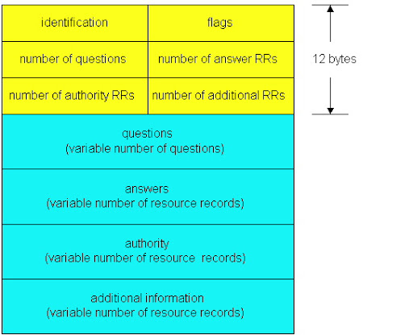

# Redes de ordenadores

# Información

[Notas](https://www.notion.so/Notas-55aa17409e1243dbb20a0d0791e04c04)

[Cronograma.xls](RO/Cronograma.xls)

[Relación temario libro - toc_kurose.xlsx](RO/Relacion_tmario_libro_-_toc_kurose.xlsx)

Magistral: MARCELO GABRIEL BAGNULO BRAUN
Practicas: JUAN MAURICIO BARROSO FRESNEDA y MARCELO GABRIEL BAGNULO BRAUN:

# Teoría

- TEMA 1

    [s1.1.pptx](RO/s1.1.pptx)

    ## 1.1 y 1.3 Internet o Red de ordenadores

    Conjunto de ordenadores interconectados de tal forma que pueden intercambiar información. Para los creadores de aplicaciones distribuidas es el servicio de comunicación que nos permite enviar y recibir mensajes mediante una API.

    Hoy en día casi cualquier cosa se puede conectar a internet, por tanto, el término de red de computadoras queda desactualizado, por tanto, en la jerga de internet todos los dispositivos que se conectas se denominan host o sistemas terminales.

    - Actualmente ya no son solo ordenadores, hay mucha variedad de dispositivos.
    - Infraestructura de comunicación:
        - Dispositivos, que corren apps que conectan con la red. Hosts = end systems.
        - Conmutadores = Packet switches y routers.
        - Enlaces de comunicación, conectan los dispositivos con los router y los routers entre ellos, no es necesario conectar todos con todos.
            - Los enlaces entre routers deben ser más rápidos que los enlaces entre router-dispositivo ya que el router transmite muchos paquetes a la vez.
            - La multiplexación estadística es la usada en la conmutación de paquetes, que asigna el uso del canal bajo demanda, es decir, no transmite de forma constante. Asigna dinámicamente los intervalos de tiempo de transmisión entre los terminales activos para no desaprovechar la capacidad del canal.
            - FDM: multiplexación en frecuencias, es el usado en radio en la conmutación de circuitos
            - La multiplexación por división de tiempo – TDM tiene un tiempo de enlace asignado, por lo que se tarda igual independientemente de que haya más personas queriendo enviar información. Desaprovecha la capacidad del enlace, ya que dedica todo el ancho de banda del canal al transmisor en cada ranura de tiempo.
        - Network = Red, conjunto de dispositivos, routers y enlaces de una organización.
    - El host rompe los mensajes en paquetes de datos de aprox. 1500 bytes para ser transmitidos con un encabezado que permite indicar el destinatario y a la red llevarlos. Una vez dividido se transmite por un enlace al router, así con la cabecera sabe dónde reenviar otro router, ahí hasta llegar al destino.
      
        - Store and forward: Debe llegar el paquete completo al router antes de transmitirlo por el siguiente enlace.
    - Funciones clave de los nodos de la red:
        - Forwarding – Reenvío: Es una acción local, que se encarga de mover los paquetes que llegan por el enlace de entrada al enlace de salida correspondiente.
    - Routing – Enrutamiento: Es una acción global, consiste en determinar la ruta desde el origen hasta destino que seguirán lo paquetes mediante algoritmo de enrutado.
    
    
## 1.2 Las fronteras de la red

- Redes de acceso

- Medios físicos
  
### Arquitectura de la red

Hoy en día usamos principalmente dos redes de comunicación, la red telefónica e internet.
    
- Conmutación de circuitos: Conceptualmente hablando en la red telefónica se crea un cable que te conecta la llamada y cuando finaliza se despliega para dejar disponible los recursos para formar otra conexión. Se usa multiplexación de división en el tiempo y frecuencia. Usa toda la capacidad del enlace para el intercambio.

- Conmutación de paquetes: Los datos se trocean y se les agrega un encabezado con la dirección de destino y se envía, los routers y conmutadores miran la dirección y lo envía por su camino hasta llegar al destino. Utiliza multiplexación estadística. Se comparten todos los recursos en tiempo real.
  
## 1.5 Protocolos

Definen el formato, orden de enviado y recepción de mensajes entre las entidades de la red y acciones tomadas en la transmisión de mensajes. Hay tantos dispositivos y apps interconectados, cada uno distinto, para que pueda funcionar todos deben hablar un lenguaje común, los protocolos permiten acordarlo. Están en todas las conexiones, control de envíos y recepción de datos.
    
### Modelo de capas:

- Cada capa siente que la comunicación es horizontal, sin embargo, la implementación es vertical. Cada capa implementa un servicio y el inverso
- El origen y destino implementan todas las capas. En el origen va de arriba hacia abajo, en los intermedios sube y baja, y en el destino sube las capas.
- Los enrutador - routers implementan la capa red, enlace y física.
- Los conmutador - switch implementan enlace y física.
- Capas:
    - Aplicación: Los propios programas que quieren enviar y recibir datos. Soporta aplicaciones distribuidas. Pone el mensaje.
    - Transporte: Multiplexación y demultiplexación de datos para poder utilizar distintas aplicación. Transferencia de datos entre procesos. Pone un encabezado para identificar la aplicación, pasa a llamarse segmento.
    - Red: Enrutamiento de datagramas de origen a destino: IP, protocolos de enrutamiento. Concatena saltos para llevar los paquetes desde el origen hasta el destino. Pone otro encabezamiento que indica la localización del origen y destino, pasa a llamarse datagrama.
    - Enlace: Corrige y detecta errores de la transmisión, transfiere los datos a la entidad de la red vecina, en conexiones a 1 salto. Pone otro encabezamiento que indican el siguiente salto en la red, pasa a llamarse trama.
- Física: Traduce bits a ondas que se envían por el cable y viceversa.

[s1.2.pptx](RO/s1.2.pptx)
    
## 1.4 Retraso

El tiempo que pasa desde que el paquete es recibido por el router hasta que llega al destino.
    
- $d_{nodal}= d_{procesado}+d_{cola}+d_{transmisión}+d_{propagación}$
- Tipos:
    - Procesamiento, comprobar error de bit y determinar el enlace de salida.
    - Cola, espera a ser transmitido por un enlace de salida.
        - Intensidad de tráfico = $\frac{L\cdot a}{R}$
            - L: tamaño paquete
            - a: ratio de llegada del paquete
            - R: ancho de banda
    - Trasmisión: En transmitir los datos, volcarlo en el enlace. $\frac{L}{R}$
        - L: bits del paquete o mensaje.
        - R: ancho de banda del enlace. Bits/seg
    - Propagación: Tiempo que tarda en transmitirse por el enlace. $\frac{d}{s}$
        - d: distancia del enlace. metros
    - s: velocidad de propagación. Metros/seg

## 1.4 Traceroute:

- Método para conocer el retraso o perdida de datos.
- Consiste en enviar 3 paquetes a destino, con tiempos de vida, de menos a más. Cuando su tiempo termina vuelve y sabe cuánto tarda en cada salto, al aumentar va llegando más lejos. Cuando hay un gran salto de ms (milisegundos) podemos analizar la fuente.

## 1.4 Perdida

Cuando la capacidad del buffer se termina o se han enviado mal, y dependiendo del protocolo:
    
- Se pierde, se descarta lo que no entra.

- Pide al emisor que lo reenvíe.
  
## 1.4 Throughput

- Tasa de procesamiento, la capacidad de un sistema para volcar datos para transmitir. $\frac{Bits}{tiempo}$.
    - Se caracteriza por el peor caso:
        - Instantáneo: En un momento determinado
        - Medio: De media.
- Cuello de botella / bottleneck: Cuando un enlace de una ruta restringe el Throughput de la ruta, dado que en esa ruta habrá un enlace de menor capacidad o que esté saturado.

- Se toma para los cálculo el mínimo entre el $\frac{R}{10}$, $R_{emisor}$ o $R_{receptor}$.
  
    
    
    - Como R recibe muchas conexiones puede haber cuello de botella en $R_e$  y $R_r$.
- TEMA 2: Application Layer

    [s2.1.pptx](RO/s2.1.pptx)

    ## 2.1 Principios de las aplicaciones de red

    - Crear una aplicación de red:
        - Son aplicaciones distribuidas, que necesitan intercambiar información para funcionar.
        - Hay que crear la aplicación del cliente para los distintos dispositivos y servidor, y ejecutarla.
        - No es necesario modificar los elementos de la red, los usuarios son los que hacen que funcione la red utilizando la aplicación.
    - Cliente: El que envía datos o inicia la comunicación.
    - Servidor: El que recibe o espera la comunicación.
    - Proceso: programa que se ejecuta.
        - dentro de un host.
        - dentro del mismo host, dos procesos se comunican mediante la comunicación entre procesos.
        - procesos en diferentes hosts que se comunican mediante intercambio de mensajes.

    ### Formas de estructurar las aplicaciones:

    - Paradigma cliente-servidor:
        - Servidor: Su función es brindar servicio. Deben estar siempre disponible y accesible. Dirección IP permanente.
        - Cliente: Solo se conecta cuando necesita algo.
    - Arquitectura peer-peer (igual-igual): Las comunicaciones se hacen directamente entre usuarios, sin pasar por un servidor.
        - Cliente: No siempre en línea, pides servicio a otro usuario y provees servicio a otros usuarios.
        - Auto escalabilidad: Cuando más clientes más capacidad de servicio.

    ### Sockets:

    - Interfaz entre la capa de aplicación y transporte, dentro de esta última.
    - Se utiliza para comunicar una aplicación con otra, en cada dispositivo hay un shocket para esa aplicación.
    - Permite al sistema identificar cada aplicación, cuando se reciben datos se pasan al correcto.
    - Un puerto no identifica de forma única la aplicación, hasta que se le asigna uno.
    - Puerto: Identifica al socket del dispositivo con 16 bits. Hay un rango asignado a aplicaciones bien conocida.

    ### Protocolo de la capa de aplicación:

    - Define:
        - Tipos de mensajes intercambiados.
        - Sintaxis del mensaje.
        - Semántica del mensaje.
        - Reglas de cuándo y cómo los procesos envían y responden los mensajes.
    - Tipos:
        - Protocolos abiertos: Todo el mundo tiene acceso a la definición.
        - Protocolos de propietario: Propios de la aplicación.

    ### Necesidades del servicio de transporte:

    Dependiendo de la aplicación puede ser más o menos susceptible.

    - Integridad de datos: Los datos no hayan sido alterados, ya sea por fallos o interferencias. Aplicación de envío de datos son muy susceptibles y las de audio o video pueden tolerar perdidas.
    - Temporalidad: El tiempo que tarda en llegar. Las de telefonía o videojuegos necesitan baja latencia.
    - Ancho de banda: Cuantos datos puede recibir y enviar. Algunas necesitan mucha capacidad, otras se adaptan a lo que hay.
    - Seguridad: Encriptado, integridad, …

    ## 2.4 DNS – Domain Name System

    - Directorio/Base de datos distribuida/espacio de nombres global, en formato amigable para el usuario, que nos permite mediante un protocolo obtener la IP.
    - Cada nombres está asignado a una IP, es una manera más intuitiva dado que una dir IP son 32 bits, 4 números entre 0-255. No es asequible para el usuario, por eso se crea el DNS que permite asignar nombres a dispositivos amigables para el usuario.
    - Es un protocolo de la capa de aplicación.
    - Diagrama paquete

        

    - Jerarquía:
        - Servidor raíz: Capaces de resolver el mapeo de cualquier nombre del sistema de nombres de dominio.
            - Conoce los servidores que contienen la información de los subdominios para todo el espacio de nombres.
            - Hay 1 maestro, pero hay muchas copias distribuidas por el mundo.
        - TLD – Top Level Domain - Dominios de alto nivel: Tienen autoridad sobre todo un subdominio (.com/.edu/.es/…).
        - Autoritario: Donde se almacena la información de mapeo de nombre y su IP. Conoce la IP para una determinada terminación de nombres (uc3m.es) propios de la organización.
        - Local: Fuera de la jerarquía, es el nivel más bajo. Responsable de subdominios de bajo nivel. Se consulta para resolver los nombres y lo poseen las empresas para su propia administración.
    - Resolución de nombre DNS:
        - Consulta iterativa:
            - Se busca una DNS a la que queremos acceder.
            - Como no se conoce la IP, se llama al DNS resolver para obtenerla.
            - Llama al server local, si la conoce nos la envía, pero sino consulta al servidor raíz.
            - El servidor raíz nos indica el servidor que conoce ese subdominio.
            - Accedemos a ese servidor que nos manda a otro que sepa más profundo el subdominio o nos envía la IP.
        - Consulta recursiva:
            - Consiste en hacer una sola consulta y que la siguiente consulta la haga el servidor consultado al siguiente en la jerarquía hasta llegar al local.
    - Para introducir un nombre nuevo se llama al registrador DNS, que introduce 2 registros en un Servidor autoritario, uno de tipo A y otro de tipo NS.
    - Seguridad:
        - Ataques DDoS: bombardear al servidor raíz con tráfico.
        - Ataques de redirección:
            - Hombre en el medio: Interceptar las consultas.
            - Envenenamiento de DNS: send bogus relies to DNS  server, which caches.

    ## 2.7 Programación de sockets: creación de aplicaciones de red

    - En UDP
    - En TCP
- TEMA 3: Transport Layer

    [s3.1.pptx](RO/s3.1.pptx)

    ## 3.1 Capa de transporte y sus servicios

    - Entre la capa de red y aplicación.
    - Mejora la capa de red, ofrece un canal lógico de comunicación entre aplicaciones de distintos dispositivos.
    - Solo está presente en los extremos, emisor y receptor.

    ### Acciones de los protocolos de transporte:

    - Emisor: Recibe los bits del mensaje de la aplicación los segmenta y les añade una cabecera que indica el origen y destino.
    - Receptor: Recibe los segmentos y los une todos para formar el mensaje completo y lo pasa a la aplicación.

    ### Servicio:

    - Orientado a conexiones: Se envía un mensaje de señalización y el receptor acepta o rechaza. Si acepta se abre un canal de conexión.
    - No orientado a conexiones: Se abre el canal y ya. Llegan los mensajes.

    # Principales protocolos de transporte:

    ## 3.5 TCP - Transmission Control Protocol:

    - Orientado a conexiones: Hace que el cliente y el servidor intercambien la información de control de capa de transporte entre si antes de que empiecen a fluir los mensajes del nivel de aplicación. Este procedimiento denominado de negociación, de reconocimiento o de establecimiento de la conexión alerta al cliente y al servidor, permitiéndoles prepararse para el intercambio de paquetes, se conectan los sockets del emisor y del receptor, de esta manera lo que entra por un lado sale por el otro.
      
        - Solo soporta comunicaciones 1 a 1, un emisor y un receptor. Crea un canal bidireccional entre ambos en la misma conexión.
    - Ofrece servicio confiable, los segmentos llegan íntegros y en orden. Se envía redundancia cíclica del mensaje en la cabecera para ver al llegar si ha fallado o ha habido interferencias, pero no ataques (habrían pensado en cambiarlo).
      
        - Lo malo es que parte del ancho de banda se usar para redundancia, si falla se reenvía y el resto de segmentos debe esperar a que llegue.
    - Control de flujo, el emisor no satura al receptor, y congestión.
    - No proporciona: temporización, ancho de banda garantizado, seguridad.
    - Servicio fiable de transferencia de flujos de bytes, a diferencia de UDP que es de paquetes.
    - Recibe datos de la capa de aplicación y puede:
        - Segmentar y enviar.
        - Esperar para hacer un paquete más grande y envía, pero crea retardo si espera.
    - Si el paquete es demasiado pequeño, la cabecera ocupa más que los propios datos.
      
        - Los paquetes son costosos en overhead, pero para algunas aplicaciones son necesarios, ya que no pueden esperar hasta que lleguen a crear un paquete más grande.
    - Cuanta más carga en la red es más importante la eficiencia, cuesta más introducir paquetes al haber retraso de cola.
    - TCP siempre envía MSS:
        - MSS: Máximo tamaño de segmentación.
        - El receptor tiene pipeline que permite una ventana deslizante de tantos paquetes como quepan en el buffer, por si se corrompe alguno.
        - Usa un método parecido al Go-back N, recibe asentimiento del último número de secuencia que se recibió en orden en el receptor y si se pasa el temporizador envía sólo el más viejo. El receptor almacena en el buffer los paquetes que recibe fuera de orden, pero sigue mandando la confirmación del que le falta en medio, y cuando lo recibe los pasa en orden a la aplicación.

            

        - La unidad fundamental de transmisión es el byte, por ello a cada byte que transmita le asocia un numero de secuencia. Cuando se recibe un asentimiento, se ha tenido en cuenta la suma de los bytes de los datos.
          
            - Si envió el paquete nº 92 de 8 bytes, el asentimiento que reciba será el nº100, confirmando que ha recibido esos 8 bytes.
    - Para tener n paquetes en vuelo necesitamos 2n números de secuencia.
    - Segmentado: el control de flujo y congestión de TCP fijan el tamaño de la ventana. Hay buffers de emisión y recepción.
    - Crea un segmento con:
        - Puerto del origen y destino, los puertos identifican la aplicación.
        - nº secuencia: identifica el orden y evita duplicados. El número va aumentando según los bytes enviados, van asociado.
        - nº ack: Es el número de secuencia que espera recibir el receptor, para cuando intercambiamos datos.

        

    - En la cabecera se pone el número de secuencia del propio paquete y además el número de secuencia que yo espero recibir si se quiere comunicar conmigo de vuelta.
        - Cuando se envían datos bidireccionalmente, cada lado tiene su propio número de secuencia de tal manera que cada uno controla la llegada de sus propios datos y el otro confirma ese paquetes recibidos.

            

    - Calcular el tiempo para el temporizador (timeout):
        - Debe ser más que round trip time, ida y vuelta, pero este varia.
        - Demasiado corto: Antes de recibir la confirmación ya he reenviado el paquete.
        - Demasiado grande: Cuando no llega la confirmación espero demasiado tiempo. Aunque es mejor pasarse que quedarse corto

            

            

        - Cada vez que recibo un paquete, voy calculando la media ponderada móvil exponencial (las más recientes influyen más) de los RTT más un margen de seguridad según la variabilidad de los tiempos como tiempo límite para recibir un paquete.
    - Emisor:
        - Crea un segmento con numero de secuencia según el byte del flujo de bytes.
        - Se inicia un temporizador con tiempo de expedición: TimeOutArrival.
            - Si pasa el tiempo, se reenvía y reinicia el temporizador.
            - Si se recibe ACK de segmentos sin confirmación, desplazo la ventana, actualizo cual es el más viejo e inicio temporizador si no hay ninguno para el más viejo.
    - Receptor:
        - Llegada de segmento en orden con el número de secuencia esperado, pero ya ha sido confirmado. Se espera hasta recibir el siguiente segmento, si no llega se envía ACK.
            - El tiempo en enviar una confirmación: ¿Es de 500 ms?
                - Cuando más grande es el tiempo que esperamos medido en número de confirmaciones de paquetes, el beneficio se va reduciendo en comparación a lo que aumenta el tiempo.
                - Esto nos permite ahorrar confirmaciones, que congestionan la red.
                - Lo mejor es enviar 1 confirmación de cada 2 paquetes.
        - Llegada de segmento en orden con el número de secuencia esperado, pero hay otro segmento en orden esperando a ser confirmado. Se envía el ACK acumulativo de ambos, el más alto.
        - Llegada de numero de secuencia fuera de orden mayor que el esperado. Se manda ACK duplicado inmediatamente del último en orden recibido, indicando el siguiente byte que esperamos.
        - Llegada de segmento que completa parcialmente una laguna. Se envía ACK inmediatamente, suponiendo que el segmento empieza en el límite inferior de la laguna.
    - Retransmisión rápida: Se detectan segmentos perdidos por ACKs repetidos. Si el emisor recibe 3 ACKs por los mismos datos, supone que el segmento se ha perdido y reenvía ese segmento de inmediato, sin esperar a que termine el temporizador.
        - Como el emisor envía varios segmento seguidos, si se pierde alguno llegaran varios ACKs repetidos.
        - El periodo de expiración a menudo es relativamente largo, lo que retrasa el reenvió de paquetes.
    - Cambia: Retardo -> Integridad.

    ## 3.3 UDP – User Datagram Protocol:

    - No orientado a conexiones: Como los sockets no están conectados, a la hora de enviar un mensaje hay que indicar quién es el destino, no crea un canal de comunicación.
    - Mejor esfuerzo.
    - Ofrece un servicio de comunicación no fiable, no hay garantías de que llegue bien o en orden.
    - No proporciona: negociación, fiabilidad, control de flujo, control de congestión, temporización, ancho de banda garantizado, seguridad.
    - La detección de errores es muy básica, avisa si hay fallos, pero no lo resuelve.
    - Cabecera más ligera, a veces es mejor no hacer nada para no tener retardo, a pesar de no asegurar integridad.
    - Al no haber establecimiento de la conexión, es más rápida.
    - Al no tener control de congestión, puede disparar todo lo rápida que quiera.
    - Cabecera: Datagrama con
        - Puerto de origen y destino.
        - Length: Longitud en bytes del segmento UDP con el header.
        - Checksum: Detectar errores, pero no los solventa.

        

    - Es utilizado para las DNS, para no sobrecargar los servidores raíz (no hay que enviar mensaje de solicitud para abrir conexión), como la integridad es importante la integridad a nivel de aplicación si falla o esta corrupta se vuelve a hacer una consulta.
    - Cambia: Integridad -> Retardo.
    - UDP checksum: Numero añadido en el segmento de transporte para detectar errores. El emisor crea el checksum, el receptor lo recalcula y compara si son distintos, si lo son correcto y si no hay algún error.
        - El emisor trata el contenido del segmento UDP (que incluye los campos de la cabecera UDP y las direcciones IP) como secuencias de 16 bits enteros.
        - Se van sumando los segmentos desde el primero de 16 en 16 bits, y si sale alguno de 17 bits cogemos el más significativo y se lo sumamos al mismo, 1º+2º, (1º+2º)+3º…. Cuando hemos sumado todos hacemos complemento a uno, los 1 por 0 y 0 por 1.

    ## 3.2 Multiplexación/ Demultiplexación:

    - El emisor multiplexa, añade la cabecera de transporte para ser demultiplexada después y vaya al socket correcto.
    - El receptor demultiplexa, deshace la cabecera del segmento para entregarlo al socket correcto.
        - Cada datagrama de la capa de red tiene la IP origen y destino con el correspondiente puerto de cada lado que identifica el socket.

    [s3.2.pptx](RO/s3.2.pptx)

    ## 3.4 Principios de transferencia de datos confiable:

    - Los servicios de transferencia confiable, consiguen que los datos lleguen y sin fallos.
    - Para la capa de aplicación es como pasar los datos a un canal confiable, pero la capa de transporte realiza un protocolo para la transferencia de datos confiable y lo pasa a un canal no confiable o lo recibe de un canal no confiable(según el lado).
    - Las características del canal no fiable determinaran la complejidad de transferencia de datos fiable.
    - Diagrama

        

    - Terminología:
        - rdt_sent(): Pasa los datos la aplicación a la capa de transporte.
        - udt_send(): La capa de transporte transfiere el paquete por el canal no confiable al receptor (capa red).
        - rdt_rcv(): Cuando el paquete llega al extremo de recepción del canal (red -> transporte)
        - deliver_data(): La capa de transporte pasa los datos a la aplicación.
    - Se desarrollan los lados de emisor y receptor incrementalmente, se imponen un solución simple y vamos levantando la simplicidad con problemas del canal.
    - Consideramos solo transferencia de datos unidireccional, pero funciona bidireccional de igual manera, es para simplificar.
    - Se usan máquinas de estado finitas para representar emisor y receptor por separado: evento/acciones tomadas.
    - rdt1.0: transferencia fiable en canal fiable.
        - Sin errores de bit, ni perdida de paquetes.

        

        - Emisor:
            - Espera los datos de la aplicación, cuando los recibe crea un paquete y envía el paquete por el canal no confiable.
        - Receptor:
            - Espera recibir paquete, cuando lo recibe extrae los datos y los pasa la aplicación.
    - rdt2.0: canal con errores de bit.
        - El canal puede alterar bits del paquete, para eso se usa el checksum y se detectan.
        - Para resolver los errores, se usa:
            - Asentimiento, confirmación o reconocimiento (Acknowledgements, ACKs): El receptor indica que la recepción fue buena.
            - Asentimiento negativo o reconocimiento negativo (NAKs): El receptor indica que el paquete tenía errores. En este caso el emisor reenvía el paquete.
        - Protocolo de parada y espera (stop and wait): Si se corrompe se envía una señal de respuesta negativa y el emisor envía de nuevo, si llega bien una respuesta positiva.

            

        - Emisor:
            - Espera recibir datos de la aplicación, cuando los recibe calcula el checksum y crea un paquete que incluye el checksum, entonces lo envía
            - Espera un paquete del receptor ACK o NAK, si recibe ACK pasa a esperar datos de la aplicación, si recibe NAK envía de nuevo el paquete y espera otra vez ACK o NAK.
        - Receptor:
          
            - Espera un paquete del emisor, cuando lo recibe comprueba los datos con el checksum, si coincide envía ACK y pasa los datos a la aplicación, y si no coincide envía NAK.
        - Pero qué pasa si se corrompe un asentimiento, no podemos asumir ACK (se pierden paquetes), ni NAK (se duplican paquetes). Para solucionarlo rdt2.1
    - rdt2.1: canal con errores de bit y manejo de ACK/NAK erróneos.
        - El emisor retransmite el paquete actual si ACK o NAK si no llegan bien.
        - El emisor añade un numero de secuencia a cada paquete, para detectar si se repite el paquete cuando se recibe.
        - Emisor:
            - Espera datos de la aplicación para poner el número de secuencia 0, cuando los recibe crea un paquete con el checksum, datos y el 0.
            - Espera recibir asentimiento con 0, si recibe ACK y no esta corrupto pasa a espera datos para poner 1, si recibe NAK o esta corrupto reenvía el paquete con 0.
            - Espera datos de la aplicación para poner 1, cuando los recibe crea un paquete con el checksum, datos y el 1
            - Espera recibir asentimiento con 1, si recibe ACK y no esta corrupto pasa a espera datos para poner 0, si recibe NAK o esta corrupto reenvía el paquete con 1.

        

        - Receptor:
            - Espera paquete con numero de secuencia 0:
                - Cuando recibe un paquete comprueba que el checksum no esté corrupto y numero de secuencia 0, si están bien ambos pasa los datos a la aplicación y crea un paquete con ACK y su checksum, por último, pasa a esperar un 1.
                - Cuando recibe un paquete si no coincide el checksum con los datos, se envía NAK con su checksum, y sigue esperando un 0.
                - Cuando recibe un paquete no corrupto (checksum correcto) y el número de secuencia es 1, se crea un paquete con ACK y su checksum (estaba duplicado)
            - Espera paquete con numero de secuencia 1:
                - Cuando recibe un paquete comprueba que el checksum no esté corrupto y número de secuencia 1, si están bien ambos pasa los datos a la aplicación y crea un paquete con ACK y su checksum, por último, pasa a esperar un 0.
                - Cuando recibe un paquete si no coincide el checksum con los datos, se envía NAK con su checksum, y sigue esperando un 1.
                - Cuando recibe un paquete no corrupto (checksum correcto) y el número de secuencia es 0, se crea un paquete con ACK y su checksum (estaba duplicado)

        

    - rdt2.2: Un protocolo sin NAK.
        - La misma funcionalidad que rdt2.1, usando solo ACKs
        - En lugar de NAK, el receptor envía ACK para el último paquete recibido bien indicando el número de secuencia del mismo.
        - Por lo tanto, el emisor si recibe un ACK de numero de secuencia incorrecto es NAK y retransmite.

            

    - rdt3.0: Canales con errores y perdidas.
        - El emisor espera un tiempo razonable para recibir el asentimiento, si no se ha perdido.
        - El tiempo de espera es el round trip time, el tiempo que tarda un paquete en ir y volver.
        - Si se pasa el tiempo se reenvía, y si se reenvió antes de tiempo el número de secuencia lo identifica.
        - Usa números de serie, temporizador y checksum.
        - Emisor:
            - Esperar datos para poner el 0, se reciben datos:
                - Si se reciben datos de la aplicación se crea un paquete con el checksum y número de serie 0, se inicia un temporizador y se envía el paquete.
                - Si se recibe un paquete del receptor no se hace nada.
            - Esperar asentimiento 0, se recibe un paquete del emisor:
                - Si esta corrupto el paquete o el número de serie recibido es 1, no se hace nada.
                - Si se pasa el temporizador se reenvía el paquete.
                - Si no está corrupto y el número de serie es 0, se para el temporizador y pasamos a esperar datos de la aplicación para poner un 1.
            - Esperar datos para poner el 1, se reciben datos:
                - Si se reciben datos de la aplicación se crea un paquete con el checksum y número de serie 1, se inicia un temporizador y se envía el paquete.
                - Si se recibe un paquete del receptor no se hace nada.
            - Esperar asentimiento 1, se recibe un paquete del emisor:
                - Si esta corrupto el paquete o el número de serie recibido es 0, no se hace nada.
                - Si se pasa el temporizador se reenvía el paquete.
                - Si no está corrupto y el número de serie es 1, se para el temporizador y pasamos a esperar datos de la aplicación para poner un 0.

        

        - Receptor: Es igual que en rdt2.2, se envía asentimiento positivo con checksum y numero de secuencia.
            - Espero paquete con 0, recibo paquete del emisor:
                - Esta corrupto el paquete o número de serie 1, envía de nuevo la confirmación anterior para que mande de nuevo el paquete 0 o el siguiente.
                - Si no está corrupto y es un 0, pasamos los datos a la aplicación y enviamos al emisor el asentimiento con 0 y su checksum.
        - El problema de este mecanismo es el rendimiento, está la mayor parte del tiempo esperando respuesta.
    - Protocolos segmentados (pipelined protocols)
        - Se amplía el número de serie que se envía lo que nos permite aumentar el número de paquetes en vuelo.
        - Aunque necesitamos un buffer más grande en el emisor y/o el receptor.
        - Ventana: Numero de paquetes que puede haber en vuelo, sin confirmación.
        - Ventana deslizante: Se va olvidando de los confirmados y envía otro según confirma.
        - Go-Back-N:
            - En el emisor hay un buffer y temporizador asociado a cada paquete.
                - Si se pasa el tiempo reenvía todos los paquetes desde el más viejo.
                - Según van llegando se desplaza la ventana y envía nuevos.
                - Acepta duplicados, cuando recibe muchos iguales acabara el temporizador por que se ha perdido alguno.
            - En el receptor, solo sabe el paquete que está esperando, si llega lo pasa a la aplicación, pero si no es el esperado lo almacena en buffer o lo deja pasar.
                - Se tiene un ACK acumulativo, le dice al emisor que ha recibido correctamente hasta cierto número de secuencia, el último en orden de secuencia. Mantiene el numero 2 si no ha llegado, aunque reciba el 3 y 4.
            - Una ventaja es que, si se pierden confirmaciones, pero se recibe una con numero de secuencia superior antes de que pase el tiempo, el emisor entenderá que las perdidas han sido recibidas.
        - Repetición selectiva (Selective repeat)
            - Ventana de n paquetes, a cada uno con un temporizador y voy corriendo la ventana cuando se confirman y si no se confirman lo reenvía.
            - El emisor solo reenvía paquetes para los que no reciba ACK, según se van recibiendo se va desplazando la ventana.
            - El receptor envía ACK individual para cada paquete correcto, a diferencia de GBN no se queda solo con el número de secuencia del ultimo correcto consecutivo. No mantiene numero 2 si recibe el 3 y 4, aunque no haya recibido el 2.
                - En un buffer voy almacenando los paquetes que llegan en desorden y cuando tengo todos se pasan a la app.
            - Dilema: Como no necesariamente los acepta en orden, puede ocurrir que, al perderse todos los paquetes aceptados, aceptemos como nuevo los paquetes reenviados por el emisor al tener números de serie que correspondan a la ventana del receptor.

    [s3.3.pptx](RO/s3.3.pptx)

    - Cada socket tiene asociado un buffer.
    - El control de flujo y congestión reducen la velocidad de transmisión, para no saturar la red.
        - $TCP = \frac {nºpaquetes*MSS}{RTT}$
    - Control de flujo: El emisor no saturara el buffer del receptor a base de enviar muchos paquetes seguidos. Se equilibra la velocidad de envío a la del receptor.
        - El emisor debe controlar su velocidad de emisión para no saturar al receptor, para ello el receptor va enviando en sus confirmaciones cuanto buffer tiene libre, de esta manera se adapta.
        - La velocidad de recepción de paquetes viene dada por el emisor, si el receptor capta los datos más lento o tiene poco buffer, empieza a perder paquetes al no caber.
        - Recibe más de lo que puede procesar.

    [s3.4.pptx](RO/s3.4.pptx)

    ## 3.6 Principios del control de congestión

    - Congestión: hay más tráfico en una parte de la red de lo que es capaz de soportar.
        - Normalmente son los enlaces los que se congestionan, cuando la multiplexación estadística se ve superada.
        - A diferencia del control de flujo, la congestión es de la red, no del receptor.
    - Síntomas:
        - Perdida de paquetes.
        - Grandes retardos.
    - Tipos:
        - Congestión crónica: Continua en el tiempo, que dura. Se puede solucionar incrementando la capacidad, más enlaces.
        - Congestión puntual: Momentánea. Se soluciona reduciendo la demanda, hacer que se envíe menos.
    - Formas de abordarla:
        - Control de terminal a terminal: No hay retroalimentación de la red, se deduce por el retardo y las perdidas. Es el método de TCP.
        - Control asistido por la red: Los routers proporcionan realimentación a los terminales. Indican a que tasa deben enviar los emisores.
    - Escenarios

        

        

        

    ## 3.7 Mecanismos de control de congestión de TCP

    - No se conoce como de congestionada esta la red, por lo que se va incrementando la tasa de transmisión poco a poco y cuando hay perdidas vuelvo a reducir.
      
        - Es autocongestionante, lo sube hasta que se congestiona.
    - Incremento aditivo: Incrementamos el tamaño de ventana en 1 MSS cada RTT hasta que haya perdidas. +1 tamaño ventana
    - Decremento multiplicativo: Dividimos el tamaño de ventana por 2 cuando haya perdidas. Ventana/2
      
        - En AIMD, corta por la mitad cuando recibe 3 ACKs del mismo paquete y quita 1 cuando expira un temporizador.
    - AIDM: Algoritmo asíncrono distribuido para optimizar los ratios de congestión de la red y tienen propiedades de estabilidad.
    - $Tasa TCP \approx \frac {cwnd} {RTT} \frac {bytes}{sec}$
    - El emisor limita la transmisión: LastByteSent- LastByteAcked < cwnd
    - ACKs duplicados: Congestión moderada. Bajamos a la mitad +3 y subimos poco a poco. El umbral también se reduce a la mitad.
    - Detectamos perdida por temporizador: Congestión severa. Bajamos el tamaño de ventana a 1 y volvemos a aumentar exponencialmente. El umbral se reduce a la mitad.
    - Arranque lento: Comienza con tamaño de ventana pequeña, 1 MSS, pero no solo aumentan de 1 en 1, se va doblando por cada RTT hasta llegar a ssthresh (la mitad del valor de la ventana antes de la última perdida) y después continua linealmente hasta perdida.
    - The Maximum Segment Size (MSS) is set to 1 in TCP Reno and Tahoe, in case of timeout detection, as the congestion is severe. However, in case of even less severe congestion detected by triple duplicate acknowledgement, the MSS size is reduced to 1 in TCP Tahoe and half in TCP Reno.
    - Diagrama:

        En arranque lento aumenta uno por cada segmento de la ventana, lo que al ocurrir para toda la ventana duplica.

        En evitación de congestión aumenta 1/ tamaño de la ventana, lo que hace que cuando se haya confirmado toda la ventana habrá aumentado uno completo.

        

- TEMA 4: Network Layer Data Plane

    [s4.1.pptx](RO/s4.1.pptx)

    ## 4.1 Overview of Network layer

    - Capa de red:
        - Ofrece un canal lógico de comunicación entre hosts – anfitriones conectados por un medio físico. Entrega los paquetes al destino indicado por su dirección IP, con los saltos que sean necesarios.
        - Utiliza los servicios de la capa de enlace y los mejora para ofrecer mejor servicio a la capa de transporte.
        - Transporta segmentos del host emisor al receptor.
            - El emisor encapsula los segmentos en datagramas. Pone la dirección IP del dispositivo destino.
            - El receptor entrega los segmentos a la capa de transporte.
        - Está presente en Routers y Hosts.
        - El router examina los campos de la cabecera de todos los datagramas IP, para determinar a donde se debe enviar y cuál será el siguiente salto, pero la IP no cambia.
        - Visión como dos planos:
            - Plano de datos: Hace Forwarding, decide por qué puerto de salida deben ir los datos de entrada.
            - Plano de control: Información de control que se transmite entre routers para controlar la red, configurar las tablas de forwarding y las del propio router. Dos aproximaciones:
                - Algoritmo distribuido de routing tradicional: Todos los router se comunican entre ellos para configurarse.

                    

                - Red definida por software: Centralizado. Hay un proceso central, que conoce el estado toda la red, para configurar el estado de cada router.

                    

    - Funciones clave: Que deben ser consistentes para no crear bucles.
        - Reenvío: Mover los paquetes de la entrada a la salida apropiada.
        - Enrutamiento: Determinar la ruta a tomar por los paquetes, desde el origen a destino.
    - Modelo de servicio de red:
        - Posibles servicios:
            - Para datagramas individuales: Entrega garantizada o Retardo acotado.
            - Para un flujo de datagramas: Datagramas en orden, Ancho de banda mínimo o restricción en la fluctuación entre paquetes.
        - Modelo de servicio de “mejor esfuerzo”:
            - No garantiza: Entrega garantizada al destino, en orden, temporización ni ancho de banda garantizado.
            - Ventajas:
                - Es simple, por lo que es robusto y es ampliamente usado.
                - Ofrece los servicios esenciales comunes para las aplicaciones, y si quieren más servicios los implementan ellos mismos.
                - Aprovechamiento suficiente de ancho de banda para aplicaciones en tiempo real.
                - Servicios distribuidos de capa de aplicación replicados que se conectan cerca de las redes de los clientes, permiten que los servicios se den desde varias ubicaciones.
                - El control de congestión de las servicios ayuda.
    - Protocolos de la capa de red:
        - Algoritmos de selección de camino: Protocolos de enrutamiento.
        - Protocolo ICMP: Señaliza errores.
        - Protocolo de Internet – IP: Formato del datagrama, direccionamiento y convenciones de manejo de paquetes.

    ## 4.2 What's inside a Router

    ### Arquitectura del router:

    

    - Funciones del Puerto de entrada: 3 capas.

        

        - Física: Transforma los impulsos de luz a bits.
        - Enlace: Procesa la capa de enlace.
        - Tiene un buffer y la capacidad de hacer forwarding, es decir consultar el puerto de salida en las tablas de forwarding que nos indica a donde deben ir. El forwarding puede ser:
            - Basado en el destino: Basado solo en la dirección IP destino.
            - Generalizado: Basado en campos de la cabecera.
    - Matrices de conmutación: Permite hacer forwarding, lleva paquetes del puerto de entrada a los de salida adecuado.
        - Tipos:
            - De memoria: Bajo el control de la CPU, los paquetes se copian en memoria y la velocidad está limitada por el ancho de banda de memoria.

                

                - Llega un paquete a la entrada.
                - Se pasa a memoria.
                - Se determina la salida.
                - Se saca el paquete de memoria y se lleva a la salida correcta.
            - De bus: Cada puerto tiene capacidad de memoria y procesamiento, y usa el bus para pasar de entrada a salida.

                

                - Hay limitación por el ancho de banda del bus.
                - Para no saturar el bus: el ancho de banda del bus >= número de puertos de entrada*ancho de banda del puerto de entrada.
                - Para no saturar la salida: ancho de banda de las entradas <= ancho de banda de las salidas
            - Red de interconexión: Caminos paralelos, todos conectados con todos, pero es caro tener una conexión entre cada uno.
                - Para evitar que se haga tan caro, se usan múltiples planos para tener más caminos.

                

                

    - Procesador de routing: Calcula la ruta, enruta.
    - Puerto de salida: 3 etapas.
        - Buffer sobre todo, para almacenar los paquetes que hay que sacar a la red que han llegado más rápido que la velocidad de transmisión.
            - Administración del buffer: Hay una cola de paquetes, cuando se llena se pierden los que no entran o los de menor prioridad. Estrategias:
                - FCFS - Primero en Llegar, Primero en Servir: En orden de llegada al puerto de salida.
                - Prioridad: Puede haber dos o más colas, una de alta y otra de baja prioridad. Tipos:
                    - Primero se pasan los de alta prioridad y luego los otros.
                    - Cada n paquetes prioritarios, se cogen 1 no prioritario.
                - Round Robin: Varias colas y va rotando, se coge uno de cada cola.
                    - Se hace de forma equitativa y la prioridad la da un campo de la cabecera.
                - Weighted Fair Queueing – Espera equitativa Ponderada: Como round robin, pero según el peso de cada cola, se cogen más o menos paquetes de esa cola en la rotación.
        - Enlace.
        - Física: Pasa bits a pulsos de luz.

    ## 4.3 The Internet Protocol (IP): IPv4, Addressing, IPv6, and More

    ### IP: Protocolo de Internet.

    - Es un protocolo no confiable.
    - Formato:

        

        - Cabecera: 20 bytes IP.
            - Versión del protocolo: 4 32 bits y 6 128 bits.
            - Longitud de la cabecera en bytes.
            - Tipo de servicio: Permite indicar la prioridad.
            - Longitud total del paquete.
            - Identificar de 16 bits, flags y offset, para identificar los fragmentos de un mismo paquete al fragmentar.
                - Id: Es fijo para el paquete.
                - Flag: 1 si hay más fragmentos y 0 si es el último.
                - Offset: Identifica el desplazamiento dentro del paquete fragmentado.
            - Tiempo de vida: máximo número de saltos de paquete, va bajando según salta. Es mucho mayor que los salto de la óptima. Si se acaba es un problema grave, ya que no es capaz de llevar los paquetes al destino.
            - Protocolo de la capa superior: TCP o UDP.
            - Checksum de la cabecera.
            - IP origen.
            - IP destino.
        - Segmento
    - Fragmentación y Reensamblado.
        - Los enlace tienen un máximo de tamaño de transferencia – MTU.
        - Los datagramas IP cuando son grandes, se fragmentan en la red (en cualquier dispositivo de la red) y cuando llega al destino se reensambla.
        - Cada fragmento tiene en la cabecera un identificador que indica a que paquete corresponde y cual es de todos.
        - EJEMPLO:

            

    ### Direccionamiento

    [s4.2.pptx](RO/s4.2.pptx)

    - EJEMPLO:

        

        

    - Pasos para asignar direcciones a una topología con subredes dadas:
        1. Calcular el número de IPs que necesita cada red, #hosts+#routers+1 de red+1 de broadcast
        2. Calcular el prefijo de cada red.
            - /32 1, /31 2, /30 4, /29 8, /28 16, /27 32, /26 64, /25 128, /24 255...
        3. Asignar IPs con la tabla, dividiendo y viendo donde comienza cada bloque de IPs.
    - Maneras de obtener la dirección IP:
        - Configurar el dispositivo manualmente.
        - DHCP, se asignan de forma dinámica.
    - Necesitamos un espacio o sistema de nombres para identificar los elementos de la red con un nombre único.
    - En internet se le asigna una dirección IP a cada interfaz.
        - 4 bytes separados por puntos, valores entre 0-255, en total 32 bits.
            - 1.1.1.1= 00000001. 00000001.00000001.00000001
        - Hay $2^{32}$ posibles valores, el tamaño máximo de internet.
        - Cuando enviamos un paquete la IP se pone en la cabecera IP, para identificar al destinatario de forma única.
    - Tabla de Forwarding/reenvío:
        - Columnas: Destino DEST y Siguiente salto NH (y Distancia, nos la dan o nos la inventamos y nos sirve para ordenar de menor a mayor distancia)
        - En DEST se pone la IP de la red, es decir la de todo 0's con su prefijo.
        - En NH:
            - Si hay conexión directa, no se pone NADA, lo asigna el propio dispositivo.
            - Si no es directa la conexión, se pone la dirección asignada a la entrada del router que lleva a esa red.
                - Poner redundancia consiste en poner para el mismo DST varias direcciones de salto.
                - Se pone la dirección de la red, la global, para todas las direcciones de las redes.
        - Los DEST se ordenan de mayor a menor longitud de prefijo, y en caso de que haya varios con el mismo se ordenan entre ellos de menor a mayor distancia.
        - La tabla de los dispositivos de una red es: Se pone la de la red y no se configura (vacía), y en la global de la red se pone la de salida.

            

    - Dos interfaces que no están en la misma red tendrán que usar al menos un router.
        - Para ver el número de redes eliminamos los router y cada medio físico aislado es una red.

            

        - En cada red necesitamos 1 para cada host, 1 para cada router, 1 para la propia red todo 0’s (la propia red) y 1 de broadcasts más  todo 1’s (referirnos a todos los dispositivos).
            - #dirs=#hosts+#routers+2
            - 60 dispositivos en una red=60+3= 63 direcciones IP necesita.
    - En una red con 256 dirs. puede haber 254 routers y 253 si tiene que conectarse con el exterior.
    - Enlace punto a punto: Conecta 1 a 1, no 1 a n o n a 1. No es un medio compartido.
    - Cuando un paquete llega al router, se lee la cabecera IP, se extrae la dirección IP y se consulta la Tabla de forwarding (Contiene: Destino y Siguiente salto) donde indica según la IP que entrada debe tomar el paquete.
        - No es factible que se almacene un valor para cada posible valor de IP, por tanto, se agrupan IPs según la entrada.
        - Todas la IPs del conjunto tomaran la misma entrada y esos dispositivos deben tener una propiedad topológica para envíe quien lo envié llegue.
    - CIDR - Classless InterDomain Routing: Porciones de la subred de longitud arbitraria

        

        

    - La IP se asigna a la interfaz del dispositivo, no al propio dispositivo.
      
        - Un mismo dispositivo puede tener varias interfaces.
    - Red: Conjunto de interfaces conectadas por un medio físico.
- Hay que repartir las direcciones entre las distintas redes, cada red tiene su propio conjunto para las interfaces que lo forman.
  

[s4.3.pptx](RO/s4.3.pptx)
    
### DHCP – Dynamic Host Configuration Protocol:

- El host obtiene la dirección IP del servidor cuando entra en la red.
- Proceso:
    - El host envía un mensaje a toda la red, para descubrir los DHCP server.
    - Un DHCP recibe el mensaje, entonces ofrece al host un dirección IP.
    - Recibimos esa dirección IP y se la confirmamos a DHCP.
    - DHCP envía un asentimiento de que ha recibido la confirmación y nos la ha asignado.
- No solo envía la dirección IP, también:
    - La dirección del primer salto a router del cliente.
    - Nombre y dirección del servidor DNS.
    - La máscara de red.
- La IP asignada es única en el sentido que no puede haber 2 usándola simultáneamente, pero en otro momento puede haber dispositivos que hayan usado la misma.
- Hay una jerarquía en la red, lo que permite que los cambios de IP se hagan de una forma más eficiente. Una parte importante figura son los ISP – Internet Service Provider.
- ICANN – Internet Corporation for Assigned Names and Numbers: Asigna los bloques de direcciones a los ISP, gestiona las DNS y dominios.
    - Hay 5 registros regionales, distribuidos por el mundo.
    - En 2011 asignaron el ultimo bloque de direcciones IPv4.
- Gracias a NAT y IPv6 se solucionan la limitaciones de las IPs.

### NAT – Network Address Translation:

- Para una misma red todos los dispositivos comparten la misma IPv4 a ojos del resto de internet.
- Cada dispositivo de la red se diferencia con un puerto, ya que tienen la misma IP entre ellos.
- Todos los dispositivos en la red local tienen una dirección de 32 bits en un espacio de direcciones privado (10/8, 172.16/12, 192.168/16 prefijos) que solo puede ser usada en esa red.
- Ventajas:
    - Con una sola IP, da servicio a todos los dispositivos del ISP.
    - Cambiar la IP local no afecta fuera de la propia red.
    - Cuando cambia la IP del ISP, no afecta a los dispositivos y su dirección privada.
    - Es más seguro, no se puede direccionar un dispositivo directamente desde fuera de la red.
- Implementación:
    - Hace falta cambiar la dirección IP en los datagramas de salida y entrada a la IP de NAT, al igual que puertos.
    - Hay una tabla de correspondencia de IP y puerto local – IP y puerto NAT.
    - Traduce IP y puerto local al de NAT y viceversa, mediante la Tabla de NAT.
- Controversia:
    - Los routers deben solo procesar hasta el nivel 3, pero si alteran el puerto deben llegar a la 4.
    - Cuando faltan direcciones se deben usar las direcciones IPv6, en vez de NAT.
    - Los extremos son los únicos que deben poder alterar los puertos.

- A pesar de los inconvenientes se usa NAT en muchos ámbitos.
  
### IPv6:

- Surge de la limitación de 32 bits de IPv4, ya que actualmente hay mucha variedad de dispositivos con su propia IP.
- Se pasa de 32 a 128 bits.
- Además:
    - Mejora la velocidad de enviado y procesado. Protocolo más eficiente. Para ello opta por una cabecera fija de 40 bytes.
    - Permite tratar los flows en distintas capas. Esto mejora el tratamiento de la comunicación de las aplicaciones de tiempo real.

- Formato del datagrama:
  
    
    
    - Cabecera
        - Versión del protocolo.
        - Prioridad, dar mejor servicio según la prioridad.
        - Etiqueta de Flow, identifica los datagramas dentro del Flow.
        - Longitud del datagrama completo.
        - Next hdr.
        - Límite de saltos del datagrama, si se sobrepasa se descarta.
        - Dirección IPv6 origen.
        - Dirección IPv6 destino.
    - Datos – payload
    - No tiene: Checksum, fragmentación y reensamblado y tampoco opciones extra.
    
    - Transición
        - Conviven ambos protocolos gracias al tunneling.
        - No todos los dispositivos pueden hacer esta mejora.
            - El 30% de los clientes acceden a Google de esta manera.
            - 1/3 de los dominios del gobierno de los estados unidos son capaces.
        - Se han tardado 25 años hasta este punto, pero todavía queda.
    - Tunneling:
    
        
    
        - Los datagramas de IPv6 se encapsulan en datagramas de tipo IPv4 como datos, para ser gestionado por los dispositivos que admiten solo IPv4.
        - Se crea un túnel por los routers de versión 4 indicando hasta donde mantenerlo, y cuando se pasa se deshace el encapsulad y se sigue pasando IPv6.
    - El protocolo IP es la única de su capa, a diferencia del resto de capas que tienen muchas alternativas. IP debe estar implementada en todos los dispositivos.
    
    - A veces se necesitan otros elementos para resolver ciertos problemas de IP, como NAT o Firewalls. Ya sea por limitación de direcciones o la mejora de las eficiencia.
    
    ### Principio arquitectónico de Internet:
    
    - El objetivo de internet, era la conectividad, mediante el Internet Protocol y la gestión/inteligencia se hará en los extremos y no oculta en la red.
    - El end-end argument: Dice que la complejidad o lógica de la conectividad se puede implementar en los extremos en vez de soportarla la red.
    - Se puede ver en la capa de protocolos, los extremos hacen la comunicación y la red se queda en las 3 primeras.
    - Aunque algunas funcionalidades pueden implementarse en la red, como congestión o transferencia fiable.
    
            
    
    - ICMP – Internet Control Message Protocol: Protocolo que utilizan los dispositivos con los routers y viceversa para comunicar información a nivel de red, ya sean errores o llegadas de datos (ping).
        - Contenido del mensaje: Tipo, código y los 8 primeros bytes del datagrama IP que causa el error.
        - Relación con Traceroute:
            - Envía 3 paquetes por iteración, según progresan las iteraciones se va aumentando su tiempo de vida.
            - Cuando se termina el tiempo se recibe error de que no llega, TTL expired, que también informa en que IP y router se ha terminado. Vuelve a mandando paquetes com más tiempo de vida.
            - Cuando llega al destino, port unreachable, conocemos la ruta tomada.
- TEMA 5: Network Layer Control Plane

    [s4.5.pptx](RO/s4.5.pptx)

    ## 5.1 Introduction

    - La función del plano de control es determinar el camino que deben seguir los paquetes desde el origen hasta la salida.
    - A diferencia que el plano de datos que es elegir la salida apropiada del router.
    - Dos aproximaciones:
        - Per-router: Configurar cada router/dispositivo manualmente.

            

            - Todo y cada uno de los router tiene un algoritmo de enrutado, que le configura las tablas de ruta.
        - SDN – Software Defined Networking: Todo el enrutado se hace mediante software desde un punto centralizado.

            

            - Hay un controlador remoto que configura las tablas de los routers, un proceso centralizado que se comunica con todos los routers.

    ## 5.2 Routing Algorithms

    - Protocolos de enrutamiento: Tratan de buscar el mejor camino en comunicaciones host to host, de punto a punto.
        - Camino: Secuencia de routers que deben atravesar los paquetes desde el host inicial dado el host destino.
        - Se puede buscar la mejor, pero con respecto a varios parámetros como coste, rapidez o menos congestión.
    - Se representan en forma de grafo:
        - Los vértices son los routers.
        - Los arcos son los enlaces entre routers.
        - Los costes de los arcos son el coste en atravesarlo de un punto a otro. Viene dado por el operador de red. Los conectados directamente tienen un valor, sino es infinito el coste entre ambos.
    - Clasificación de los algoritmos de routing: Dos planos, global o descentralizada y estática o dinámica.
        - Global: Todos los routers tienen completa información sobre la topología y costes de enlace.
            - Algoritmo de estado de enlace.
        - Descentralizada: La información está distribuida, cada router solo conoce el estado y costes de sus vecinos físicamente conectados. Es un proceso iterativo de computación e intercambio de información con los vecinos.
            - Algoritmo de vector de distancias.
        - Estática: Las rutas cambian poco en el tiempo.
        - Dinámica: Las rutas cambian rápidamente, actualización periódica en respuesta a cambios en el coste de enlaces.
    - Algoritmo estado de enlaces – link state: Algoritmo de enrutado estado de enlaces de Dijkstra.
        - Centralizado: Tiene información completa sobre todos los nodos de la red.
        - Calcula la ruta de menor coste desde ese nodo al resto de nodos, proporciona la tabla de enrutamiento de ese nodo.
        - Es iterativo, después de k iteraciones conoce los caminos de menor coste.
        - Notación:
            - $c_{x,y}$: Coste de los enlaces directos, si no los hay infinito.
            - $D(v)$: Estimación actual del coste hasta v.
            - $p(v)$: Nodo anterior a v en la ruta.
            - $N’$: Conjunto de nodos de los que se conoce el camino de menor coste, van entrando los menos del algoritmo.
        - Algoritmo:

            

        - La complejidad del algoritmo es $O(n^2)$, una mejor implementación tendrá $O(n \log (n))$
        - La complejidad de mensaje, cada router debe transmitir la información de estado a los n routers
        - Posibles oscilación/fluctuaciones de ruta, según la cantidad de tráfico en los enlaces, lo que hace que tenga que recomputar todas las rutas.
        - Ejemplo:

            

            

    - Algoritmo vector de distancias – distance vector: Basado en la ecuación de Bellman-Ford.
        - $D_x(y)$: Coste del camino más barato desde x a y
        - $D_c(y)=min_v \{ c_{c,v}+D_v(y)\}$ El mínimo se toma sobre todos los vecinos v de x.
          
            - Calcula la ruta de menor cote de un nodo x a un nodo y, será el mínimo para todo vecino de ir al vértice más el menor coste desde ese vértice hasta y.
    - Algoritmo
      
        
        
        - La clave es que cada nodo envía su vector de distancia solo a sus vecinos, cuando recibe el de los vecinos actualizas tu vector de distancia y lo vuelves a mandar.
        - Iterativo, asíncrono: Una iteración local viene causada por
            
            - El cambio de coste en el enlace local
        - Mensaje de actualización de DV desde un vecino.
        
            
        
        - Distribuido: cada nodo notifica a los vecinos solo si su propio DV cambia, y los vecinos a sus vecinos, si es necesario.
        - Cada iteración va llegando a datos de más lejos, se propaga, y teniendo en cuanto más caminos.
        - Los cambios se hacen de forma asimétrica, lo que hace que cambien más rápido los costes.
            - Bad news travel slow, cuesta superar los costes al escoger los mínimos.
            - Good news travel fast, se superan antes al ser menores.
    - Ejemplo
      
        
        
    - Comparación de estado de enlaces y vector de distancias:
        - Complejidad del mensaje:
            - LS: Con n nodos, E enlaces, se envían $O(nE)$ mensajes.
            - DV: Intercambio solo entre vecinos.
        - Complejidad de la convergencia:
            - LS: Algoritmo $O(n^2)$, necesita $O(nE)$ enlaces.
            - DV: Tiempo de convergencia variable.
        - Robustez:
            - LS: El nodo puede difundir un coste de enlace erróneo, cada nodo computa solo su propia tabla no se propaga.
            - DV: El nodo DV puede difundir un coste de ruta erróneo, se propagaría por la red al pasarlo a los vecinos.
    - Enrutamiento jerárquico:
        - Hasta ahora hemos estudiado un modelo idealizado, todos los routers idénticos y una red plana, pero no es así en la práctica.
        - Escala: Hay tantos destinos que no se puede tener una tabla de routing con todos ellos, la tabla sería tan grande que saturaría los enlaces.
        - Autonomía administrativa: Cada administrador de red querrá controlar su propia porción de la red.
        - Sistemas Autónomos o dominios – AS: agregación/agrupación de routers en regiones.
        - Intra-AS – Intradominios: Enrutado dentro del mismo dominio.
            - Routers en el mismo AS ejecutan el mismo protocolo de enrutamiento.
            - Routers en diferente AS pueden ejecutar diferentes protocolos intra-AS.
            - Gateway router – Router pasarela: Están en la frontera de su AS. Enlaza con otros routers pasarela.
        - Inter-AS – Interdominio: Enrutado entre dominios.
            - Los router pasarela hacen el enrutamiento entre dominios.
    - La tabla de reenvío se configura tanto con algoritmos intra-AS como inter-dominio.
        - Entradas intra-AS para destinos internos.
        - Entradas inter-AS e intra-AS para destinos externos.
    - Los router de un dominio deben conocer que destinos tienen los dominios vecinos para saber a qué router pasarela hay que enviar los datagramas, esos datos los proporciona el routing inter-AS.

    ## 5.3 Intra-AS Routing in the Internet: OSPF

    - Protocolos intradominio más comunes, llamados IGP – Interior Gateway Protocols:
        - RIP – Routing Information Protocol (incluido en la distribución BSD-UNIX en 1982)
            - Basado en vector de distancia.
                - Permite un máximo de 15 saltos, cada enlace cuesta 1.
                - Intercambia con los routers vecinos cada 30 segundos, llamado anuncio RIP.
                - En cada anuncio, lista de hasta 25 subredes destino, en sentido IP.
            - Fallo y recuperación de enlace:
                - Si tras 180 segundo no recibe anuncio de un vecino, entiende que el vecino o el enlace han muerto.
                - Invalida rutas a través de muerto.
                - Envía anuncios a los demás vecinos, y estos si actualizan su vector enviaran la suya.
                - Si muere la información se propaga rápido.
                - Inversa envenenada: Se usa para evitar bucles ping-pong, se considera distancia infinita 16 saltos, ya que supera el límite de saltos.
                    - En la práctica se pone valor infinito por el que debe pasar, de esta manera este no tratara de pasar por él, y al resto les informa del valor real (el coste desde ese nodo al destino)
                    - Si se corta un enlace con un router, informara de coste infinito (16) a los vecinos de esta manera tardaran menos en actualizar los costes.
                - Cuenta hasta infinito: Cuando cambia el coste de un enlace provocando que se tarden infinito o muchos ciclos en estabilizar, ya que el que se encuentra directamente afectado por ese aumento tratara de llegar por otro lado, pero lo que no sabe es que ese lado le utilizaba a él para llegar y se hace un bucle de actualizaciones. Una solución es suponer que una vez que la distancia es 16 es infinito, de esta manera para de calcular la distancia hacia ese nodo.
            - Las tablas de enrutamiento RIP se manejan a nivel de aplicación por el Daemon route-d.
            - Los anuncios se mandan en paquetes UDP.
            - En desuso.
        - EIGRP – Enhanced Interior Gateway Routing Protocol.
            - Basado en vector de distancia.
            - Conocido como Propiedad Cisco.
        - OSPF – Open Shortest Path First.
            - Basado en estado de enlace.
                - Inunda de paquetes, el anuncio lleva una entrada por cada enlace, los anuncios se difunden a todos los demás routers del AS.
                - Los mensajes se transmiten mediante IP, no TCP o UDP.
                - Cada nodo conoce el mapa topológico completo.
                - Se calcula mediante Dijkstra.
                - Hay distintas métricas para calcular, retraso, ancho de banda, etc.
            - Es abierto, disponible públicamente.
            - Seguridad: todos los mensajes van autenticados para evitar intrusiones maliciosas.
            - Jerarquía OSPF: 2 niveles.
                - Back bone - Troncal:
                    - Formado por los routers de borde de área, están en ambas, resumen las distancias a otras redes dentro del área.
                    - Los routers troncales- backbone routers, ejecutan el enrutado OSPF en los límites del área.
                    - Routers de frontera – boundary routers, conectan otras
                - Área local:
                    - Formado por routers locales o internos y los routers de borde de área.
                    - En este nivel es donde se realizan los anuncios de estado de enlace.
                    - Cada nodo tiene la topología de área.
            - Equivalente al protocolo IS-IS.

    ## 5.4 Routing Among the ISPs: BGP

    - Enrutado Interdominio:
        - BGP – Border Gateway Protocol:
            - Protocolo path vector.
            - Es el protocolo que utiliza por defecto para el enrutado Interdominio.
            - Permite a las subredes publicar su existencia y los destinos que puede alcanzar, al resto de internet.
            - Provee a cada red:
                - eBGP: Obtener la información alcanzable de los dominios vecinos. Entre dominios.
                - iBGP: Propaga la información de alcance entre routers del dominio. Dentro del dominio.
            - Los router Gateway -pasarela ejecutan eBGP y iBGP.
            - Sesión BGP: Conexión TCP semipermanente de intercambio de mensaje entre dos routers BGP, pares.
              
                - Llevan la información sobre las rutas hasta las diferentes redes destinos en forma de prefijos.
    - Diagrama
            
        
            
        - Si hay varias rutas se escogerá la de menor número de saltos.
    - ¿Por qué diferentes enrutados, intra e inter dominio?
        - Políticas:
            - Interdominio: el administrador quiere control sobre como enrutar su tráfico, y quien enruta a través de su red.
            - Intradominio: administrador único, que busca la eficiencia del enrutado, no hace falta negociar al ser solo 1.
        - Escala: Permite reducir el tamaño de tabla y el número de mensajes enviados.
        - Rendimiento:
            - Interdominio: se centra en la política de alcanzar el dominio mas que en el rendimiento.
            - Intradominio: Se centra en la eficiencia de la ruta.
    - Enrutado de la patata caliente – Hot potato routing: Cuando hay varias salidas elige la salida local que conlleva menor coste interno. Sin importar si hay más o menos saltos externos al dominio.
    - Enrutado broadcast – por difusión: Envío masivo. Envía paquetes a todos los nodos desde el origen. Replicar desde el origen no es eficiente. Hay que controlar duplicados.
        - Inundación: Cuando un nodo recibe un paquete broadcast, envía copias a todos sus vecinos.
            - El problema es que genera ciclos y tormentas de difusión.
        - Inundación controlada: el nodo solo difunde los paquetes broadcast si no ha difundido el mismo paquete previamente.
            - El nodo guarda memoria de la identidad de los paquetes ya difundidos
            - O hace Reenvío por el camino inverso – Reverse path forwarding RPF: solo se reenvía un paquete si ha llegado por el camino mas corto desde su origen, evitando bucles.
        - Árbol de recubrimiento – Spanning Tree: Ningún nodo recibe paquetes redundantes.
            - Primero, se construye un árbol de nodos.
                - Método basado en nodo central.
                    - Cada nodo envía un mensaje de adhesión al nodo central, origen, por medio de unicast – unidifusión.
                    - Mandan un solo mensaje con destino el origen, si llega se establece esa rama del árbol.
                    - El mensaje se envía hasta que es recibido por uno que ya pertenece al árbol.
                - Los nodos mandan copias solo a lo largo del árbol, a los siguientes siguiendo la estructura, excepto al nodo que se lo haya enviado.
    - Enrutado multicast – multidifusión, problemas.
        - Objetivo: Encontrar un árbol que conecte routers que pertenezca al grupo multicast.
        - Árbol: no se usan todas las rutas entre routers.
        - Basado en el origen: arboles diferentes para orígenes diferentes.
        - Árbol compartido: mismo árbol para todos los miembros del grupo.

    ## 5.6 ICMP: The Internet Control Message Protocol

    [s4.6.pptx](RO/s4.6.pptx)

- TEMA 6: Link Layer

    [s5.1.pptx](RO/s5.1.pptx)

    ## 6.1 Link Layer: Introduction and Services

    - Capa de enlace: Transferencia fiable de tramas entre equipos conectados dentro de una misma red de área local. Tiene la responsabilidad de transferir datagramas de un nodo al nodo físicamente adyacente a través de un enlace.
    - Vamos a ver:
        - Funciones:
            - Detección y corrección de errores.
            - Compartición de accesos al canal. Regula el acceso.
            - Direccionamiento a nivel MAC.
            - Redes de área local: Ethernet, VLAN.
        - Implementación e instanciación de las tecnologías del nivel de enlace.
    - Terminología:
        - Nodos: Hosts y routers.
        - Enlaces: Canales de comunicación que conectan nodos adyacentes.
            - Wired: cableados.
            - Wireless: inalámbricos.
            - LANs.
        - Trama: Paquete del nivel 2, encapsula datagramas.
    - Cada protocolo de enlace proporciona diferentes servicios.
    - Los datagramas son transferidos por diferentes protocolos de enlace según los distintos enlaces:
        - Ethernet como primer enlace.
        - Frame delay como enlace intermedio.
        - 802.11 como ultimo enlace.
    - Servicios de la capa de enlace:
        - Entramado – Limitación de tramas:
            - Encapsula los datagramas dividiéndolos en trozos a los que les pone una cabecera, y se identifica el comienzo y fin de cada datagrama.
            - Accede al canal si el medio es compartido.
            - Las direcciones MAC identifica origen y destino a nivel de enlace, son distintas a la dirección IP.
        - Entrega fiable entre nodos adyacentes:
            - Rara vez se usan en canales con pocos errores.
            - Enlaces inalámbricos: alta tasa de error.
        - Control de flujo entre nodos: Adecuar la velocidad entre los nodos adyacentes origen y destino.
        - Detección de errores: Errores causados por la atenuación de señal, ruido. Detecta y avisa al emisor.
        - Corrección de errores: El receptor identifica y corrige errores de bit sin necesidad de retransmisión. Técnica: FEQ.
        - Half-duplex y full-duplex: Con half duplex, ambos nodos de los extremos del enlace pueden transmitir, pero no a la vez.
    - ¿Dónde se implementa?
        - Esta en todos y cada uno de los hosts.
        - Se implementa en el adaptador en NIC – network interface card (Tarjeta de red).
        - Conectado a los buses del hosts.
        - Combinación de Software, Hardware, Firmware.

            

    - Comunicación:

        

        - Emisor: Desde la NIC
            - Encapsula el datagrama en una trama.
            - Añade bits para el control de errores, control de flujo, etc.
            - Mira si el canal está disponible.
        - Se asegura de que está disponible el enlace.
        - Receptor: Lo recibe la NIC.
            - Busca errores, control de flujo, etc.
            - Extrae el datagrama, y lo pasa a niveles superiores.

    ## 6.2 Error Detection and Correction Techniques

    ## 6.3 Multiple Access Protocols

    - Dos tipos de enlaces:
        - Punto a punto: PPP por red telefónicas. Enlace punto a punto entre conmutador Ethernet y el Host.
        - Difusión – Broadcast (compartición de cable o medio): Ethernet antigua. LAN 802.11 inalámbrica.
            - Wifi o por satélite.
            - Debe haber mecanismos que controlen quien hace uso del canal.
    - Canal único compartido para difusión.
    - Interferencia: cuando dos o más nodos transmiten simultáneamente.
    - Colisión: Si un nodo recibe dos o más señales a la vez.
    - Protocolo de acceso Multiple: Algoritmo distribuido que determina de qué modo los nodos comparten el canal. La comunicación sobre como compartir el canal va sobre el mismo canal.
    - Protocolo de acceso Multiple ideal:
        - Múltiples accesos al canal con ratio R bps.
        - Deseable:
            - Cuando 1 nodo quiere transmitir usa velocidad R.
            - Si hay M nodos cada uno usa una fracción R/M.
            - Totalmente descentralizada: No existe un nodo especial para coordinar la transmisión. No hay ni turnos ni sincronización de relojes.
            - Simple.
    - Clasificación:
        - Reparto del canal – Partición del canal: Dividir el canal en piezas más pequeñas, de tiempo o frecuencias. Reservas un nodo para uso exclusivo.
            - TDMA: Acceso por multiplexación en el tiempo.
                - Se accede al canal en rondas.
                - Cada estación tiene espacios de tiempo fijo en cada ronda.
                - Los slots no usados se desaprovechan.

                    

            - FDMA: Acceso múltiple por división en frecuencia.
                - Se divide la frecuencia entre los accesos.
                - Cada estación tiene su frecuencia fija.
                - El espectro del canal de divide en bandas.
                - Cuando no transmite la banda queda desocupada.

                    

        - Acceso aleatorio – De contienda: No se particiona, permite las colisiones y se necesita recuperación de colisiones.
            - Cuando un nodo tiene un paquete que enviar:
                - Transmite a la velocidad máxima del canal.
                - No hay coordinación entre nodos.
            - Dos o más nodos transmitiendo provocan colisión.
            - Especifica:
                - Como detecta colisiones.
                - Como recuperarse de colisión.
            - ALOHA puro – Pure ALOHA:
                - Mas simple, no requiere sincronización, si quiere transmite.
                - Cuando llega la trama, transmite.
                - La probabilidad de colisión aumenta: puede colisionar con las siguientes.
                - Si se produce colisión espera un tiempo aleatorio antes de volver intentar transmitir.
                - Eficiencia: 18%, peor que ALOHA ranurado.

                    

            - ALOHA ranurado – Slotted ALOHA:
                - Divide el tiempo de uso del canal en “cuantos”. Cuando hay colisión espera un tiempo aleatorio, y cuando pasa el tiempo debe esperar que empiece un cuanto/franja.
                - Suposiciones:
                    - Tramas del mismo tamaño.
                    - Tiempo dividido en franjas del mismo tamaño.
                    - Se empieza a transmitir al comienzo del slot.
                    - Los nodos se sincronizan.
                    - Si dos o más nodos transmiten en el mismo slot, todos los demás detectan la colisión.
                - Operación:
                    - Cuando un nodo tiene una trama para transmitir:
                        - Si no hay colisión: el nodo puede transmitir una nueva trama en el slot siguiente.
                        - Si hay colisión: el nodo retransmitirá la trama en cada slot subsiguiente con una probabilidad p hasta que transmita con éxito. Se espera un tiempo.
                - Cuando colisionan ninguna de las transmisiones tiene éxito .
                - Pros:
                    - Un nodo activo puede transmitir continuamente a velocidad máxima
                    - Altamente descentralizado
                    - Simple
                - Contras:
                    - Colisiones gastan slots
                    - Existen slots desocupados
                    - Los nodos tienen que ser capaces de detectar colisión en menos que transmitir. Puede haber colisiones no detectadas por el protocolo.
                    - Reloj de sincronización
                - Eficiencia: Fracción más larga de slots exitosos.

                    

                - Como mucho el canal se puede usar para transmisiones con éxito el 37% del tiempo.

                    

            - CSMA – Carrier Sense Multiple Access – Acceso múltiple con sondeo de portadora:
                - Escucha el canal, para saber si está libre u ocupada.
                - Si esta libre transmite, sino espera.
                - No interrumpe.
                - Mientras transmite no escucha.
                - El retraso en la propagación puede hacer que un nodo no oiga a otro.
                - Colisión: Se malgasta el tiempo en enviar una trama completa.
                - A tener en cuenta: El papel que desempeñan la distancia y el retraso en la propagación, para determinar la probabilidad de colisión.
                - CSMA/CD: CSMA con detección de colisiones.
                    - Como CSMA, pero escucha durante la transmisión.
                    - Si llega una colisión, este deja de transmitir y espera un tiempo aleatorio.
                    - Las colisiones se detectan en menos tiempo.
                    - Dirección de colisión: Sencillo en LANs cableadas y difícil en LANs inalámbricas.
                - Uno de los protocolos más usados es Ethernet CSMA/CD:
                    - Recibe de la tarjeta de red el datagrama y crea una trama.
                    - Escucha el canal:
                        - Si está libre: Empieza a transmitir.
                        - Si está ocupado: Espera que se libere y entonces transmite.
                    - Si transmite la trama y no hay colisión, se completa.
                    - Si detecta otra transmisión, se detiene y manda señal de atasco.
                    - Después de abortar, NIC entra en retroceso binario (binary backoff)
                        - Espera un tiempo y vuelve a escuchar el canal.
                        - Mas colisiones provocan que el intervalo de espera se alargue de esta manera se ajusta a la carga del canal.
                        - Espera 512*K, siendo K un valor entre 0 y $2^{m}-1$ para m colisiones.
                    - Mejor rendimiento que ALOHA: más simple, más barato y descentralizado.
                - CSMA/CA se usa en wifi
                    - El emisor reserva el canal para transmitir tramas, para ello transmite pequeños paquetes para solicitar enviar.
                        - El emisor primero transmite RTS – request to send usando CSMA.
                        - El receptor envía CTS – clear to send, los envía la estación base en respuesta a RTS, diciendo que emisor puede transmitir.
                        - Entonces el emisor al que se lo envía transmite y el resto los aplaza.

                        

                - Los anteriores son por cables. Ahora por Wireless:
                    - IEEE 802.11: Multiple acceso.
                        - avoid collisions: 2+ nodes transmitting at same time
                        - 802.11: CSMA - sense before transmitting
                            - don’t collide with detected ongoing transmission by another node
                        - 802.11: no collision detection!
                            - difficult to sense collisions: high transmitting signal, weak received signal due to fading
                            - can’t sense all collisions in any case: hidden terminal, fading
                            - goal: avoid collisions: CSMA/CollisionAvoidance
                    - IEEE 802.11 MAC Protocol: CSMA/CA
                        - 802.11 emisor:
                            - Si el canal esta libre entonces para DIFS
                                - entonces transmite la trama.
                            - Si está ocupado
                                - Empieza un temporizador con tiempo aleatorio.
                                - El contador progresa mientras el canal esta idle.
                                - Cuando para el temporizador transmite.
                                - Si no recibe ACK aumenta el temporizador.
                        - 802.11 receptor:
                            - Si llega bien: Espera SIFS y envía ACK.

                        

        - Por turnos – Paso del testigo: Los nodos cogen un turno para su uso, y luego ira el del siguiente turno. Sin embargo, si un nodo tiene mucho que enviar su turno será más largo.
            - Por división: Comparte el canal eficientemente con alta carga. Ineficiente a baja carga.
            - Aleatorio: Eficiente a baja carga, un solo nodo puede utilizar todo el canal. Con alta carga, hay muchas colisiones.
            - Usa lo mejor de ambos.
            - Sondeo: El nodo maestro invita a transmitir a los nodos esclavos. Se emplea típicamente con nodos tontos.
                - Hay que tener en cuenta el tiempo que se tarda en sondear, la latencia y un único punto de fallo, el nodo maestro.

                    

            - Paso de testigo: Una trama especial token es intercambiado de un nodo al siguiente.
                - El token es un mensaje, que cuando un nodo lo tiene pueden transmitir y cuando termina se lo pasa a otro.
                - Hay que tener en cuenta el tiempo de pasar el token, la latencia y un único punto de fallo, el token.

                    

    ## 6.4 Switched Local Area Networks

    [s5.2.pptx](RO/s5.2.pptx)

    - Direccionamiento a nivel de enlace.
        - Direccionamiento ARP - Address Resolution Protocol
            - Direccionamiento MAC
                - Usado localmente entre interfaces físicamente conectadas.
                - Direcciones de 48 bit, 6 pares de números hexadecimales.
                    - 1A-2F-BB-76-09-AD
                - Se reserva la dirección todo 0's y 1's.
                - Cada interfaz tiene una dirección MAC única en esa red de área local (se supone que no tiene por qué ser única globalmente, pero es muy probable) y una dirección IP local única.
                - IEEE administra la asignación de direcciones MAC.
                - Los fabricantes comprar parte del espacio de direcciones MAC.
                - La dirección MAC es portátil, puede cambiar de LAN, pero la jerarquía de dirección IP no es portátil.
            - ARP: Protocolo de Resolución de Direcciones.
                - Cada nodo IP tiene una tabla de las direcciones MAC correspondiente a la IP y un TTL.
                  
                    - < IP address; MAC address; TTL >
- TTL: Tiempo en el que olvidar esa asociación, normalmente 20 minutos. Tiempo de vida de una entrada en la tabla.
                
    
                
    
            - Es plug-and-play: Los nodos crean su tabla ARP sin intervención del administrador de red.
                    - Proceso: A quiere enviar un datagrama a B, y la dirección MAC de B no está en la tabla ARP de A.
                - A quiere el MAC de B, entonces manda una solicitud de ARP en abierto a todos los nodos.
                - B recibe la solicitud ARP y responde con su dirección MAC a A.
                - A recibe la respuesta de B la añade a su ARP table hasta que no sea necesaria, TTL.
                    - Enviar un datagrama de A a B a través de R:
                - Suponemos:
                    - A conoce la dirección IP y MAC de B.
                    - A conoce la dirección IP y MAC del primer router del primer salto, R
                - A crea un datagrama IP con la dirección IP origen de A, destino B.
                - A crea una trama con la dirección MAC de R como destino, la trama contiene el datagrama IP de A a B.
                - Trama enviada de A a R.
                - Trama recibida en R, se extrae el datagrama y se pasa a IP. El router lee la trama y datagrama para saber dónde debe ser el siguiente salto.
                - R reenvía el datagrama con dirección IP origen de A y destino B. No lo cambia
                - R crea una trama con la dirección MAC de B como destino, la trama contiene el datagrama IP de A a B. Origen R y destino B.
                - B recibe la trama, extrae el datagrama IP y lo pasa a la capa superior.
    - Ethernet
        - Tecnología LAN cableada dominante.
            - Ampliamente usada.
            - Simple y barato.
            - Velocidad entre 10 Mbps y 400Gbps.
        - Topología física:
            - La topología en bus fue popular en los 90, todos en el mismo dominio de colisión.
            - Hoy en ida se usan switches - conmutadores, que están en el centro y tienen hasta capa de enlace 2. Los nodos no colisionan con ningún otro.
                - Cada switch ejecuta el protocolo Ethernet.
        - Switch: Donde se conectan los host e implementa la lógica de red.
        - Router: Separa dominios de difusión.
        - Estructura de trama Ethernet:
    - El adaptador emisor encapsula IP en una trama Ethernet.
    
        
    
            - Partes:
                - Preámbulo: Para sincronizar relojes del dispositivo y separación de tramas.
                    - 7 bytes con el patrón 10101010 seguido de un byte con el patrón 10101011
                    - se emplea para sincronizar los relojes del emisor y del receptor
                - Direcciones: 6 bytes.
                - Tipo: Indica el protocolo de nivel de red.
                - Datos.
                - CRC: Detección de errores. Se comprueba en la recepción, si se detecta que hay error la trama se descarta.
        - Servicio sin conexión, no fiable.
            - Servicio sin conexión: No existe un protocolo de handshaking - negociación entre los NICs emisor y receptor.
            - No fiable: Detecta errores, pero no sabe resolverlos, no envía asentimientos. Puede resolver el fallo si se implementa en una capa superior transmisión fiable.
            - Protocolo MAC de Ethernet: CSMA/CD no ranurado.
        - 802.3 Estándar Ethernet: Capa enlace y física
            - Hay diferentes Ethernet según la velocidad y medio de la capa física.
                - El formato de trama y el protocolo MAC son comunes.
                - Velocidad: 2 Mbps, 10 Mbps, 100Mbps, 1Gbps, 10G bps.
                - Capa física: fibra óptica, cable.
        - Redes inalámbricas y móviles:
            - Hay más dispositivos Wireless que wired (10 a 1 en 2019)
            - Dos importantes retos:
                - Inalámbrico: Comunicar por enlace Wireless.
                - Movilidad: Manejo del usuario móvil que cambia el punto de conexión a la red.
            - Elementos:
                - Hosts inalámbricos: Laptop, smartphone, IoT. Ejecutan aplicaciones.
                - Estación base: Típicamente conecta móviles en una red cableada.
                
            - Relay: Responsable de enviar paquetes entre redes cableadas y host cableados.
    - Enlace inalámbricos: Típicamente conecta móviles y la estación base. Varios ratios, distintas y frecuencias de transmisión.
      
        
        
    - Characteristics of selected wireless links
      
        
                
        
            - Modo infraestructura:
                - Handoff: Un móvil puede cambiar de estación base a la que está conectado.
                - Estación base conecta móviles en una red cableada.
                - Modo ad hoc:
                - No hay estaciones base.
                - Los nodos se transmiten la información directamente.
                - Los nodos se organizan ellos mismos, enrutados a través de los mimos.
                - 802.11 Arquitectura LAN
                - Los host inalámbricos se comunican con la estación base = Access point.
                - BSS - La infraestructura célula contiene:
                    - Hosts inalámbricos.
                    - Estación base.
                    - Entre los hosts se usa modo ad hoc.
                - Canales y asociación:
                    - El espectro se divide en canales con distintas frecuencias.
                    - Los dispositivos que entran se deben asociar con el punto de acceso (Meter la pass del wifi)
                - Cuando se asocia con un punto de acceso, se puede hacer autenticación, típicamente se hace DHCP para conseguir una IP.
    - Escaneo pasivo:
        
            
            
                    - Los beacons frames envían solicitudes para asociarse con los hosts.
            - Beacon frame: Pequeña trama donde va información sobre el punto de acceso y la MAC.
    - Escaneo activo:
        
            
            
            - Los dispositivos son los que van mandando solicitudes.
    - Trama: Direccionamiento.
        
            
            
                    - Partes:
                        - Dentro de control de trama:
                            - Tipo: Tipo de trama, RTS, CTS, ACK y data.
                        - Duración: Duración de reserva del tiempo de transmisión. RTS petición y CTS envía.
                        - Dirección 1: Dirección MAC de destino.
                        - Dirección 2: Dirección MAC del que transmite la trama.
                        - Dirección 3: Dirección MAC del router asociado al Access point.
                    - Seq control – secuencia de control: Detección de tramas. Para saber cuál es.
                - Dirección 4: Dirección MAC cuando se usa modo ad hoc.
        
            
        
    - Switches
        - Un switch es un dispositivo en la capa de enlace con una función importante.
            - Almacena y reenvía tramas ethernet.
            - Cuando recibe una trama mira la dirección MAC y con la tabla sabe porque enlace lo debe pasar, usando CSMA/CD.
            - Es transparente para los hosts.
            - plug-and-play, self-learning: Autoaprenden, no hace falta configurarlo según se reciben tramas se van rellenando las tablas de manera dinámica. Cada nodo tiene una tabla de reenvió donde guarda la dirección MAC, la interfaz un TTL.
        - Los hosts se conectan a los switches con conexiones dedicadas directamente.
        - El protocolo ethernet se usa en cada enlace de entrada:
            - Sin colisiones y puedo full duplex.
            - Cada enlace es un dominio de colisión.
            - Un switch puede recibir y reenviar datos simultáneamente, pero por un mismo enlace solo se puede transmitir uno a la vez.
        - Autoaprende: El switch aprende cuales son los hosts alcanzables según la MAC origen e interfaces de entrada de las tramas que recibe.
            - Se va rellenando la tabla con el uso del switch.
            - Si recibe por la interfaz una trama que procede de A, sabe que si algo es para A se enviara por esa interfaz.
            - Si no lo conoce inunda las interfaces.
            - Proceso:
                1. Registra enlace y MAC del emisor.
                2. Indexa la tabla usando la dirección de destino.
                3. Si tiene la entrada para ese destino.
                    1. Si la interfaz es la misma de la que viene la descarta.
                    2. Si no lo envía por la interfaz correspondiente.
                4. Si no la conoce, inunda las interfaces, excepto por la que viene.
        - Los switches que autoaprenden pueden conectarse, cuando se ha reenviado por los que pasa se conectan al almacenar las entradas.
        - Switch vs router:
            - Ambas almacenan y reenvían los datos que reciben, unos tramas otros datagramas.
                - router: De la capa de red.
                - switch: De la capa de enlace.
            - Ambos usan tablas:
                - router: Se basa en IP.
                - switch: Se basa en MAC.
    - VLAN - Redes de Area Local Virtual
        - Un solo dominio de broadcast, todo el tráfico debe cruzar la LAN entera.
        - Permite que dispositivos conectados a un switch pertenezcan a otra red de área local.
        - Permite a un usuario que no está conectado físicamente, pertenecer lógicamente a la red mediante un switch.
        - VLAN basado en el puerto:
            - Según el puerto configurado está en una red u otra.
            - 1 switch muchos VLAN.
            - Aislamiento de tráfico: Hace que las tramas no se expandan, ni colisionen, entre VLAN distintas solo se popula en el VLAN.
            - Pertenencia dinámica: La pertenencia a la VLAN es dinámica al cambiar puerto.
            - Reenvió entre VLANs: Mediante enrutamiento. En la práctica se vende la combinación de router y switch.
            - En 802.1Q hay 12 bits para el ID de la VLAN
            - Puerto trunk: Para intercambiar tramas entre dispositivos de una VLAN, pero que físicamente están en varios switches.
    - Las tramas en VLAN en varios switches no pueden ser el standard 802.1
                - Se usan 802.1q para añadir en la cabecera o quitar la cabecera entre los puertos trunk.
    
                    
    
        - MPLS:
            - Solución tecnológica para multiplexar el tráfico, entre la capa 2 y 3.
            - Su objetivo es conseguir reenvío IP de alta velocidad entre redes de router capaces de MPLS, de esta tecnología.
            - Se consulta más rápido usando el identificador.
            - Coge ideas de redes de circuitos, pero con datagramas IP. Con respecto a que se pone un identificador dependiendo del origen y fin.
            - Añade una cabecera entre la cabecera ethernet y el datagrama.
            - Reenvía solo consultando la cabecera MPLS, no mira el resto, usa sus propias tablas.
            - Prioriza las rutas de baja latencia.
            - Flexible: El reenvío puede ser distinto que el de IP, ya que prioriza baja latencia.
            - Permite detectar rápidamente fallos.
            - A diferencia de IP, la ruta se puede basar tanto en la dirección de origen como la de destino, no solo en la de destino.
            - Como lo hace:
        - Va modificando las tablas de enrutamiento de otras capas.
                - Los routers MPLS usan RSVP-TE para configurar el reenvío, que es una modificación de OSPF, un protocolo de estado de enlace por inundación.

            

    [s5.3.pptx](RO/s5.3.pptx)

    ## 6.7 A Day in the Life of a Web Page Request

    ## 7.1 Introduction

    ## 7.3 WiFi: 802.11 Wireless LANs

    [s5.1.pptx](RO/s5.1.pptx)
    
    [s5.2.pptx](RO/s5.2.pptx)
    
    [s5.3.pptx](RO/s5.3.pptx)

# Práctica

- TEMA 1
    - Review Questions 10 September 2020, 1:42 AM

        ## rq1. REVIEW QUESTIONS: 1, 4, 7, 12, 16, 18, 19, 23, 24, 25

        *(NOTA: enunciados y figuras del libro "[Redes de computadoras: un enfoque descendente](http://uc3m.summon.serialssolutions.com/#!/search?bookMark=ePnHCXMw42LgTQStzc4rAe_hSmFm4AIWgBZGwExlackBjWlD8EFWpiacDKJBqSmpxQopqQrJ4FsMElOAPi_mZpBycw1x9tAtTTbOjYcOZMQDax5gd8AIryQAslkjuQ)", 5ed. Kurose-Ross y "[Computer networking: a top-down approach](http://uc3m.summon.serialssolutions.com/#!/search?bookMark=ePnHCXMw42LgTQStzc4rAe_hSmGGHHIDrCWBDVtLMwtOBmHYfQUKeZCVzsAymptBys01xNlDtzTZODceOnIRbw46rA50RB4eSQAbYiC0)" 6ed int. Kurose-Ross, ambos disponibles en la biblioteca de la Escuela Politécnica Superior de la Universidad Carlos III de Madrid)*

        **1**. ¿Cuál es la diferencia entre un host y un sistema terminal? Enumere los tipos de sistemas terminales. ¿Es un servidor web un sistema terminal?

        **4**. Enumere seis tecnologías de acceso. Clasifíquelas como de acceso residencial, acceso empresarial o acceso móvil.

        **7**. ¿Cuál es la velocidad de transmisión en las redes LAN Ethernet? Para una determinada velocidad de transmisión, ¿pueden los usuarios de la LAN transmitir continuamente a dicha velocidad?

        **12**. ¿Por qué se dice que la conmutación de paquetes emplea multiplexación estadística? Compare la multiplexación estadística con la multiplexación por división en el tiempo (TDM).

        **16**. Considere el envío de un paquete desde un host emisor a un host receptor a través de una ruta fija. Enumere los componentes del retardo terminal a terminal. ¿Cuáles de estos retardos son constantes y cuáles son variables?

        **18**. ¿Cuánto tiempo tarda un paquete cuya longitud es de 1.000 bytes en propagarse a través de un enlace a una distancia de 2.500 km, siendo la velocidad de propagación igual a 2,5·10^8 m/s y la velocidad de transmisión a 2 Mbps? De forma más general, ¿cuánto tiempo tarda un paquete de longitud L en propagarse a través de un enlace a una distancia d, con una velocidad de propagación s y una velocidad de transmisión de R bps? ¿Depende este retardo de la longitud del paquete? ¿Depende este retardo de la velocidad de transmisión?

        **19**. Suponga que el host A desea enviar un archivo de gran tamaño al host B. La ruta desde el host A al host B está formada por tres enlaces, cuyas velocidades son R_1= 500 kbps, R_2= 2 Mbps y R_3= 1 Mbps.

        a. Suponiendo que no hay tráfico en la red, ¿cuál es la tasa de transferencia para el archivo?b. Suponga que el tamaño del archivo es de 4 millones de bytes. Dividiendo el tamaño del archivo entre la tasa de transferencia, ¿cuánto tiempo tardará aproximadamente en transferirse el archivo al host B?c. Repita los apartados (a) y (b), pero ahora con R_2 igual a 100 kbps.

        **23**. ¿Cuáles son las cinco capas de la pila de protocolos Internet? ¿Cuáles son las responsabilidades principales de cada una de estas capas?

        **24**. ¿Qué es un mensaje de la capa de aplicación? ¿Y un segmento de la capa de transporte? ¿Y un datagrama de la capa de red? ¿Y una trama de la capa de enlace?

        **25**. ¿Qué capas de la pila de protocolos de Internet procesa un router? ¿Qué capas procesa un switch de la capa de enlace? ¿Qué capas procesa un host?

    - Problems 15 September 2020, 5:29 PM

        ## p1. PROBLEMAS: 6, 7, 10, 11, 13, 22, 23, 25 y 31

        *(NOTA: enunciados y figuras del libro "[Redes de computadoras: un enfoque descendente](http://uc3m.summon.serialssolutions.com/#!/search?bookMark=ePnHCXMw42LgTQStzc4rAe_hSmFm4AIWgBZGwExlackBjWlD8EFWpiacDKJBqSmpxQopqQrJ4FsMElOAPi_mZpBycw1x9tAtTTbOjYcOZMQDax5gd8AIryQAslkjuQ)", 5ed. Kurose-Ross y "[Computer networking: a top-down approach](http://uc3m.summon.serialssolutions.com/#!/search?bookMark=ePnHCXMw42LgTQStzc4rAe_hSmGGHHIDrCWBDVtLMwtOBmHYfQUKeZCVzsAymptBys01xNlDtzTZODceOnIRbw46rA50RB4eSQAbYiC0)" 6ed int. Kurose-Ross, ambos disponibles en la biblioteca de la Escuela Politécnica Superior de la Universidad Carlos III de Madrid)*

        **6**. En este problema se exploran los retardos de propagación y de transmisión, dos conceptos fundamentales en las redes de datos. Considere dos hosts, A y B, conectados por un enlace cuya velocidad es de R bps. Suponga que los dos hosts están separados m metros y que la velocidad de propagación a lo largo del enlace es igual a s metros/segundo. El host A envía un paquete de tamaño L bits al host B.

        a. Exprese el retardo de propagación, dprop, en función de m y s.b. Determine el tiempo de transmisión del paquete, dtrans, en función de Ly R.c. Ignorando los retardos de procesamiento y de cola, obtenga una expresión para el retardo terminal a terminal.d. Suponga que el host A comienza a transmitir el paquete en el instante t= 0. En el instante t= dtrans, ¿dónde estará el último bit del paquete?e. Suponga que dprop es mayor que dtrans. En el instante t= dtrans, ¿dónde estará el primer bit del paquete?f. Suponga que dprop es menor que dtrans. En el instante t= dtrans , ¿dónde estará el primer bit del paquete?g. Suponga que s= 2,5·10^8 metros/segundo, L= 120 bits y R= 56 kbps. Determine la distancia m de modo que dprop sea igual a dtrans.

        **7**. En este problema vamos a considerar la transmisión de voz en tiempo real desde el host A al host B a través de una red de conmutación de paquetes (VoIP). El host A convierte sobre la marcha la voz analógica en un flujo de bits digital a 64 kbps. A continuación, el host A agrupa los bits en paquetes de 56 bytes. Entre el host A y el host B existe un enlace, cuya velocidad de transmisión es de 2 Mbps y su retardo de propagación es igual a 10 milisegundos. Tan pronto como el host A forma un paquete, lo envía al host B. Cuando el host B recibe un paquete completo, convierte los bits del paquete en una señal analógica. ¿Cuánto tiempo transcurre desde el momento en que se crea un bit (a partir de la señal analógica en el host A) hasta que se decodifica (como parte de la señal analógica en el host B)?

        **10**. Considere un paquete de longitud L que tiene su origen en el sistema terminal A y que viaja a través de tres enlaces hasta un sistema terminal de destino. Estos tres enlaces están conectados mediante dos dispositivos de conmutación de paquetes. Sean d_i, s_i y R_i la longitud, la velocidad de propagación y la velocidad de transmisión del enlace i, para i = 1, 2, 3. El dispositivo de conmutación de paquetes retarda cada paquete dproc. Suponiendo que no se produce retardo de cola, ¿cuál es el retardo total terminal a terminal del paquete en función de d_i, s_i, R_i, (i = 1, 2, 3) y L? Suponga ahora que la longitud del paquete es de 1.500 bytes, la velocidad de propagación en ambos enlaces es igual a 2,5·10^8 m/s, la velocidad de transmisión en los tres enlaces es de 2 Mbps, el retardo de procesamiento en el conmutador de paquetes es de 3 milisegundos, la longitud del primer enlace es de 5.000 km, la del segundo de 4.000 km y la del último enlace es de 1.000 km. Para estos valores, ¿cuál es el retardo terminal a terminal?

        **11**. En el problema anterior, suponga que R_1= R_2= R_3= R y dproc= 0. Suponga también que el conmutador de paquetes no almacena los paquetes y los reenvía, sino que transmite inmediatamente cada bit que recibe sin esperar a que llegue el paquete completo. ¿Cuál será el retardo terminal a terminal?

        **13**. Considere el retardo de cola en el buffer de un router (que precede a un enlace de salida). Suponga que todos los paquetes tienen Lbits, que la velocidad de transmisión es R bps y que llegan simultáneamente Npaquetes al buffer cada LN/Rsegundos. Calcule el retardo medio de cola de un paquete. (Sugerencia: el retardo de cola para el primer paquete es igual a cero; para el segundo paquete es L/R; para el tercero es 2L/R. El paquete N ya habrá sido transmitido cuando el segundo lote de paquetes llegue.)

        **22**. Considere la Figura 1.19 (b). Suponga que cada enlace entre el servidor y el cliente tiene una probabilidad de pérdida de paquetes p y que las probabilidades de pérdida de paquetes de estos enlaces son independientes. ¿Cuál es la probabilidad de que un paquete (enviado por el servidor) sea recibido correctamente por el receptor? Si un paquete se pierde en el camino que va desde el servidor hasta el cliente, entonces el servidor volverá a transmitir el paquete. Como media, ¿cuántas veces tendrá que retransmitir el paquete el servidor para que el cliente lo reciba correctamente?

        

        **23**. Considere la Figura 1.19 (a). Suponga que sabemos que el enlace cuello de botella a lo largo de la ruta entre el servidor y el cliente es el primer enlace, cuya velocidad es R_s bits/segundo. Suponga que envíamos un par de paquetes uno tras otro desde el servidor al cliente y que no hay más tráfico que ese en la ruta. Suponga que cada paquete tiene un tamaño de Lbits y que ambos enlaces presentan el mismo retardo de propagación d_prop.

        a. ¿Cuál es el periodo entre llegadas de paquetes al destino? Es decir, ¿cuánto tiempo transcurre desde que el último bit del primer paquete llega hasta que lo hace el último bit del segundo paquete?b. Suponga ahora que el enlace cuello de botella es el segundo enlace (es decir, R_c < R_s). ¿Es posible que el segundo paquete tenga que esperar en la cola de entrada del segundo enlace? Explique su respuesta. Suponga ahora que el servidor envía el segundo paquete T segundos después de enviar el primero. ¿Qué valor debe tener T para garantizar que el segundo paquete no tenga que esperar en la cola de entrada del segundo enlace? Explique su respuesta.

        **25**. Se tienen dos hosts, A y B, separados 20.000 kilómetros y conectados mediante un enlace directo con R= 2 Mbps. Suponga que la velocidad de propagación por el enlace es igual a 2,5·10^8 m/s.

        a. Calcule el producto ancho de banda-retardo, R·dpropb. Se envía un archivo cuyo tamaño es de 800.000 bits desde el host A al host B. Suponga que el archivo se envía de forma continua como un mensaje de gran tamaño. ¿Cuál es el número máximo de bits que habrá en el enlace en un instante de tiempo determinado?c. Haga una interpretación del producto ancho de banda-retardo.d. ¿Cuál es el ancho (en metros) de un bit dentro del enlace? ¿Es más grande que un campo de fútbol?e. Deduzca una expresión general para la anchura de un bit en función de la velocidad de propagación s, la velocidad de transmisión R y la longitud del enlace m.

        **31**. En las redes de conmutación de paquetes modernas, el host de origen segmenta los mensajes largos de la capa de aplicación (por ejemplo, una imagen o un archivo de música) en paquetes más pequeños y los envía a la red. Después, el receptor ensambla los paquetes para formar el paquete original. Este proceso se conoce como segmentación de mensajes. La Figura 1.27 ilustra el transporte terminal a terminal de un mensaje con y sin segmentación del mensaje. Imagine que se envía un mensaje cuya longitud es de 8·10^6 bits desde el origen hasta el destino mostrados en la Figura 1.27. Suponga que cada enlace de los mostrados en la figura son enlaces a 2 Mbps. Ignore los retardos de propagación, de cola y de procesamiento.

        a. Suponga que el mensaje se transmite desde el origen al destino sinsegmentarlo. ¿Cuánto tiempo tarda el mensaje en desplazarse desde el origen hasta el primer conmutador de paquetes? Teniendo en cuenta que cada conmutador de paquetes utiliza el método de conmutación de almacenamiento y reenvío, ¿cuál el tiempo total que invierte el mensaje para ir desde el host de origen hasta el host de destino?

        b. Suponga ahora que el mensaje se segmenta en 4.000 paquetes y que la longitud de cada paquete es de 2.000 bits. ¿Cuánto tiempo tarda el primer paquete en transmitirse desde el origen hasta el primer conmutador de paquetes? Cuando se está enviando el primer paquete del primer conmutador al segundo, el host de origen envía un segundo paquete al primer conmutador de paquetes. ¿En qué instante de tiempo habrá recibido el primer conmutador el segundo paquete completo?

        c. ¿Cuánto tiempo tarda en transmitirse el archivo desde el host de origen al host de destino cuando se emplea la segmentación de mensajes? Compare este resultado con la respuesta del apartado (a) y coméntelo.

        d. Comente los inconvenientes de la segmentación de mensajes.

        

    [p1 RO.pdf](RO/p1_RO.pdf)

- TEMA 2: Application Layer
    - Review Questions

        ## rq2. REVIEW QUESTIONS: 2,3,5,6 y 8

        *(NOTA: enunciados y figuras del libro "[Redes de computadoras: un enfoque descendente](http://uc3m.summon.serialssolutions.com/#!/search?bookMark=ePnHCXMw42LgTQStzc4rAe_hSmFm4AIWgBZGwExlackBjWlD8EFWpiacDKJBqSmpxQopqQrJ4FsMElOAPi_mZpBycw1x9tAtTTbOjYcOZMQDax5gd8AIryQAslkjuQ)", 5ed. Kurose-Ross y "[Computer networking: a top-down approach](http://uc3m.summon.serialssolutions.com/#!/search?bookMark=ePnHCXMw42LgTQStzc4rAe_hSmGGHHIDrCWBDVtLMwtOBmHYfQUKeZCVzsAymptBys01xNlDtzTZODceOnIRbw46rA50RB4eSQAbYiC0)" 6ed int. Kurose-Ross, ambos disponibles en la biblioteca de la Escuela Politécnica Superior de la Universidad Carlos III de Madrid)*

        **2**. ¿Cuál es la diferencia entre la arquitectura de red y la arquitectura de aplicación?

        **3**. En una sesión de comunicación entre dos procesos, ¿qué proceso es el cliente y qué proceso es el servidor?

        **5**. ¿Qué información utiliza un proceso que se ejecuta en un host para identificar a un proceso que se ejecuta en otro host?

        **6**. Suponga que desea realizar una transición desde un cliente remoto a un servidor lo más rápidamente posible. ¿Qué utilizaría, UDP o TCP? ¿Porqué?

        **8**. Enumere las cuatro clases principales de servicios que puede proporcionar un protocolo de transporte. Para cada una de las clases de servicios, indique si UDP o TCP (o ambos) proporcionan un servicio así.

    - Problems

        ## p2. PROBLEMAS: 7, 8, 13, 25, 29, 37, 40, 42, 47, 53

        *(NOTA: enunciados y figuras del libro "[Redes de computadoras: un enfoque descendente](http://uc3m.summon.serialssolutions.com/#!/search?bookMark=ePnHCXMw42LgTQStzc4rAe_hSmFm4AIWgBZGwExlackBjWlD8EFWpiacDKJBqSmpxQopqQrJ4FsMElOAPi_mZpBycw1x9tAtTTbOjYcOZMQDax5gd8AIryQAslkjuQ)", 5ed. Kurose-Ross y "[Computer networking: a top-down approach](http://uc3m.summon.serialssolutions.com/#!/search?bookMark=ePnHCXMw42LgTQStzc4rAe_hSmGGHHIDrCWBDVtLMwtOBmHYfQUKeZCVzsAymptBys01xNlDtzTZODceOnIRbw46rA50RB4eSQAbYiC0)" 6ed int. Kurose-Ross, ambos disponibles en la biblioteca de la Escuela Politécnica Superior de la Universidad Carlos III de Madrid)*

        **7**. En el protocolo rdt3.0, los paquetes ACK que fluyen del receptor al emisor no tienen números de secuencia (aunque tienen un campo ACK que contiene el número de secuencia del paquete que están reconociendo). ¿Por qué estos paquetes ACK no requieren números de secuencia?

        **8**. Dibuje la máquina de estados finitos correspondiente al lado receptor del protocolo rdt3.0

        **13**. Considere un protocolo de transferencia de datos fiable que sólo utiliza paquetes de reconocimiento negativo. Imagine que el emisor envía datos con muy poca frecuencia. ¿Sería preferible un protocolo que solo emplea paquetes NAK a uno que utilice paquetes ACK? ¿Por qué? Suponga ahora que el emisor tiene muchos datos que transmitir que la conexión terminal a terminal experimenta muy pocas pérdidas. En este segundo caso, ¿sería preferible un protocolo que sólo emplee paquetes NAK a otro que utilice paquetes ACK? ¿Por qué?

        **25**. Los hosts A y B están comunicándose a través de una conexión TCP y el host B ya ha recibido de A todos los bytes hasta el byte 126. Suponga que a continuación el host A envía dos segmentos seguidos al host B. El pimer y el segundo segmentos contienen respectivamente, 70 y 50 bytes de datos. En el pimer segmento, el número de secuencia es 127, el número del puerto de origen es 302 y el número de puerto de destino es 80. El host B envía un paquete de reconocimiento cuando recibe un segmento del host A.

        a. En el segundo segmento enviado del host A al B. ¿Cuáles son el número de secuencia, el número del puerto de origen y el número del puerto de destino?b. Si el primer segmento llega antes que el segundo segmento, ¿cuál es el número de reconocimiento, el número del puerto de origen y el número del puerto de destino en el ACK correspondiente al pimer segmento?c. Si el segundo segmento llega antes que el pimero, ¿cuál es el número de reconocimiento en el ACK correspondiente al pimer segmento?d. Suponga que los dos segmentos enviados por A llegan en orden a B. El primer paquete de reconocimiento se pierde y el segundo llega después de transcurrido el primer intervalo de fin de temporización. Dibuje un diagrama de temporización que muestre estos segmentos y todos los restantes segmentos y paquetes de reconocimiento enviados. (Suponga que no se producen pérdidas de paquetes adicionales). Para cada uno de los segmentos que incluya en su diagrama, especifique el número de secuencia y el número de bytes de datos; para cada uno de los paquetes de reconocimiento que añada, proporcione el número de reconocimiento.

        **29**. Considere el procedimiento de TCP para estimar RTT. Suponga que alfa=0.1. Sea RTTMuestra_1 la muestra de RTT más reciente, RTTMuestra_2 la siguiente muestra de RTT más reciente, y así sucesivamente.

        a. Para una conexión TCP determinada, suponga que han sido devueltos cuatro paquetes de reconocimiento con las correspondientes muestras de RTT. RTTMuestra_4. RTTMuestra_3, RTTMuestra_2 y RTTMuestra_1. Exprese RTTEstimado en función de las cuatro muestras de RTT.b. Generalice la fórmula para n muestras de RTT.c. En la fórmula del apartado (b), considere que n tiende a infinito. Explique por qué este procedimiento de cálculo del promedio se conoce como media móvil exponencial

        **37**. Considere la Figura 3.58. Suponiendo que TCP Reno es el protocolo que presenta el comportamiento mostrado en la figura, responda a las siguientes preguntas. En todos los casos, deberá proporcionar una breve explicación que justifique su respuesta.

        a. Identifique los intervalos de tiempo cuando TCP está operando en el modo de arranque lento.b. Identifique los intervalos de tiempo cuando TCP está operando en el modo de evitación de la congestiónc. Después del ciclo de transmisión16. ¿se detecta la pérdida de segmento mediante tres ACK duplicados o mediante un fin de temporización?d. Después del ciclo de transmisión 22. ¿se detecta la pérdida de segmento mediante tres ACK duplicados o mediante un fin de temporización?e. ¿Cuál es el valor inicial de umbral en el primer ciclo de transmisión?f. ¿Cuál es el valor de umbral transcuridos 18 ciclos de transmisión?g. ¿Cuál es el valor de umbral transcurridos 24 ciclos de transmisión?h. ¿Durante cuál ciclo de transmisión se envía el segmento 70?i. Suponiendo que se detecta una pérdida de paquete después del ciclo de transmisión 26 a causa de la recepción de un tiple ACK duplicado, ¿cuáles serán los valores del tamaño de la ventana de congestión y de umbral?j. Suponga que se utiliza TCP Tahoe (en lugar de TCP Reno) y que se han recibido triples ACK duplicados en el ciclo de transmisión 16. ¿Cuáles serán los valores del tamaño de la ventana de congestión y de umbral en el ciclo de transmisión 19?k. Suponga otra vez que se utiliza TCP Tahoe y que se produce un suceso de fin de temporización en el ciclo de transmisión 22. ¿Cuántos paquetes han sido enviados entre los ciclos de transmisión 17 a 22, ambos inclusive?

        

        **40**. El host A está enviando un archivo de gran tamaño al host B a través de una conexión TCP. En esta conexión nunca se pierden paquetes y los temporizadores nunca caducan. La velocidad de transmisión del enlace que conecta el host A con Internet es R bps. Suponga que el proceso del host A es capaz de enviar datos a su socket TCP a una velocidad de S bps, donde S=10·R. Suponga también que el buffer de recepción de TCP es lo suficientemente grande como para almacenar el archivo completo y que el buffer emisor sólo puede almacenar un porcentaje del archivo. ¿Qué impide al proceso del host A pasar datos de forma continua a su socket TCP a una velocidad de S bps? ¿El mecanismo de control de flujo de TCP, el mecanismo de control de congestión de TCP o alguna otra cosa? Razone su respuesta

        **42**. Recuerde la descripción macroscópica de la tasa de transferencia de TCP. En el periodo de tiempo que va desde que la velocidad de la conexión varía entre W/(2·RTT) y W/RTT, sólo se pierde un paquete (justo al final del periodo).

        a. Demuestre que la tasa de pérdidas (fracción de paquetes perdidos) es igual a: L=tasa de pérdidas= 1/[(3W^2/8)+(3W/4)]b. Utilice el resultado anteior para demostrar que si una conexión tiene una tasa de pérdidas igual a L. entonces su tasa promedio es aproximadamente igual a aprox. (1,22·MSS)/[RTT·sqrt(L)]

        **47**. Considere un algoitmo AIMD de TCP simplificado en el que el tamaño de la ventana de congestión se mide en número de segmentos, no en bytes. En la fase de incremento aditivo, el tamaño de la ventana de congestión se incrementa en un segmento cada RTT. En la fase de decrecimiento multiplicativo, el tamaño de la ventana de congestión se reduce a la mitad (si el resultado no es un entero, redondee al entero más próximo). Suponga que dos conexiones TCP, C_1, y C_2, comparten un enlace congestionado cuya velocidad es de 30 segmentos por segundo. Suponemos que tanto C_1, como C_2, están en la fase de evitación de la congestión. El intervalo RTT de la conexión C_1 es igual a 100 milisegundos y el de la conexión C_2, es igual a 200 milisegundos. Suponemos que cuando la velocidad de los datos en el enlace excede la velocidad del enlace, todas las conexiones TCP experimentan pérdidas de segmentos de datos.

        a. Si en el instante t=0 el tamaño de la ventana de congestión de ambas conexiones, C_1 y C_2 es de 10 segmentos, ¿cuáles serán los tamaños de dichas ventanas de congestión después de transcurridos 2.200 milisegundos?b. ¿Obtendrán estas dos conexiones, a largo plazo, la misma cuota de ancho de banda del enlace congestionado? Explique su respuesta.

        **53**. En este problema, vamos a considerar el retardo introducido por la fase de arranque lento de TCP. Se tiene un cliente y un servidor web directamente conectados mediante un enlace a velocidad R. Suponga que el cliente desea extraer un objeto cuyo tamaño es exactamente igual a 15·S, donde S es el tamaño máximo de segmento (MSS). Sea RTT el tiempo de transmisión de ida y vuelta entre el cliente y el servidor (suponemos que es constante). Ignorando las cabeceras del protocolo, determine el tiempo necesario para recuperar el objeto (incluyendo el tiempo de establecimiento de la conexión TCP) si

        a. 4S/R > S/R + RTT > 2S/Rb. S/R + RTT > 4S/Rc. S/R > RTT

    [p2 RO.pdf](RO/p2_RO.pdf)

- TEMA 3: Transport Layer

    [p3.pptx](RO/p3.pptx)

    - Review Questions

        ## rq3. REVIEW QUESTIONS: 1, 2, 3, 4, 5, 6, 7, 9, 10, 11, 12, 13, 14, 15, 17 y 18

        *(NOTA: enunciados y figuras del libro "[Redes de computadoras: un enfoque descendente](http://uc3m.summon.serialssolutions.com/#!/search?bookMark=ePnHCXMw42LgTQStzc4rAe_hSmFm4AIWgBZGwExlackBjWlD8EFWpiacDKJBqSmpxQopqQrJ4FsMElOAPi_mZpBycw1x9tAtTTbOjYcOZMQDax5gd8AIryQAslkjuQ)", 5ed. Kurose-Ross y "[Computer networking: a top-down approach](http://uc3m.summon.serialssolutions.com/#!/search?bookMark=ePnHCXMw42LgTQStzc4rAe_hSmGGHHIDrCWBDVtLMwtOBmHYfQUKeZCVzsAymptBys01xNlDtzTZODceOnIRbw46rA50RB4eSQAbYiC0)" 6ed int. Kurose-Ross, ambos disponibles en la biblioteca de la Escuela Politécnica Superior de la Universidad Carlos III de Madrid)*

        **1**. Suponga que la capa de red proporciona el siguiente servicio: la capa de red del host de origen acepta un segmento con un tamaño máximo de 1.200 bytes y una dirección de host de destino de la capa de transporte. La capa de red garantiza la entrega del segmento a la capa de transporte en el host dedestino. Suponga que en el host de destino pueden ejecutarse muchos procesos de aplicaciones de red.

        a. Diseñe el protocolo de la capa de transporte más simple posible que entregue los datos de la aplicación al proceso deseado en el host de destino. Suponga que el sistema operativo del host de destino ha asignado un número de puerto de 4 bytes a cada proceso de aplicación en ejecución.b. Modifique este protocolo de manera que proporcione una diección de retomo al proceso de destino.c. En sus protocolos, ¿la capa de transporte tiene que hacer algo en el núcleo de la red de computadoras?

        **2**. Imagine una sociedad en la que todo el mundo perteneciera a una familia de seis miembros, todas las familias vivieran en su propia casa, cada casa tuviera una dirección única y cada persona de cada casa tuviera un nombre único. Imagine que esa sociedad dispone de un servicio de correos que transporta las cartas desde una vivienda de origen hasta una vivienda de destino. El servicio de correos requiere que (i) la carta se introduzca en un sobre y que (ii) la dirección de la casa de destino (y nada más) esté claramente escrita en el sobre. Suponga también que en cada familia hay un delegado que tiene asignada la tarea de recoger y distribuir las cartas a los restantes miembros de la familia. Las cartas no necesariamente proporcionan una indicación acerca de los destinatarios.

        a. Partiendo de la solución del problema 1, describa un protocolo que el delegado de la familia pueda utilizar para entregar las cartas de un miembro de la familia emisora a un miembro de la familia receptora.b. En su protocolo, ¿el servicio de correos tienen que abrir el sobre y examinar la carta para proporcionar este servicio?

        **3**. Considere una conexión TCP entre el host A y el host B. Suponga que los segmentos TCP que viajan del host A al host B tienen un número de puerto de origen x y un número de puerto de destino v. ¿Cuáles son los números de puerto de origen y de destino para los segmentos que viajan del host B al host A?

        **4**. Describa por qué un desarrollador de aplicaciones puede decidir ejecutar una aplicación sobre UDP en lugar de sobre TCP.

        **5**. ¿Por qué razón el tráfico de voz y de vídeo suele enviarse sobre TCP en lugar de sobre UDP en la Internet de hoy día? (Sugerencia: la respuesta que estamos buscando no tiene nada que ver con el mecanismo de control de congestión de TCP )

        **6**. ¿Es posible que una aplicación disfrute de una transferencia de datos fiable incluso si se ejecuta sobre UDP? En caso afirmativo, explique cómo.

        **7**. Sea un proceso del host C que tiene un socket UDP con el número de puerto 6789. Suponga también que los hosts A y B envían cada uno de ellos un segmento UDP al host C con el número de puerto de destino 6789. ¿Serán dirigidos ambos segmentos al mismo socket del host C? En caso afirmativo, ¿cómo sabrá el proceso del host C que estos dos segmentos proceden de dos hosts distintos?

        **9**. En los protocolos rdt estudiados, ¿por qué necesitábamos introducir números de secuencia?

        **10**. En los protocolos rdt estudiados, ¿por qué necesitábamos introducir temporizadores?

        **11**. Suponga que el retardo de ida y vuelta entre el emisor y el receptor es constante y conocido por el emisor. ¿Se necesitaría en este caso un temporizador en el protocolo rdt3.0, suponiendo que los paquetes pueden perderse? Explique su respuesta.

        **12**. Visite el applet de Java Go-Back-N en el sitio web del libro.

        a. Haga que el emisor envíe cinco paquetes y luego detenga la animación antes de que cualquiera de los cinco paquetes alcance su destino. A continuación, elimine el primer paquete y reanude la animación. Describa lo que ocurre.b. Repita el experimento, pero ahora deje que el pimer paquete alcance su destino y elimine el primer paquete de reconocimiento. Describa lo que ocurre.c. Para terminar, pruebe a enviar seis paquetes. ¿Qué ocurre?

        **13**. Repitael problema 12, pero ahora utilizando el applet de Java con repetición selectiva (SR). ¿En qué se diferencian los protocolos SR y GBN?

        **14**. ¿Verdadero o falso?

        a. El host A está enviando al host B un archivo de gran tamaño a través de una conexión TCP. Suponga que el host B no tiene datos que enviar al host A. El host B no enviará paquetes de reconocimiento al host A porque el host B no puede superponer esos reconocimientos sobre los datosb. El tamaño de la ventana de recepción de TCP nunca varía mientras dura la conexión.c. Suponga que el host A está enviando al host B un archivo de gran tamaño a través de una conexión TCP. El número de bytes no reconocidos que A envía no puede exceder el tamaño del buffet del receptor.d. Suponga que el host A está enviando al host B un archivo de gran tamaño a través de una conexiónTCP. Si el número de secuencia de un segmento en esta conexión es m, entonces el número de secuencia del siguiente segmento necesariamente tiene que ser m+1.e. El segmento TCP contiene un campo en su cabecera para VentanaRecepcion.f. Suponga que el último RTTMuestra en una conexión TCP es igual a 1 segundo. El valor actual del IntervaloFinDeTemporización para la conexión será necesariamente >= 1 segundo.g. Suponga que el host A envía al host B un segmento con el número de secuencia 38 y 4 bytes de datos a través de una conexión TCP. En este mismo segmento el número de reconocimiento necesariamente tiene que ser 42.

        **15**. Suponga que el host A envía dos segmentos TCP seguidos al host B a través de una conexión TCP. El primer segmento tiene el número de secuencia 90 y el segundo tiene el número de secuencia 110.

        a. ¿Cuántos datos hay en el primer segmento?b. Suponga que el primer segmento se pierde pero el segundo llega a B. En el paquete de reconocimiento que el host B envía al host A, ¿cuál será el número de reconocimiento?

        **17**. Suponga que existen dos conexiones TCP en un cierto enlace de cuello de botella con una velocidad de R bps. Ambas conexiones tienen que enviar un archivo de gran tamaño (en la misma dirección a través del enlace de cuello de botella). Las transmisiones de los archivos se inician en el mismo instante. ¿Qué velocidad de transmisión podía proporcionar TCP a cada una de las conexiones?

        **18**. ¿Verdadero o falso? En el control de congestión de TCP, si el temporizador del emisor caduca, el valor de umbral se hace igual a la mitad de su valor anterior

    - Problems

        ## p3. PROBLEMAS: 4, 5, 16, 17 y 19

        *(NOTA: enunciados y figuras del libro "[Redes de computadoras: un enfoque descendente](http://uc3m.summon.serialssolutions.com/#!/search?bookMark=ePnHCXMw42LgTQStzc4rAe_hSmFm4AIWgBZGwExlackBjWlD8EFWpiacDKJBqSmpxQopqQrJ4FsMElOAPi_mZpBycw1x9tAtTTbOjYcOZMQDax5gd8AIryQAslkjuQ)", 5ed. Kurose-Ross y "[Computer networking: a top-down approach](http://uc3m.summon.serialssolutions.com/#!/search?bookMark=ePnHCXMw42LgTQStzc4rAe_hSmGGHHIDrCWBDVtLMwtOBmHYfQUKeZCVzsAymptBys01xNlDtzTZODceOnIRbw46rA50RB4eSQAbYiC0)" 6ed int. Kurose-Ross, ambos disponibles en la biblioteca de la Escuela Politécnica Superior de la Universidad Carlos III de Madrid)*

        **4**. Utilice la red mostrada más abajo.

        

        a. Suponga que se trata de una red de datagramas. Especifique la tabla de reenvío del router A, de modo que todo el tráfico destinado al host H3 sea reenviado a través de la interfaz 3.b. Suponga que se traía de una red de datagramas. ¿Puede escribir una tabla de reenvío para el router A, de manera que todo el tráfico de H1 destinado al host H3 sea reenviado a través de la interfaz 3, mientras todo el tráfico de H2 destinado al host H3 sea reenviado a través de la interfaz 4? (Sugerencia: esta pregunta tiene truco)c. Ahora suponga que se trata de una red de circuitos virtuales y que hay una llamada activa entre H1 y H3, y otra llamada activa entre H2 y H3. Escriba la tabla de reenvío del router A. de modo que todo el tráfico de H1 destinado al host H3 sea reenviado a través de la interfaz 3, mientras todo el tráfico de H2 destinado al host H3 sea reenviado a través de la interfaz 4.d. Suponga el mismo escenario que en el apatado (c) y escribalas tablas de reenvío de los nodos B, C y D.

        **5**. Considere una red de circuitos virtuales con un campo de 2 bits para el número de VC. Suponga que la red desea configurar un circuito vitual a través de cuatro enlaces: el enlace A, el enlace B. el enlace C y el enlace D. Suponga también que cada uno de estos enlaces actualmente está dando soporte a otros dos circuitos virtuales y que los números de VC de los mismos son los siguientes:

        

        Al responder a las siguientes preguntas, tenga en cuenta que cada uno de los circuitos virtuales existentes sólo puede estar atravesando uno de los cuatro enlaces:

        a. Si se requiere que cada circuito virtual utilice el mismo número de VC en todos los enlaces a lo largo de su ruta, ¿qué número de VC podía asignarse al nuevo circuito virtual?b. Si se permite que cada circuito virtual tenga números de VC distintos en los diferentes enlaces a lo largo de su ruta (de modo que las tablas de reenvío tengan que llevar a cabo una traducción de número de VC), ¿cuántas combinaciones distintas de cuatro números de VC (una para cada uno de los cuatro enlaces) podían utilizarse?

        **16**. Considere la topologíade la Figura 4.17. Denomine a las tres subredes con hosts (comenzando en el sentido horario a partir de las 12:00) como redes A, B y C. Denomine a las subredes que no tienen hosts como redes D, E y F.

        

        a. Asigne direcciones de red a cada una de estas seis subredes, teniendo en cuenta las siguientes restricciones: todas las direcciones tienen que ser asignadas a partir de 214.97.254/23; la subred A tendrá que disponer de las direcciones suficientes como para dar soporte a 126 hosts; la subred B tendrá que disponer de las direcciones suficientes como para dar soporte a 62 interfaces y lasubred C tendrá que disponer de las direcciones suficientes como para dar soporte a 15 sistemas finales. Por supuesto, las subredes D, E y F deberían poder dar soporte a dos intefaces. Para cada subred, la asignación debería hacerse empleando el formato a.b.c.d/x.b. Utilizando su respuesta al apartado (a), proporcione las tablas de reenvío (utilizando la regla de coincidencia con el prefijo más largo) para cada uno de los tres routers). Utilice el formato IP destino/prefijo/siguiente salto y escriba las direcciones IP usando notación decimal y el prefijo usando /[0..32].

        **17**. Se envía un datagrama de 2.400 bytes por un enlace que tiene una MTU de 700 bytes. Suponga que el datagrama original está marcado con el número de identificación 422 ¿Cuántos fragmentos se generan? ¿Cuáles son los valores de los distintos campos de los datagramas IP generados, relacionados con la fragmentación?

        **19**. Considere la red de la Figura 4.22. Suponga que el ISP asigna al router la dirección 24.34.112.235 y que la dirección de la red doméstica es 192.168.1/24.

        

        a. Asigne direcciones a todas las interfaces de la red doméstica.b. Suponga que cada host tiene dos conexiones TCP activas, todas ellas en el puerto 80 del host 128.119.40.86. Proporcione las seis entradas correspondientes de la tabla de traducciones NAT.

- TEMA 4: Network Layer
    - Review Questions

        ## rq4. REVIEW QUESTIONS: 3, 9, 10, 11, 12, 15, 16, 17, 18, 20, 21, 22, 23, 24, 25, 27, 33

        *(NOTA: enunciados y figuras del libro "[Redes de computadoras: un enfoque descendente](http://uc3m.summon.serialssolutions.com/#!/search?bookMark=ePnHCXMw42LgTQStzc4rAe_hSmFm4AIWgBZGwExlackBjWlD8EFWpiacDKJBqSmpxQopqQrJ4FsMElOAPi_mZpBycw1x9tAtTTbOjYcOZMQDax5gd8AIryQAslkjuQ)", 5ed. Kurose-Ross y "[Computer networking: a top-down approach](http://uc3m.summon.serialssolutions.com/#!/search?bookMark=ePnHCXMw42LgTQStzc4rAe_hSmGGHHIDrCWBDVtLMwtOBmHYfQUKeZCVzsAymptBys01xNlDtzTZODceOnIRbw46rA50RB4eSQAbYiC0)" 6ed int. Kurose-Ross, ambos disponibles en la biblioteca de la Escuela Politécnica Superior de la Universidad Carlos III de Madrid)*

        **3**. ¿Cuál es la diferencia entre enrutamiento y reenvío?

        **9**. Describa cómo pueden perderse paquetes en los puertos de entrada. Describa cómo puede eliminarse la pérdida de paquetes en los puertos de entrada (sin utilizar buffers de capacidad infinita).

        **10**. Describa cómo puede producirse una pérdida de paquetes en los puertos de salida.

        **11**. ¿Qué es el bloqueo HOL? ¿Se produce en los puertos de entrada o en los puertos de salida?

        **12**. ¿Tienen direcciones IP los routers? En caso afirmativo, ¿cuántas?

        **15**. Suponga que hay tres routers entre un host de origen y un host de destino. Ignorando la fragmentación, se envía un datagrama IP desde el host de origen al host de destino. ¿A través de cuántas interfaces pasará? ¿Cuántas tablas de reenvío indexará para transportar el datagrama desde el origen al destino?

        **16**. Suponga una aplicación que genera fragmentos de 40 bytes de datos cada 20 milisegundos y cada fragmento se encapsula en un segmento TCP y luego en un datagrama IP. ¿Qué porcentaje de cada datagrama será información administrativa y qué porcentaje será datos de aplicación?

        **17**. Suponga que el host A envía al host B un segmento TCP encapsulado en un datagrama IP. Cuando el host B recibe el datagrama, ¿cómo sabe la capa de red del host B que debería pasar el segmento (es decir, la carga útil del datagrama) a TCP en lugar de a UDP o a cualquier otro protocolo?

        **18**. Suponga que adquiere un router inalámbrico y que lo conecta a su módem por cable. Suponga también que su ISP asigna dinámicamente una dirección IP a su dispositivo conectado (es decir, a su router inalámbrico). Además, suponga que tiene cinco equipos PC en su domicilio que utilizan 802.11 para conectarse de forma inalámbica a su router inalámbico. ¿Cómo se asignan las direcciones IP a los cinco PC? ¿Utiliza NAT el router inalámbrico? ¿Por qué?

        **20**. A veces se dice que cuando IPv6 tuneliza a través de los routers IPv4, IPv6 trata los túneles de IPv4 como protocolos de la capa de enlace. ¿Está de acuerdo con esta afirmación? ¿Por qué?

        **21**. Compare y contrastelos algoritmos de enrutamiento de estado de enlaces y de vector de distancias.

        **22**. Explique cómo la organización jerárquica de Internet ha hecho posible el escalar la red a millones de usuarios.

        **23**. ¿Es necesario que todos los sistemas autónomos utilicen el mismo algoritmo de enrutamiento interno? ¿Por qué?

        **24**. Considere la Figura 4.37.

        

        Comenzando con la tabla original en D, suponga que D recibe de A el siguiente anuncio

        

        ¿Cambiará la tabla en el router D? En caso afirmativo, ¿cómo?

        **25**. Compare y contraste los anuncios utilizados por RIP y OSPF

        **27**. ¿Por qué es diferente el protocolo de enrutamiento interno de un AS del protocolo de enrutamiento entre sistemas autónomos de Internet?

        **33**. Para cada uno de los tres métodos generales que hemos estudiado para la difusión (inundación no controlada, inundación controlada y mediante árbol de recubrimiento) indique si las siguientes afirmaciones son verdaderas o falsas. Puede suponer que no se pierde ningún paquete por desbordamiento del buffer y que todos los paquetes son entregados a través de un enlace en el mismo orden en que fueron enviados.

        a. Un nodo puede recibir varias copias del mismo paquete.b. Un nodo puede reenviar múliiples copias de un paquete a través del mismo enlace de salida

    - Problems

        ## p4. PROBLEMAS: 25, 28, 32, 43 y 49

        *(NOTA: enunciados y figuras del libro "[Redes de computadoras: un enfoque descendente](http://uc3m.summon.serialssolutions.com/#!/search?bookMark=ePnHCXMw42LgTQStzc4rAe_hSmFm4AIWgBZGwExlackBjWlD8EFWpiacDKJBqSmpxQopqQrJ4FsMElOAPi_mZpBycw1x9tAtTTbOjYcOZMQDax5gd8AIryQAslkjuQ)", 5ed. Kurose-Ross y "[Computer networking: a top-down approach](http://uc3m.summon.serialssolutions.com/#!/search?bookMark=ePnHCXMw42LgTQStzc4rAe_hSmGGHHIDrCWBDVtLMwtOBmHYfQUKeZCVzsAymptBys01xNlDtzTZODceOnIRbw46rA50RB4eSQAbYiC0)" 6ed int. Kurose-Ross, ambos disponibles en la biblioteca de la Escuela Politécnica Superior de la Universidad Carlos III de Madrid)*

        **25**. Considere la red del Problema P24.

        

        Utilizando el algoritmo de Dijkstra y utilizando una tabla similar a la Tabla 4.3, haga lo siguiente:

        a. Calcule la ruta más corta desde x a todos losdemás nodos de la red,b. Calcule la ruta más corta desde u a todos los demás nodos de la red.

        

        **28**. Considere el fragmento de red mostrado a continuación, x sólo tiene dos vecinos conectados, w e y. w tiene una ruta de coste mínimo al destino u (no mostrado) de 5 e y tiene una ruta de coste mínimo a u de 6. Las rutas completas desde w e y a u (y entre w e y) no se muestran. Todos los costes de enlace de la red tienen valores enteros estrictamente positivos.

        

        a. Indique el vector dedistancias de x para los destinos w, u e y.b. Indique un cambio en el coste del enlace para c(x,w) o c(x,y) tal que x informe a sus vecinos de una nueva ruta de coste mínimo a u, como resultado de ejecutar el algoritmo de vector de distancias.c. Indique un cambio en el coste del enlace para c(x,w) o c(x,y) tal que x no informe a sus vecinos de una ruta de coste mínimo a u, como resultado de ejecutar el algoritmo de vector de distancias.

        **32**. Considere la Figura 4.31. Suponga que existe otro router w, conectado a los routers y y z. Los costes de todos los enlaces son los siguientes: c(x,y) =4, c(x,z) =50, c(y,w)=1, c(z.w)=1, c(y,z)=3. Suponga que se utiliza inversa envenenada en el algoritmo de enrutamiento por vector de distancias.

        

        a. Cuando el enrutamiento por vector de distancias se estabiliza, los routers w, y y z se informan de sus respectivas distancias a x. ¿Cuáles son los valores de esas distancias?b. Ahora suponga que el coste del enlace entre x e y aumenta a 60. ¿Se producirá un problema de cuenta hasta infinito aunque se utilice inversa envenenada? ¿Por qué? Si existe el problema de cuenta hasta infinito, entonces ¿cuántas iteraciones serán necesarias para que el enrutamiento por vector de distancias alcance de nuevo un estado estable? Justifique su respuesta.c. ¿Cómo modificaría c(y,z) para que no existiera el problema de cuenta hasta infinito si c(y,x) cambia de 4 a 60?

        **43**. Considere la operación del algoritmo de reenvío de camino inverso (RPF) utilizado en la Figura 4.44. Utilizando la misma topología, determine un conjunto de rutas desde todos los nodos al nodo de origen A (e indique estas rutas en un grafo utilizando líneas sombreadas más gruesas como en la Figura 4.44), tal que si esas rutas fueran las rutas de coste mínimo, entonces el nodo B recibiría una copia del mensaje de difusión de A procedente de los nodos A, C y D bajo RPF.

        

        **49**. Considere una red en la que todos los nodos están conectados a otros tres nodos. En un único intervalo de tiempo, un nodo puede recibir todos los paquetes de difusión transmitidos desde sus vecinos, duplicar los paquetes y enviarlos a cada uno de sus vecinos (excepto al nodo que envío un paquete concreto). En el siguiente intervalo de tiempo, los nodos vecinos puede recibir, duplicar y reenvía restos paquetes, y así sucesivamente. Suponga que se utiliza la técnica de inundación no controlada para proporcionar comunicación por difusión en una red así. En el intervalo de tiempo t, ¿cuantas copias del paquete de difusión se transmitirán, suponiendo que durante el intervalo de tiempo 1 el nodo de origen transmitió un único paquete de difusión a sus tres vecinos?

- TEMA 5: Link Layer
    - Review Questions

        ## rq5. REVIEW QUESTIONS: 2, 3, 4, 5, 6, 7, 8, 10, 11, 12, 14, 15, 16 (cap 6) y 2, 7, 8 (cap 7)

        *(NOTA: enunciados y figuras del libro "[Redes de computadoras: un enfoque descendente](http://uc3m.summon.serialssolutions.com/#!/search?bookMark=ePnHCXMw42LgTQStzc4rAe_hSmFm4AIWgBZGwExlackBjWlD8EFWpiacDKJBqSmpxQopqQrJ4FsMElOAPi_mZpBycw1x9tAtTTbOjYcOZMQDax5gd8AIryQAslkjuQ)", 5ed. Kurose-Ross y "[Computer networking: a top-down approach](http://uc3m.summon.serialssolutions.com/#!/search?bookMark=ePnHCXMw42LgTQStzc4rAe_hSmGGHHIDrCWBDVtLMwtOBmHYfQUKeZCVzsAymptBys01xNlDtzTZODceOnIRbw46rA50RB4eSQAbYiC0)" 6ed int. Kurose-Ross, ambos disponibles en la biblioteca de la Escuela Politécnica Superior de la Universidad Carlos III de Madrid; a partir de la 6ª edición, el tema de enlace corresponde al capítulo 6 del libro, mientras que en ediciones anteriores aparecía en el capítulo 5; las preguntas a continuación vienen de la 7ª edición, capítulos 6 y 7)*

        ***Capítulo 6***

        **2**. Si todos los enlaces de Internet tuvieran que proporcionar un servicio de entrega fiable ¿sería el servicio de entrega fiable de TCP redundante? ¿Por qué?

        **3**. ¿Cuáles son algunos de los posibles servicios que puede ofrecer un protocolo de la capa de enlace a la capa de red?¿Cuáles de estos servicios de la capa de enlace tienen servicios correspondientes en IP? ¿Y en TCP?

        **4**. Suponga que dos nodos comienzan a transmitir al mismo tiempo un paquete de longitud L a través de un canal de difusión de velocidad R. Sea el retardo de propagación entre los dos nodos dprop. ¿Se producirá una colisión si dprop<L/R? ¿Por qué?

        **5**. En la Sección 6.3 hemos enumerado cuatro características deseables de un canal de difusión. ¿Cuáles de estas características presenta el protocolo ALOHA con particiones ¿Cuáles de estas caracteísticas presentan los protocolos de paso de testigo?

        **6**. En CSMA/CD, después de la quinta colisión, ¿cuál es la probabilidad de que un nodo seleccione K=4? ¿A cuántos segundos de retardo corresponde el resultado K=4 en una red Ethemet a10Mbps?

        **7**. Describa los protocolos de sondeo y de paso de testigo utilizando la analogía de las interacciones de las personas que asisten a un coctel.

        **8**. ¿Por qué el protocolo token-ring resulta ineficiente si una red LAN tiene un perímetro muy grande?

        **10**. Suponga que los nodos A, B y C están conectados a la misma red LAN de difusión (a través de sus adaptadores). Si A envía miles de datagramas IP a B, con cada trama que los encapsula dirigida hacia la dirección MAC de B, ¿procesará el adaptador de C estas tramas En caso afirmativo, ¿pasará el adaptador de C los datagramas IP de dichas tramas a la capa de red de C? ¿Cómo variaría su respuesta si A envía las tramas con la dirección MAC de difusión?

        **11**. ¿Por qué las consultas ARP se envían dentro de una trama de difusión? ¿Por qué la respuesta ARP se envía dentro de una trama con una dirección MAC de destino específica?

        **12**. En la red de la Figura 6.19 el router tiene dos módulos ARP, cada uno con su propia tabla ARP. ¿Es posible que la misma dirección MAC aparezca en ambas tablas?

        

        **14**. Considere la Figura 6.15. ¿Cuántas subredes hay, en el sentido de direccionamiento explicado en la Sección 4.3?

        

        **15**. ¿Cuál es el número máximo de redes VLAN que pueden configurarse en un conmutador que soporta el protocolo 802. IQ? ¿Por qué?

        **16**. Suponga que tenemos que conectar N conmutadores que dan soportea K grupos VLAN mediante un protocolo de enlace troncal (trunking). ¿Cuántos puertos son necesarios para conectar los conmutadores? Justifique su respuesta.

        ***Capítulo 7***

        **2**. ¿Cuáles son los cuatro tipos de redes inalámbricas identificados en nuestra taxonomía de la Sección 7.1? ¿Cuáles de estos tipos de redes inalámbricas ha usado usted?

        **7**. ¿Por qué se utilizan los reconocimientos en una red 802.11, pero no en una red Ethernet cableada?

        **8**. Verdadero o falso: Ethernet y 802.11 utilizan la misma estructura de trama.

    - Problems

        ## p5. PROBLEMAS: 1, 8, 9, 11, 15, 22, 25, 35, 36, 37

        *(NOTA: enunciados y figuras del libro "[Redes de computadoras: un enfoque descendente](http://uc3m.summon.serialssolutions.com/#!/search?bookMark=ePnHCXMw42LgTQStzc4rAe_hSmFm4AIWgBZGwExlackBjWlD8EFWpiacDKJBqSmpxQopqQrJ4FsMElOAPi_mZpBycw1x9tAtTTbOjYcOZMQDax5gd8AIryQAslkjuQ)", 5ed. Kurose-Ross y "[Computer networking: a top-down approach](http://uc3m.summon.serialssolutions.com/#!/search?bookMark=ePnHCXMw42LgTQStzc4rAe_hSmGGHHIDrCWBDVtLMwtOBmHYfQUKeZCVzsAymptBys01xNlDtzTZODceOnIRbw46rA50RB4eSQAbYiC0)" 6ed int. Kurose-Ross, ambos disponibles en la biblioteca de la Escuela Politécnica Superior de la Universidad Carlos III de Madrid)*

        **1**. Suponga que el contenido de información de un paquete es el patrón de bits 11101011 1001 1101 y que está utilizando un esquema de paridad par. ¿Cuál sería el valor del campo que contiene los bits de paridad para el caso de un esquema de paridad bidimensional? La respuesta debe ser tal que se utilice un campo de suma de comprobación de longitud mínima.

        **8**. En la Sección 5.3, hemos proporcionado un esbozo del cálculo de la eficiencia del protocolo ALOHA con particiones. En este problema vamos a completar dicho cálculo.

        a. Recuerde que cuando hay N nodos activos, la eficiencia de ALOHA con particiones es Np(1-p)^(N-1). Calcule el valorde p que maximiza esta expresión.b. Utilizando el valor de p determinado en el apartado (a), calcule la eficiencia del protocolo ALOHA con particiones haciendo que N tienda a infinito. Sugerencia: (1-1/N)^N tiende a 1/e cuando N tiende a infinito.

        **9**. Demuestre que la eficiencia máxima del protocolo ALOHA puro es l/(2e). Nota: este problema es sencillo después de haber completado el problema anterior.

        **11**. Suponga que cuatro nodos activos (nodos A, B, C y D) están compitiendo por el acceso a un canal utilizando el protocolo ALOHA con particiones. Suponga que cada nodo tiene un número infinito de paquetes que transmitir y que cada nodo intenta transmitir en cada partición con una probabilidad p. La pimera partición tiene el número 1, la segunda el número 2, etc.

        a. ¿Cuál es la probabilidad de que el nodo A tenga éxito por primera vez en la partición 5?b. ¿Cuál es la probabilidad de que algún nodo (A, B, C ó D) tenga éxito en la partición 4?c. ¿Cuál es la probabilidad de que el primer éxito suceda en la partición 3?d. ¿Cuál es la eficiencia de este sistema de cuatro nodos?

        **15**. Considere la Figura 5.38. Ahora vamos a sustituir el router situado entre las subredes 1 y 2 por un conmutador S1, y vamos a etiquetar el router situado entre las subredes 2 y 3 como R1.

        a. Considere el envío de un datagrama IP desde el host E al host F. ¿Pedirá el host E al router R1 que le ayude a reenviar el datagrama? ¿Por qué? En la trama Ethernet que contiene el datagrama IP, ¿cuáles son las direcciones IP y MAC de origen y de destino?b. Suponga que E quiere enviar un datagrama IP a B y suponga que la caché ARP de E no contiene la dirección MAC de B. ¿Realizará E una consulta ARP para averiguar la dirección MAC de B? ¿Por qué? En la trama Ethernet (que contiene el datagrama IP destinado a B) que se le entrega al routerR1, ¿cuáles son las direcciones IP y MAC de origen y de destino?c. Suponga que el host A quiere enviar un datagrama IP al host B, y que ni la caché ARP de A contiene la dirección MAC de B ni la caché ARP de B contiene la dirección MAC de A. Suponga además que la tabla de reenvío del conmutador S1 contiene entradas únicamente para el host B y el router R1. Por tanto, A difundirá un mensaje de solicitud ARP. ¿Qué acciones realizará el conmutador S1 una vez que reciba el mensaje de solicitud ARP? ¿Recibirá también el router R1 esta solicitud ARP? En caso afirmativo, ¿reenviará R1 el mensaje hacia la Subred3? Una vez que el host B reciba este mensaje de solicitud ARP. devolverá al host A un mensaje de respuesta ARP. Pero ¿enviará un mensaje de consulta ARP para preguntar por la dirección MAC de A? ¿Por qué? ¿Que hará el conmutador S1 una vez que reciba el mensaje de respuesta ARP del host B?

        

        **22**. Considere una red Ethemet 100BASE-T a 100Mbps con todos los nodos directamente conectados aunconcentrador. Para tener una eficiencia de 0.50, ¿cuál debería ser la distancia máxima entre un nodo y el concentrador? Suponga una longitud de trama de 1.000 bytes y que no existe ningún repetidor. ¿Garantiza también esta distancia máxima que un nodo A que está transmitiendo será capaz de detectar si cualquier otro nodo ha transmitido mientras A estaba transmitiendo? ¿Por qué? ¿Cómo es esa distancia máxima, comparada con el estándar real a 100Mbps? Suponga que la velocidad de propagación de la señal en Ethemet I00BASE-T es 1,8X10^8m/s.

        **25**. Suponga que dos nodos, A y B, están conectados en los extremos opuestos de un cable de 800 metros y que cada uno de ellos tiene una trama de 1.500 bits (incluyendo todas las cabeceras y preámbulos) que enviar al otro. Ambos nodos intentan transmitir en el instante t=0. Suponga que existen cuatro repetidores entre A y B, cada uno de los cuales inserta un retardo de 20 bits. Suponga que la velocidad de transmisiónes de 100 Mbps y que se utiliza CSMA/CD con intervalos de espera (backof) que son múltiplos de 512 bits. Después de la primera colisión, A saca K=0 y B saca K=1 en el protocolo de backoff exponencial. Ignore la señal de interferencia y el retardo de 96 periodos de bit.

        a. ¿Cuál es el retardo de propagación unidireccional (incluyendo los retardos de los repetidores) entre A y B en segundos? Suponga que la velocidad de propagación de laseñal es igual a 2x10^8m/s.b. ¿En qué momento (en segundos) habrá sido entregado completamente a B el paquete de A?c. Ahora suponga que sólo A tiene un paquete que enviar y que los repetidores se sustituyen por conmutadores. Suponga que cada conmutador tiene un retardo de procesamiento de 20bits, además de un retardo de almacenamiento y reenvío. ¿En qué momento, en segundos, se entregará a B el paquete de A?

        **35**. Considere la red MPLS mostrada en la Figura 5.36 y suponga que ahora los routers R5 y R6 son compatibles con MPLS. Suponga que deseamos realizar la ingeniería de tráfico de modo que los paquetes procedentes de R6 y destinados a A se conmuten hacia A a través de R6-R4-R3-R1, y que los paquetes procedentes de R5 destinados a A se conmuten a través de R5-R4-R2-R1. Detalle las tablas MPLS de R5 y R6, así como la tabla modificada de R4, que harían esto posible.

        

        **36**. Considere de nuevo el mismo escenario que el problema anterior, pero suponga que los paquetes de R6 destinados a D se conmutan a través de R6-R4-R3, mientras que los paquetes procedentes de R5 destinados a D se conmutan a través de R4-R2-R1-R3. Determine las tablas MPLS en todos los routers que harían esto posible.

        **37**. En este problema vamos a juntar muchas de las cosas que hemos aprendido acerca de los protocolos de Internet. Suponga que entra en una habitación, se conecta a Ethernet y desea descargar una página web. ¿Cuáles son todos los pasos de protocolo que tienen lugar, comenzando desde el instante en que enciende su PC y hasta el momento en que obtiene la página web? Suponga que no hay nada en la caché DNS ni en la caché del navegador cuando enciende su PC. (Sugerencia: los pasos incluyen el uso de los protocolos Ethernet, DHCP. ARP, DNS, TCP y HTTP) Indique explícitamente en sus pasos cómo se obtienen las direcciones IP y MAC de un router de pasarela.

- LABORATORIOS
    - Práctica DNS

        [PRACTICA - DNS.pdf](RO/PRACTICA_-_DNS.pdf)

    - Práctica de Direccionamiento

        [understandIP.pdf](RO/understandIP.pdf)

        [3-EdD.zip](RO/3-EdD.zip)

    - Práctica de routers

        [manual_linksys_uc3m.pdf](RO/manual_linksys_uc3m.pdf)

        [4_routers_eng_VM_con_instrucciones.pdf](RO/4_routers_eng_VM_con_instrucciones.pdf)

        [4-routers.zip](RO/4-routers.zip)

    - Recursos

        [CORE INSTALLATION TROUBLESHOOTING.pdf](RO/CORE_INSTALLATION_TROUBLESHOOTING.pdf)

        [0. core installation instructions.pdf](RO/0._core_installation_instructions.pdf)

        [install_core.pdf](RO/install_core.pdf)

        [Oracle VM VirtualBox](https://www.virtualbox.org/)

        [Networks and Communication Systems Branch](https://www.nrl.navy.mil/itd/ncs/products/core)

        [https://www.youtube.com/watch?v=eow0I39diug](https://www.youtube.com/watch?v=eow0I39diug)

        [https://www.youtube.com/watch?v=7wVJQTu5H3E](https://www.youtube.com/watch?v=7wVJQTu5H3E)

# Recursos

[Redes_de_computadoras_Un_enfoque_descend.pdf](RO/Redes_de_computadoras_Un_enfoque_descend.pdf)

[Computer Networks](https://padlet.com/fvalera/8njxmoxyj4qgck6d)