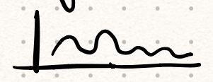
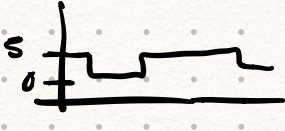

# Diseño de sistemas operativos

[TOC]

## Información

[Notas](https://www.notion.so/Notas-2607b92b49e64106afd141326b010798)

> Teorías: Javier García Guzmán
>
> Prácticas: Mat Max Montalvo Martínez

## Recursos

[Lista de libros de referencia](https://learning.oreilly.com/playlists/5a6c045f-e39c-465e-9e7c-60dcbb12aebb)

# Tema 1: Arquitectura de Sistemas IoT

[Definición de Internet de las Cosas](https://learning.oreilly.com/library/view/internet-of-things/9781788470599/a7f866bd-4ac8-47f3-a175-0f10d91a5ce2.xhtml)

[Aplicaciones Actuales de Internet de las Cosas](https://learning.oreilly.com/library/view/internet-of-things/9781119456742/part04.xhtml#part)

[Arquitectura de Sistemas de Internet de las Cosas](https://learning.oreilly.com/library/view/build-your-own/9781484244982/html/474034_1_En_2_Chapter.xhtml)

**IoT - Internet de las Cosas**: Consiste en conectar a internet, cualquier dispositivo, vehículo, edificios o en general objetos a los que se les haya dotado de sensores, actuadores y conexión a la red. Lo que les permite obtener e intercambiar información. Red de objetos conectados a internet que aporta valor añadidos a los usuarios que interactúan con ellos.

Consiste en añadir **inteligencia computacional** a dispositivos para mejorar las funcionalidades.

Permite que los dispositivos puedan intercambiar información.

Se busca que sean pequeños y tengan un chip que les permita **conectarse a la red** y operar en ella. Lo estandarizo IBM.

El **top 6 áreas** de aplicación de IoT:

1. **Industrial/Fabricación**: Automatizar, controlar la distribución, gestión de instalaciones.
2. **Transporte/Movilidad:** Coches, tráfico en ciudad, vehículos de transporte masivo y transporte industrial.
3. **Energía/Gestión eléctrica**: Predecir consumo, personalizar, bien estar de los ocupantes, monitorizar el consumo detallado, instalaciones con sensores.
4. **Gestión de inventarios/Comercial**: Saber cuánto queda y pedir, facilitar compras.
5. **Ciudad**: Recoge muchas áreas; basura, vigilancia, trafico, etc.
6. **Salud:** Investigación, la forma de tratar, las emergencias, distribución de información médica y dispositivos.

**Agricultura de precisión**: Según las previsiones ambientales y meteorológica, plagas y demás se calcula el mejor momento para sembrar. Además, cuando ya está plantado, las condiciones del suelo, cuando regar y abonar las tierras, así como la recolecta.

## En IoT de vehículos hay distintos niveles

**0**: Sin automatización.

**1**: Asistencia en la conducción.

**2**: Control de carril, lateral y longitudinal.

**3**: Conducción autónoma, pero el conductor en su puesto, para riesgos.

**4**: Conducción autónoma, pero el conductor en su  puesto, supervisar.

**5**: Conducción totalmente autónoma, sin conductor.

## Elementos IoT

**Colector**: Recogen información, sensores, o se activan, actuadores, que se intercambian en internet.

**Transmisor**: Puertas de enlace, pasarelas, pasan los datos a la red desde los dispositivos.

**Agregación + Distribución**: Calculo y procesamiento de la información.

**Consumidor**: Los usuarios/clientes acceden a los datos.

## Evolución

3 generaciones.

1. **RFID y sensores**

    Tecnología de detección por radio frecuencia.

    Las cosas contengan información, las etiquetas (como NFC, se estandarizó para indicar que datos contiene) y tener un dispositivo que al acercarlo podamos leerla.

2. **Web services e inter-networking** (2004-2012): Interconexión completa de las cosas y la red de las cosas.

    IPv4, HTTP, Bluetooth, TCP, UDP, etc.

    Pasan a tener una manera fácil de conectarse los dispositivos entre sí o con internet.

3. **Social, Cloud & ICN:** La era de la computación en la nube y la Internet del futuro.

    En esta generación la lógica pasa a estar en la nube, no en el dispositivo.

    Gestión de grandes cantidades de información.

    Seguridad, evitar accesos fraudulentos.

## Arquitectura de in Sistema IoT

**Dispositivos (Devices)**: Sensores y actuadores FÍSICOS, que normalmente tienen un microprocesador, que mide el medio físico y transforma las mediciones a señales digitales. Su función es tomar medidas y procesarlas, pero su función no puede ser solo transmitir la información.

Actuador, Sensores, LED, LCD, Beacon (la parte dispositivo), Termostato, RFID, Trampa para ratones inteligente, Dispositivos embebidos, etc.

**Pasarela (Gateway)**: Dispositivo o protocolo con la capacidad de comunicar con internet los dispositivos, para transmitir los datos tomados. Su única función es transmitir.

Router, Wifi, GSM, Bluetooth, Zigbee, Raspberry a veces, AMQP, CoAP, LoRaWAN (sistema de radio), Wimax.

Un móvil está entre Device y Gateway.

**Plataforma IoT (IoT Platform):** Conjunto de servicios orquestados para gestionar una gran red de dispositivos interconectados y que proporcionan información a aplicaciones u otros tipos de sistemas de información. Gestiona y almacena grandes cantidades de datos y las redirige. Funciona com middleware.

Es una nube de servidores que dan servicios:

1. **Message broker y Message bus**: Se encarga de conectar los dispositivos físicos con los distintos procesos que forman parte de la red de IoT. Manda los datos a todos los que estén conectados a su bus, suscritos por API Rest.
2. **Message router**: Está suscrito al message broker, los mensajes que recibe los enriquece; dando información semántica, de contexto, de estad y los reenvía a aquellos componentes que van a gestionar la lógica de las aplicaciones relacionadas con la nube IoT. Otra cosa que hace es transformar datos, descomprimir y decodificar datos para hacerlos más fáciles de procesar y tratar.
3. **Rest API**: Interfaz que usan otros programas para obtener los servicios o las funcionalidades de un componente. Esta API se caracteriza por ser accesible por http e independiente del estado del sistema.
4. **Data Management**: Para almacenar y gestionar los datos tomados en la red.
5. **Rule engine**: Permite monitorear los mensajes recibidos desde el router y permite lanzar distintas acciones en distintos elementos. Decide que acción tomar.

    Ejem: Si se abre la puerta, entonces avisar de intruso.

6. **Microservicios**: Proporciona funcionalidades muy específicas a través de una interfaz API Rest bien definidas mediante un contrato de datos. Muchos los coordina el rule engine. Se busca que este muy cohesionado y poco acoplado.

    Ejem: El que actualiza la estación meteorológica en el móvil, es un proceso muy concreto.

7. **Device manager**: Permite monitorizar algunos elementos de los sensores físicos como si está activo, la batería o si está conectado a la red.
8. **App y User management**: Sistema de permisos que identifica y gestiona el acceso de usuarios y aplicaciones.

**Aplicación(Application)**: La interfaz que el usuario utiliza para controlar el sistema.

**iBeacon** es un ejemplo de protocolo y **Beacon** es el dispositivo. Ambos están relacionados con dispositivos.

**Small Data**: Que solo proporcione la información de valor añadido. Es un conjunto de datos con un volumen y un formato que hacen que los datos sean accesibles, informativos y procesables.

**Wimax**: Conjunto de tecnologías y protocolos para aumentar el alcance de las redes inalámbricas (en vez de 30 metros, 40 kilómetros).

# Tema 2: Sensores y Actuadores

[Introducción a Sensores y Actuadores](https://learning.oreilly.com/library/view/internet-of-things/9781788470599/d39be056-b166-476e-868e-c415e4dfa886.xhtml) Hasta la sección 'Up to Functional examples (putting it all together)’ incluida.

## Sensores

Conjunto de componentes electrónicos capaces de detectar cambios físicos en el entorno y enviar información a otros componentes electrónicos, generalmente un procesador de computadora.

**Ejemplos**: Sensor de luz (LDR), sensor de ultrasonidos, giroscopio, fototransistor, Reed switch, ...

Los sensores se pueden clasificar en tipos según lo que miden: Gases, velocidad, flujo, fugas, movimiento, electricidad, ...

Según la señal que produce:

- **Analógico**: Produce voltaje analógico constante de los medido. El grafico de voltaje sobre el tiempo debe ser continuo y suave.
  -  Sensor de presión, sensor de luz, sensor de temperatura, acelerómetro, sensor de sonido.
- **Digital**: Produce un voltaje discreto, por lo general tendrá uno u otro de dos valores, 0V (apagado) a 5V (encendido). Gracias a la miniaturización hay más dado que se puede introducir un conversor.
  -  Sensor de ultrasonidos, sensor de infrarrojos, acelerómetro, sensor de sonido (suele ser analógico), sensor de temperatura.

Según si necesitan energía:

- **Sensor activo**: Siempre **necesitan** su propia fuente de energía.
  - Sensor de ultrasonidos, radar, LiDAR, sensor de humedad, cámara infrarroja.
- **Sensor pasivo**: **No necesitan** una fuente de energía, usan factores externos para alimentarse.
  - Sensor infrarrojo (fotodiodo infrarrojo), sensor PIR, sensor de luz (LDR)

**Sensor piezoeléctrico:**

1. Un cristal piezoeléctrico se coloca entre dos placas de metal que están en perfecto equilibrio y conduce ninguna corriente eléctrica.
2. Las placas de metal aplican tensión o fuerza mecánica sobre el material que hace que las cargas eléctricas del cristal se desequilibren.
3. Las placas de metal recogen esas cargas y produce un voltaje y envía una corriente eléctrica a través de un circuito.

## Actuadores

Cualquier dispositivo capaz de intervenir para cambiar las condiciones físicas del entorno generando los datos.

**Ejemplos**: Display, LED, servomotor, motor de paso a paso, Relay, solenoide, actuadores lineales, ...

## Factores de selección de Sensores y Actuadores

**Factores ambientales**: Temperatura, Humedad, Corrosión, Interferencia electromagnética, Tamaño, Rudeza y Consumo de energía.

**Factores económicos**: Coste, Disponibilidad y Tiempo de vida.

**Factores característicos del sensor**: Sensibilidad, Rango, Estabilidad, Repetibilidad, Rango de error, Tiempo de respuesta y Linealidad.
