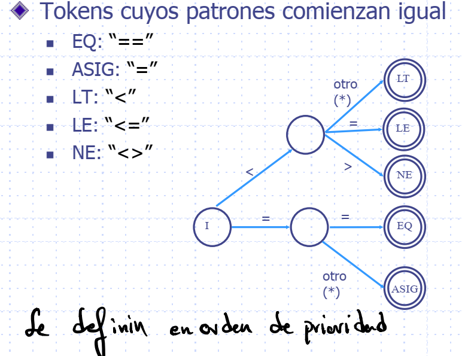
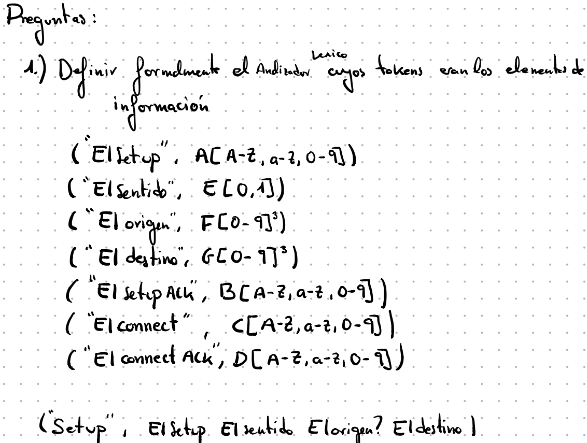
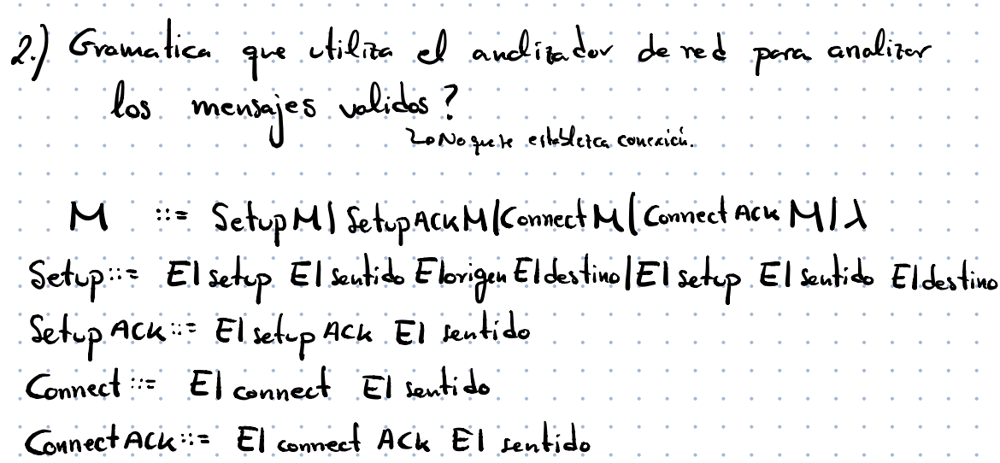

# PL

## Información

[Notas](https://www.notion.so/Notas-d4dc05f7110a4805bd82047088f79223)

> Teorías: Antonio Berlanga de Jesús y Jesús García Herrero
>
> Prácticas: Juan Manuel Alonso Weber jmaw@ia.uc3m.es
>

## Presentación

Practicas semanales de 2 en 2.

Hay clases en el cronograma de más, algunas se usarán para recuperar.

Las practicas las hacemos en Linux, vale, máquina virtual, guernika y se puede hacer en WSL2. Lo importante es tener un terminal.

Vamos a usar bison y flex, programaremos en C. El editor de texto que queramos.

## Repaso de TALF

[RepasoTALF.pdf](PL/G1ab.pdf)

### Definiciones

**Forma sentencial**: Aplicando reglas de producción llego a $x \in \sum^*$

**Sentencia**: Forma sentencial en el que x no tiene No Terminales.

**Lenguaje asociado a una gramática**: Todas las sentencias, sin terminales, de una gramática.

**Recursividad**: Aparece el terminal de la parte izquierda a la derecha.

- Recursividad a izquierda: $A → Ay$

- Recursividad a derechas: $A → xA$


**Reglas compresoras**: Aquellas que producen menos símbolos de los que hay a la izquierda. Como lo es $x::= \lambda$

### Gramática

$G=\{ \sum_T, \sum_N, S, P\}$

- $\sum_T$: Conjunto de símbolos **terminales**, alfabeto del lenguaje.

- $\sum_N$: Conjunto de símbolos **no terminales**.

- $S$: **Axioma** $S \in \sum_N$

- $P$: Conjunto de **Reglas de producción**. 

- Backus Normal Form: $P_i ::= P_d$

- $P_i \in (\sum_T \cup \sum_N)^+$ Al menos un símbolo

- $P_d \in (\sum_T \cup \sum_N)^*$ De 0 a infinitos símbolos

- $\lambda$  Clausula vacía


#### Tipos de Gramáticas

**Tipo 3**: Autómata Finito Determinista y Autómata Finito No Determinista.

- Expresiones regulares o lineales.

- Un solo No Terminal para dar: $P_d ::= a | aN | Na;  a \in \sum_T, N \in \sum_N$

- Lineal izquierda: $P_d ::= a | Na$

- Lineal derecha: $P_d ::= a | aN$


**Tipo 2**: Autómata a Pila.

- Lenguaje Independiente del Contexto. 

- Un No Terminal para dar cualquier sentencia, excepto lambda que solo lo puede dar el axioma.


**Tipo 1**: Maquina Linealmente Acotada.

- Lenguaje de contexto libre.

- Cualquier sentencia para dar cualquier secuencia, pero que no sea una regla reductora(tampoco se puede No Terminal para dar lambda).


**Tipo 0**: Maquina de Turing.

- Lenguaje sin restricciones.

- Cualquier sentencia para dar cualquier secuencia de símbolos, incluso reglas reductoras.


### Problemas de lectura de sentencias

**Precedencia**: Hay operadores con mayor prioridad. Se debe hacer desde lo último derivado hacia arriba.  Esto provoca ambigüedad, que es nuestro enemigo.


**Dangling Else**: Sobre a quién pertenece el else, en C el else pertenece al último else.

```c
if C1 then A else if C2
then B else C
```

**Asociatividad**: Entre operaciones con la misma precedencia. 1-1-1-1

### Derivación

Aplicación de una producción a una forma sentencial.

**Derivación más a la izquierda**: Sustituye el símbolo no terminal más a la izquierda.

**Derivación más a la derecha**: Sustituye el símbolo no terminal más a la derecha.

### Ambigüedad

Hay distintos niveles:

- **Sentencia**: Se puede obtener por dos derivaciones diferentes.
- **Gramática**: Si puede obtener una sentencia con dos derivaciones.
- **Lenguaje**: Todas las gramáticas que lo generan son ambiguas entonces es inherentemente ambiguo.

### Bien formar Gramáticas

**Limpiar**:

1. Sin **reglas innecesarias**: Un terminal que se da a sí mismo. A→A

2. Sin **símbolos inaccesibles**: Poner T y NT, e ir tachando según aparecen, los que no aparecen regla fuera.

3. Sin **símbolos superfluos**: Empezamos con las reglas que solo producen terminales e ir subiendo por pasos.


Sin reglas **no generativas**: Las que dan lambda, quitarlas y sustituir sus apariciones por lambda(nada).

Sin reglas de **redenominación**: Las que llaman aun solo símbolo No Terminal, poner las reglas de ese símbolo en el que lo invoca.

### Transformaciones útiles en compiladores

Estas transformaciones facilitan a los analizadores predictivos. Estos analizadores implican que nunca se va a hacer backtracking siempre sabemos que regla de producción hay que aplicar o no hay más, pero no se retrocede.

**Factorización a izquierdas**

- Cuando hay una estructura común en las reglas de producción.

- Se crea un nuevo No terminal para dar los símbolos que acompañan a esa parte común, en el original se pone la parte común seguida del nuevo símbolo.


**Eliminar recursividad por la izquierda**

- Para evitar recursividades pendientes, ya que leemos de izquierda a derecha, así reconocemos mientras aplicamos reglas.

- A la reglas no recursivas a izquierda se le concatena un nuevo No Terminal (quitamos las que eran recursivas). 

- Ese nuevo símbolo produce $\lambda$ y lo que producía originalmente que era recursivo a izquierda, pero en recursividad a la derecha.


### **Autómata Finito Determinista**

$AFD=( \sum, Q, f, q_o, F)$

**Donde:**

- $\sum$ Símbolos de entrada, Tokens.

- $Q$ Estados.

- $q_o \in Q$ Estado inicial.

- $F \subseteq Q$ Estados finales.

- $f(q,a \cdot x)$ Función de transición. Con un estado y un símbolo, voy a un estado.


Extensión a palabras: Recibe una palabra y va cogiendo los símbolos de entrada, y aplicando reglas sucesivas. Palabras que partiendo del inicial nos permite llegar a uno final.

**Lenguaje asociado:** Aquellas palabras tales que aplicando extensión a palabra el $q_o$ alcanza su estado de F, final.

**Equivalencia de AFD:** Si el lenguaje que reconocen es el mismo.

**Minimización de AFD:** Autómata finito mínimo equivalente es aquel con menor número de estado pero mismo lenguaje.

Siempre se puede pasar de G3 a AFD, aunque puede que no directo, por medio de AFND.

### **Autómata Finito No Determinista**

- Admite $\lambda$ y más de una posibilidad por símbolo.

- $AFND=( \sum, Q, f, q_o, F)$ Los símbolos representan lo mismo que en AFD.

- En este caso se permite transicionar sin recibir símbolo, lambda, además varias transiciones para un mismo símbolo en un mismo estado.


Para cualquier AFD existe uno no determinista equivalente.

Para toda gramática G3 existe un autómata determinista y no determinista.

### **Autómata a Pila (G2)**

$AP=(\sum, \Gamma, Q, A_0, q_0, f, F)$

**Donde:**

- $\Gamma$ Conjunto de símbolos de pila

- $A_0$ Símbolo de pila inicial

- $f(q,\lambda,A)$ Transita a uno o varios estados y puede escribir o no en pila, cuando escribe pueden ser mas de 1.

- Para toda gramática G2 existe un AP.

- El AP puede ser no determinista y en general $APND \nrightarrow APD$.

- Lenguaje aceptado por un AP, palabras que reconoce, y el final lo determina:


**Por estado final:** Cuando llega a un estado final y la secuencia de entrada está vacía, termina.

**Por vaciado de pila:** Entrada y pila vacía, termina.

### **Expresiones Regulares G3**

**Definición:**

- $\empty$ es una ER.

- $\lambda$ es una ER.

- a es una ER, siendo a un Tokens.

- $\alpha + \beta$ es una ER, la unión.

- $\alpha \cdot \beta$ es una ER, la concatenación.

- $\alpha ^*$ es una ER, la clausura.


**ER útiles:**

- $\alpha ^+ =\alpha \cdot \alpha ^* = \alpha ^* \cdot \alpha$ Al menos 1

- $\alpha? = \alpha | \lambda$ Puede ser alpha o lambda

- $[abc] = a|b|c$ Es a o b o c

- $[a-z] = a|b|...|z$

Dos EERR son equivalentes si describen el mismo lenguaje.


Inferencia: Si X=AX+B entonces X=A*B

## Tema 1: Introducción

**Compilador**: Proceso de traducción que convierte un programa fuente escrito en un lenguaje de alto nivel a un programa objeto en código maquina y listo por tanto para ejecutarse en el ordenador. Solo se genera el programa objeto cuando no hay errores.


**Programa fuente  → Compilador → Programa objeto/Mensajes de error.**

Originalmente, cuando no existía se metía con 1’s y 0’s, código máquina.

Después, se creó el ensamblador que traduce un código nemotécnico (lenguaje ensamblador) a código máquina.

Por último, el compilador sobre el ensamblador, esto facilito mucho las cosas.

En los 50's se consideraban los programas más difíciles.

Con el tiempo se ha facilitado mucho con entornos de programación y herramientas, no hay una fecha exacta del primer compilador.

Los primeros traducían formulas aritméticas a código máquina.

**Motivación**:

- Saber cómo se obtiene un ejecutable para alcanzar mejor eficiencia y corrección.
- Para entender mejor los lenguajes de programación.
- Conocer la teoría que hace posible su funcionamiento y como se ha llegado hasta este punto.
- Aplicar la teoría y herramientas a otros campos:
    - Intérpretes de comandos y consultas
    - Formateadores de texto (LaTeX, HTML)
    - Gráficos, ecuaciones,… (PS, GIF, EQN, …)
    - Lenguajes de simulación (GPSS)

**Aplicación**:

- Desarrollo de interfaces de texto.
- Tratamiento de ficheros de texto estructurado.
- Procesadores de texto.
- Formateo de texto y descripción grafica.
- Procesamiento del lenguaje natural.
- …

**Diferencia entre compilador e interprete**: El compilador solo hace la traducción a algo que se puede ejecutar, sin embargo, el intérprete no solo lo traduce, sino que lo va ejecutando.

**Ensamblador**: Compilador sencillo, traduce a código maquina sentencias simples de lenguaje fuente.

**Traductor**: Normalmente se refiere a la traducción entre dos lenguajes al mismo nivel de abstracción.

**Interprete**: Es un programa que simultáneamente analiza y ejecuta un programa escrito en lenguaje fuente.

**Compilador cruzado**: Compilador que traduce un lenguaje fuente a objeto donde el objeto es para un ordenador distinto del que compila.

**Compile-Link-Go frente a Compile-Go**: Uno Fragmenta, Compila, Enlaza las partes y tras crearlo lo ejecuta, y el otro Compila en un módulo cargable y Ejecuta el módulo.

**Compilador de una o varias pasadas**. 

Una pasada es un recorrido total de todo el código fuente con una misión específica.

**Traductor o compilador incremental**: Encontrados y corregidos los errores después solo se compilan estos.

**Autocompilador**: Compilador escrito en el propio lenguaje que compila. Esto facilita la Portabilidad:

**Metacompilador**: Programa que recibe la definición de un lenguaje (Gramática) y genera un compilador para ese lenguaje.

**Ejecutable**: Código objeto enlazado con las librerías.

### Compilación


Antes del pasar al compilador se pasa al **preprocesador que hace muchas funciones**, entre ellas, sustituir las variables constantes por su valor y quita los comentarios. Cuando termina pasa el programa fuente al compilador.


**Análisis**: Parte que solo depende de la estructura del lenguaje. No depende de la arquitectura.

**Analizador léxico**: A este llegan directamente los datos, no al resto. Su salida va al siguiente.

**Generación**: Depende de la arquitectura, pero no del lenguaje.

**Generador de código intermedio**: A veces se encuentra en análisis y otras en generación.

**Analizador léxico (scanner)**: Convierte la entrada (y::= 3+b*3) en Símbolos terminales (id op numo p id op num) de una gramática.

Análisis lineal: La cadena de entrada se lee de izquierda a derecha y se agrupa en componentes léxicos (tokens)


**Analizador sintáctico:** Agrupa los componentes léxico en frases gramaticales que el compilador utiliza. A partir de los tokens produce un árbol sintáctico.

- Recibe tokens → crea un árbol. 

- En las hojas tiene los terminales en la manera en la que identifica el token.


**Analizador semántico:** Busca errores semánticos, reúne información de tipos; identifica operadores y operandos.

- Recibe el árbol sintáctico explícita o implícitamente, y trata de determinar si tiene sentido las distintas operaciones. Por ejemplo: Sumar un número y una cadena de caracteres.


**Generador de código**: A veces se encuentra en análisis y otras en generación. Convierte el árbol en instrucciones, código intermedio(ensamblador). El recorrido es importante ya que al generar código no se ve la jerarquía. Por ejemplo: Primero se tienen que hacer las operaciones antes de asignar el valor.


**Optimizador:** Trata de darse cuenta de subárboles comunes para no repetir operaciones en las que no cambian variables. En vez de volver a poner esa estructura apunta a ella.


**Generador de código:** El uso de código intermedio reduce la complejidad del desarrollo de compiladores. m front ends y n back-ends comparten un código intermedio común.

**Front-end**: Etapa inicial. Fases que dependen del lenguaje fuente y que son independientes de la máquina. Análisis léxico, sintáctico, semántico y generación de código intermedio, manejo de errores de cada parte.

**Back-end**: Etapa final. Fases que dependen de la máquina, dependen del lenguaje intermedio. Optimización de código, generación de código, operaciones con la tabla de símbolos.

### Diagramas de Tombstone

Conjunto de piezas de puzzle útiles para razonar acerca de los procesadores de lenguaje y los programas.

Está formado por piezas que deben encajar, encajan según unas reglas de formación.

La máquina y el lenguaje deben coincidir.


- Ejemplos:

    

## Tema 2: Análisis Léxico


### **Funciones del Análisis Léxico**

**Manejar el fichero fuente:** Leer los caracteres de la entrada. Eliminar comentarios y delimitadores. Relacionar los mensaje de error con las líneas del programa fuente.

**Interfaz con las otras fases de análisis:** Generar la secuencia de componentes léxicos (tokens). Introducir los identificadores en la **tabla de símbolos**. Manejar macros. pi→3,14

**Controlar si es de formato libre o no:** Libre: PASCAL. No libre: FORTRAN.

### **Aspectos del Análisis Léxico:**

**Diseño más sencillo:** Los símbolos que trata el scanner se describe con una gramática más simple que la del parser.

**Mejora la eficiencia:** Gran parte del tiempo de compilación se consume en la lectura y exploración.

**Mejora la portabilidad:** Se pueden tener varias versiones del scanner una para distintos códigos.

**Tokens**: Unidades sintácticas de un lenguaje. Símbolos terminales de una gramática, identificadores, palabras reservadas.

- num es el token.

**Categoría:**

- **Palabras reservadas**: IF, THEN, DO...

- **Identificadores**: main, suma, identificadores...

- **Símbolos especiales**: Como <, >...
- **Constantes y literales.**

**Lexema:** Secuencias válidas para un token. Secuencia de caracteres del código fuente que son identificados como un token específico.

- El lexema de num son los valores que puede tomar: 12, 34, 480


**Atributos:** Información adicional que tiene el token. 

- id.lexema="x" id.tipo id.ámbito


**Patrón:** Define la secuencia de caracteres válidos para un tokens, formato de los lexemas.

- $[0-9]^+$ Naturales  $-?[0-9]^+$ Enteros de -9 a 9


- El + al final, indica que hay 1 o más ocurrencias. Para poner determinados símbolos se pone "\"


**Especificar tokens:** Con expresiones regulares, patrones, o Autómatas Finitos.

- Los elementos básicos en un lenguaje deben ser tokens.

- Se pueden usar Expresiones regulares o Autómatas Finitos.


**Tabla de símbolos:** Almacenan la correspondencia entre tokens y lexemas, en muchos lenguajes hay palabras claves (reservadas) que no se pueden declarar como una variable para ello se almacena en la tabla. 

- Los atributos de los identificadores se pueden guardar en la tablas de símbolos. Los otros en otra tabla.


Un AF no devuelve el token, se usa otra cosa para que nos dé el token cuando reconoce símbolos.

Nosotros vamos a usar DT para representar.

### **Diagrama de Transiciones - DT**

Definir formalmente un AL es hacer los DT de los tokens (ojo con los separadores que llevan a finales, si no hay nada, que no salga)

Se usa para especificar el funcionamiento de un Analizador Léxico mediante un AFD. **UNO POR TOKEN**

Se diferencian porque el DT reconoce un token cuando reconoce un delimitador y devuelve entonces el token.

**Lee caracteres hasta completar un token entonces: Devuelve el token leído** y Deja el buffer listo para la siguiente llamada.

No tiene estados de error.

De los estados de aceptación no salen transiciones, necesita una transición mas que no pertenece al token, que le hace salir y devolver el token.

Esto quiere decir que aquello estados que son terminales y pueden transitar a otro estado tengan una transición para otro tipo de carácter que hace que salga como final.


### **Construcción de un AFD para AL**

Normalmente se parte de representación de las reglas de tokens con expresiones regulares.
1. Toda expresión regular tiene un AFND asociado.
2. Construir un AFD para el mismo lenguaje del AFND
3. Optimización del AFD.

### Tabla de Transiciones de DT


### Autómata programado

Es la manera de programar un Analizador Léxico.

Representa directamente con un programa al DT en cuestión.


### Implementación de un AL

#### Utilizando un generador de Analizadores Léxicos (es lo que usaremos)

**Ventajas**: Comodidad y Rapidez de desarrollo.

**Inconvenientes**: Ineficiencia.

**Recomendación**: Ordenar las reglas de acuerdo a la frecuencia de utilización.

#### Utilizando ensamblador

**Ventajas**: Mas eficiente y compacto.

**Inconvenientes**: Mas difícil de desarrollar y Dificultad de mantenimiento de código generado.

#### Utilizando un lenguaje de alto nivel

**Ventajas**: Eficiente y Compacto.

**Inconveniente**: Realizar todo a mano.

Técnicas:

- **Programación**: Muy eficiente.

- **Controlado por tablas**: Código pequeño, general y manejable.

### Programación de un AL

Dos punteros de lectura:

**Puntero actual**: El ultimo carácter aceptado.

**Puntero de búsqueda**: El ultimo carácter leído.


**Funciones de lectura**: GetChar(avanza uno del avanzado y da el valor), Fail(Mueve el puntero avanzado de vuelta al aceptado), Retract(mueve el puntero avanzado uno atrás) y Accept(mueve el puntero actual hasta el avanzado).

**Primitivas**: IsLetter(letra), IsDigit(número) y IsDelimiter(separadores).

**Acciones**: InstallName(introduce un nombre en la tabla de símbolos).

### Errores Léxicos

Hay pocos detectables por el analizador léxico.

Detectables, según el diseñador:
- Número de caracteres de los identificadores.
- Caracteres ilegales.
- Otros, como admitir números sin la parte entera.
- Cadena que no concuerda con ningún token.

En caso de error:
1. Anotar el error, indicarlos.
2. Recuperarme del error para continuar con el análisis.
    Ignorar, Borrar, Insertar o Corregir.
3. Seguir.

### Identificación de palabras reservadas

Mediante resolución implícita, todas identificadas en el comienzo de la tabla de símbolos, o resolución explícita, usando patrones para las palabras reservadas.

### Prioridad de los tokens

Criterio: Se utilizan heurística para dar prioridad al token que concuerda con el lexema más largo. 

En el caso se puede concordar a varios tokens se asocia al que esté en primer lugar.



### AL y Lenguajes de Programación

El **AL agrupa caracteres para formar tokens**, por tanto es importante definir el “delimitador”.

- Carácter que **delimita el token sin pertenecer** a él.

Otro concepto importante es el de “**palabra reservada**”

- El lenguaje **prohíbe el uso libre al programador de determinadas palabras** que tienen un significado específico y único en el lenguaje

**Lenguajes según uso de delimitadores y palabras reservadas:**

- **Delimitadores blancos; con palabras reservadas**
    - Caso más sencillo de lenguaje (PASCAL, COBOL)
- **Delimitadores blancos; sin palabras reservadas**
    - PL/I
- **Blancos se ignoran; sin palabras reservadas**
    - El tipo más difícil de lenguaje, aparecen ambigüedades (FORTRAN)
    - El espacio en blanco se elimina con un preprocesado.
    - El AL tiene que retroceder y comenzar de nuevo.

### Ejemplo de crear un AL



## Tema 3: Análisis Sintáctico


## Recursos


[LibroCompiladores.pdf](PL/82b023f9736138ad1bfdba842c04b6ce.pdf)