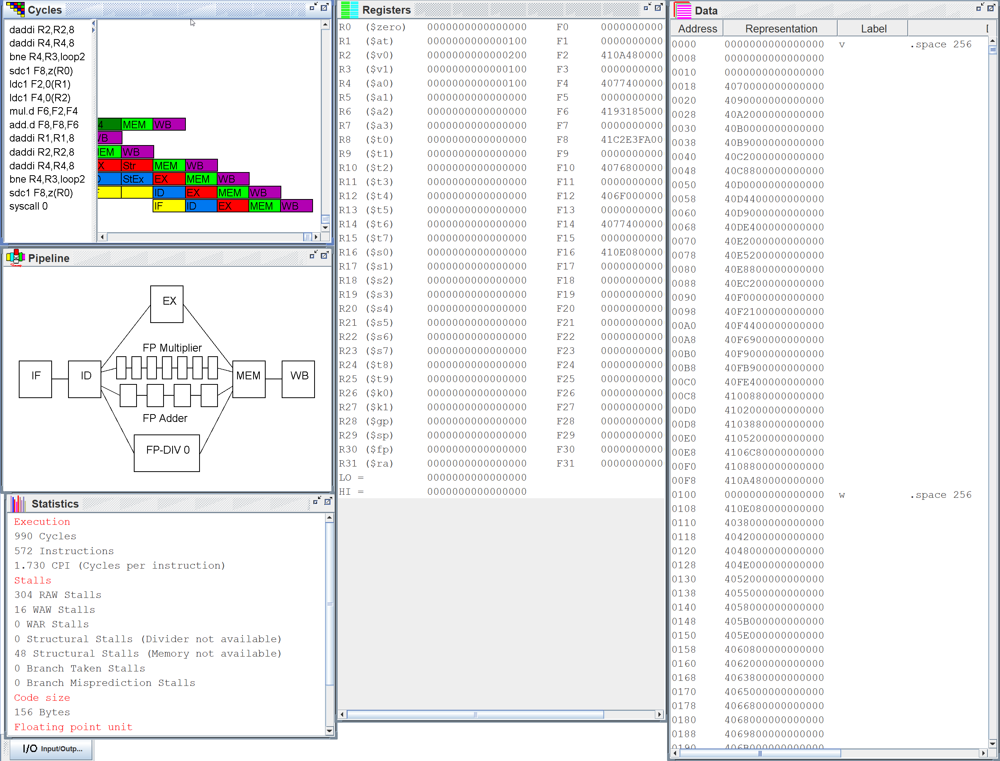
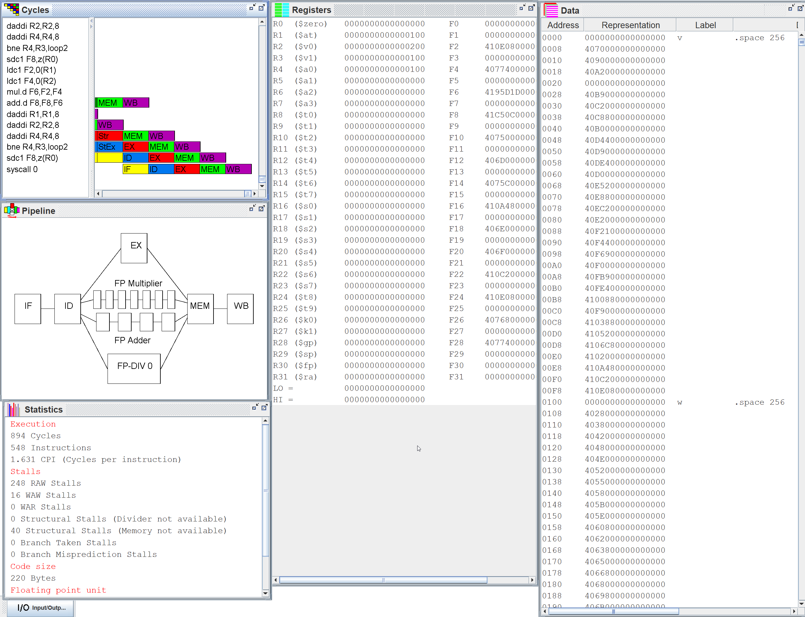
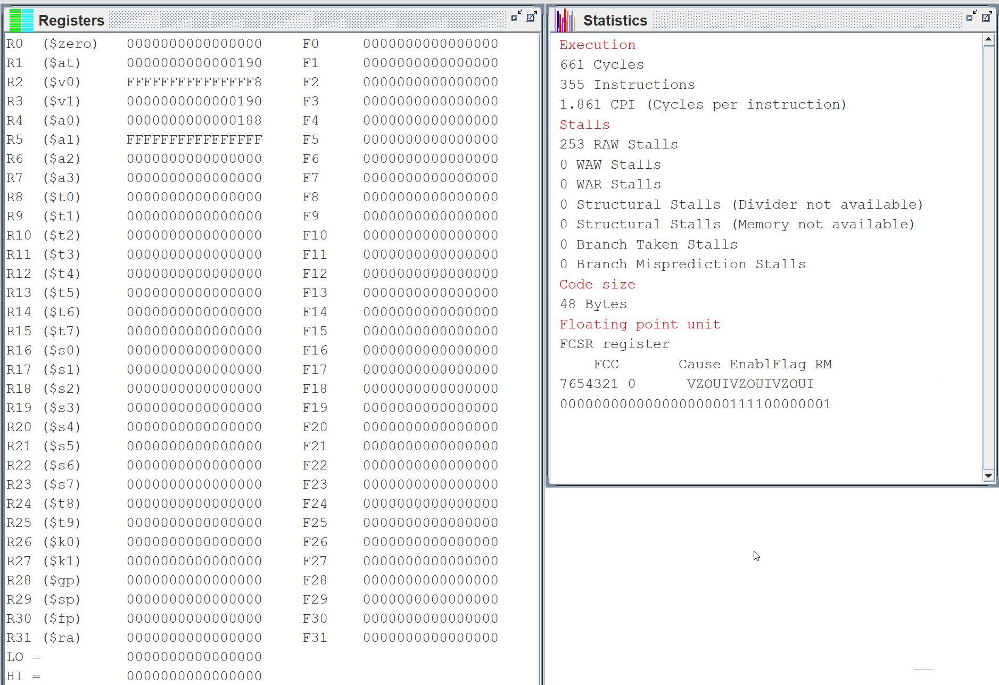

# Arquitectura de computadores

# Información

[Notas](https://www.notion.so/Notas-796a528ac8f34899856cab69c136bf31)

[Presentación AC.pdf](AC/es-00-intro-hout.pdf)

Teorías: José Daniel García jdgarcia@inf.uc3m.es josedaniel.garcia@uc3m.es
Prácticas: ELIAS DEL POZO PUÑAL, JOSE MANUEL PEREZ LOBATO y DAVID EXPOSITO SINGH

# Teoría

- Módulo 1: Introducción al Diseño de Computadores

    [es-m1-01-fund-hout.pdf](AC/es-m1-01-fund-hout.pdf)

    - Lecturas

        [http://www.gotw.ca/publications/concurrency-ddj.htm](http://www.gotw.ca/publications/concurrency-ddj.htm)

        Lea la sección 1.3 del libro (Defining Computer Architecture).

    ## ¿Qué es la arquitectura de computadores?

    - Son los atributos de un sistema que puede ver el programador, y aquellos que no puede ver es la organización del sistema.
    - Es la ciencia y el arte de seleccionar e interconectar componentes hardware para que satisfagan los requisitos funcionales, de rendimiento y coste.
    - No es lo mismo que el ISA - Instruction Set Arquitecture, al principio se creía que era lo mismo, pero la arquitectura de computadores es mucho más que diseñar las instrucciones, es organización funcional, diseño lógico e implementación. A su vez esas tareas son muy complejas. El ISA sirve como límite entre el software y el hardware.
    - Estudiarla nos permite comprender las tendencias de la próxima década y las limitaciones de los computadores.

    ## La ley de Moore:

    Mas que una ley es una observación empírica

    - Diagrama

        

    - El número de transistores por chip se duplica cada N meses, donde N varía entre 12 y 24. Aumenta exponencialmente.
    - En 2015 se dejó de cumplir. No somos capaces de aumentar la frecuencia.
    - Aunque han aumentado los transistores no quiere decir que sea más rápido cada uno de ellos, ya que se llega un punto en el que no puede dar más potencia debido al problema de la temperatura.
    - Evolución del del rendimiento:
        - Diagrama

            

    ## RISC:

    Aparece en 1986 como una nueva arquitectura.

    - Permitió una mejora de la capacidad disponible. Hasta el punto que un microprocesador de alta gama era más potente que un supercomputador de 10 años atrás.
    - Se mejoró el ratio coste/rendimiento, lo que dio lugar a nuevos computadores. En los 80’s PC y Workstation, y en los 00’s smartphones, tablets y grandes centros de datos.
    - Fue una revolución, permitió dominar los computadores basados en microprocesadores, gracias a la mejora continua de semiconductores.
    - El rendimiento crecía 52% al año hasta el 2003.

    ## Perspectiva histórica:

    - Primera revolución (70's): El microprocesador.
        - Primer microprocesador.

            

        - Fue posible al poder poner suficientes transistores, 25000, en un único chip para un procesador de 16 bits.
        - Era más barato, todo en un chip, y más rápido, no hacía falta tantas salidas del chip al estar todo junto.
        - Aparecen computadores de escritorio, portátiles, consolas, descodificadores, etc.
        - Se mejoraron los supercomputadores como agregación de muchas placas con procesadores estándar.
    - Segunda revolución (80’s): Paralelismo a nivel de instrucción.
        - ILP – Instruction Level Parallelism.
        - El hardware tiene recursos que se pueden usarse en paralelo. Mientras se realiza una parte para una, se hace otra para otro.
        - Elementos:
            - Segmentación o Pipeline: Dividir el diseño del procesador en distintas partes físicas que se pueden usar por separado. Se incrementa la frecuencia de reloj.
            - Caches: Necesaria para incrementar las frecuencias, para esperar menos a los datos de disco.
            - Coma flotante: Integradas en el chip, junto a la unidad aritmética general.
            - Incremento en la profundidad del pipeline, más etapas, y especulación de salto, intenta adivinar que rama se van a tomar.
            - Emisión múltiple: Arquitecturas superescalares, captar más de una instrucción por ciclo de reloj, entre 2 y 4 instrucciones.
            - Planificación dinámica: Ejecución fuera del orden programado, con el objetivo de que sea más rápido y funcione igual.
        - Culminación de procesadores de un núcleo.

            

    - Tercera revolución: Paralelismo de datos y de hilos
        - Soporte a paralelismo explícito de datos y de hilos.
        - El hardware ofrece recursos paralelos y el software especifica su uso.
        - El paralelismo deja de ser ocultado por el hardware.
        - La razón es que los beneficios del ILP son cada vez menores, no pueden hacer un núcleo de ejecución más complicado, pero pueden meter más transistores.
        - Se introducen más cores y se mejora la memoria cache del chip.
        - Elementos:
            - Instrucciones vectoriales, que dan muy buen resultado en aplicaciones multimedia.
            - Soporte general para aplicaciones.
        - Procesadores multi-core.

            

    ## Tendencias arquitectónicas.

    - ILP - Paralelismo a nivel de instrucción: Permite ejecutar varias instrucciones, pero 2003-2005 no se puede mejorar significativamente.
        - El hardware y el compilador oculta detalles al programador, por lo que este tiene una vista secuencial muy simplificada del hardware.
    - Con la aparición de los multi-core surgen nuevos tipos de procesamiento, pero estos requieren reestructurar las aplicación para incrementar el rendimiento:
        - Paralelismo a nivel de dato – DLP
        - Paralelismo a nivel de hilo – TLP
        - Paralelismo a nivel de petición – RLP

    ## Paralelismo:

    - Forma de computación en la cual varios cálculos pueden realizarse simultáneamente, basado en el principio de dividir los problemas grandes para obtener varios problemas pequeños, que son posteriormente solucionados en paralelo.
        - La velocidad de las máquinas secuenciales, no nos permiten alcanzar velocidades de procesado demasiado altas por limitaciones física.
            - Por ejemplo, una máquina secuencial de 1 TFLOP, no es factible con una aproximación secuencial.
    - Aparece como principal mecanismo de diseño de computadores, contra las restricciones de coste y consumo de energía.
    - Tipos de paralelismo en las aplicaciones:
        - Paralelismo de datos: Se aplica la misma operación a distintos datos.
        - Paralelismo de tareas: Se ejecutan distintas operaciones.
    - Tipos de paralelismo hardware:
        - ILP - Paralelismo a Nivel de Instrucción: Explota el paralelismo de datos con ayuda del compilador.
        - Arquitecturas vectoriales y GPUs: Explotan el paralelismo de datos aplicando la misma operación a varios datos en paralelo.
        - TLP - Paralelismo a Nivel de Hilo: Explota el paralelismo de datos o tareas en hardware altamente acoplado. Permite interacciones entre hilos.
            - Por ejemplo, un procesador con varios cores.
        - RLP - Paralelismo a Nivel de Petición: Explota el paralelismo entre tareas altamente desacopladas.
            - Cuando hay varios computadores en un red y cada uno de ellos procesa una petición distinta de un servidor.

    ## Clasificación de computadores:

    - Dispositivos móviles personales:
        - Dispositivos sin cables con una interfaz de usuario multimedia.
            - Dispositivos móviles, tablets, etc.
        - Precio: $100 – $1000.
        - Precio de procesador: $10 – $100.
        - Factores críticos:
            - Coste, a un centenar de dólares.
            - Energía, ya que debe durar suficiente la batería.
            - Rendimiento, realizar las tareas en un tiempo adecuado.
            - Tiempo de respuesta, interfaces de usuario rápidas.
    - Computadores de escritorios:
        - Diseñados para ofrecer un buen rendimiento a los usuarios.
            - Desde ultra-books hasta estaciones de trabajo.
            - Mas de 50% son portátiles.
        - Precio: $300 – $2500.
        - Precio de procesador: $50 – $500.
        - Factores críticos:
            - Precio-Rendimiento, están dispuestos a pagar más si van a obtener mejor rendimiento.
            - Energía.
            - Rendimiento de gráficos.
    - Servidores:
        - Usados para ejecutar aplicaciones de gran escala y dar servicio a múltiples usuarios de forma simultánea.
            - Han crecido mucho desde los 80 y sustituyeron a los mainframes.
        - Precio: $5,000 – $10,000,000.
        - Precio de procesador: $200 – $2,000. Hay muchos procesadores.
        - Factores críticos:
            - Throughput (tasa de procesamiento), las peticiones procesadas por unidad de tiempo.
            - Disponibilidad, que sean accesibles en cualquier momento.
            - Escalabilidad, que permite hacerlo más grande mejorando las prestaciones.
            - Energía, ya que suponen un gran gasto en electricidad.
    - Clusters / Computadores a Escala de Almacén - Warehouse Scale Computers (WSC)
        - Pasillos y pasillos de armarios llenas de placas con memoria, disco y procesador conectadas en LAN. Cada uno ejecuta su sistema operativo.
        - Una colección de computadores conectados mediante Red de Área Local - LAN que actúa como un computador más grande.
            - Alcanza más popularidad debido a crecimiento de SaaS (Software as a Service).
            - Cada nodo ejecuta su propio sistema operativo.
            - A partir de 1000 nodos se considera WSC.
        - Precio: $100,000 – $200,000,000.
        - Precio de procesador: $50 – $250.
        - Factores críticos:
            - Precio-Rendimiento.
            - Throughput (tasa de procesamiento).
            - Proporcionalidad en energía.
    - Empotrados
        - Computador dentro de otro sistema que ejecuta aplicaciones preestablecidas. Un solo sistema puede tener cientos de pequeños microprocesadores, por eso deben ser baratos.
            - Lavaplatos, consola de videojuegos, MP3, . . .
        - Precio: $10 – $100,000.
        - Precio de procesador: $0.01 – $100.
        - Factores críticos:
            - Precio, ya que no es lo fundamental.
            - Energía.
            - Rendimiento de aplicación específica, ya que hace una función específica.

    ### Mainframe:

    Tipo de computador hasta los 70 de gran escala que usaban las compañías para el back office. Estaban muy optimizados para procesamiento batch, por lotes.

    ### Taxonomía de Flynn:

    Clasificación de arquitecturas paralelas posibles:

    - SISD - Single Instruction Single Data Stream: Una sola instrucción sobre un único dato.
        - Monoprocesador
    - SIMD – Single Instruction Multiple Data Stream: Una única instrucción sobre varios datos.
        - Alternativas: Procesadores vectoriales, extensiones multimedia y GPUs.
    - MISD – Multiple Instruction Single Data: No se conocen implementaciones comerciales. Nunca se ha construido.
    - MIMD – Multiple Instruction Multiple Data: Múltiples instrucciones sobre múltiples datos. Cada procesador opera sobre sus propios datos, permite el Paralelismo de tareas.
        - También se puede incluir el Paralelismo a Nivel de Hilo como en las arquitecturas multi-core o el Paralelismo a Nivel de Petición de los clústeres y WSCs.
        - Es más caro que el SIMD, pero es más flexible y general.
        - Requiere que las tareas a ejecutar sean suficientemente complicadas.
- Módulo 2: Evaluación del rendimiento de sistemas informáticos

    [es-m2-01-trend-hout.pdf](AC/es-m2-01-trend-hout.pdf)

    ## Tendencias tecnológicas

    - Impacto de la tecnología: Los cambios tecnológicos tienen impacto en los mecanismos de implementación de la ISA – Arquitectura del Juego de Instrucciones.
        - Tecnología de circuitos integrados:
            - Densidad de transistores: 35% anual.
            - Tamaño del dado: 10%-20% anual.
            - Efecto combinado: 40%-55% anual, pero se dejó de cumplir (Ley de Moore).
        - Capacidad DRAM:
            - 25%-40% anual (reduciéndose).
        - Capacidad Flash:
            - 50%-60% anual
            - 8-10 veces más barato por bit que DRAM
        - Capacidad de discos magnéticos:
            - 5% anual (últimos años).
            - 8-10 veces más barato por bit que Flash.
            - 200-300 veces más barato que DRAM.
    - Ancho de banda – Throughput: Cantidad de trabajo realizada por unidad de tiempo.
        - Procesadores: Instrucciones por segundo. Incremento entre 32.000 y 40.000 veces.
        - Memoria y discos: bytes o bits transferidos por unidad de tiempo. Incremento entre 300 y 1.200 veces.
    - Latencia: Tiempo entre inicio y fin de un evento.
        - Procesadores: Desde que se ejecuta hasta que termina. Incremento entre 50 y 90 veces.
        - Memorias y discos: Desde que comienza la lectura hasta que termina. Incremento entre 6 y 8 veces.
    - El ancho de banda ha aumentado mucho con respecto a la latencia.
        - Diagrama

            

    ## Tendencias en potencia y energía

    - El coste se mide en Energía. $E= P \cdot t$
        - No siempre el más potente es que más energía consume, pero cuando ocurre hay que plantearse si merece la pena.
    - En la tecnología CMOS, el consumo de energía viene de la conmutación de transistores.
    - Energía dinámica: Cantidad de energía necesaria para conmutar.
        - $E_d \approx \frac 1 2 \cdot X_c\cdot V^2$
        - La reducción del voltaje mejora mucho la Energía dinámica, con el tiempo se ha pasado de 5 a 1V.
    - Potencia dinámica: Depende de la frecuencia de conmutación.
        - $P_d \approx \frac 1 2 \cdot X_c\cdot V^2\cdot f$
            - Xc: Carga capacitiva. Depende del número de transistores.
            - V: Voltaje.
            - f: frecuencia
    - La evolución ha estado dominada por el incremento de número de transistores e incremento de frecuencia, lo que ha incrementado la potencia, pero también la energía.
        - El incremento de la energía hasta los 95 W provoca una gran cantidad de calor que debemos disipar y se ha alcanzado el Limite de enfriamiento por ventilación.
    - Eficiencia energética:
        - Desactivación de reloj de las unidades inactivas.
        - Escalado dinámico de voltaje y frecuencia (DVFS)
        - Modos de bajo consumo en memoria y discos, aunque requieren reactivación que puede tardar.
        - Overclocking automático, si es seguro.

    ## Tendencias en coste:

    - El coste de fabricación de un computador se reduce a lo largo del tiempo.
        - Principio de la curva de aprendizaje: Se comienza siendo ineficiente y con el tiempo se va mejorando el proceso de fabricación. También hay que tener en cuenta el coste de ingeniería o diseño.
            - Si se dobla el rendimiento se divide a la mitad el coste.
            - DRAM: Promedio de caída anual del 40% en coste y precio
        - Volumen: Cuantos más se fabriquen de una vez, el coste por unidad se reduce.
            - Decremento del 10% en coste si se dobla volumen.
        - Venta por múltiples fabricantes de mismo producto: La competencia.
    - Dado: Cada uno de los circuitos -chips impresos sobre la oblea.
    - Oblea: Material semiconductor donde se imprimen los circuitos.
        - Coste

            

    [es-m2-02-almfiab-hout.pdf](AC/es-m2-02-almfiab-hout.pdf)

    ## Evaluación del rendimiento

    ### Métricas de rendimiento

    - Velocidad de ejecución: Tiempo en el que se ejecuta un programa o transacción. Se trata de reducir el tiempo de ejecución, lo que aumenta la tasa de procesado.
    - Rendimiento: Es una métrica inversa al tiempo de ejecución. $R= \frac 1 T$ Alto rendimiento -> Bajo tiempo de ejecución.
    - Aceleración: Veces que x es más rápido que y. $n=\frac {T(x)} {T(y)}=\frac {R(y)} {R(x)}$ No está claro si están bien.
    - La única métrica fiable para comparar rendimiento de computadores es la ejecución de programas reales, cualquier otra conduce a errores, hay que probar con lo que buscamos rendimiento.
    - Tiempo de ejecución.
        - Tiempo de respuesta: Tiempo total transcurrido.
        - Tiempo de CPU: Tiempo que la CPU ha estado ocupada.

    ### Benchmarks

    - Aplicación o conjunto de aplicaciones usadas para evaluar rendimiento.
    - El rendimiento de un computador depende de la carga de trabajo con la que se evalúa. Los computadores están adaptados a cargas especificas (servidores web, servidores de bases de datos, computador personal, multicomputadoras, …) .
    - Aproximaciones: Malas al no ser programas reales, el arquitecto y el compilador pueden engañar
        - Kernels: Partes pequeñas de aplicaciones reales.
        - Programas de juguete: Programas cortos.
        - Benchmarks sintéticos: Inventados para medir el rendimiento, para representar aplicaciones reales.
    - Algunos benchmarks para:
        - Empotrados: Dhrystone y EEMBC.
        - Desktop: SPEC2017(mezcla de programas reales con unos datos concretos)
        - Servidores: SPECWeb, SPECSFS o TPC.

    ### Ley de Amdahl

    - El incremento de rendimiento obtenido usando un modo de ejecución más rápido está limitado por la fracción de tiempo que se puede usar dicho modo.
    - Cuando mejora el rendimiento depende mucho de cuánto tiempo se ejecuta. Hay que optimizar las que más tiempo va a estar ejecutándose.
    - Speedup o aceleración: Cuantas veces es mejor la mejora con respecto al original. Ratio entre el rendimiento mejorado y el rendimiento original.
        - $S=\frac {R_{mejorado}} {R_{original}}=\frac {T_{original}} {T_{mejorado}}$
        - $S=\frac 1 {(1-F)+\frac F S}$ F: fracción mejorable, $\frac {T_{a\space mejorar}} {T_{total}}$.
        - El speedup depende exclusivamente de la fracción de mejora y el speedup de la mejora.
        - Diagrama

            

    - Se debe optimizar:
        - Dentro del procesador: la ruta de datos.
        - En el juego de instrucciones: las instrucciones más frecuentes.
        - En el diseño de la jerarquía de memoria, la programación y la compilación: hay que explotar la localidad de las referencias. El 90% del tiempo se está ejecutando el 10% del código.

    ### Rendimiento del procesador

    - Cada instrucción ocurre en varios ciclos de reloj.
    - CPI: Ciclos por instrucción. $CPI = \frac {ciclosCPU} {IC}$
    - IC: Instrucciones ejecutadas.
    - $tiempoCPU = \frac {ciclosCPU} f= CPI\cdot IC\cdot T$ a veces se pone P de Periodo en vez de T. $T=\frac 1f$
        - Si se reducen un 10% cualquiera de los 3 factores se reduce un 10% el tiempo de ejecución.
    - La frecuencia relativa de las instrucciones tiene impacto en la ejecución del programa.
        - $CPI_{global}=\sum_{i=1}^{n} \frac {IC_i} {IC} \times CPI_i$

- Módulo 3 Paralelismo a nivel de instrucción

    [es-m3-01-expilp-hout.pdf](AC/es-m3-01-expilp-hout.pdf)

    # Segmentación (Pipeline):

    Técnica de implementación de los procesadores en la que la ejecución de múltiples instrucciones se solapa en el tiempo.

    La instrucción se divide en ciclos, se hacen suboperaciones simples, se van ejecutando de forma escalonada.

    - Efectos:
        - Aumenta la tasa de procesamiento (Throughput), al ser de forma escalonada, termina una operación por ciclo.
        - No disminuye la latencia, cada instrucción individual tarda lo mismo o más, lo que pasa es que terminan más operaciones por unidad de tiempo. Una instrucción 5 etapas, 5 ciclos.
        - Un pipeline de profundidad n, multiplica por n el ancho de banda necesario de la versión sin pipeline. Se necesita más dado que las etapas de captación y memoria acceden a memoria y se van solapando.
            - Se solventa y evitan problemas de memoria con una cache de datos y una cache de instrucciones.
        - Distintas instrucciones en la pipeline no deben usar el mismo recurso en el mismo ciclo.
            - Se introducen registros de pipeline entre etapas, donde se almacenan temporalmente los datos de la etapa anterior para usarlo en la siguiente. Hay tantos registro por etapa como salidas de la etapa.
        - Para evitar conflictos en los registros, todos escriben en la primera mitad de ciclo y leen en la segunda mitad de ciclo.
    - Tratamos un modelo simplificado con solo 5 etapas (ejem: Intel 20-28 etapas)
    - Etapas:
        - Diagrama

            

        - Captación (Fetch): Leer la instrucción de la memoria de instrucciones y lo cargar en el IR.
            - Leer el PC en memoria y se guarda en el IR.
            - Actualización de PC, se suma un valor fijo.
        - Decodificación (Decode): Mira código de operación y obtiene el valor de los operandos del banco de registros.
            - Se utiliza el campo de código de operación para activar las señales de control.
            - Se leen los registros correspondientes y se preparan para entrar en la ALU.
            - También se aplica extensión de signo, 16-32 bits, y el cálculo de la dirección de salto.
        - Ejecución (Execution): Se hacen las operaciones en la ALU.
            - Se utiliza la ALU para operar los valores preparados previos.
            - También se usa la ALU para calcular direcciones de memoria.
        - Memoria (Memory): Escritura o lectura de memoria de datos.
            - Se lee o escribe en memoria.
                - Leer: Se pasa la dirección y sale el dato.
                - Escritura: Se pasa la dirección y el dato a escribir.
        - Post-escritura (Write-back): Actualización de banco de registros, guarda los resultados.
            
        - Se escribe la salida de la ALU o de la memoria de datos en el banco de registros.
    
## Riesgos:
    
Situación que impide que la siguiente instrucción pueda comenzar en el ciclo de reloj previsto.
    
    - Provocan una reducción del rendimiento.
    - Tipos de riesgos:
        - Riesgo estructural: Cuando el hardware no puede soportar todas las posibles secuencias de instrucciones.
            - En un mismo ciclo dos etapas hacen uso del mismo recurso.
            - Una de esas etapas debería esperar hasta que el recurso este libre.
            - Razones:
                - Unidades funcionales no totalmente segmentadas, cuando hay operaciones que hacen varios ciclos en el mismo recurso. Se podría subdividir en subetapas.
                - Unidades funcionales no duplicadas. Se podría dividir en instrucciones más cortas, de esa manera, en cada ciclo completa un aparte dentro de ese recurso.
            - Es evitable, pero encarece el hardware.
            - Se resuelve por hardware, dos caches instrucciones y datos.
        - Riesgo de datos: Cuando la segmentación modifica el orden de accesos de lectura/escritura a los operandos.
            - Tratamos de leer o escribir un dato que todavía no se ha guardado o leído por estar en etapas intermedias. Se leen en la 2º etapa y se escribe en la 5º etapa.
            - Clasificación según la relación entre instrucciones:
                - RAW: Lectura después de escritura, conocida como Dependencia verdadera. No pueden ejecutarse en paralelo ni solaparse.
                    - Soluciones:
                        - Que el hardware lo detecte.
                        - Que lo controle el compilador, introducción entre medias otras etapas.
                - WAR: Escritura después de lectura, conocida como Anti dependencia, va al revés del orden habitual.
                    - No puede ocurrir en un MIPS con 5 etapas, dado que lectura es el 2º y escritura en la 5º.
                - WAW: Escritura después de escritura, conocido como dependencia de salida.
                    - No puede ocurrir en un MIPS con pipeline de 5 etapas, ya que la escritura es siempre en la 5 etapa.
            - Soluciones a los riesgos de datos:
                - Se puede resolver con detenciones: Se retrasan las instrucciones hasta que se escribe el dato.
                - Se resuelve con 1º mitad escritura y 2º mitad leer. Además de Forwarding.
                - Dependencias RAW:
                    - Envío Adelantado (Forwarding): Técnica para evitar algunas detenciones de datos, no hace falta esperar.
                        - Consiste en tomar los valores tras al etapa de Ejecución y Memoria, en los registros de pipeline.
                        - No todos los riesgos se pueden evitar, no se puede leer antes de que se haya escrito incluso en los registros de pipeline.
                    - Dependencia WAR y WAW:
                        - Renombrado de registros.
        - Riesgo de control: Se produce en una instrucción de alteración del PC, contador de programa.
            - Las bifurcación son problemáticas porque no sabemos si se tomara o no hasta que se resuelva la condición, y no se puede preparar las instrucciones.
            - Terminología:
                - Bifurcación tomada: modifica el PC.
                - Bifurcación no tomada: no se modifica el PC.
            - Alternativas ante riesgos de control:
                - Tiempo de compilación: Una opción prefijada desde el principio. Si se conoce el comportamiento se puede minimizar su impacto.
                - Alternativas en tiempo de ejecución: Trata de predecir qué hará el software, va variando durante la ejecución.
            - Soluciones estáticas:
                - Vaciado de pipeline: Hasta Decodificación no sabemos si salta o no, por lo que hacemos captación de la siguiente y cuando lo sabemos hacemos el fetch de la siguiente (Aunque ya se hubiera hecho) o del salto.
                - Congelación del pipeline: Si la instrucción actual es una bifurcación para o elimina del pipeline instrucciones posteriores hasta que conozca el destino.
                    - Penaliza en tiempo.
                    - El destino de la bifurcación se conoce en la etapa de decodificación, entonces en la siguiente se puede hacer fetch.
                        - La repetición de captación, equivale a una detención y da lugar a una pedida de rendimiento de 10-30%.
                - Predicción prefijada: Asumir tomada o no tomada.
                    - No tomada:
                        - Se evita la modificar el estado del procesador hasta que se tiene confirmación de que la bifurcación no se toma.
                        - Si se toma la bifurcación, se retira la siguiente instrucción y se capta la instrucción en el destino.
                        - Solo pierde rendimiento cuando no acierta con la predicción.
                        - La tarea de compilador es poner la opción más frecuente como no tomada e invirtiendo condición si es necesario.
                    - Tomada:
                        - Tan pronto como se decodifica la bifurcación y se conoce el destino se comienza a captar instrucciones del destino.
                        - En pipeline de 5 etapas no aporta ventajas, ya que no se conoce el destino hasta la decisión de bifurcar.
                        - La tarea de compilador es poner la opción más frecuente como no tomada e invirtiendo condición si es necesario.
                - Bifurcación con retraso: La bifurcación se produce después de ejecutar las n instrucciones posteriores a la propia instrucción de bifurcación.
                    - En pipeline de 5 etapas, hay 1 ranura de retraso. La instrucción sigue a Branch se ejecuta siempre.
                    - Es responsabilidad del programador poner código útil en la ranura.
                    - Se rellena un 60% de las ranuras y cuando se rellena el 80% son instrucciones útiles para compilación. Por lo tanto, en torno al 50% de las ranuras son de forma útil.
                    - En desuso a favor de enfoque dinámico.
            - El número de detenciones de bifurcaciones depende de:
                - Frecuencia de las bifurcaciones, lo habituales que son.
                - Penalización por bifurcación, ciclos de más requiere.
            - Ciclos de penalización por bifurcación:
                - $ciclos_{bifurc} = f_{bifurc}*penaliz_{bifurc}$
            - Aceleración:
                - $S= \frac {profundidad_{pipeline}} {1+ f_{bifurc}*penaliz_{bifurc}} = \frac {profundidad_{pipeline}} {1+ ciclos_{bifurc}}$
    - La alternativa sencilla es:
        - Detener el flujo de instrucciones, no introducir nuevas operaciones en el pipeline, pero dejar las instrucciones que ya han iniciado.
    - Speedup de la segmentación:
        - $t_{noseg}$: Tiempo medio de instrucción en no segmentada.
        - $t_{seg}$: Tiempo medio de instrucción en segmentada.
        - $ciclo_{segOnoseg}$: tiempo medio por ciclo
        - $S= \frac { t_{noseg}} { t_{seg}} = \frac { CPI_{noseg} * ciclo_{noseg}} { CPI_{seg} * ciclo_{seg}}$
        - En el caso ideal el CPI segmentado es 1, una instrucción por ciclo, pero hay que añadir ciclos de detención por instrucción.
        - En el caso del procesador no segmentado.
            - $CPI=1,$ con $ciclo_{noseg} > ciclo_{seg}$
            - $ciclo_{noseg} = N* ciclo_{seg}$
            - N: Profundidad del pipeline.
            - $S= \frac {N} { 1+ DetencionesPorInstrucción}$
        - Si no hay detenciones: $S=N$
    
## Predicción de saltos
    
    - Cada bifurcación condicional suele estar fuertemente sesgada, que se toma o no la mayoría de veces, como un bucle que se repite una cierta cantidad de veces fija. Nunca es 50%
    - Predicción basada en perfil de ejecución:
        - Se ejecuta una vez para recoger estadísticas, como cuantas veces se ha tomado la bifurcación, esa información se usa para modificar el código y aprovechar la información.
        - Falla entre un 3-24% de las bifurcaciones ejecutadas, hay tanta diferencia por los productos matriciales que usan bucles.
    - Predicción dinámica: La forma más sencilla es el uso de BHT – Branch History Table
        - Almacena:
            - Índice: Bits menos significativos de dirección de la instrucción de Branch, su PC.
            - Valor: 1 bit indicando tomada o no tomada.
        - El problema:
            - Puede fallar por identificarlo con otro que tengo los mismos bits menos significativos.
                - Cuantos más bits para el índice más entradas tengo que almacenar.
            - Cuando falla cambia el bit, por lo que un bucle falla dos veces, la primera y la última (cuando sale).
        - Mejorarlo: Uso de más bits como valor, para que hagan falta dos fallos para cambiar entre tomada o no tomada.
            - 00 01 No tomado. 10 11 Tomado
        - Cuando acierta gana confianza, cuando falla pierde confianza y si falla dos veces seguidas cambia.
    
            
    
            - Funciona esta predicción gracias a la regularidad de los bucles y estructuras de datos.
        - Fallan menos que la predicción estática.
    
## Operaciones multiciclo
    
    - Las operaciones de coma flotante toman más de un ciclo.
        - Para que tomaran un solo ciclo, habría que hacerlos más largos, pero eso tendría un impacto negativo global.
        - Para solventarlo: Segmentación de coma flotante.
            - Repetir EX varias veces hasta completarla.
        - Con su propio pipeline, varias unidades funcionales en EX: Entera, multiplicación FP y Entero, sumador FP, divisor FP y entero.
    
        
    
        - Latencia: Número de ciclos entre la instrucción que produce un resultado y la instrucción que usa el resultado. Según la dependencia de datos.
    - Intervalo de iniciación: Número de ciclos entre la emisión de dos instrucciones que usan la misma unidad funcional. Depende del uso de unidades funcionales.
    
## Técnicas de compilación e ILP – Paralelismo a Nivel de Instrucción
    
    - En ILP se aplica a bloques básicos.
        
        - Bloque básico: Secuencia de instrucción sin saltos. En un programa típico MIPS el tamaño de bloque es de 3-6 instrucciones.
    - Aprovechamiento de paralelismo: Entrelazar ejecuciones de instrucciones no relacionadas. Rellenando las detenciones con instrucciones, pero sin alterar resultados.
        - El compilador es capaz de optimizarlo, lo pasa ensamblador y lo planifica.
        - Planificar: Consiste en reordenar las operaciones para reducir o eliminar latencias(stall)
        - Las latencias vienen determinadas por el procesador en su manual.
    - Desenrollamiento de bucles (Loop and rolling)
        - Consiste en replica varias veces el cuerpo del bucle y ajustar el código de terminación del bucle. Usa registros distintos para evitar dependencias.
        - Tratamos de ampliar el tamaño del bloque básico, poniendo varias iteraciones en una solo.
            - Desenrollado x4, es poner 4 iteraciones y requiere 4 veces menos vueltas al bucle.
        - El problema:
            - Se requieren más registros.
            - Se debe poder dividir las iteraciones totales entre el factor de desenrollado.
        - Tras desenrollar podemos planificar para aprovechar los stall, teniendo cuidado con las dependencias.
            - 1º Original.
            - 2º Desenrollar.
            - 3º Planificar.
        - Limitaciones del desenrollamiento de bucles.
            - Decremento de la ganancia con cada desenrollamiento.
                - Se puede llegar un punto que se eliminen todas las detenciones.
            - Crecimiento en tamaño de código.
                - Puede afectar a que falle la cache.
            - Presión sobre banco de registros.
                - Pueden llegar a faltar registros
- Límites del ILP
        - Procesador ideal

            
    
        - Mas ILP implica más lógica de control, más silicio.
            - Caches de menor tamaño.
            - Ciclos de reloj más largos.
        - Mayor consumo de energía.
        - Emisión de 3 a 6 instrucciones por ciclo, a partir de ahí ya no merece invertir más en mejorar el diseño. Se llego sobre el 2003 a este punto.

    ## Técnicas avanzadas de predicción de salto
    
    - Resumen
        - Las bifurcaciones tienen un alto impacto sobre el rendimiento de los programas. Hay incertidumbre si el salto se hará o no.
        - Para reducir el impacto:
            - Desenrollamiento de bucles, aumenta el tamaño del bloque básico, hay más separación entre branch y se aprovechan los huecos.
            - Predicción de saltos: Estática o Dinámica.
                - En tiempo de compilación, primero se compila y se reorganiza.
                - Comportamiento de cada bifurcación de forma aislada.
            - Predicción avanzada de saltos:
                - Predictores con correlación.
                - Predicción por turnos.
    - Planificación dinámica
        - El hardware reordena la ejecución (no solo lo hace el software) de instrucciones para reducir detenciones manteniendo el comportamiento de flujo de datos y excepciones.
        - Puede tratar casos no conocidos en tiempo de compilación.
            - Fallos/aciertos en cache, cuando ocurren, ejecutamos instrucciones no afectadas.
            - Lo anterior provoca menos dependencia de un pipeline concreto. Simplifica el compilador, para una familia de procesadores concreta.
        - Permite la especulación hardware.
    - Predicción con correlación.
        - Cada bifurcación se acuerda de las anteriores bifurcaciones para poder elegir entre los predictores.
        - Sugiere que hay correlación entre las bifurcaciones.
            - Si ocurren ciertas bifurcaciones se tomará esta o no.
        - Se almacena la historia de la últimas bifurcaciones para seleccionar entre predictores.
        - Un predictor (m, n)
            - El resultado de las m ultimas bifurcaciones para seleccionar entre $2^m$ predictores.
            - Cada predictor de n bits.
            - El típico es (1, 2), se acuerda de 1 para elegir entre 2 predictores.
            - Hay varias entradas por cada dirección de bifurcación.
            - Tamaño total: $T = 2^m*n*entradas_{dirección}$
        - Tasa de fallos:
            - Predicción con correlación tiene menos fallos, en general.
    - Predicción por turnos.
        - Combina dos predictores: Porque no se computa igual los enteros y cama flotante
            - Predictor basado en información global.
                - Como uno de correlación de todo el código.
            - Predictor basado en información local.
                - Como Branch History Table, solo se esa Branch.
        - Utiliza un selector para elegir entre predictores.
            - Usa un contador de saturación de 2 bits, parecido a como los usa la tabla de histórico de saltos, pero con predicción global y local.
    - Intel Core i7:
        - Predictor de dos niveles:
            - Primer nivel más pequeño, más rápido.
            - Segundo predictor mas grande como backup.
        - Cada predictor grande o pequeño tiene 3 predictores:
            - Predictor simple de 2 bits.
            - Predictor de historia global. BHT.
            - Predictor de salida de bucle. Se fija en los bucles cuantas veces se va a ejecutar y la próxima vez asume que se ejecuta esas veces.
        - Además:
        - Predicción de saltos indirecto. En programas que usan Orientados a Objetos.
            - Predicción de direcciones de retorno. Predice la dirección del que llama/retorno.

    ## Introducción a la planificación dinámica
    
    - El hardware reordena la ejecución de instrucciones para reducir detenciones, ejecutando otras mientras no haya dependencias.
    - Ventajas:
        - Código compilado optimizado para un pipeline ejecuta eficientemente en otro pipeline.
        - Gestiona dependencias desconocidas en tiempo de compilación, como fallos de cache.
        - Permite tolerar retrasos no predecibles.
    - Desventaja: Mayor complejidad del hardware.
    - Efecto:
        - Ejecución fuera de orden, otro orden con respecto al escrito en ensamblador.
        - Finalización fuera de orden, cambia el orden de las instrucciones y por tanto también su terminación.
        - Puede introducir riesgos WAR y WAW.
    - Separación de etapa ID en dos etapas:
        - Emisión: Coge la instrucción del RI, la decodifica y comprueba riesgos estructurales, y si hay hace esperar a la siguiente etapa.
        - Lectura de operandos: Cuando no hay riesgo de datos lee los operandos.
    - Etapa de captación IF: Capta 1 instrucción de memoria y la va poniendo en un buffer de instrucciones a la cola.
        - Cambia RI por buffer de instrucciones.
    - Técnicas:
    - Scoreboard o Marcador: Detiene instrucciones emitidas hasta que hay recursos suficientes y no hay riesgos de datos.
        - Algoritmo de Tomasulo: Elimina dependencias WAR y WAW con renombrado de registros.

    ## Especulación o Ejecución especulativa
    
    - Al aumentar el paralelismo conseguido, las dependencias se convierten en un problema, cada vez hay más bifurcaciones.
    - Ahora no solo me vale con captar la instrucción, sino que asumo el resultado y voy ejecutando instrucciones asumiendo que lo especulado es correcto.
        - Se capta, emite y ejecuta instrucciones.
        - Necesitamos un mecanismo de arrepentimiento, para deshacer instrucciones cuando no acierta.
    - Ideas:
        - Predicción dinámica de saltos: Selecciona las instrucciones a ejecutar.
        - Especulación: ejecución antes de que se resuelvan dependencias de control, con capacidad de deshacer.
        - Planificación dinámica.
    - Para conseguirlo se debe separar el paso del resultado entre instrucciones y la finalización de la instrucción. No se actualiza el estado de los registro y memoria hasta que hay confirmación.
        - Para eso se usa: ROB – Reorder Buffer – Buffer de reordenamiento
            - Es un array de 4 columnas fundamental para la especulación, entradas:
                - Tipo de instrucción.
                - Destino: Id de registro o dirección de memoria.
                - Valor del resultado.
                - Ready: Si se ha completado la instrucción.
        - Cuando se finaliza una instrucción se escribe en el ROB, y cuando se confirma se escribe en el destino real y si no se descartan.
            - Las siguientes instrucciones leen del ROB.

    ## Técnicas de emisión múltiple
    
    - Consiste en conseguir un CPI menor de 1, se puede iniciar más de una instrucción por ciclo.
    - Procesador superescalar, son lo que pueden hacer emisión múltiple.
        - Procesadores superescalares planificados estáticamente:
            - Emisión: Dinámica, no cogen siempre el mismo número de instrucciones.
            - Detección de riesgos: Hardware.
            - Planificación: Estática.
            - Lo que le diferencia: Ejecutan las instrucciones en orden.
        - Procesadores superescalares planificados dinámicamente:
            - Sin especular:
                - Emisión: Dinámica.
                - Detección de riesgos: Hardware.
                - Planificación: Dinámica.
                - Lo que le diferencia: Ejecutan fuera de orden, cambian el orden para aprovechar el procesador.
                - NO hay ninguno que no especule.
            - Especulativo:
                - Emisión: Dinámica.
                - Detección de riesgos: Hardware.
                - Planificación: Dinámica con especulación.
                - Lo que le diferencia: Ejecutan fuera de orden con especulación.
        - Procesadores VLIW – Palabra de Instrucción Muy Larga.
            - Varias instrucciones empaquetadas.
            - Planifica estáticamente, en orden.
            - ILP por el compilador.
            - El código debe presentar suficiente paralelismo como para que pueda usar todas las instrucciones.
            - El programador es el responsable de crear el paquete con instrucción compatibles, el compilador casi siempre los crea de una sola y no merece la pena.
            - Emisión: Estática.
            - Detección de riesgos: Software.
            - Planificación: Estática.
            - Lo que le diferencia: Riesgos determinado e indicado por el compilador (software).
            - Desventajas:
                - Complejidad de encontrar paralelismo estáticamente.
                - Tamaño del código generado, demasiado grande.
                - No tiene hardware de detención de riesgos.
                - Problemas de compatibilidad binaria mayores que en superescalares.
        - EPIC: Mejora el VLIW
            - Emisión: Principalmente estática.
            - Detección de riesgos: Principalmente software.
        - Planificación: Sobre todo estática.
            - Lo que le diferencia: Riesgos determinado e indicado por le compilador (software)

    ## Paralelismo a nivel de hilo – TLP.
    
    - Algunas aplicaciones presentan más paralelismo natural, que claramente su función lo necesita o se beneficia mucho de este.
    - Dos modelos:
        - Paralelismo a nivel de Hilos – TLP
            - Hilo: Proceso con sus propias instrucciones y datos.
            - Pueden ser parte del programa o independientes.
            - Cada hilo tiene su propio estado (instrucciones, datos, PC, registros, …)
                - Múltiples hilos de ejecución paralelos.
                - Mejor tasa de procesamiento cuando se ejecutan muchos programas.
                - Mejor tiempo de ejecución de programas multihilo.
            - Ejecución multihilo: Múltiples hilos comparten las unidades funcionales de un procesador.
                - Necesita replicar n veces el estado, según el número de hilos.
            - Tipos: Según cada cuantos ciclos cambia de hilo.
                    - Resumen

                        
    
                    - Grano fino: Alterna cada ciclo de hilo, saltado las detenciones.
                        - Entrelaza la ejecución de los hilos.
                        - Normalmente round-robin, menos las detenciones.
                        - Ventaja: Oculta detenciones cortas y largas.
                        - Desventaja: Retrasa la ejecución de hilos individuales.
                    - Grano grueso: Cambia de hilo solo en detenciones largas.
                        - Ventajas:
                            - No hace falta cambio de hilo demasiado rápido.
                            - No retrasa hilos individuales.
                        - Desventajas:
                            - Se debe vacía o congelar el pipeline.
                            - Se debe llenar el pipeline con instrucciones del nuevo hilo.
                        - Merece la pena cuando llenar el pipeline es más corto que la detención.
                    - Multi-hilo simultaneo (Hyperthreading): En un núcleo puede tratar varias instrucciones por ciclo.
                        - Procesadores con planificación dinámica ya tienen muchos mecanismos de soporte para multi-hilo.
                            - Grandes conjuntos de registros virtuales.
                            - Renombrado de registros.
                            - Finalización fuera de orden.
                        - Modificaciones:
                            - Tabla de renombrado por hilo
                            - Registros PC separados.
                            - ROB separados.
        - Paralelismo a nivel de Datos – DLP
            
            - Operaciones idénticas sobre distintos datos.
- Módulo 4 Jerarquía de memoria

    # Jerarquía de memoria

    [es-m4-01-cache-hout.pdf](AC/es-m4-01-cache-hout.pdf)

    - Evolución de la latencia:
        - Múltiples visiones del rendimiento, $Rendimiento =\frac 1 {latencia}= \frac 1 {tiempo\space desde\space que\space se\space inicia\space hasta\space que\space termina}$. Para evaluar procesadores y memoria.
        - Procesadores: Desde que comienza hasta que termina una operación.
            - Incremento anual del rendimiento: 25% y 52%.
            - Efecto combinado de 1980 a 2010, superior a 3000 veces.
        - Memoria: Desde que comienza la lectura o escritura hasta que termina.
            - Incremento anual del rendimiento: 7%.
            - Efecto combinado de 1980 a 2010, superior a 7.5 veces.
    - Se ha mejorado mucho más el rendimiento del procesador que el de memoria, lo que provoca el Muro de Memoria, lo que hace lento la ejecución es el tiempo en acceder a memoria.
    - Efecto multi-core:

        

    - Principio de localidad: Es una propiedad de los algoritmos, no del hardware, pero lo aprovecha. Los programas acceden una porción relativamente pequeña del espacio de direcciones.
        - Se trata de tener los datos cercanos para acceder rápido, ya que sabemos que es posible que lo accedamos.
        - Tipos de localidad: Visiones complementarias.
            - Localidad temporal: Los elementos accedidos recientemente tienden a volver a ser accedidos.
            - Localidad espacial: Los elementos próximos a los accedidos recientemente tienden a ser accedidos.
    - Situación (2018)

        

    - Jerarquía de memoria:
        - De menor a mayor capacidad, de más rápida a más lenta. Si está el dato, acierto, lo pasa al procesador y si no, fallo, lo pedimos a la cache superior.
            - Procesador
            - Cache L1: Del orden del KB.
            - Cache L2
            - Cache L3
            - Memoria principal.
        - Bloque o línea: Unidad de copia. Formada por múltiples palabras, es un parámetro del hardware. En Intel 64 bytes.
        - Acierto: El dato accedido está presente en el nivel superior.
            - Tasa de aciertos = $h= \frac {aciertos} {accesos}$
        - Fallo: Si el dato accedido está ausente.
            - Penalización de fallo: Tiempo en resolver el fallo.
            - Tasa de fallo = $m= \frac {fallos} {accesos}=1-h$
    - Medidas:
        - Tiempo medio de acceso a memoria: $t_M=t_A+(1-h)t_F$
            - $t_A$: Tiempo de acceso.
            - $t_F$: Tiempo de fallo.
        - Penalización de fallo: Tiempo en remplazar bloque y entregarlo a CPU.
        - Tiempo de acceso: Tiempo de obtenerlo de nivel inferior.
        - Tiempo de transferencia: Tiempo de transferir un bloque.
        - Tiempo de ejecución de CPU: $t_{CPU}=(ciclos_{CPU}+ciclos_{detencionMemoria})*t_{ciclo}$
        - Ciclos de reloj CPU: $ciclos_{CPU}=IC*CPI$
        - Ciclos de detención de memoria: $ciclos_{detención\space memoria}= n_{fallos}*penalización_{fallo}= IC*fallo_{instr}*penalización_{fallo}= IC*accesos\_memoria_{instr}*(1-h)*penalización_{fallo}$
    - Políticas y estrategias:
        - Políticas:
            - Ubicación de bloque: donde se ubica un bloque.
                - Correspondencia directa: Hay un único lugar donde se coloca, se asigna de forma cíclica.
                    - Ubicación: bloque mod $n_{bloque}$
                - Correspondencia totalmente asociativa: Pueden ocupar cualquier lugar, se almacenan pares clave y valor.
                - Correspondencia asociativa por conjuntos: Equilibrio de los anteriores. Los bloques tienen asignado un conjunto, y dentro puede estar en cualquier hueco.
                    - Ubicación de conjunto: bloque mod $n_{conjuntos}$
            - Identificación de bloque: Como se localiza un bloque.
                - Hay varios campos: Etiqueta | Índice | Desplazamiento. Se toman x bits si el tamaño es $2^x$ bytes.
                    - Dirección de bloque: Encontrar el bloque.
                        - Etiqueta: Identifica la dirección en entrada.
                        - Índice: Selecciona el conjunto.
                    - Desplazamiento de bloque: Selecciona el dato dentro del bloque. Offset.
                - Con mayor asociatividad:
                    - Menos bit de índice.
                    - Mas bits de etiqueta.
            - Remplazo de bloque: Que bloque debe remplazarse.
                - Relevante para asociativa y asociativa por conjuntos, no para directa, ya que hay un único candidato para echar:
                    - Aleatorio: Fácil de implementar.
                    - LRU: Menor recientemente usado. Complejidad creciente.
                    - FIFO: El primero en entrar, el primero en salir. Puede ser peor que LRU, pero es menos complejo que LRU.
                - LRU y FIFO son mejor que aleatorio.
            - Estrategia de escritura: Que se debe hacer cuando modificamos un dato.
                - Escritura inmediata – write-through: Las escrituras van a cache y memoria inmediatamente. Fácil de implementar, aunque puede haber problema si todos lo realizan a la vez.
                - Post-escritura – write-back: Solo escribe cuando van a ser expulsado de cache. Problema de propagación y serialización. Mas complejo.
                - Diagrama:

                    

        - Penalización de fallo: Latencia total del fallo y Latencia expuesta, cuanto tiene que parar la CPU. $\frac {ciclos\_detencion_{memoria}} {IC}= \frac {fallos} {IC}*(latencia_{total}-latencia_{solapada})$
    - Buffer/Cola de escritura:
        - Cuando va a modificar un dato lo escribe en el buffer, se da por completada la escritura en memoria.
            - En escritura inmediata, se escribe en el buffer cada vez.
            - En escritura retrasada, se usa solo cuando se saca el bloque de cache.
        - También permite que si se reciben varias peticiones de escritura de posiciones próximas agruparlas para hacer una única escritura en memoria.
        - Buffer al lado de la cache donde se almacenan valores para la memoria principal, mientras otra instrucción la está usando, de esta manera podemos seguir ejecutando y otro mecanismos llevaron más tarde lo del buffer a la memoria principal.
    - Tasa de fallos global y local.

        

        

    ## Optimizaciones básica de cache:

    Dirigidas a mejorar la velocidad de acceso.

    ### Reducción de tasa de fallos:

    - Aumentar de tamaño de bloques:
        - Mejor aprovechamiento de localidad espacial. Caben más datos por bloque. Menos bloques por cache.
        - Menor la tasa de fallos.
        - Mayor penalización por fallo, hay que mover más datos.
        - Necesidad de equilibrio: Buscar el punto óptimo de tamaño, 64 bytes.
            - Alta latencia y alto ancho de banda, incrementar tamaño de bloque.
            - Baja latencia y bajo ancho de banda, tamaño de bloque reducido.
    - Aumentar de tamaño de cache:
        - Menor tasa de fallos.
        - Mas datos en la cache, caben más bloques.
        - Tarda más en buscar en cache.
        - Mayor coste y consumo de energía.
    - Incrementar de asociatividad:
        - Menor tasa de fallos. Menos conflictos.
        - Al haber más vías es más difícil que haya que dejar 1.
        - Puede incrementar tiempo de acierto, tarda más en buscar.
        - Totalmente asociativo, aprox. 8 vías. Poner más deja de mejorar.

    ### Reducción de penalización de fallos:

    - Introducir caches multinivel:
        - Reducción de la penalización de fallos.
        - Evolución: Mayor distancia entre rendimiento de DRAM y CPU. Coste de penalización de fallo creciente.
        - Alternativas: Hacer la cache más rápida y más grande.
        - Solución: Hacer las dos cosas y varios niveles de cache.
    - Dar prioridad de fallos de lectura sobre escrituras:
        - Reduce la penalización de fallos. Evita que un fallo de lectura tenga que esperar a que una escritura termina.
        - Caches de escritura inmediata: El buffer de escritura podría contener una modificación del fato que se lee. Buffer al lado de cache donde se escriben los valores a memoria principal
            - a) Esperar el vaciado del buffer de escritura y otro mecanismo los copiara más tarde en memoria principal.
            - b) Comprobar los valores del buffer de escritura.
        - Caches con post-escritura: Un fallo de lectura podría remplazar un bloque modificado.
            - Copiar bloque modificado a buffer.
            - Aplicar opciones a o b.

    ### Reducción de tiempo de acierto:

    - Evitar traducción de direcciones en indexación en cache:

    ## Optimizaciones avanzadas

    [es-m4-02-cache-hout.pdf](AC/es-m4-02-cache-hout.pdf)

    - Trata de reducir: Tiempo de búsqueda, tasa de fallos y penalización de fallos.
    - Trata de aumentar: Ancho de banda de cache.
    - Caches pequeñas:
        - El tiempo de búsqueda se incrementa con el tamaño de la cache.
        - Por lo tanto, una más pequeña, hace el hardware de búsqueda más simple y cabe en el chip del procesador.
        - Mejora el tiempo de búsqueda.

        

    - Caches simples:
        - Mecanismo de correspondencia lo más sencillo posible.
        - La más sencilla es la correspondencia directa, ya que permite paralelizar la comparación de etiquetas con la transmisión del dato.
        - Cache pequeña es mejor que cache simple.
    - Predicción de vía:
        - El problema es:
            - La correspondencia directa es rápida, pero produce muchos fallos.
            - La correspondencia asociativa por conjuntos tiene menos fallos, pero es más lenta.
        - Almacena bits adicionales para predecir la vía en el próximo acceso.
        - Acceso adelantado al bloque y comparación con una única etiqueta, si falla se comparan el resto.
    - Acceso segmentado a la cache:
        - Trata de aumentar el ancho de banda.
        - Para ello segmenta el acceso a la cache en varios ciclos de reloj.
        - Efectos:
            - Se puede reducir el ciclo de reloj.
            - Se puede iniciar un acceso en cada ciclo de reloj.
            - Se mejora el ancho de banda de la cache.
            - Se aumenta la latencia.
        - Efecto positivo en procesadores superescalares.
    - Caches no bloqueantes
        - Problema: Los fallos de cache generan paradas hasta que se recibe el bloque.
        - Para evitar paradas, se hace ejecución fuera de orden, que la siguiente instrucción en ejecución pueda seguir progresando.
        - Si la siguiente accede a memoria:
            - Acierto durante el fallo: Permite accesos con acierto mientras se espera al bloque. Reduce la penalización del fallo.
            - Acierto durante el fallo/ Fallo durante fallo: Permite fallos solapados. Necesita memoria multicanal. Es altamente complejo, por lo tanto, más probable el fallo.
    - Caches multi-banco:
        - Busca poder acceder simultáneamente a distintas posiciones de la cache.
        - Para ello se divide la memoria en bancos independientes, que se pueden acceder simultáneamente por separado, pero no varios en el mismo banco.
        - Hay que distribuir los accesos entre los bancos para ver mejora. El esquema sencillo, es entrelazarlo secuencialmente, los bloques se reparten equitativamente (banco1 0 y 2, banco2 1 y 3).
        - Aumenta el ancho de banda.
    - Palabra critica primero y reinicio temprano
        - Se basa en que el procesador normalmente necesita una única palabra para poder proseguir.
        - La solución es no esperar a recibir el bloque completo, cuando se recibe la palabra crítica y se continúa mientras sigue trayendo el bloque.
        - Alternativas:
            - Palabra critica primero: El bloque se recibe reordenado con la palabra que necesita el procesador al principio, de esta manera no tiene que esperar tanto para continuar.
            - Reinicio temprano: El bloque se recibe sin reordenar, pero cuando se recibe prosigue.
        - En la práctica se combinan ambas.
        - Cuanto más grande es el bloque más se aprovecha.
    - Mezcla en búfer de escritura
        - Si el búfer contiene bloques modificado, se comprueban las direcciones para ver si se pueden sobrescribir, de esta manera no se hacen dos escrituras para el mismo bloque.
        - Además, si tenemos varios datos próximos podemos agrupar escrituras para hacer una única escritura.
        - Efectos:
            - Reduce el número de escrituras en memoria.
            - Reduce paradas debidas a que el buffer este lleno.
    - Optimización del compilador:
        - El objetivo es generar código que provoque menos fallos de instrucciones y datos.
        - Instrucciones:
            - Reordenamiento de procesamientos.
                - Trata de reducir los fallos por conflicto debidos a que dos procesamientos coincidentes en el tiempo se corresponden con la misma línea de cache (expulsa).
                - La técnica es reordenar los procedimientos o subrutinas en memoria, para evitar que se tenga que expulsar algún procedimiento que vamos a volver a usar.
                - Se realiza en tiempo de compilación.
            - Alinear bloques de código al inicio de bloques de cache.
                - Objetivo: Reducir la posibilidad de fallos de cache para código secuencial, un bloque básico.
                - Técnica: Hacer coincidir la primera instrucción del bloque básico con la primera palabra del bloque.
                    - Maximizar el número de instrucciones de la línea, trata de reducir fallos.
            - Linealización de saltos:
                - Objetivo: Reducir los fallos de cache debidos a saltos condicionales.
                - Técnicas: Si el compilador sabe que es probable que se tome un salto, puede cambiar el sentido de la condición en intercambiar los bloques básicos de las dos alternativas.
        - Datos:
            - Fusión de arrays.

                

                - Reduce los conflictos.
                - Mejora de localidad espacial, cuando se fusiona están contiguos los valores con mismo índice, así no hay conflicto por que estén lejos.
            - Intercambio de bucles.

                

                - Trata de mejorar la localidad espacial, cambiando el interno a externo o al revés.
                - Depende del modelo de almacenamiento vinculado al lenguaje de programación.
            - Fusión de bucles.

                

                - Objetivo: Mejorar localidad temporal.
                - El fusionado será mejor o igual, pero no peor. ¿?
                - Necesitan el mismo número de iteración.
                - Cuidado: Puede reducir localidad espacial
            - Acceso por bloques

                

                - Aumenta la tasa de aciertos
                - Consiste en dividir productos matriciales en bloques más pequeños.
    - Lectura adelantada hardware - Instruction prefetching:
        - Se parte de que las instrucciones presentan alta localidad espacial.
        - Lectura de dos bloques en caso de fallo, el que provoca el fallo y el bloque siguiente.
        - Ubicación:
            - Bloque que falla, cache de instrucción.
            - Bloque siguiente, búfer de instrucciones y se trae posteriormente.
        - Ejemplo: Pentium 4, permite lectura adelantada de páginas de 4KB a cache L2.
            - Se invoca si: 2 fallos en L2 debidos a una misma página. Distancia entre fallos menor de 256 bytes.
    - Resumen:

        

    ## Memoria virtual

    [es-m4-03-virt-hout.pdf](AC/es-m4-03-virt-hout.pdf)

    

    - Surge al encontrar limites en la memoria que podemos tener.
- Direccionamiento físico:
    
    
    
        - Todos los datos están en el mismo lugar, cualquier programa que ejecuta en la CPU puede acceder a cualquier dirección de memoria.
    - No hay una manera de evitar que acceda a datos de otro programa.
    - La CPU realiza accesos a direcciones del espacio de direcciones virtuales normalizadas, detrás hay un mecanismo que las transforma en direcciones físicas mediante una tabla.
    - Normalizadas: Porque se puede asumir que empiezan en 0, el mecanismo los colocará en su sitio en la memoria física.
        - La traducción la realiza el hardware, el software sería demasiado lento.
        - Lo gestiona el SO.
    - Página: Cada uno de los bloques de memoria en lo que se divide un proceso/programa, todos del mismo tamaño.
    - Marco de página: Cada una de las partes en las que se divide la memoria principal, son del mismo tamaño que las páginas. Cada marco de página se rellena con una página.
    - Características soportadas:
        - Protección:
            - Solo puede acceder a las direcciones asignadas, por lo tanto, no accede a los datos de otro proceso.
            - Se pueden hacer páginas con atributos fijos.
            - Los datos del núcleo no son accesibles.
            - Mejora la protección frente a software malicioso.
        - Traducción:
            - Los programas tienen una vista consistente de la memoria, se especifican como si empezasen en la dirección 0.
            - Reduce el coste de aplicaciones multihilo.
            - Solo se tienen en memoria el conjunto de trabajo.
            - Las estructuras dinámicas usan la memoria principal asignada, pero no podrán crecer más allá.
        - Compartición:
            - Que traduzca las mismas direcciones para 2 programas.
            - Proyectar: Consiste en que varios procesos puedan acceder a una página.
    - Diferencias con cache:
        - Remplazo:
            - Cache: Controlado por hardware. Se conservan los bloques frecuentes y se traen a memorias más rápidas.
            - Memoria virtual: Controlado por software. Conserva las necesarias en memoria principal traídas desde disco.
        - Tamaño:
            - El tamaño de cache es independiente de la longitud de dirección.
            - El tamaño de memoria virtual es dependiente de la longitud de dirección.
        - Parámetros:
            - La ventaja es una mucho mayor tasa de aciertos, pero cuando falla es mucho más lento que cache.
    
                
    
    ## Políticas de memoria virtual:

    - Ubicación de página:
    - Correspondencia totalmente asociativa: Las paginas se pueden ubicar en cualquier marco de página de memoria principal.
        - Se divide el programa en páginas, y dividimos la memoria principal en marco de página.
    - Gestionado por el sistema operativo.
        - Objetivo: Minimizar la tasa de fallos.
            - Penalización muy alta debida a lentitud de discos.
            - En cuanto la penalización por fallo no se puede hacer mucho.
    - Identificación de página:
        - Se almacena una tabla de paginas por proceso en la memoria principal.
        - La tabla tiene la correspondencia entre Identificador de pagina e Identificador de marco de página.
    
            
    
        - Reducción de tiempo de traducción.
    - TLB – Translation Lookaside Buffer – Tabla de Traducción Adelantada: Para almacenar más rápido a las traducción frecuentes y no leer memoria.
            
        - Evita accesos a la tabla de páginas de memoria principal.
    - Remplazo de página:
        - Típicamente LRU – Menos Reciente Usado.
        - Definida por el Sistema Operativo.
        - Bit de uso: Se activa cuando se accede a la página, y periódicamente se pone a 0 el bit de esta manera sabemos lo recientemente que se han usado.
    - Estrategia de escritura:
        - Siempre es write-back, escritura retrasada.
        - Hace uso de dirty bit, indicando si se ha modificado una página.
        - El write-through es demasiado lento.
        - El coste de escritura en disco es tremendamente alto.
    
    ## Tabla de páginas:
    
- Las páginas de cada proceso apuntan al marco donde están los datos, en virtual parecen ordenados, pero se van asignando según se liberan.
    - Proceso de traducción:
    - Se tiene una dirección virtual, que contiene: Identificador de página virtual y desplazamiento dentro de la página.
            
            - Para páginas de 4KB necesito 12 bits para el desplazamiento.
        - Se coge el identificador de página virtual, y se consulta esa dirección de la tabla de páginas.
        - La entrada de tabla de páginas contiene: V bit de validez, Protección (permisos rwx, …) y dirección de marco de página.
    - Se saca la dirección de marco de página y se junta con el desplazamiento de página, de esta manera tenemos la dirección física para memoria principal.
        
        
    
    - Se tiene un PTBR – Registro Base a la Tabla de Pagina, donde se almacena la dirección de memoria principal donde se empieza la tabla de página.
- El tamaño de tabla de páginas es, el número de página (número de direcciones/tamaño de página) por el tamaño de la entrada.
    
        

        - Alternativas:
        - Tablas de páginas multinivel: Organización en forma de árbol.
            - Tablas de páginas invertidas: Va en sentido contrario. Marco —> página.
    - Cada acceso a memoria requiere dos accesos: Acceso a tabla de páginas y acceso a memoria.
    - TLB – Translation Lookaside Buffer: Es una cache de traducciones frecuentes para evitar accesos a la tabla de páginas.
        - Etiquetas: Porción de dirección virtual.
        - Datos: Número de marco, bits de protección, bit de validez y dirty-bit.
    
    ## Máquinas virtuales:

    - Desarrollo a finales de los 60, desde entonces se usa en entornos mainframe.
- Ignoradas en máquinas monousuario hasta finales de los 90.
    - Se popularizo debido a:
        - Importancia del creciente de aislamiento y seguridad en sistemas modernos.
        - Fallos en seguridad y fiabilidad en sistemas operativos.
        - Compartición de un computador por varios usuarios.
        - Gran incremento en prestaciones de procesadores.
    - Características:
        - Ofrecer un entorno idéntico al entorno original para el programa.
        - Los programas corren en el entorno como mucho un poco más lento.
        - Se tiene control completo de los recursos.
    - Virtualización: Cualquier método de emulación que ofrece una interfaz software estándar con la maquina física.
    - Máquinas virtuales de sistema: Ofrecen un entorno completo de sistema a nivel de ISA binaria (a nivel de instrucción).
        - Se suele asumir que ISA de MV e ISA de hardware son idénticas.
    - Máquina virtual: Ofrece la ilusión de que los usuarios tienen un computador completo.
        - Un computador ejecuta varias máquinas virtuales, varios sistemas operativos y todos compartiendo hardware.
        - Host – Anfitrión: Plataforma hardware subyacente.
        - Guest – Invitado: Máquinas virtuales que comparten recursos.
    - MMV: Capa de software de sistema.
        - El monitor se ejecuta sobre la plataforma hardware.
        - Permite la ejecución de varias máquinas virtuales sobre hardware único.
        - Capa máquina virtual tiene su propio sistema operativo y aplicación.
        - Permite ejecutar aplicaciones sin modificarlas.
    
    ## MMV – Monitores de máquinas virtuales o Hipervisor.

    

    - Es el software que soporta las máquinas virtuales.
- Determina la correspondencia entre recursos virtual y recursos físicos.
    - Alternativas en compartición de recursos físicos:
        - Compartición de tiempo. Asignar rodajas de tiempo.
        - Repartir espacio de disco con las máquinas virtuales.
        - Emulado por software.
    - Es más pequeño que un sistema operativo tradiciones, ya que no necesita todas las funcionalidades.
    - Sobrecarga:
        - Depende de la carga de trabajo.
        - Programas ligados a procesadores a nivel de usuario:
            - Ejemplo: SPEC
            - Sobrecarga: 0
            - Raras invocaciones a SO.
        - Programas intensivos en E/S --> intensivos en SO.
            - Muchas llamadas al sistema à instrucciones privilegiadas.
            - Muchas sobrecarga de virtualización.
        - Programas intensivos en E/S y ligados a E/S:
            - Gran parte del tiempo en E/S habría que esperar a estas operaciones, y se podrían esconder.
            - Se pude ocultar virtualización.
            - Baja sobrecarga de virtualización.
    - Usos:
        - Aislamiento: Si falla una puede comprometer la otra, para ello los aislamos y de esta manera son independientes.
    
            

        - Consolidación: Dos máquinas físicas separadas con su propia máquina virtual, sistema operativo, apps. Se puede en una misma maquina tener ambas maquinas virtual de esta manera se aprovecha más esta máquina.

            

        - Migración: Mover de una maquina a otra.

            

    - Otros usos:
    - Gestión de software:
            - MV ofrece una abstracción que permite ejecutar pila software completa.
            - Despliegues combinados SO estable, SO heredado y siguiente versión de SO.
        - Gestión de hardware:
            - MV permite ejecutar pilas de software separados, pero sobre un mismo hardware.
                - Consolidación de servidores, varios servidores en la misma máquina.
                - Independencia à mayor fiabilidad, si falla una puede continuar.
            - Migración de MV en ejecución:
                - Equilibrio de carga, se puede mover la carga para reparar o traspasar la carga.
    - Requisitos de MMV:
        - Una MMV:
            - Presenta una interfaz software a software huésped.
            - Aísla el estado de un huésped del resto.
            - Se protege a si mismo de los huéspedes.
        - Software huésped se debería comportar como si no hubiese MMV, excepto por:
            - Comportamiento dependiente del rendimiento.
            - Limitaciones de recursos fijos compartidos por múltiples MMV.
        - El software huésped no debe poder modificar la asignación de recursos reales.
        - MMV debe controlarlo todo:
            - Acceso a estado privilegiado.
            - Traducción de direcciones.
            - E/S.
            - 
            - 
            - …
        - MMV debe ejecutar en un modo más privilegiado que huéspedes.
        - Requisitos de MMV:
            - Como mínimo dos modos de procesador.
            - Subconjunto de instrucciones privilegiadas solo en modo privilegiado.
    
    ## Soporte hardware para virtualización:

    - Soporte de ISA:
    - Si MV se tienen en cuenta en el diseño de ISA, es fácil reducir instrucciones que debe ejecutar VMM y cuando tarda la emulación.
        - MMV debe asegurar que huésped solo interacciona con recursos virtuales. SO huésped en modo usuario. Los intentos de acceder a hardware dan lugar a trap.
        - Si ISA no es consciente de MV, el MMV deben interceptar instrucciones problemáticas.
    - Impacto sobre memoria virtual
    
        

    - Soporte ISA para virtualización de memoria virtual

        

    - Impacto de entrada/salida

        

    ## Tecnologías de virtualización

    - Virtualización impura

        

    - Tecnologías ISA

        

- Módulo 5 Introducción a los multiprocesadores

    # Memoria compartida simétrica

    [es-m5-01-shmem-hout.pdf](AC/es-m5-01-shmem-hout.pdf)

    - Introducción a las arquitecturas multiprocesador
        - Creciente importante de multiprocesadores
            - Caída de la eficiencia en uso de silicio y energía al explotar mayor nivel de ILP.
                - El coste de silicio y energía crece más rápidamente que el rendimiento.
            - Interés creciente en servicios de alto rendimiento.
                - Cloud computing, SaaS (Software as a service)
            - Crecimiento de aplicación intensivas en datos.
                - Enormes cantidades de datos en Internet.
                - Big data analytics.
        - TLP - Paralelismo a nivel de hilo
            - TLP implica la existencia de múltiples contadores de programa.
            - Asume MIMD, múltiples instrucciones sobre múltiples datos.
            - Es reciente que se use TLP fuera de la computación científica.
            - Da lugar a nuevas aplicaciones: Aplicaciones empotradas, Desktop y Servidores de alta gama.
        - Multiprocesadores
            - Es un computador formado por procesadores altamente acoplados con:
                - Coordinación y uso, típicamente controlado por un sistema operativo único.
                - Compartición de memoria, tiene un único espacio de direcciones compartidas.
            - Modelos de software:
                - Procesamiento paralelo: Hilos acoplados que cooperan. Varios hilos haciendo cada uno partes distintas.
                - Procesamiento de peticiones: Ejecución de procesos independientes originados por usuarios. Cuando se recibe una petición se crea un hilo.
                - Multiprogramación: Ejecución independiente de multiples aplicaciones. Cada hilo ejecuta una aplicación diferente.
            - La aproximación más común para alcanzar mejor rendimiento:
                - De 2 a decenas de procesadores.
                - Memoria compartida, no implica una única memoria física.
            - Alternativas:
                - CMP (Chip MultiProcessors) o multi-core: Múltiples chips, que pueden ser o no multi-core.
                - Multicomputador o Cluster de computación: Procesadores débilmente acoplados que no comparten memoria.  Usados en computación científica a gran escala.
            - Aprovechamiento de un multiprocesador:
                
                - Para n procesadores se necesitan n hilos o procesos.
            - Identificación de hilos:
                - Identificados explícitamente por programador.
                - Creados por el sistema operativo.
                - Iteraciones de un bucle generadas por compiladores paralelo.
            - Hilos con un número suficiente de instrucciones a ejecutar. Para que merezca la pena arrancar y parar el hilo, tiene que compensar.
            - Memoria compartida:
                - SMP - Symmetric Multi-Processor:
                    - Memoria compartida centralizada.
                    - Una memoria centralizada única a la que todos pueden acceder por igual.
                    - Todos los multi-core son SMP.
                    - UMA - Uniform Memory Access.
                - Latencia de memoria uniforme.
            
            
            
                - DSM - Distributed Shared Memory:
                    - Memoria compartida distribuida.
                    - La memoria se distribuye entre los procesadores.
                    - Cuando hay muchos procesadores.
                    - NUMA - Non Uniform Memory Access.
                - Latencia dependiente de la ubicación del dato.
            
                
        
    - Arquitecturas de memoria compartida centralizada
        - SMP y jerarquía de memoria
            - Se usa memoria centralizada, porque las caches grandes multi-nivel reducen la demanda de ancho de banda sobre memoria principal.
            - Evolución:
                1. Mono-núcleo con memoria en bus compartido. El bus es compartido con periféricos.
                2. Conexión de memoria a bus separado solamente para memoria. Uno orientado a la memoria y otro a los periféricos lentos.
        - Memoria caché
            - Tipos de datos en memoria cache:
                - Datos privados: Usados por un único procesador.
                - Datos compartidos: Usados por varios procesadores.
            - Problema con datos compartidos:
                - El dato puede replicarse en múltiples caches.
                - Reduce la contención. Cada procesador accede a su copia local.
                - Si dos procesadores modifican sus copias hay que controlar la coherencia.
                    - Si modifica su copia local, el otro debe ser consciente del mismo.
            - Incoherencia de caché
                - Dualidad de estado.
                    - Estado global: Memoria principal.
                    - Estado local: Cache privada.
                - Un sistema de memoria es coherente si cualquier lectura de una posición devuelve el valor más reciente que se haya escrito para esa posición.
                - Dos aspectos:
                    - Coherencia
                    - Consistencia
            - Condiciones para la coherencia
                - Preservación de orden de programa:
                    - Una lectura del procesador P sobre la posición X posterior a una escritura del procesador P sobre la posición X, sin escrituras intermedias de X por otro procesador, siempre devuelve el valor escrito por P.
                - Vista coherente de la memoria:
                    - Una lectura de un procesador sobre la posición X posterior a una escritura por otro procesador sobre la posición X, devuelve el valor escrito si las dos operaciones están suficientemente separadas en el tiempo y no hay escrituras intermedias sobre X.
                - Serialización de escrituras:
                    - Dos escrituras sobre la misma posición por dos procesadores son vistas en el mismo orden por todos los procesadores
            - Consistencia de memoria
                - Define en qué momento un proceso que lee verá una escritura.
                - La coherencia y consistencia son complementarias:
                    - Coherencia: Comportamiento de lecturas y escrituras a una única posición de memoria.
                    - Consistencia: Comportamiento de lecturas y escrituras con respecto a accesos a otras posiciones de memoria.
    - Alternativas de coherencia de caché
        - Multiprocesadores coherentes:
            - Un multiprocesador coherente ofrece:
                - Migración de datos compartidos.
                    - Un dato puede moverse a una coche local y usarse de forma transparente, que es como si lo hiciera en MP.
                    - Reduce latencia de acceso a dato remoto y demanda de ancho de banda.
                - Replicación de datos compartidos leídos simultáneamente.
                    - Se realiza copia del dato en cache local.
                    - Reduce latencia de acceso y contención de las lecturas.
            - Propiedades críticas para el rendimiento:
                - La solución debe hacerse mediante hardware, se llaman Protocolos de Coherencia de cache.
        - Clases de protocolos de coherencia de cache:
            - Basado en directorio:
                - En una tabla publica donde se almacena el estado de cada bloque de cache de cada procesador.
                - El estado de compartición se mantiene en un directorio.
                - SMP: Directorio centralizado en memoria o en cache de más alto nivel compartida.
                - DSM: Para evitar cuello de botella se usa un directorio distribuido, cada parte del directorio puede estar en un procesador distinto.
            - Snooping (espionaje)
                - Cada cache mantiene el estado de compartición de cada bloque que tiene.
                - Las caches accesibles mediante medio de multidifusión (bus, donde se puede hacer broadcast), los nodos lo estarán observando para ver si es válido.
                - Todas las caches monitorizan el medio de multidifusión para determinar si tienen una copia del bloque.
    - Protocolo basado en directorio

        

    - Protocolos de espionaje
        - Mantenimiento de la cache: La más común es invalidación.
            - Invalidación de escrituras: Garantiza que un procesador tiene acceso exclusivo aun bloque antes de escribir en el, para ello se invalida el resto de copias.
                - Cuando se modifica, indican al resto que la suya es invalida y si lo necesita la debe volver a pedir.
            - Actualización de escrituras (difusión de escrituras):
                - Difunde todas las escrituras a todas las caches para modificar el bloque.
                - Consume más ancho de banda.
        - Uso del bus de memoria:
            - Invalidación
                - El procesador adquiere el bus y difunde la dirección a invalidar.
                - Todos los procesadores espían el bus.
                - Cada procesador comprueba si tienen en cache la dirección difundida y la invalida.
            - No puede haber dos escrituras simultáneamente, el uso exclusivo de bus serializa las escrituras.
            - Fallos de cache:
                - Escritura inmediata: La memoria tiene la última escritura realizada.
                - Post-escritura: Si un procesador tiene copia modificada, contesta al fallo de cache del otro procesador.
        - Implementación
            - Invalidación: Se aprovecha del bit de validez (V) asociado a cada bloque.
            - Escritura:
                - Necesidad de saber si hay otras copias en cache.
                    - Si no hay otras copias no hay que difundir escritura.
                - Cuando hay escritura:
                    - Se genera invalidación en bus.
                    - Se pasa de estado compartido a estado exclusivo.
                    - No hace falta enviar nuevas invalidaciones.
                - Cuando hay fallo de cache en otro procesador:
                    - Se pasa de estado exclusivo a estado compartido.
        - Protocolo básico: MSI
            - Basado en una máquina de estados para cada bloque de cache:
                - Cambia de estado por: Peticiones del procesador o Peticiones del bus.
                - Acciones: Cambiar de estado o Acciones sobre el bus.
            - Tres estados:
                - M: El bloque ha sido modificado.
                - S: El bloque esta compartido.
                - I: El bloque ha sido invalidado.
            - Acciones generadas por el procesador

                

            - Acciones generadas por el bus

                

            - Complejidad del protocolo MSI
        - Asume que las operaciones son atómicas.
                - Si las operaciones no son atómicas, hay posibilidad de interbloqueo (deadblock) y/o carreras.
        - La solución el procesador que envía invalidación mantiene propiedad del bus hasta que la invalidación llega al resto.
        - Extensiones a MSI:
            - MESI: 4 estados.
                - Añade estado exclusivo (E), que indica que reside en una única cache pero no esta modificado.
                - Escritura de un bloque E no genera invalidaciones.
            - MESIF: 5 estados.
                - Añade además de E, el estado forward (F) que indica que nodo debe responder a una petición. Usado en Intel Core i7.
            - MOESI: 5 estados.
                - Añade además de exclusivo, el estados poseído (O) que indica que el bloque esta desactualizado. Usado en AMD Opteron.
    - Rendimiento en SMPs
        - El uso de políticas de coherencia de caché tiene impacto sobre tasa de fallos.
        - Aparecen fallos de coherencia:
            - Fallos de compartición verdadera (true sharing):
                - Un procesador escribe en bloque compartido y lo invalida.
                - Otro procesador lee de bloque compartido y se lo trae.
                - Si el segundo lo modifica invalida al primero, lo que produce un "ping-pong", se modifican e invalida.
            - Fallos de compartición falsa (false sharing): Es difícil de ver.
                - Un procesador escribe en bloque compartido e invalida.
                - Otro procesador lee una palabra distinta del mismo bloque.
                - Uno lo ha modificado y otro tiene una copia local, ambos del mismo bloque.
        - Graficas:

            

    # Modelos de consistencia de memoria

    [es-m5-02-consist-hout.pdf](AC/es-m5-02-consist-hout.pdf)

    - Modelo de memoria
        - Modelo de consistencia de memoria
            - Conjunto de reglas que define como procesa el sistema de memoria las distintas operaciones de memoria de múltiples procesadores.
            - Contrato entre el programador y el sistema, conjunto de reglas y condiciones.
            - Determina que optimizaciones son válidas sobre programas correctos.
        - Modelo de memoria
            - Interfaz entre el programa y sus transformadores.
            - El modelo de memoria del lenguaje tiene implicaciones para el hardware.

            

        - Modelo de memoria monoprocesadores
            - Las operaciones que nos importan son lecturas y escrituras.
            - Modelo de comportamiento de memoria
                - Las operaciones de memoria ocurren en orden de programa.
                    - Lectura devuelve el valor de la última escritura.
                - Semántica definida por orden de programa secuencial:
                    - Razonamiento simple pero restringido.
                        - Resolver dependencias de datos y control.
                    - Las operaciones independientes pueden ejecutarse en paralelo.
                    - Las optimizaciones preservan la semántica.
    - Consistencia secuencial

        

        - Un sistema con varios procesadores es secuencialmente consistente si para cada posible ejecución las operaciones de memoria que genera son equivalentes a las de un programa secuencial en el que ponemos esas operaciones en algún orden.
        - Restricciones de la consistencia secuencial
            - Orden de programa: Si uno de los hilos hace una operación de memoria y luego otra, el resto de hilos las deben ver en ese mismo orden.
                
                - Deben hacerse visibles a todos los procesos en el orden de programa.
            - Atomicidad: El orden total de ejecución entre procesos debe ser consistente requiriendo que todas las operaciones sean atómicas.
        - Básicamente no podemos hacer visibles valores que hayan tenido encuentra escrituras que todavía no son visibles para el resto.
            
        
            
        - La consistencia secuencial restringe todas las operaciones/peticiones de memoria:
            - Write→Read.
            - Write→Write.
            - Read→Read, Read→Write.
        - Modelo simple para razonar sobre programas paralelos.
        - Hace reordenaciones simples para monoprocesador pueden violar el modelo de consistencia secuencial:
            - Reordenación de hardware para mejorar rendimiento.
            - Optimizaciones de compilador aplican transformaciones que reordenan operaciones.
            - Transformaciones por programadores o herramientas de refactoring también modifican la semántica del programa.
        - Violación de consistencia secuencial
            - La consistencia secuencial garantiza que no puedan acceder simultáneamente a la sección critica.
            - Si hay escritura en búfer puede que la escritura no llegue a memoria a tiempo para que el otro vea el cambio
            - Si las caches usan búfer de escritura:
                - Escrituras se retrasan en búfer.
                - Lecturas obtienen el valor antiguo.
                - Se invalida el algoritmo de Dekker, que es la primera solución conocida al problema de exclusión mutua.
        - Condiciones para la consistencia secuencial:
            - Cada proceso emite las operaciones de memoria en orden de programa.
            - Después de la emisión de una escritura, el proceso de emisión espera a que se complete la escritura antes de emitir otra operación.
            - Después de emitir una lectura, el proceso que la emitió espera a que se complete la lectura y a que la escritura del valor que se está leyendo se complete.
                - Esperar la propagación de escrituras.
            - Son restricciones muy exigentes, puede haber condiciones necesarias menos exigentes.
    - Otros modelos de consistencia
        - Optimizaciones: Modelos que relajan el orden de ejecución de problemas.
            - W→R. Se llama Arquitectura de orden de almacenamiento total - TSO
            - W→W.
            - R→W, W→W.
        - Ejemplo de modelo comerciales, con la restricción que relajan.

            

        - Lectura adelantadas a escritura (W→R)
            - Una lectura puede ejecutarse antes que una escritura anterior.
            - Cuando se va a hacer una lectura comprueba el búfer de escritura, puede estar ahí el dato modificado.
        - Otros modelos:
            - R→W, W→R.
                - Permiten que las escrituras puedan llegar a memoria fuera de orden de programa.
            - R→W, W→R, R→R, W→W: El más relajado.
                - Solamente se evitan dependencias de datos y control dentro del procesador.
                - Alternativas:
                    - Consistencia débil.
                    - Consistencia de liberación.
        - Consistencia débil
            - Divide las operaciones a memoria en operaciones de datos y operaciones de sincronización.
            - Las operaciones de sincronización actúan como una barreara.
                - Todas las operaciones de datos previas deben completarse antes de la sincronización.
                - Todas las operaciones de datos posteriores deben esperar a que se complete la sincronización.
                - Las sincronizaciones se realizan en orden de programa.
            - Implementación hardware de la barrera
                - Procesador mantiene un contador: De operaciones pendientes, así controlamos que todas se han completado.
                    - Emisión de operaciones de datos, incrementan el contador.
                    - Operaciones de datos completada, decrementa el contador.
        - Consistencia de liberación.
            - Mas relajada que la consistencia débil.
            - Accesos de sincronización divididos en:
                - Acquire: Adquisición.
                - Release: Liberación.
            - Hace como un bloque que se ejecuta después de acquire y después de release.
            - Semántica:
                - Acquire: Debe completarse antes que todos los accesos que lo siguen.
                - Release: Debe completarse todos los accesos a memoria previos.
                    - Accesos a memoria posteriores SI pueden iniciarse.
                    - Operaciones que siguen a reléase y que deben esperar se deben proteger con un acquire.
    - Caso de uso: Intel
        - Modelo de consistencia
            - Consistencia de memoria en Intel: Hasta el año 2005 Intel no había clarificado completamente su modelo de consistencia de memoria.
                - Complejidad para formalización del modelo.
                - Problemas para implementaciones de lenguajes.
                - Actualmente el modelo esta complemente clarificado y es público.
            - I486 y Pentium: Pensado para ejecución secuencial.
                - Operaciones en orden de programa.
                    - Excepción: fallos de lectura adelantan escrituras en write buffer solamente si todas las escrituras son aciertos de cache.
                    - Es imposible que el fallo de lectura coincida con una escritura.
            - Operaciones atómicas:
                - Desde i486:
                    - Leer o escribir 1 byte.
                    - Leer o escribir una palabra alineada a 16 bits.
                    - Leer o escribir una doble palabra alineada a 32 bits.
                - Desde Pentium:
                    - Leer o escribir quadword alineado a 64 bits.
                    - Acceso a memoria no cacheada que cabe en bus de datos de 32 bits.
                - Desde P6:
                    - Acceso no alineado a datos de 16, 32 o 64 bits que caben en una línea de cache.
            - Bloque del bus:
                - Un procesador puede emitir una señal del bloqueo del bus y otros elementos no pueden acceder al bus.
                - Bloqueo automático de bus: Instrucciones que lo hacen.
                    - Instrucción XCHG.
                    - Actualización de descriptores de segmento, directorio de páginas y tabla de páginas.
                    - Aceptación de interrupciones.
                - Bloqueo software del bus:
                    - Uso del prefijo LOCK en:
                    - Instrucciones de comprobación y modificación de bit (BTS, BTR, BTC).
                    - Instrucciones de intercambio (XADD, CMPXCHG, CMPXCHG8B).
                    - Instrucciones aritméticas de 1 operando (INC, DEC, NOT, NEG).
                    - Instrucciones aritmético-lógicas de 2 operandos (ADD, ADC, SUB, SBB, AND, OR, XOR).
            - Instrucciones de barrera:
                - LFENCE:
                    - Barrera para load.
                    - Cada load previo a LFENCE se hace globalmente visible antes que cualquier load posterior.
                - SFENCE:
                    - Barrera para store.
                    - Cada store previo a SFENCE se hace globalmente visible antes que cualquier store posterior.
                - MFENCE:
                    - Barrera para operaciones de load/store.
                    - Todos los load y store previos a MFENCE son globalmente visibles antes que cualquier load o store posterior.
            - Modelo de memoria actual dentro del procesador:
                - Lecturas no adelantan lecturas (R→R).
                - Escrituras no adelantan lecturas (R→W).
                - Escrituras no adelantan escrituras (W→W).
                - Hay excepciones para strings y movimientos no temporales.
                - Lecturas si adelantan escrituras anteriores (W à R) a direcciones diferentes.
                - Lecturas/escrituras no adelantan a operaciones de (E/S), instrucciones con cerrojo o instrucciones de serialización.
                - Lecturas no pueden sobrepasar LFENCE o MFENCE anteriores.
                - Escrituras no pueden sobrepasar LFENCE, SFENCE o MFENCE anteriores.
                - LFENCE no puede sobrepasar lectura anterior.
                - SFENCE no puede sobrepasar escritura anterior.
                - MFENCE no puede sobrepasar lectura o escritura anterior.
            - Modelo de memoria multiprocesador:
                - Cada procesador cumple con reglas anteriores individualmente.
                - Las escrituras de un procesador se observan en el mismo orden (pero no al mismo tiempo) por todos los demás.
                - Las escrituras de un procesador NO se ordenan con respecto a las escrituras de otros procesadores.
                - La ordenación de memoria es transitiva.
                - Dos escrituras son vistas en un orden consistente por cualquier procesador distinto de esos dos.
                - Las instrucciones de cerrojo tienen un orden total.
        - Ejemplo:

            

        - Efectos del modelo
        - Consistencia secuencial
                - Load: mov reg, [mem]
            - Store: xchg [mem], reg
            - Consistencia relajada
            - Load: mov reg, [mem]
                - Store: mov [mem], reg
        - Consistencia de liberación adquisición
                - Load: mov reg, [mem]
            - Store: mov [mem], reg

    # Sincronización

    [es-m5-03-sincr-hout.pdf](AC/es-m5-03-sincr-hout.pdf)

    - La comunicación ser realiza a través de memoria compartida, para ello es necesario sincronizar accesos a variables compartidas.
        - Para evitar condiciones de carrera y por tanto comportamiento no definido.
    - Alternativas:
        - Comunicación 1-1
            - Asegurar que la lectura se produce después de la escritura.
            - En caso de reutilización, asegurar que escritura se haga después de lectura anterior.
            - Necesidad de accesos con exclusión mutua.
                - Solamente uno de los procesos accede a una variable a la vez.
            - Sección critica: Secuencia de instrucciones que acceden a una o varias variables con exclusión mutua. Tratamos de protegerla.
        - Comunicación colectiva
            - Necesidad de coordinación de múltiples accesos a variables, las escrituras se hacen sin interferencias y las lecturas cuando el dato está disponible.
            - Deben garantizarse accesos a variable en exclusión mutua.
            - Debe garantizarse que no se lee resultado hasta que todos hasta ejecutado su sección crítica.
    - Primitivas hardware
        - Soporte hardware: Necesidad de fijar un orden global de operaciones, ya que un modelo de consistencia puede ser insuficiente y complejo. Se puede complementar con operaciones lectura-modificación-escritura.
        - Test and set (test_and_set y clear):
            - Secuencia atómica: Ambos pasos se ejecutan sin interrupciones, se lo que hay antes o después no en medio.
                - Lee posición de memoria en registro.
                - Escribe el valor 1 en la posición de memoria.
        - Intercambio (swap):
            - Secuencia atómica:
                - Intercambia los contenidos de una posición de memoria y de un registro.
            - Lo que conlleva una lectura y escritura de memoria.
            - Mas general que test-and-set
        - Captación y operación (fetch-and-XXX)
            - Secuencia atómica:
                - Lee posición de memoria en registro, devolviendo el valor.
                - Escribe en la posición de memoria el resultado de aplicar al valor original una operación.
        - Comparar e intercambiar (compare-and-exchange):
            - Operación sobre dos variables locales (registro a y b) y una posición de memoria (variable x).
            - Secuencia atómica:
                - Lee el valor de x.
                - Si x es igual a registro a, entonces, intercambia x y registro b.
        - Almacenamiento condicional (LL/SC):
            - LL Load Linked y SC Store Conditional.
            - Funcionamiento:
                - Si el contenido de una variable leída mediante LL se modifica antes de un SC el almacenamiento no se lleva a cabo.
                - Si entre LL y SC ocurre cambio de contexto, SC no se lleva a cabo.
                - SC devuelve un código de éxito o fracaso.
    - Cerrojos
        - Mecanismo que asegura la exclusión mutua.
        - Dos funciones:
            - Lock(k): Adquiere el cerrojo. Solo lo puede adquirir 1 proceso, el resto se ponen en espera. Por más que lleguen se ponen en espera.
            - Unlock(k): Libera el cerrojo. Permite a u proceso en espera adquirir el cerrojo y si no hay nadie en espera lo deja libre y quien llegue lo puede bloquear.
        - Mecanismo de espera: 2 alternativas.
            - Espera activa: El proceso queda en bucle que constantemente consulta valor de variable de control de espera. No libera el procesador.
                - Como el Spin-lock, es un cerrojo sin llamadas al sistema.
            - Bloqueo: El proceso queda suspendido y cede el procesador a otro proceso. Cuando se hace unlock se libera un proceso bloqueado.
                - La selección de la alternativa depende del coste.
        - Componentes: Tres elementos.
            - Método de adquisición: Intentar adquirir el cerrojo.
            - Método de espera: Espera hasta que se pueda adquirir el cerrojo.
            - Método de liberación: Liberar uno o varios procesos en espera.
        - Cerrojos simples:
            - Variable compartida k con dos valores.
                - 0 abierta y 1 cerrado.
            - Lock(n)
                - Si k es 1, se hace espera activa mientras sea 1.
                - Si k es 0, pasa a k=1.
                - No se debe permitir que 2 procesos adquieran cerrojo simultáneamente.
        - Retardo exponencial: Se utiliza cuando se hacen muchos accesos a memoria durante espera activa, por eso se trata de por cada acceso a memoria se incrementa el tiempo de espera.
            - Reducir accesos a memoria.
            - Limitar el consumo de energía.
            - Incrementa exponencialmente el tiempo entre invocaciones del intento de bloqueo.
        - Sincronización y modificación:
            - Se pueden mejorar prestaciones si se usa la misma variable para sincronizar y comunicar. Se evita usar variables compartidas solamente para sincronizar.
        - Cerrojos y orden de llegada:
            - Problema:
                - Implementaciones simples no fijan orden de adquisición de cerrojos. Cuando se libera lo adquiere un proceso aleatorio en espera, puede darse inanición si no se escoge entre todos al más viejo.
                - Se podría dar inanición.
            - Solución:
                - El cerrojo se adquiera por antigüedad en la solicitud.
                - Garantizar orden FIFO.
        - Cerrojos con etiquetas:
            - Dos contadores:
                - Contador de adquisición: Número de procesos que han solicitado el cerrojo.
                - Contador de liberación: Número de veces que se ha liberado el cerrojo.
                - Si el contado de adquisiciones y liberaciones son iguales esta libre.
            - Lock:
                - Etiqueta: Valor de contador de adquisición.
                - Incrementa contador de adquisición.
                - Espera hasta que el contador de liberación coincida con etiqueta.
            - Unlock:
                - Incrementa el contador de liberación.
        - Cerrojos basados en colas:
            - Una cola con procesos que esperan para entran en sección crítica.
            - Lock:
                - Comprobar si cola esta vacía.
                - Sin un proceso se une a la cola hace espera activa en una variable.
            - Unlock:
                - Eliminar proceso de cola.
                - Modificar variable de espera de proceso.
    - Barreras: Permite sincronizar varios procesos en algún punto.
        - Garantiza que ningún proceso supera la barrera hasta que todos han llegado.
        - Se usan para sincronizar fases de un programa.
        - Barreras centralizadas: Contador centralizado asociado a la barrera.
            - Cuando el número de procesos que han llegado a la barrera.
            - Cuando se llega a la función se incrementa el contador, y se espera a que el contador llegue al número de procesos a sincronizar.
        - Barrera simple: Problema si se reuse la barrera en un bucle.
        - Barrera con inversión de sentido: Esta barrera si permite implementarla en un bucle.
        - Barreras en árbol: Implementación simple de barrera no es escalable.
            - Contención en el acceso a variable compartidas.
            - Estructuración de los procesos de llegada y liberación en forma de árbol.

    # Memoria compartida distribuida

    [es-m5-04-shdist-hout.pdf](AC/es-m5-04-shdist-hout.pdf)

- Módulo 6 Modelos de programación paralela y concurrente

    # Introducción a C++

    [es-m6-00-Introduction to C++ - Computer Architecture.pdf](AC/es-m6-00-Introduction_to_C_-_Computer_Architecture.pdf)

    # Programación concurrente en C++11

    [es-m6-01-openmp-hout.pdf](AC/es-m6-01-openmp-hout.pdf)

    # Programación paralela con OpenMP

    [es-m6-02-cppconc-ocw.pdf](AC/es-m6-02-cppconc-ocw.pdf)

    # Consistencia de memoria en C++

    [es-m6-03-atomics-hout.pdf](AC/es-m6-03-atomics-hout.pdf)

# Práctica

- Laboratorio 1

    [es-m3-lab-2020.pdf](AC/es-m3-lab-2020.pdf)

    [Listing 2.txt](AC/Listing_2.txt)

    [Listing 2.txt.xdin](AC/Listing_2.txt.xdin)

    

    [unroll-loop1x2.s](AC/unroll-loop1x2.s)

    

    [unroll-loop1x4.s](AC/unroll-loop1x4.s)

    

    [unroll-loop2x2.s](AC/unroll-loop2x2.s)

    

    [unroll-loop2x4.s](AC/unroll-loop2x4.s)

    

    [unrollx2.s](AC/unrollx2.s)

    

    [unrollx4.s](AC/unrollx4.s)

    

    

    [Listing 1.s](AC/Listing_1.s)

    [Listing 1.txt](AC/Listing_1.txt)

    

    

    [Listing 2.s](AC/Listing_2.s)

- Laboratorio 2

    [es-m4-lab-2020.pdf](AC/es-m4-lab-2020.pdf)

    [Memoria Lab2.docx](AC/Memoria_Lab2.docx)

- Laboratorio 3

    [es-m5-lab-atomics-2020.pdf](AC/es-m5-lab-atomics-2020.pdf)

    [Memoria Lab3.docx](AC/Memoria_Lab3.docx)

- POpenMP

    [image-seq.cpp](AC/image-seq.cpp)

    [MemoriaOpenMP.pdf](AC/MemoriaOpenMP.pdf)

    [es-m6-lab-omp-img-2020.pdf](AC/es-m6-lab-omp-img-2020.pdf)

    [image-par.cpp](AC/image-par.cpp)

# Recurso

[Computer Architecture, Sixth Edition_ A Quantitative Approach ( PDFDrive.com ).pdf](AC/Computer_Architecture_Sixth_Edition__A_Quantitative_Approach_(_PDFDrive.com_).pdf)

[Introduction to C++ - Computer Architecture.pdf](AC/Introduction_to_C_-_Computer_Architecture.pdf)

[Install Ubuntu desktop | Ubuntu](https://ubuntu.com/tutorials/install-ubuntu-desktop#1-overview)

[Licencias educativas gratuitas. Asistencia a la comunidad](https://www.jetbrains.com/es-es/community/education/#students)

[C++ reference](https://en.cppreference.com/w/cpp)

[Standard C++](https://isocpp.org/)

[Super-FAQ : Standard C++](https://isocpp.org/faq)

[C++ Core Guidelines](http://isocpp.github.io/CppCoreGuidelines/CppCoreGuidelines)

[Introduction to OpenMP - Tim Mattson (Intel)](https://www.youtube.com/playlist?list=PLLX-Q6B8xqZ8n8bwjGdzBJ25X2utwnoEG)