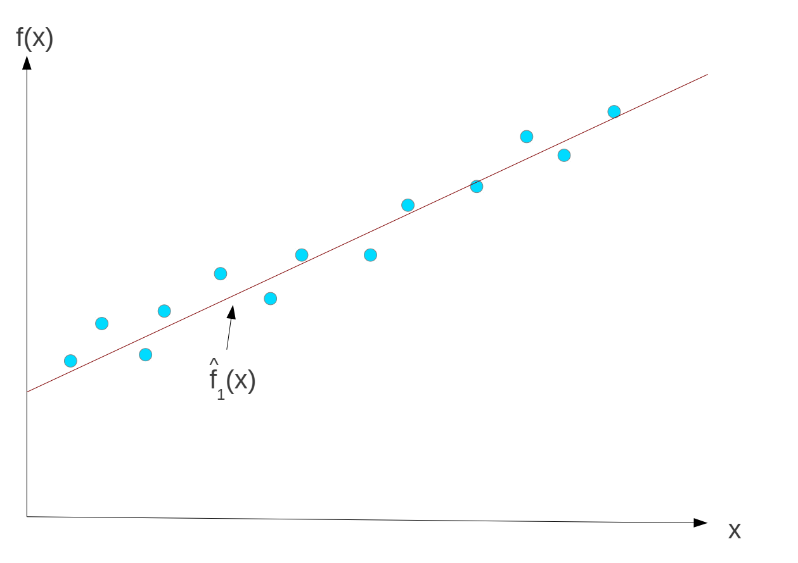
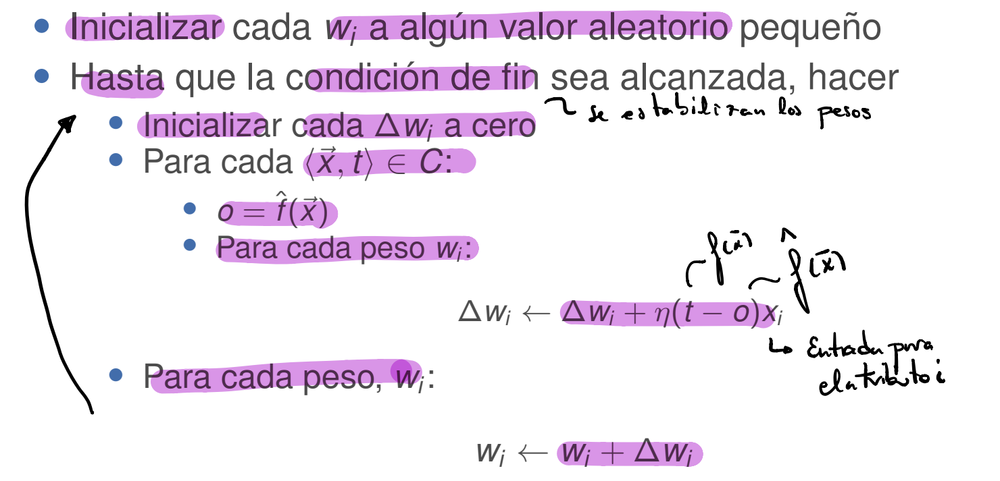
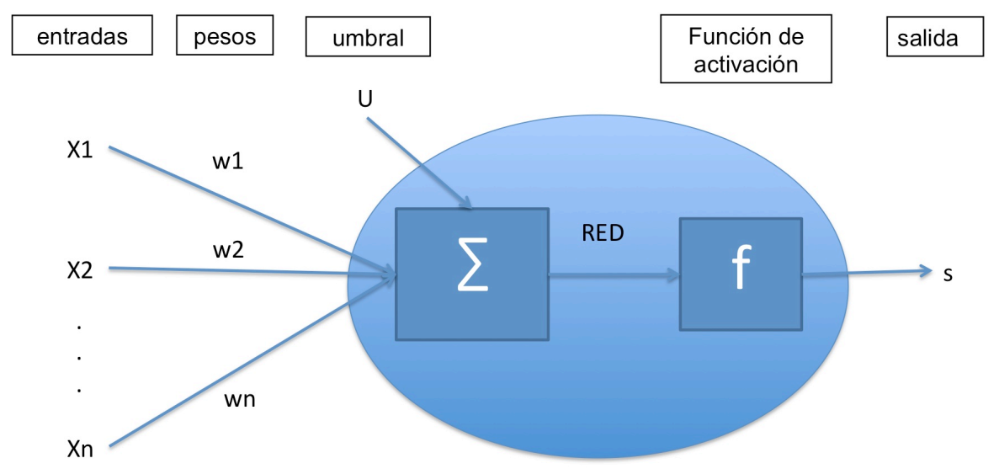
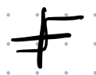
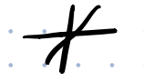
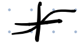
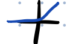
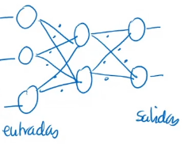
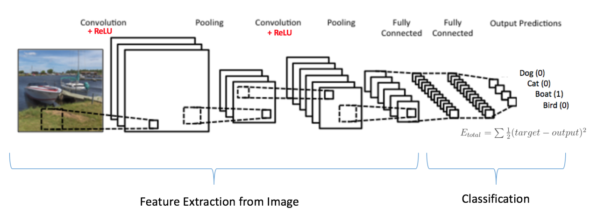

# Aprendizaje Automático

[TOC]

## Información

[Notas](https://www.notion.so/Notas-bb731e07965c44b89ad1e8670893e136)

> Teorías: Raquel Fuentetaja rfuentet@inf.uc3m.es 2.1B19
>
> Prácticas: Rubén Majadas rmajadas@pa.uc3m.es 2.2A12

## Presentación

Vamos a trabajar sobre una modificación del Pac-man.

Los fantasmas no van a por Pac-man, si no que si los toca se los come.

Las practicas consisten en 4 Tutoriales 0.5 cada uno y 2 Practicas 1.5 cada una.

El objetivo de la asignatura es conseguir que gane solo el Pac-man sin ayuda nuestra.

El objetivo de las practicas no es pegar los resultados o con captura, si no documentar bien, incluyendo tablas y graficas.

Los casos que no funcionan son importantes, no solo poner pruebas con éxito. Así se documentan los cambios realizados.

## Recursos

# TEMA 1. Introducción

**Definición**:

Campo de estudio que da al computador la habilidad de aprender.

Proceso por el cual el sistema mejora el rendimiento por la experiencia.

Un programa se dice que aprende de una experiencia con respecto a una tarea y alguna medida del rendimiento, si el rendimiento con la tarea al ser medido mejora con la experiencia.

**Objetivo**: Aprender conocimiento nuevo y mejorar el comportamiento de un sistema.

Se encuentra en las fronteras de la programación.

**Programación tradicional**: Lo normal, es que el usuario construya el programa que resuelve el problema.

**Programación automática**: Se crea un programa capaz de generar el programa que es capaz de resolver nuestra problema.

**Es útil cuando:**

- No existe experiencia humana.

- Los humano no saben explicar su experiencia.

- Los modelos deben ser personalizados

- Los modelos se basan en enormes cantidades de datos.

**Actualmente**: Existen muchos algoritmos de aprendizaje automático efectivo y eficientes, recursos computacionales y datos disponibles.

**Definición de tarea de Aprendizaje Automático**: Mejorar en una **tarea** T, respecto a una **medida de rendimiento** P, basándose en la **experiencia** E (los ejemplos).

Tarea, Medida y Experiencia.

**Tipos de tareas de Aprendizaje Automático:**

- **Aprendizaje supervisado**: Consiste en etiquetar los datos.
  - **Clasificación**: Determinar de qué clase es un ejemplo.
    - **Predicción – Regresión**: Determinar una etiqueta numérica.
- **Aprendizaje no supervisado**: Agrupa elementos similares, no etiqueta.
  - **Agrupación**.
- **Aprendizaje por refuerzo**: Basado en prueba y error. Dando refuerzo positivo/negativo.

**Algunas aplicaciones**: Sanidad, Domótica, Banca, Marketing, Personalización, Seguridad, Videojuego, etc.

**Problemas no técnicos:**

- Las maquinas no son responsables de los diagnósticos, predicciones, o clasificaciones que hacen.

- Los humanos no se fían de los resultados .

- La salida no es entendible por el humano. No explica sus decisiones, se está avanzando para lograr saber cómo piensa.

- Leyes de protección de datos.

- Miedo de los humanos a la pérdida de control.

- Cuestiones éticas.

# TEMA 2. Árboles y Reglas de Decisión

## Aprendizaje inductivo (De lo más específico a lo más general)

Encontrar una **función h** (la hipótesis o modelo) que aproxime la **función f** (desconocida) definida por un conjunto de ejemplos.

Los ejemplos normalmente se representan como pares, **(x, f(x))**.

**Según como sea la salida de f**: Es **clasificación** si es categórica y es de **regresión** si es numérica.

Se basa en inducción, se parte de un ejemplo específico para obtener modelos generales.

**Asume que:**

- La **hipótesis del aprendizaje es inductiva.**

- Si un modelo o hipótesis **categoriza bien en función a un conjunto de ejemplos grande también lo hará bien para futuros ejemplos.**

- **Siempre hay un sesgo inductivo**, que influye en la decisión, nos lleva más a uno que a otro.

- El lenguaje de representación nos limita si no lo puede expresar bien. Por ejemplo, limitarnos a una función lineal, pero es cuadrática.

- Encontrar una hipótesis adecuada puede ser difícil, f es desconocida y puede ser complicado determinar si h es buena.

El **espacio de hipótesis** es el conjunto de hipótesis que se consideran para aproximar f, **influye mucho para encontrar una buena aproximación**, pueden ser: funciones lineales, polinómicas, lógica de predicados, arboles de decisión, etc.

Los ejemplos tienen atributos/características que los identifican y nos permitirán clasificarlos por clases. Cada ejemplo es una instancia, da valor a los atributos y su clase.

Todos los ejemplos clasificados forman el conjunto de entrenamiento.

## Definiciones

**Atributos**: Característica que define a un elemento de un conjunto.

**Instancia**: Colección de valores de atributos.

**Clase**: Cada uno de los subconjuntos disjuntos.

**Ejemplo (positivo)**: Instancia que pertenece al subconjunto definido por la clase.

**Ejemplo negativo**: No pertenece al subconjunto definido por la clase.

**Generalización de un conjunto de ejemplos de una clase(hipótesis)**: Descripción que representa al subconjunto de instancias de la clase y no de otras.

## Arboles y reglas de decisión

Usaremos **modelos simbólicos como arboles de decisión**, que usa símbolos para representar lo que los hace más fáciles para ver explicaciones de las decisiones, lo entendemos. Sin embargo, en otros tipos de modelos como los numéricos (redes neuronales), usa números para representar y no es posible que dé explicaciones que entendamos.

## Aprendizaje de árboles de decisión

Nosotros estudiaremos **ID3 (Dicotomizador Iterativo, Quinlan 1986)**, a partir de ejemplos de partida genera arboles de decisión. Normalmente NO son arboles binarios.

Usa búsqueda avara, para encontrar el árbol más sencillo que separa mejor los ejemplos. Utiliza una heurística basada en entropía. Trata de escoger para empezar la clasificación el atributo que mejor separa las distintas clase.

## Algoritmo

1. **Seleccionar el atributo** $A_i$ que maximice la ganancia $G(A_i)$.
2. **Crear un nodo** para ese atributo con **tantos sucesores como valores** tenga.
3. **Dividir los ejemplos** en los sucesores según el valor del atributo.
4. Por cada sucesor,

    sí solo hay **ejemplo de una clase**, entonces se **etiqueta con esa clase**,

    si no, **ejecutar el ID3** con la tabla formada por los ejemplos de ese nodo, pero sin el atributo que todos tiene en común.

- Ejemplo:

    

## Heurística de ID3 (Heurística de la ganancia de información)

Seleccionar el **atributo que mejor separe los ejemplo de acuerdo con las clases**, que deje subconjuntos más puros (orientados más a un valor)

Para calcular la ganancia se utiliza el concepto de Entropía, como medida de la pureza o impureza de un conjunto ejemplos.

## Entropía

**Entropía en clasificación binaria**: El conjunto de ejemplos S pertenece a una de las dos clases: **$Entropia(S) \equiv -p_\oplus \log _2 p_\oplus -p_\ominus  \log _2 p_\ominus$**

- $p_\oplus$: **Proporción** de ejemplos **positivos** sobre el total.

- $p_\ominus$: **Proporción** de ejemplos **negativos** sobre el total.

$*p\ominus+p\ominus=1*$

$*p\ominus+p\ominus=0.5$ Entropía máxima*

**Entropía en múltiples clases**: $Entropia(S) \equiv \sum_{c\in C} -p_c \log _2 p_c$

Cuanto más se diferencian las proporciones, cuanto más notablemente hay de una que de otra, más tiende a 0.

**Nuestro objetivo es minimizar la entropía.**

**La ganancia de información:** mide la efectividad de un atributo para clasificar, es la **reducción esperada de la entropía** cuando se divide el conjunto de datos original S según el atributo dado A.

- $G(S,A)=Entropia(S) - Entropia\_ Atr(S,A)$

- $Entropia\_ Atr(S,A)= \sum_{c \in valores(A)} \frac {|S_{A=v}|}{|S|} Entropia(S_{A=v})$

- $Entropia(S_{A=v})= -\sum_{c \in C} \frac {|S_{A=v,C=c}|}{|_{A=v}|} \log_2 \frac {|S_{A=v,C=c}|}{|_{A=v}|}$

**Se elige el atributo que maximiza la ganancia de información**, ya que menos resta es el que menos entropía tiene, o elegir el que menor **entropía tenga**.

$A= \arg\max_{A \in \mathcal{A}}  G(S,A) = \arg\min_{A \in \mathcal{A}} Entropia \_ Atr(A,S)$

- Ejemplo:

    

## Aprendizaje de reglas de decisión

**Traducción a reglas:**

- Cualquier árbol de decisión se puede convertir a reglas.

- **Reglas**: Estructura del tipo **Si(valor de los atributos)-Entonces(clase a la que pertenece)**

- **Algoritmo**: Por cada rama del árbol, las preguntas y sus valores estarán en la parte de la izquierda de las reglas y la etiqueta del nodo hoja correspondiente será la parte derecha.

**Sesgo inductivo en ID3**

- Preferir arboles con atributos con más información cerca de la raíz, y arboles cortos.

- **La navaja de Ockham/Occam:** Preferir siempre la hipótesis más sencilla que describa los datos.
- Favorece atributos con muchos valores.

## Ampliación del ID3

En los datos puede haber errores, ruido. Si se ajusta mucho a los datos se produce **sobreajuste**.

**No se pueden tratar:**

- **Valores continuos de atributos**, números reales, lo que no son discretos.
- **Valores discretos con muchos valores.**

Hay valores de atributos más caros de obtener.

- Hay métodos que los ejemplos vienen incrementalmente, se puede ampliar el modelo, no hace falta volver a empezar: ID4, ID5 y Hoeffding tree.

- Clases continuas: M5

- Representación relacional, la más común es con lógica de predicados: ILP.

Normalmente recibimos los datos como **atributo-valor**, esta forma es **proposicional**.

## Ruido

Cualquier cosa que pueda oscurecer la relación entre los atributos y la clase.

- Que los atributos no estén bien descritos o seleccionados.
- Que no sean relevantes los atributos.

**Ruido en atributos:** Valores erróneos, sin valor (missing values) o outliers (que se salen de sus valores)

**Ruido en la clase:** Ejemplos con una clase incorrecta, ejemplos exactamente iguales, pero clase distinta (contradictorio)

## Evaluación para Validación de un modelo

No se pueden usar para evaluar ejemplos conocidos, tienen que ser nuevos, para ello se tienen **dos conjuntos de ejemplos, uno para entrenar y otros de prueba**. Tras crear el modelo se pasan los ejemplos de prueba y se calcula el número de errores, se evalúan los resultados.

$Accuracy= \frac {numeroEjemplosClasificadosCorrectamente}{numeroTotalEjemplos}$ Proporción de aciertos sobre conjunto de test.

Un problema de hacer la división de conjuntos es que no se usan todos para entrenar, y esto es problemático si no se tienen muchos.

**Validación cruzada k-veces:** Método para definir el conjunto de entrenamiento y de pruebas, que permite usar todos los datos para entrenar el modelo. Sirve para **estimar el error del modelo final, no para generar el modelo final**, en el que se usan todos los ejemplos.

Estimación del error del modelo final, en el que se usan todos los ejemplos para entrenarlo.

1. Divide el **conjunto de ejemplos en k partes** iguales.
2. Para cada conjunto, se **entrena con los k-1 conjuntos restantes**, y se pasa por el modelo generado el conjunto seleccionado calculando el error de ese modelo sobre el conjunto. $e_i$
3. Se estima la **tasa de error total haciendo la media** aritmética de los errores. $r= \sum_{i=1}^k \frac {e_i}{k}$

Si k=5, se hacen 5 modelos (clasificadores) para evaluar y otro que es el final que usa todos. k=n entonces n+1 modelos.

El valor de **k típico es 10**, pero la mejor sería que fuese 'Leave one out'(aunque es muy lento y costoso), coger todas menos 1 instancia para entrenar y usar esa para hacer test.

## Medidas adicionales del rendimiento

Tener una precisión alta, no quiere decir que sea bueno, la clase puede estar desbalanceada, que haya más de una clase que otra, aunque se admite cierta diferencia.

**Basadas en la Matriz de confusión:**

$Accuracy= \frac {TP+TN}{TP+TP+FP+FN}$

$Sensibilidad(recall)= \frac {TP}{TP+FN}$ Proporción de las que son positivas acierta. Cuanto más es mejor.

Cuando el coste de FN es alto.

$Especificidad= \frac {TN}{TN+FP}$ En qué medida acierta cuando la clase es negativa.

$Tasa \space de\space falsos \space positivos=1-Especificidad= \frac {FP}{TN+FP}$

$Precision \space de \space clase= \frac {TP}{TP+FP}$ En qué medida el clasificador acierta cuando predice clase positiva.

Importante cuando el coste FP es alto.

$F1 \space score= 2\cdot \frac {precision \cdot recall}{precision +recall}$ Medida armónica entre sensibilidad y precisión de clase.

Cuando se busca un buen balance entre recall y precisión de clase, y las clases no balanceadas.

**Espacio ROC:** Mide como de útil es un clasificador para distinguir entre clases. Cuanto más cerca de la esquina superior izquierda mejor, recoge más área y está más cerca del punto óptimo.

**Curva ROC**: Es una curva en el espacio ROC, en la que cada punto de la recta representa un clasificador, el más cercano al punto óptimo será el mejor, pero teniendo cuidado de los falsos positivos. Se define un umbral a partir del cual se considera de clase positiva o negativa. Los puntos son del tipo +0.8 +0.6.

Cuanto más Área por debajo de la curva mejor.

## Proceso de análisis de datos

Es un proceso iterativo, tras la última etapa se vuelve al principio.

1. **Pre-procesamiento**.

    - **Tratamiento de datos imperfectos:**

        - **Reducción del ruido:** Mediante filtros que eliminan instancias clasificadas mal.
        - **Valores desconocidos:** Eliminar instancias/atributos o asignar el valor más probable.

    - **Reducción de datos:** Reducir la variedad.

        - **Normalización**: Valores entre 0 y 1.

        - **Discretización**: En rangos.

        - **Selección de instancias**: Aleatoriamente, los más parecidos entre sí, los más diferentes entre sí o según alguna distribución.

        - **Selección de atributos:**

            - Reducción de la dimensionalidad de los datos, mediante filtrado según algún criterio o seleccionando un subconjunto.

            - **Búsqueda**: Cualquier técnica.

            - **Evaluación**: Correlación, entropía, etc.

            - **Criterio de parada:** Porcentaje, umbral, iteraciones, etc.

            - **Técnicas de wrapper**: Se genera el modelo con todos los atributos, se evalúa el modelo y se ve el subconjunto de atributos mejores.

                

            - **Búsqueda en el espacio de estado de los conjuntos de atributos.**

                

                - Se puede comenzar por el conjunto completo (por arriba) o por el conjunto vacío (por abajo).
                - La búsqueda puede ser de cualquier tipo.
                - La evaluación de cada nodo, que son subconjuntos de atributos, se realiza llamando al algoritmo inductivo seleccionado, una función de evaluación. Tras evaluar se opera.

            - **PCA (No lo usaremos):** Análisis de componentes principales. Es una solución algebraica, describe los datos en términos de nuevos atributos que no están correlados entre sí.

        - **Datos no balanceados:** Crear ejemplos sintéticos de la clase desbalanceada.

2. **Diseño**.
    - Selección de algoritmo.
    - Selección de parámetros.

3. **Ejecución de algoritmo.**

4. **Post-proceso.**
    - Análisis de resultados.
    - Visualización.

## Aspectos avanzados

### Sobreajuste (overfitting)

Fenómeno que se produce al hacer aprendizaje, porque **el modelo se ajusta demasiado a los ejemplos, y eso hace que no generalice bien.**

Mejora con los que se entrena, pero con aquellas que no conoce falla más.

Para evitar sobreajuste se debe generalizar, hay **2 métodos**:

- **Pre-poda**: Mientras se construye se poda.

  - **Método de $\chi^2$ (chi-cuadrado)**: Si en un nodo la diferencia entre clases no es significativa, no se divide, para con la mayoría. Muy conservador.
  - **Mediante curvas de error**: Cross-validation. De esta manera podemos detectar el punto de inflexión, donde se empieza a producir overfitting (en el punto que se separan las curvas).

- **Post-poda**: Después de generar poda.

  - **Eliminando subárboles**: Eliminando nodos del árbol empezando por las hojas, se evalúa el error tras eliminarlo, si no mejora probamos otro. 

  - **Eliminando precondiciones o reglas**: Tras haberlo pasado a reglas, eliminamos condiciones o reglas completas. Tras la eliminación se calcula el error, si mejora, el modelo principal pasa a ser el que lo eliminó y se sigue probado. Si no se prueba otra condición o regla.

    

### Atributos con valores continuos

1. Se **ordenan los valores del atributo**, y se especifica la clase a la que pertenecen.
2. Se **observan los puntos en los que pasa de una clase a otra** y se hace media con los puntos de corte.
3. Los **nodos de decisión se crean según:**
    - Se trata como **atributo binario**: Se escoge **una sola regla de distinción** entre valores, el de mayor ganancia de información, que se eligen con los valores medios. La reglas en del tipo atrib<punto1 o atrib<punto2.
    - Se trata como **atributos multivaluado**: Se crean **tanto grupos como queramos**, lo más preciso es uno por cada intervalo de valores que tengan la misma clase.

### Atributos con muchos valores

**ID3 prefiere atributos con mayor número de valores.**

**Problema**: Que cada uno puede tener un valor único, y no se podrá usar para clasificar.

**Alternativas**:

- Por cada valor v del atributo A, se puede crear un atributo binario, de si es atributo toma ese valor o no.
- **Razón de ganancia (GainRatio, GR)**: Ganancia calculada como la ganancia partido por una penalización por el número de valores del atributos. $GR(S,A)= \frac {G(S,A)=max Entropia(S)-EntropiaAtrib(S,A)}{Split\_Information(S,A)=-\sum_{c\in valores(A)} \frac {|S_v|}{S} \cdot log_2(\frac {S_x}{S})}$
- **Split_Information(S,A)**: Entropía de S con respecto de A. $Split\_Information(S,A)=-\sum_{c\in valores(A)} \frac {|S_v|}{S} \cdot log_2(\frac {S_x}{S})$

### Atributos con costes variables

Como podrían ser pruebas médicas caras, obtener los ejemplos es caro. **Consiste en penalizar la entropía de los atributos con coste variable.**

$\frac {G(S,A)}{unidad \space de \space coste(A)} o \frac {G(S,A)}{unidad \space de \space coste(A)^2}$

## Otras alternativas a ID3

**Clasificadores débiles:**

- **ZeroR**: En clasificación, dará siempre la **clase más frecuente**, la moda de la clase. En regresión, devuelve la media.
- **OneR**: Construye un conjunto de **reglas de decisión con un solo atributo**. Se elige aquel atributo con menor error, para cada valor del atributo se crea una reglas, donde el valor que toma es el más frecuente.

## Implementaciones

**ID3**, 1986.

**C4.5**, 1993: Sucesor de ID3, atributos numéricos, conversación a reglas, poda.

**C5.0**: Versión comercial.

**J4.8**: Implementación JAVA de C4.5.

# TEMA 3. Regresión

La clase en regresión es numérica.

## Regresión como clasificación

Discretizando la clase, pero se pierde información y hay que elegir un método de discretización.

**Soluciones**:

- **Discretización de clase.**
- **Discretización fija.**
- **Discretización dinámica.**

## Función de regresión

### Regresión lineal

Hallar una **función que se ajuste lo mejor posible a la nube de puntos**. En el caso de la **lineal es una recta.**

Aproximar una función $f(x)$ que no tiene por qué ser lineal en regresión, con una función **$\hat{f}(x)= w_0 + w_1a_1(x)+ w_2a_2(x)+ ...+ w_na_n(x)$** donde

- $a_i$ denota el **atributo** i-ésimo del ejemplo x.
- $w_i$ **peso** del atributo

**Objetivo**: Encontrar aquellos $w_i$ que minimicen el error entre la función clase y el valor de la aproximación.

Equivalente a **minimizar el error cuadrático sobre el conjunto de entrenamiento total,** C: $E= \sum _{c \in C} (f(x)-\hat{f}(x))^2$ Lo que queremos es minimizar.

### Error de Regresión

La **suma de todas las diferencias de los valores de la función y su aproximación**. Buscamos aquella aproximación que minimice E.

#### Minimizando el error

**El problema de definir la función se traslada a un problema de definir el vector de pesos w.** Se debe encontrar el vector $\vec{w}$ que minimice la función de error, problema de búsqueda en el espacio de pesos.

**Aproximación**: Descenso de gradiente.

### Descenso de gradiente

Sobre la función de errores por variable **vamos calculando la tangente y desplazando los valores de los pesos**.

- Consisten en movernos poco a poco en los pesos, para no pasarnos, y se parte de pesos aleatorios.
- Si la **tangente** tiene pendiente **positiva**, nos desplazamos a la **izquierda**.
- Si la **tangente** tiene pendiente **negativa**, vamos a la **derecha**.

**Gradiente del error respecto a w:** Derivada parcial de la función de error de cada uno de los pesos. $\nabla E[\vec{w}] \equiv\left[\frac{\partial E}{\partial w_{0}}, \frac{\partial E}{\partial w_{1}}, \cdots \frac{\partial E}{\partial w_{n}}\right]$

**Regla de entrenamiento:** $\Delta \vec{w}=-\eta \nabla E[\vec{w}]$

**Derivada del error:** $\frac{\partial E}{\partial w_{i}}=\sum_{e}\left(t_{e}-o_{e}\right)\left(-x_{i, e}\right)$

- $t_e$: Valor **verdadero** para la instancia e.
- $o_e$: Valor de **salida del modelo** para la instancia e.
- $x_{i,e}$: Valor del **atributo** a para la instancia e.

**Procedimiento: Descenso de Gradiente(C,n)**

- C conjunto de ejemplo de entrenamiento. n tasa de aprendizaje cuando salta.

### Regresión no lineal

Cuando usamos este tipo de funciones hay que tener **cuidado**, la evaluación se debe realizar con ejemplos de un conjunto distinto del de entrenamiento, porque la función no lineal se puede ajustar muy bien a esos, pero a al resto.

Esta función es más difícil de generar.

## Regresión paramétrica

Elegir una función lineal, logística o cualquier tipo, para que se ajuste.

El modelo o predictor adapta una forma predeterminada.

Regresión lineal es regresión paramétrica. También se puede hacer regresión no lineal paramétrica, función logística, polinómica, etc.

## Arboles de regresión

Regresión no lineal y no paramétrica.

## M5

**M5 es una variación de CART**, las hojas son valores numéricos y elige aquel atributo que maximice la reducción esperada en varianza.

**Estrategia**: Se divide el espacio en partes y hace regresión lineal por partes, no global.

**Algoritmo**: Parecido a ID3, pero en este caso se trata de reducir la variación interna de los valores de la clase de cada subconjunto.

- Elige aquel atributo que maximice la reducción del error (en vez de entropía o desviación típica). Nos quedamos con la menor media de desviaciones.

    $\Delta \operatorname{error}(S, A)=\operatorname{sd}(S)-\sum_{v \in \text { valoresTestNodo }(A)} \frac{\left|S_{A=v}\right|}{|S|} \times \operatorname{sd}\left(S_{A=v}\right)$
  - **S** conjunto de ejemplos en el nodo a dividir.
  - **$S_{A=v}$** Ejemplos con valor v en el atributo A.
  - **sd(S)** Desviación típica de los valores de la clase para los ejemplos en S.

**Criterio de parada**: Pocos ejemplos o poca variación de los valores(desviación típica pequeña)

**Hojas**: Se calcula un modelo lineal y se utiliza regresión estándar.

**Salida**: En las hojas tiene funciones de regresión, en los nodos no hoja se tienen atributos acotados <. Cada nodo tiene un conjunto de entrenamiento y se hace su regresión lineal.

En los árboles de regresión, los nodos hoja tienen modelos lineales y para llegar a esos nodos se usa como heurística es la Desviación típica (cuanto menor mejor), que se calcula haciendo una media ponderada ($S_{S=si}\cdot\frac {|S_{S=si}|}{|S|}$) de las desviaciones típicas de cada uno de los conjuntos resultantes.

Tras la construcción del árbol hay un proceso de poda, que consiste en Simplificar los modelos lineales de las hojas, Simplificar el árbol para que sea más pequeño y por último el Suavizado.

## Poda

Paso 0: Antes de realizar la poda se crean modelos lineales de los nodos intermedios, que se utilizaran para ver si se pueden simplificar los subárboles por ese modelo del nodo intermedio. Para estos modelos se usan solo los atributos que aparecen en el subárbol.

Para decidir si simplificamos por un modelo lineal necesitamos una medida del error. Si el modelo lineal proporciona menor error con respecto al subárbol podemos simplificarlo utilizando el modelo.

La medida de error que empleamos es el **Error absoluto medio**, que es la media de error al clasificar las instancias el subconjunto de instancias de entrenamiento del subárbol. Se calcula como $$residuo(T) = \frac 1 n \sum _{i \in T} ||f(i) \hat{f}(i)||$$, dado un subárbol con un subconjunto de n instancias de entrenamiento T.

El residuo subestima el error en instancias nuevas (que no ha visto nunca), para solucionar esto se multiplica por $\alpha = \frac {n+v}{n-v}$. Tal que n es el número de ejemplos del subárbol y v el número de atributos del modelo.

Por lo que el error aumenta cuando hay muchos parámetros o hay pocas instancias.

**Formula del error:** $error\_estimado(T) = \alpha \times residuo(T)$ Es una proporción del residuo.

1. **Simplificación de los modelos lineales** (Busca eliminar atributos)

    Se realiza en cada modelo lineal. Se eliminan atributos, que se seleccionan utilizando escalada para reducir el error estimado. En el extremo, deja solo una constante, como termino independiente.

    $M= 0.25a_1+0.12a_2+300a_5-40 \Rightarrow M=0.12a_2+300a_5-40$

2. Simplificación del subárbol (Busca eliminar subárboles por modelo lineales)

    Cada nodo interno del árbol tiene un modelo lineal simplificado y un modelo subárbol, y se elige aquel que minimice el error estimado. Si el modelo da mejor resultado, se sustituye el subárbol por el nodo del modelo.

3. **Suavizar el árbol.**

    Algunos trabajos se ha comprobado que realizar un suavizado mejor la predicción final, dado que lea predicción en cada nodo puede variar mucho. Lo que hace es en lugar de devolver la predicción del modelo en el nodo hoja. se consideran también los modelos en los nodos intermedios entre el nodo hoja y el nodo raíz.

# Otras técnicas

## Aprendizaje Bayesiano

Funcionan bien en la clasificación de textos, text mining. Permite recibir los datos de manera incremental y va creciendo el modelo.

### Hipótesis más probable (MAP)

Se busca la hipótesis que explique mejor los datos. $$P(h_i/E)= \frac {P(E/h_i)P(h_i)}{P(E)}$$

Es aquella que $\arg \max P(h_i/E)$ o  $\arg \max P(E/h_i) $. Cogemos el $h_i$ más probable, pero puede haber otros muchos modelos que dicen que no y que habría que considerar, entonces lo que queremos es la clase más probable para esos datos.

### Clasificación más probable

Probabilidad de la clase C dados los ejemplos E: $P(C/E) = \sum _{h_i \in H} P(C/h_i) \cdot P(h_i/E)$

A esto se le llama **Clasificador Bayesiano Optimo**, en la practica el tamaño de H hace que sea imposible, además no tenemos un modelo como tal si no la probabilidad de la clase más probable para esos datos.

### Naïve Bayes

$\arg \max P(C/a_1,...,a_n)= \arg \max _{c \in C} \frac {P(a_1,...,a_n/C)P(C)}{P(a_1,...,a_n)}=\arg \max_{c \in C} P(a_1,...,a_n/C)P(C)$

Podemos quitar el denominador porque todos las clases se evalúan con los mismos atributos. Y $P(a_1,...,a_n/C)$ es muy complejo de calcular, exponencial, se necesitaría una tabla de todas las combinaciones.

Para evitar esta complejidad se hace una simplificación, **se asume que los valores de los atributos una vez se conoce la clase son condicionalmente independientes**, lo que quiere decir que se puede calcular como un producto. $P(a_1,...,a_n/C) = P(a_1/C) \cdot P(a_2/C) \cdot ... \cdot P(a_n/C)$. El problema es que ahora no es una aproximación y no un clasificador bayesiano óptimo. **Suele funcionar bastante bien** esta aproximación.

$P(c=c_1)= \frac {n\_casos\_c=1}{n\_casosTotales}$  $P(a=v_1/c=c_1)= \frac {n\_casos\_c=1\_y\_v=v_1}{n\_casos\_c=1}$

## Redes de neuronas

### Neurona

Las e**ntradas son los valores de los atributos** ($x_1,x_2,..,x_n$) y un umbral, se hace **combinación lineal de las entradas con unos pesos** ($w_0+w_ix_1+...+w_nx_n$) y se pasa el **resultado por una función de activación** que nos da la salida.

**Tipos de función de activación:**

- Umbral, devuelve 0 o 1. 
- Lineal. 
- Sigmoidal.
- RELU, se ha visto que el aprendizaje es más rápido.

El aprendizaje consiste en determinar los pesos que se aplican a las entradas.

La regla que se aplica de forma habitual es la **Regla delta**, que es parecido al descenso del gradiente. Se empieza con peso aleatorio y con las iteraciones del entrenamiento se van actualizando los pesos. $w_i \leftarrow w_i+\Delta w_i$  El delta es una pequeña variación es ŋ$(t-o)x_1$ donde ŋ es una tasa de aprendizaje, $t$ la salida real y $o$ el valor que damos.

En general para hacer descenso del gradiente necesitamos que la función sea derivable y con un único mínimo.

Se van metiendo los datos de entrada, se recibe la salida y según el error se van actualizando los pesos, se para cuando los pesos se estabilizan.

### Perceptrón

Es una forma más simple de red de neuronas, formada por una sola neurona. Usa la función escalón como función de activación.

Se usa en tareas de clasificación lineal, es capaz de determinar el hiperplano capaz de discriminar los ejemplos en dos clases.

### Redes

 Red neuronal multicapa

Es un **conjunto de neurona conectadas entre sí** que se distribuyen en capas.

**Ventajas**:

- Son robustas ante el ruido.
- Trabajan con datos complejos (difíciles de clasificar, como sensores)
- Éxito en reconocimiento del habla y visión. Deep learning
- Dan bueno resultado.

**Desventaja**: El aprendizaje es lento.

En las redes multicapa el cálculo del error se complica, hay varias salidas y capas ocultas.

### Backpropagation o Retropropagación

Se basa en: $Error \sim \sum _{d \in D} \sum_{k \in outputs} (t_{kd}-o_{kd})^2$. Para cada ejemplo:

1. Se propaga desde la **entrada hasta la salida** (calcular la salida de la red)
2. **Propagación del error hacia atrás**: En las que están en la última capa es fácil, pero para las que están en las capas intermedias no tanto.
    1. Se calcula el **error en la unidad de salida**: $\delta_k \leftarrow$ $o_k(1-o_k)(t_k-o_k)$ Este valor es el (t-o) de la variación delta, en este caso para una función sigmoidal en vez de lineal
    2. **En las capas ocultas**: Se calcula con las unidades que están conectadas posteriormente, $\delta_n \leftarrow o_n(1-o_n)\sum_{k \in output} w_{kn}\delta_k$

### Deep Learning

Redes neuronales convolucionales. Se usan para procesado de imágenes.

**Puede recibir datos en crudo, no necesita que se los pasemos como atributo valor** tras un preproceso de elegir los atributos relevantes y dar valor a instancias. Recibe el grueso de los datos y los va cogiendo por partes y agrupando, Convolution. Después se reduce la resolución de la imagen, Pooling. Se repite el proceso hasta que tenemos lo datos para clasificar, extracción de características, y podemos generar una red neuronal totalmente conectada, classification.

## Algoritmos genéticos
