# Protocolos de IoT Edge a la nube

Hasta ahora en este libro, hemos generado datos o un evento desde un dispositivo que se ejecuta en el borde de la red. Hemos discutido varios medios y tecnologías de telecomunicaciones para mover esos datos desde WPAN, WLAN y WAN. Existen muchas complejidades y sutilezas en la construcción y el puenteo de estas conexiones de red desde redes PAN no basadas en IP a redes WAN basadas en IP. También hay conversiones de protocolo que deben entenderse. Los protocolos estándar son las herramientas que unen y encapsulan datos sin procesar de un sensor a algo significativo y formateado para que la nube lo acepte. Una de las principales diferencias entre un sistema IOT y un sistema M2M es que M2M puede comunicarse a través de una WAN a un servidor o sistema dedicado sin ningún protocolo encapsulado.

Este capítulo también detallará los protocolos necesarios que prevalecen en el espacio IOT, como el **transporte de telemetría de cola de mensajes** ( **MQTT** ) y CoAP.

# Protocolos

Una pregunta natural es, ¿por qué existen protocolos fuera de HTTP para transportar datos a través de la WAN? HTTP ha proporcionado importantes servicios y capacidades para Internet durante más de 20 años, sin embargo, fue diseñado y diseñado para computación de propósito general en modelos cliente / servidor. Los dispositivos de IoT pueden estar muy restringidos, ser remotos y tener un ancho de banda limitado. Por lo tanto, se necesitan protocolos más eficientes, seguros y escalables para administrar una gran cantidad de dispositivos en varias topologías de red, como las redes de malla. 

Al transportar datos a Internet, los diseños se relegan a las capas fundamentales de TCP / IP. Los protocolos TCP y UDP son la única opción obvia en la comunicación de datos, siendo TCP significativamente más complejo en su implementación que UDP (siendo un protocolo de multidifusión). Sin embargo, UDP no tiene la estabilidad y confiabilidad de TCP, lo que obliga a algunos diseños a compensar agregando resistencia en las capas de aplicación por encima de UDP. 

Muchos de los protocolos enumerados en este capítulo son implementaciones de **Middleware orientado a mensajes** ( **MOM** ). La idea básica de un MOM es que la comunicación entre dos dispositivos se realiza mediante colas de mensajes distribuidos. Una mamá entrega mensajes de una aplicación de espacio de usuario a otra. Algunos dispositivos producen datos para agregarlos a una cola, mientras que otros consumen datos almacenados en una cola. Algunas implementaciones requieren que un corredor o intermediario sea el servicio central. En ese caso, los productores y consumidores tienen una relación de tipo publicar y suscribirse con el corredor. AMQP, MQTT y STOMP son implementaciones de MOM; otros incluyen los servicios de mensajería CORBA y Java. Una implementación de MOM que usa colas puede usarlas para la resiliencia en el diseño. Los datos pueden persistir en las colas, incluso si el servidor falla. 

La alternativa a la implementación de MOM es RESTful. En un modelo RESTful, un servidor posee el estado de un recurso, pero el estado no se transfiere en un mensaje al servidor desde el cliente. Diseños RESTful utilizan métodos HTTP tales como GET, PUT, POST, y DELETEa lugar r equests sobre de un recurso **Identificador de Recurso Universal** ( **URI** ) (véase la siguiente figura) . No se necesita ningún intermediario o intermediario en esta arquitectura. Como se basan en la pila HTTP, disfrutan de la mayoría de los servicios ofrecidos, como la seguridad HTTPS. Los diseños RESTful son típicos de las arquitecturas cliente-servidor. Los clientes inician el acceso a los recursos a través de patrones de solicitud-respuesta sincrónicos.

Además, los clientes son responsables de los errores, incluso si el servidor falla. La siguiente figura ilustra un MOM frente a un servicio RESTful. A la izquierda hay un servicio de mensajería (basado en MQTT) que utiliza un servidor intermediario y editores y suscriptores de un evento. Aquí, muchos clientes pueden ser tanto editores como suscriptores y la información puede o no almacenarse en colas para mayor resistencia. A la derecha hay un diseño RESTful donde la arquitectura se basa en HTTP y utiliza paradigmas HTTP para comunicarse del cliente al servidor:

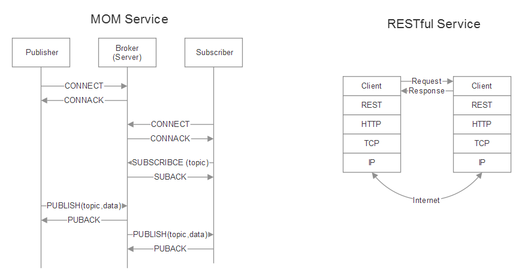

Un ejemplo que compara un MOM con una implementación RESTful.

El URI se utiliza como identificador para el tráfico de datos basado en web. El URI más notable es el **localizador de recursos universal** ( **URL** ), como http://www.iotforarchitects.net:8080/iot/?id="temperature"*.* El URI se puede dividir en partes que son utilizadas por varios niveles de la pila de red:

- - **Esquema** :http://
	- **Autoridad** :www.iotforarchitects.net
	- **Puerto** :8080
	- **Camino** :/iot
	- **Consulta** :?id="temperature"

# MQTT

La tecnología IBM Websphere Message Queue se concibió por primera vez en 1993 para abordar problemas en sistemas distribuidos independientes y no concurrentes para comunicarse de forma segura. Andy Stanford-Clark y Arlen Nipper en IBM crearon un derivado de WebSphere Message Queue en 1999 para abordar las limitaciones particulares de conectar oleoductos y gasoductos remotos a través de una conexión satelital. Ese protocolo se conoció como MQTT. Los objetivos de este protocolo de transporte basado en IP son:

- Debe ser simple de implementar
- Para brindar una forma de calidad de servicio
- Ser muy liviano y eficiente en el ancho de banda.
- Ser independiente de los datos
- Tener conciencia continua de la sesión
- Para abordar problemas de seguridad

MQTT proporciona estos requisitos. Una forma de pensar en el protocolo está mejor definida por el cuerpo estándar ( [mqtt.org](http://mqtt.org/) ) que presenta un resumen muy bien definido del protocolo:

"MQTT significa MQ Telemetry Transport. Es un protocolo de mensajería de publicación / suscripción, extremadamente simple y liviano, diseñado para dispositivos restringidos y redes de bajo ancho de banda, alta latencia o poco confiables. Los principios de diseño son minimizar el ancho de banda de la red y los requisitos de recursos del dispositivo al mismo tiempo que se intenta garantizar la confiabilidad y cierto grado de garantía de entrega. Estos principios también resultan en hacer que el protocolo sea ideal para el mundo emergente “máquina a máquina” (M2M) o “Internet de las cosas” de dispositivos conectados, y para aplicaciones móviles en las que el ancho de banda y la energía de la batería son primordiales ".

MQTT fue un protocolo interno y propietario de IBM durante muchos años hasta que se lanzó en la versión 3.1 en 2010 como un producto libre de regalías. En 2013, MQTT fue estandarizado y aceptado en el consorcio OASIS. En 2014, OASIS lo lanzó públicamente como versión MQTT 3.1.1. MQTT también es un estándar ISO (ISO / IEC PRF 20922). 

# Publicar-suscribir MQTT

Si bien las arquitecturas cliente-servidor han sido el pilar de los servicios del centro de datos durante años, los modelos de publicación-suscripción representan una alternativa útil para los usos de IoT. Publish-subscribe, también conocido como **pub / sub** , es una forma de desvincular a un cliente que transmite un mensaje de otro cliente que recibe un mensaje. A diferencia de un modelo cliente-servidor tradicional, los clientes no conocen ningún identificador físico, como la dirección IP o el puerto. MQTT es una arquitectura pub / sub, pero no es una cola de mensajes. Las colas de mensajes almacenan mensajes por naturaleza, mientras que MQTT no. En MQTT, si nadie se suscribe (o escucha) a un tema, simplemente se ignora y se pierde. Las colas de mensajes también mantienen una topología cliente-servidor en la que un consumidor se empareja con un productor.

Hay mensajes *retenidos* en MQTT que se tratarán más adelante. Un mensaje retenido es una instancia única de un mensaje retenido.

Un cliente que transmite un mensaje se llama **editor** ; un cliente que recibe un mensaje se llama **suscriptor** . En el centro hay un corredor de MQTT que tiene la responsabilidad de conectar clientes y filtrar datos. Dichos filtros proporcionan:

- **Filtrado de temas** : por diseño, los clientes se suscriben a temas y ciertas ramas de temas y no reciben más datos de los que desean. Cada mensaje publicado debe contener un tema y el corredor es responsable de retransmitir ese mensaje a los clientes suscritos o de ignorarlo.
- **Filtrado de contenido** : los corredores tienen la capacidad de inspeccionar y filtrar los datos publicados. Por lo tanto, el bróker puede administrar cualquier dato que no esté encriptado antes de ser almacenado o publicado para otros clientes.
- **Filtrado de tipo** : un cliente que escucha un flujo de datos suscrito también puede aplicar sus propios filtros. Los datos entrantes se pueden analizar y el flujo de datos se puede seguir procesando o ignorar.

MQTT puede tener muchos productores y muchos consumidores, como se muestra en la siguiente figura:

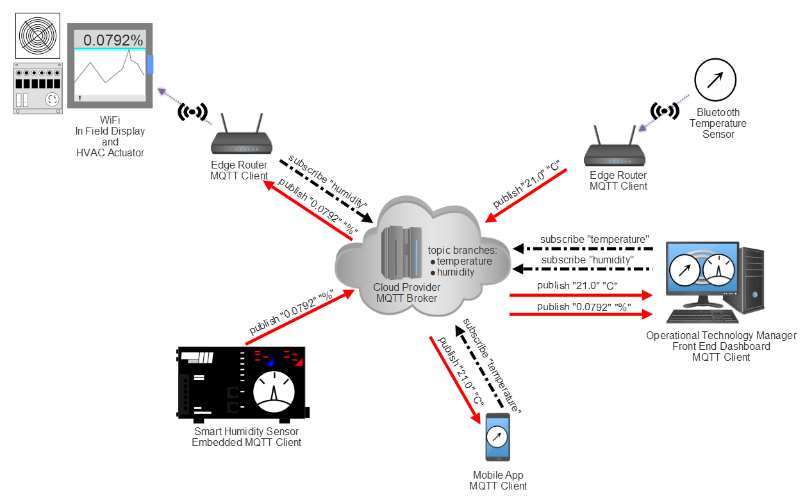

Topología y modelo de publicación-suscripción de MQTT. Los clientes se ejecutan en el borde y publican y / o se suscriben a temas administrados por MQTT Broker. Aquí, se consideran dos temas: humedad y temperatura. Un cliente puede suscribirse a varios temas. La figura representa sensores inteligentes que incluyen suficientes recursos para administrar su propio cliente MQTT y enrutadores de borde que brindan los servicios del cliente MQTT en nombre de sensores o dispositivos que no están habilitados para MQTT.

Una advertencia del modelo informático de editor / suscriptor es que tanto el editor como el suscriptor deben conocer la rama del tema y el formato de los datos antes de iniciar la transmisión. 

MQTT disocia con éxito a los editores de los consumidores. Dado que el corredor es el órgano de gobierno entre los editores y los consumidores, no es necesario identificar directamente al editor y al consumidor en función de aspectos físicos (como una dirección IP). Esto es muy útil en implementaciones de IoT ya que la identidad física puede ser desconocida o ubicua. MQTT y otros modelos pub / sub también son invariantes en el tiempo. Esto implica que un mensaje publicado por un cliente puede ser leído y respondido en cualquier momento por un suscriptor. Un suscriptor podría estar en un estado de muy bajo consumo de energía / ancho de banda limitado (por ejemplo, comunicación Sigfox) y responder minutos u horas después a un mensaje. Debido a la falta de relaciones físicas y temporales, los modelos pub / sub escalan muy bien a una capacidad extrema.

Los agentes de MQTT gestionados en la nube normalmente pueden ingerir millones de mensajes por hora y dar soporte a decenas de miles de editores.

MQTT es independiente del formato de datos. Cualquier tipo de datos puede residir en la carga útil, por lo que tanto los editores como los suscriptores deben comprender y aceptar el formato de los datos. Es posible transmitir mensajes de texto, datos de imágenes, datos de audio, datos cifrados, datos binarios, objetos JSON o prácticamente cualquier otra estructura en la carga útil. Sin embargo, el texto JSON y los datos binarios son los tipos de carga útil de datos más comunes. 

El tamaño máximo de paquete permitido en MQTT es de 256 MB, lo que permite una carga útil extremadamente grande. 

Sin embargo, tenga en cuenta que el tamaño máximo de carga útil de datos depende de la nube y del intermediario. Por ejemplo, IBM Watson permite tamaños de carga útil de hasta 128 KB, mientras que Google admite 256 KB. Alternativamente, un mensaje publicado puede incluir una carga útil de longitud cero. El campo de carga útil es opcional. Es recomendable consultar con su proveedor de nube para asegurarse de que los tamaños de carga útil coincidan. De no hacerlo, se producirán errores y desconexiones del agente de nube.

# Detalles de la arquitectura MQTT

MQTT por su nombre es un nombre inapropiado. No hay colas de mensajes inherentes al protocolo. Si bien es posible poner en cola los mensajes, no es necesario y, a menudo, no se hace. MQTT está basado en TCP y, por lo tanto, incluye alguna garantía de que un paquete se transfiera de manera confiable. 

MQTT también es un *protocolo asimétrico* , mientras que HTTP es un *protocolo no simétrico* . Digamos que el nodo A necesita comunicarse con el nodo B. Un protocolo asimétrico entre A y B solo requeriría que un lado (A) use el protocolo, sin embargo, toda la información necesaria para el reensamblaje de paquetes debe estar contenida en el encabezado de fragmentación enviado por A Los sistemas asimétricos tienen un maestro y un esclavo (FTP es un ejemplo clásico). En un protocolo simétrico , tanto A como B tendrían el protocolo instalado. A o B pueden asumir el papel de maestro o esclavo (telnet es un ejemplo principal). MQTT tiene funciones distintas, lo que tiene sentido en la topología de sensores / nubes.

MQTT puede retener un mensaje en un corredor de forma indefinida. Este modo de funcionamiento está controlado por una bandera en una transmisión de mensaje normal. Se envía un mensaje retenido sobre un intermediario a cualquier cliente que se suscriba a esa rama de tema de MQTT. El mensaje se transmite inmediatamente a ese nuevo cliente. Esto permite que un nuevo cliente reciba un estado o una señal de un tema recién suscrito sin esperar. Por lo general, un cliente que se suscribe a un tema puede necesitar esperar horas, o incluso días, antes de que un cliente publique nuevos datos. 

MQTT define una instalación opcional llamada **Última voluntad y testamento** ( **LWT** ). Un LWT es un mensaje que un cliente especifica durante la fase de conexión. El LWT contiene el tema Última voluntad, QoS y el mensaje real. Si un cliente se desconecta de la conexión de un corredor de manera deshonesta (por ejemplo, el tiempo de espera de mantener vivo, un error de E / S o el cliente cierra la sesión sin desconectarse), el corredor está obligado a transmitir el mensaje LWT a todos los demás clientes suscritos a ese tema. 

Aunque MQTT se basa en TCP, las conexiones aún se pueden perder, especialmente en un entorno de sensor inalámbrico. Un dispositivo puede perder energía, perder intensidad de señal o simplemente fallar en el campo, y una sesión entrará en un estado semiabierto. Aquí, el servidor creerá que la conexión sigue siendo confiable y esperará datos. Para remediar este estado semiabierto, MQTT utiliza un sistema de mantener vivo. Con este sistema, tanto el corredor de MQTT como el cliente tienen la seguridad de que la conexión sigue siendo válida incluso si no ha habido una transmisión durante algún tiempo. El cliente envía un paquete PINGREQ al corredor, que a su vez reconoce el mensaje con un PINGRESP. Un temporizador está preestablecido en el lado del cliente y del corredor. Si no se ha transmitido un mensaje desde ninguno de los dos dentro de un límite de tiempo predeterminado, se debe enviar un paquete de mantenimiento de vida.

En el caso de que no se reciba un Keep-Alive y el temporizador expire, el corredor cerrará la conexión y enviará el paquete LWT a todos los clientes. El cliente puede en algún momento intentar volver a conectarse. En ese caso, el corredor cerrará una conexión semiabierta y abrirá una nueva conexión con el cliente.

El tiempo máximo de vida es de 18 horas, 12 minutos y 15 segundos. Establecer el mantenimiento de vida interno en 0 deshabilitará la funcionalidad de mantener vivo. El temporizador lo controla el cliente y se puede cambiar dinámicamente para reflejar los modos de suspensión o los cambios en la intensidad de la señal.

Si bien Keep-Alive ayuda con las conexiones rotas, restablecer todas las suscripciones de un cliente y los parámetros de QoS puede resultar en una sobrecarga innecesaria en una conexión con límite de datos. Para aliviar estos datos adicionales, MQTT permite conexiones persistentes. Una conexión persistente guardará lo siguiente en el lado del corredor:

- Todas las suscripciones del cliente
- Todos los mensajes de QoS que no fueron confirmados por el cliente
- Todos los mensajes nuevos de QoS perdidos por el cliente

El parámetro hace referencia a esta información para identificar clientes únicos. Un cliente puede solicitar una conexión persistente, sin embargo, el corredor puede rechazar la solicitud y forzar el reinicio de una sesión limpia. Tras la conexión, el corredor utiliza la bandera para permitir o denegar conexiones persistentes. El cliente puede determinar si se almacenó una conexión persistente mediante el mensaje CONNACK. client_id cleanSession

Las sesiones persistentes deben usarse para clientes que deben recibir todos los mensajes incluso cuando están fuera de línea. No deben usarse en situaciones en las que un cliente solo publica (escribe) datos en temas. 

Hay tres niveles de calidad de servicio en MQTT:

- **QoS-0 (transmisión no asegurada)** : este es el nivel mínimo de QoS. Esto es análogo al modelo de disparar y olvidar detallado en algunos de los protocolos inalámbricos. Es un proceso de entrega de mejor esfuerzo sin que el receptor reconozca un mensaje o el remitente vuelva a intentar la transmisión.
- **Qos-1 (transmisión asegurada)** : este modo garantizará la entrega del mensaje al menos una vez al receptor. Puede entregarse más de una vez y el receptor enviará un acuse de recibo con una respuesta PUBACK.
- **QoS-2 (servicio asegurado en aplicaciones)** : este es el nivel más alto de QoS que asegura e informa tanto al remitente como al receptor que un mensaje se ha transmitido correctamente. Este modo genera más tráfico con un protocolo de enlace de varios pasos entre el remitente y el receptor. Si un receptor recibe un mensaje configurado en QoS-2, responderá con un mensaje PUBREC al remitente. Esto reconoce el mensaje y el remitente responderá con un mensaje de PUBREL. PUBREL permite al receptor descartar de forma segura cualquier retransmisión del mensaje. A continuación, el receptor reconoce el PUBREL con un PUBCOMP. Hasta que se envíe el mensaje PUBCOMP, el receptor almacenará en caché el mensaje original por seguridad.

QoS en MQTT está definido y controlado por el remitente y cada remitente puede tener una política diferente. 

Casos de uso típicos:***\*
\****

- **QoS-0** : debe usarse cuando no se necesita la cola de mensajes. Es mejor para conexiones por cable o cuando el sistema está muy restringido en el ancho de banda. 
- **Qos-1** : Este debería ser el uso predeterminado. QoS1 es mucho más rápido que QoS2 y reduce en gran medida el costo de transmisión. 
- **QoS-2** : para aplicaciones de misión crítica. Además, los casos en los que la retransmisión de un mensaje duplicado podría provocar fallos.

# Estructura de paquetes MQTT

Un paquete MQTT se encuentra en la parte superior de la capa TCP de la pila de red del modelo OSI. El paquete consta de un encabezado fijo de 2 bytes, que siempre debe estar presente, un encabezado de tamaño variable (opcional) y concluye con la carga útil (nuevamente, opcional):


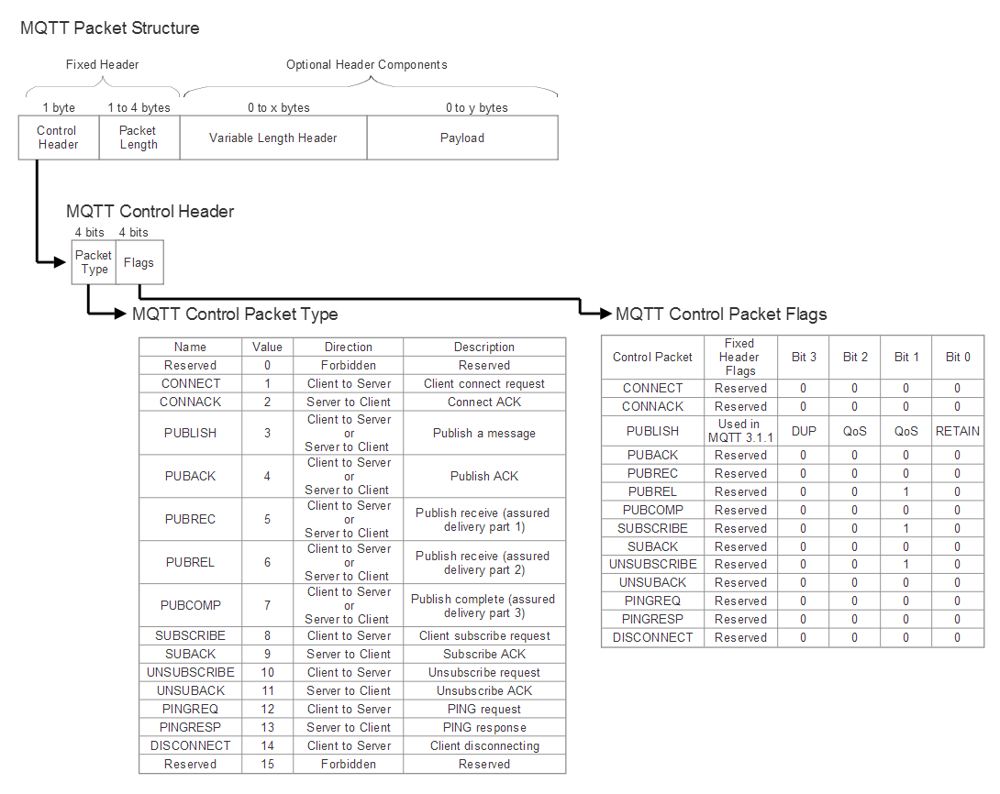

Estructura de paquetes común de MQTT

# Formatos de comunicación MQTT

Un enlace de comunicación que utiliza MQTT comienza con el cliente enviando un mensaje CONNECT a un intermediario. Solo un cliente puede iniciar una sesión y ningún cliente puede comunicarse directamente con otro cliente. El corredor siempre responderá a un mensaje CONNECT con una respuesta CONNACK y un código de estado. Una vez establecida, la conexión permanece abierta. Los siguientes son los mensajes y formatos MQTT:

- **Formato CONNECT (cliente a servidor)** : Un mensaje CONNECT típico contendrá lo siguiente (solo clientIDse requiere para iniciar una sesión):

| **Campo**       | **Requisito** | **Descripción**                                              |
| --------------- | ------------- | ------------------------------------------------------------ |
| clientID        | Requerido     | Identifica al cliente en el servidor. Cada cliente tiene una identificación de cliente única. Puede tener entre 1 y 23 UTF-8 bytes de longitud. |
| cleanSession    | Opcional      | 0: El servidor debe reanudar las comunicaciones con el cliente. El cliente y el servidor deben guardar el estado de la sesión después de la desconexión. 1: Cliente y servidor deben descartar y la sesión anterior e iniciar una nueva. |
| username        | Opcional      | Nombre utilizado por el servidor para la autenticación.      |
| password        | Opcional      | Contraseña binaria de 0 a 65536 bytes con un prefijo de 2 bytes de longitud. |
| lastWillTopic   | Opcional      | Rama de tema para publicar mensaje de voluntad.              |
| lastWillQos     | Opcional      | 2 bits que especifican el nivel de QoS al publicar el mensaje. |
| lastWillMessage | Opcional      | Define la carga útil del mensaje Will.                       |
| lastWillRetain  | Opcional      | Especifica si el testamento se conservará cuando se publique. |
| keepAlive       | Opcional      | Intervalo de tiempo en segundos. El cliente es responsable de enviar un mensaje o un paquete PINGREQ antes de que keepAliveexpire el temporizador. El servidor se desconectará de la red a 1,5 veces el período Keep Alive. Un valor de cero ( 0) deshabilitará el keepAlivemecanismo. |

- **Códigos de retorno CONNECT (servidor a cliente)** : el corredor responderá a un mensaje CONNECT con un código de respuesta. Un diseñador debe tener en cuenta que no todas las conexiones pueden ser aprobadas por un corredor. Los códigos de respuesta son los siguientes:

| **Código de retorno** | **Descripción**                                              |
| --------------------- | ------------------------------------------------------------ |
| 0                     | Conexión exitosa                                             |
| 1                     | Conexión rechazada: versión inaceptable del protocolo MQTT   |
| 2                     | Conexión rechazada: el cliente identificado es el UTF-8 correcto, pero el servidor no lo permite |
| 3                     | Conexión rechazada: el servidor no está disponible           |
| 4                     | Conexión rechazada: nombre de usuario o contraseña incorrectos |
| 5                     | Conexión rechazada: el cliente no está autorizado para conectarse |

- **Formato PUBLICAR (cliente a servidor)** : en este punto, un cliente puede publicar datos en una rama de tema. Cada mensaje contiene un tema:

| **Campo**  | **Requisito** | **Descripción**                                              |
| ---------- | ------------- | ------------------------------------------------------------ |
| packetID   | Requerido     | Identifica de forma única el paquete en el encabezado de la variable. Responsabilidad de la biblioteca cliente. Siempre establezca en cero (0) para QoS-0. |
| topicName  | Requerido     | Rama de temas para publicar (como EE.UU. / Wisconsin / Milwaukee / temperatura). |
| qos        | Requerido     | Nivel de QoS 0,1 o 2.                                        |
| retainFlag | Requerido     | Nombre utilizado por el servidor para la autenticación.      |
| payload    | Opcional      | Carga útil independiente del formato de datos.               |
| dupFlag    | Requerido     | El mensaje es un duplicado y se reenvía.                     |

- **Formato SUBSCRIBE (cliente a servidor)** : la carga útil de un paquete de suscripción incluye al menos un par de ID de tema codificados en UTF-8 y niveles de QoS. Puede haber varios ID de tema suscritos en esta carga útil para evitar que el cliente tenga que realizar varias transmisiones:

| **Campo** | **Requisito** | **Descripción**                                              |
| --------- | ------------- | ------------------------------------------------------------ |
| packetID  | Requerido     | Identifica de forma única el paquete en el encabezado de la variable. Responsabilidad de la biblioteca cliente. |
| topic_1   | Requerido     | Rama de tema suscrito.                                       |
| qos_1     | Requerido     | Nivel de QoS de los mensajes publicados topic_1.             |
| topic_2   | Opcional      | Nombre utilizado por el servidor para la autenticación.      |
| qos2      | Opcional      | Nivel de QoS de los mensajes publicados topic_2.             |

 

Los comodines se pueden utilizar para suscribirse a varios temas en un solo mensaje. Para estos ejemplos, el tema será la ruta completa de "{country}/{states}/{cities}/{temperature,humidity}".

- **+ Comodín de nivel único** : sustituye a un nivel único en el nombre de una cadena de tema. Por ejemplo, US / + / Milwaukee sustituirá el nivel estatal y lo reemplazará con los 50 estados, desde Alaska hasta Wyoming.
- ***** Comodín de varios niveles: reemplaza varios niveles en lugar de uno solo. Siempre es el último carácter del nombre del tema. Por ejemplo, US / Wisconsin / # se suscribirá a todas las ciudades de Wisconsin: Milwaukee, Madison, Glendale, Whitefish Bay, Brookfield, etc.
- **$ Temas especiales** : este es un modo estadístico especial para los corredores de MQTT. Los clientes no pueden publicar en $ topics. No existe un estándar oficial para su uso en este momento. Un modelo usa $ SYS de la siguiente manera: $ SYS / broker / clients / connected.

Un servidor MQTT debería (pero esto no lo requiere explícitamente la especificación) admitir comodines en el nombre del tema. Si no admite comodines, el servidor debe rechazarlos. Establecer el packetID es responsabilidad de la biblioteca cliente MQTT. 

Varios otros mensajes se encuentran en la especificación MQTT. Se pueden encontrar más detalles sobre la API de programación MQTT en OASIS MQTT Versión 3.1.1 Estándar, http://docs.oasis-open.org/mqtt/mqtt/v3.1.1/os/mqtt-v3.1.1-os.pdf , 2014.

# Ejemplo de trabajo de MQTT

Por ejemplo, **Google Cloud Platform** ( **GCP** ) se utilizará como receptor e ingestor de MQTT en su nube. La mayoría de los servicios en la nube de MQTT siguen un modelo similar, por lo que este marco se puede utilizar como referencia. Usaremos herramientas de código abierto para iniciar un cliente MQTT y un ejemplo simple de Python para publicar una cadena de hola mundo en una rama de temas. Se necesitan pasos preliminares para comenzar a usar GCP. Las cuentas de Google y los sistemas de pago deben protegerse antes de continuar. Consulte estas instrucciones sobre cómo comenzar con Google IoT Core [https://cloud.google.com/iot/docs/how-tos/getting-started.](https://cloud.google.com/iot/docs/how-tos/getting-started)

Continúe dentro de GCP para crear un dispositivo, habilitar la API de Google, crear una rama de temas y agregar un miembro al editor / sub-editor. 

Google es único en el sentido de que requiere un cifrado fuerte (TLS) además de MQTT para cifrar todos los paquetes de datos mediante **JSON Web Tokens** ( **JWT** ) y un agente de certificados. Cada dispositivo creará un par de claves pública / privada. Google se asegura de que cada dispositivo tenga un ID y una clave únicos; en el caso de que uno se vea comprometido, solo afectará a un único nodo y contendrá el área de superficie de un ataque.

El intermediario MQTT comienza importando varias bibliotecas. El paho.mqtt.client P biblioteca ython es un proyecto patrocinado por Eclipse y es el hogar de referencia del proyecto original de IBM MQTT. Paho es también el producto principal del Grupo de trabajo industrial Eclipse M2M. Hay otras variantes de agentes de mensajes MQTT, como el proyecto Eclipse Mosquitto y Rabbit MQ:

```
# Ejemplo simple de publicación de cliente MQTT para Google Cloud Platform 
import datetime 
import os 
import time 
import paho.mqtt.client as mqtt 
import jwt 

project_id = 'name_of_your_project' 
cloud_region = 'us-central1' 
registry_id = 'name_of_your_registry' 
device_id = 'name_of_your_device' 
algoritmo 'RS256' 
mqtt_hostname = 'mqtt.googleapis.com' 
mqtt_port = 8883 
ca_certs_name = 'roots.pem' private_key_file 
= '/Users/joeuser/mqtt/rsa_private.pem'
```

El siguiente paso es la autenticación con Google mediante el uso de una clave. Aquí usamos un objeto JWT para contener el certificado:

```
#Google requiere autenticación basada en certificados mediante JSON Web Tokens (JWT) por dispositivo. 
#Esto limita el área de superficie de los ataques 
def create_jwt (project_id, private_key_file, algorítm): 
    token = { 
            # La hora en que se emitió el token 
            'iat': datetime.datetime.utcnow (), 
            # La hora en que expira el token. 
            'exp': datetime.datetime.utcnow () + datetime.timedelta (minutos = 60), 
            # Campo de audiencia = project_id 
            'aud': project_id 
    } 

    # Leer el archivo de clave privada. 
    con open (private_key_file, 'r') como f: 
        private_key = f.read () 
    return jwt.encode (token, private_key, algoritmo = algoritmo)
```

Definimos varias devoluciones de llamada utilizando la biblioteca MQTT, como errores, conexiones, desconexiones y publicación:

```
#Typical MQTT callbacks 
def error_str (rc): 
    return '{}: {}'. Format (rc, mqtt.error_string (rc)) 

def on_connect (unused_client, unused_userdata, unused_flags, rc): 
    print ('on_connect', error_str ( rc)) 

def on_disconnect (unused_client, unused_userdata, rc): 
    print ('on_disconnect', error_str (rc)) 

def on_publish (unused_client, unused_userdata, unused_mid): 
    print ('on_publish')
```

A continuación se muestra la estructura principal de un cliente MQTT. Primero, registramos al cliente como prescribe Google. Google IoT requiere que se identifique un proyecto, una región, un ID de registro y un ID de dispositivo. También omitimos el nombre de usuario y usamos el campo de contraseña a través del create_jwtmétodo. Aquí también es donde habilitamos el cifrado SSL en MQTT; muchos proveedores de nube de MQTT requieren esta disposición. Después de conectarse al servidor MQTT en la nube de Google, el bucle principal del programa publica una cadena simple de hola mundo en una rama de temas a la que está suscrito. También es de destacar el nivel de QoS que se establece en el mensaje de publicación.

Si se requiere un parámetro pero no se establece explícitamente en el programa, la biblioteca cliente está obligada a usar valores predeterminados (por ejemplo, los indicadores RETAIN y DUP utilizados como valores predeterminados durante el mensaje PUBLISH):

```
def main (): 
    client = mqtt.Client ( 
            client_id = ('proyectos / {} / ubicaciones / {} / registros / {} / dispositivos / {}' 
                       .format ( 
                               project_id, 
                               cloud_region, 
                               registry_id, 
                               device_id))) #Google requiere este formato explícitamente 

    client.username_pw_set ( 
            username = 'unused', #Google ignora el nombre de usuario. 
            password = create_jwt (#Google necesita el JWT para la autorización 
                    project_id, private_key_file, algorítmo)) 

    # Habilita el soporte SSL / TLS 
    client.tls_set (ca_certs = ca_certs_name)
    
    #callback no utilizado en este ejemplo: 
    client.on_connect = on_connect 
    client.on_publish = on_publish 
    client.on_disconnect = on_disconnect 

    # Conéctese a Google pub / sub 
    client.connect (mqtt_hostname, mqtt_port) 

    # Loop 
    client.loop_start () 

    # Publique en los eventos o tema del estado basado en la bandera. 
    sub_topic = 'events' 
    mqtt_topic = '/devices/{}/{}'.format(device_id, sub_topic) 

    # Publicar num_messages mensajes en el puente MQTT una vez por segundo. 
    
    para i en el rango (1,10): 
        payload = 'Hello World !: {}'. format (i) 
        print ('Publicando mensaje \' {} \ ''. format (payload))
        client.publish (mqtt_topic, payload, qos = 1) 
      
        time.sleep (1) 
        

if __name__ == '__main__': 
    main ()
```

# MQTT-SN

Un derivado de MQTT se llama MQTT-SN (a veces llamado MQTT-S) para redes de sensores. Mantiene la misma filosofía de MQTT que un protocolo ligero para dispositivos periféricos, pero está diseñado específicamente para los matices de una red de área personal inalámbrica típica en entornos de sensores. Estos rasgos incluyen soporte para enlaces de ancho de banda bajo, falla de enlace, mensajes cortos de longitud y hardware con recursos limitados. MQTT-SN es, de hecho, tan ligero que se puede ejecutar con éxito sobre BLE y Zigbee. 

MQTT-SN no requiere pila TCP / IP. Se puede usar a través de un enlace en serie (forma preferida), donde la sobrecarga de un protocolo de enlace simple (para distinguir diferentes dispositivos en la línea) es realmente pequeña. Alternativamente, se puede usar sobre UDP, que tiene menos hambre que TCP.

# Arquitectura y topología MQTT-SN

Hay cuatro componentes fundamentales en una topología MQTT-SN:

- **Pasarelas** : en MQTT-SN, una pasarela tiene la responsabilidad de convertir el protocolo de MQTT-SN a MQTT y viceversa (aunque son posibles otras traducciones). Las puertas de enlace también pueden ser agregadas o transparentes (se tratan más adelante en este capítulo).
- **Reenviadores** : una ruta entre un sensor y una puerta de enlace MQTT-SN puede tomar muchas rutas y saltar a través de varios enrutadores en el camino. Los nodos entre el cliente de origen y la puerta de enlace MQTT-SN se denominan reenviadores y simplemente vuelven a encapsular las tramas MQTT-SN en tramas MQTT-SN nuevas y sin cambios que se envían al destino hasta que llegan a la puerta de enlace MQTT-SN correcta para la conversión del protocolo. .
- **Clientes** : Los clientes se comportan de la misma forma que en MQTT y son capaces de suscribirse y publicar datos.
- **Brokers** : Los brokers se comportan de la misma forma que en MQTT:

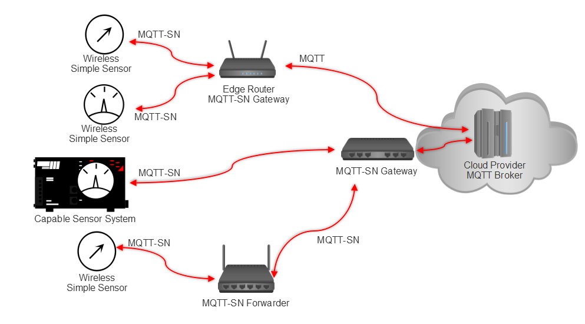

Topología MQTT-SN. Los sensores inalámbricos se comunican con pasarelas MQTT-SN, que traducen MQTT-SN a MQTT, a otras formas de protocolo, o con reenviadores que simplemente encapsulan las tramas MQTT-SN recibidas en mensajes MQTT-SN reenviados a una pasarela. 

# Pasarelas transparentes y agregadas

En MQTT-SN, las puertas de enlace pueden asumir dos funciones distintas. Primero, una puerta de enlace transparente administrará muchos flujos MQTT-SN independientes de los dispositivos sensores y convertirá cada flujo en un mensaje MQTT. Una puerta de enlace de agregación fusionará una cantidad de transmisiones MQTT-SN en una cantidad reducida de transmisiones MQTT enviadas al agente MQTT en la nube. Una puerta de enlace agregada tiene un diseño más complejo, pero reducirá la cantidad de sobrecarga de comunicación y la cantidad de conexiones simultáneas que quedan abiertas en el servidor. Para que funcione una topología de puerta de enlace de agregación, los clientes deben publicar o suscribirse al mismo tema:

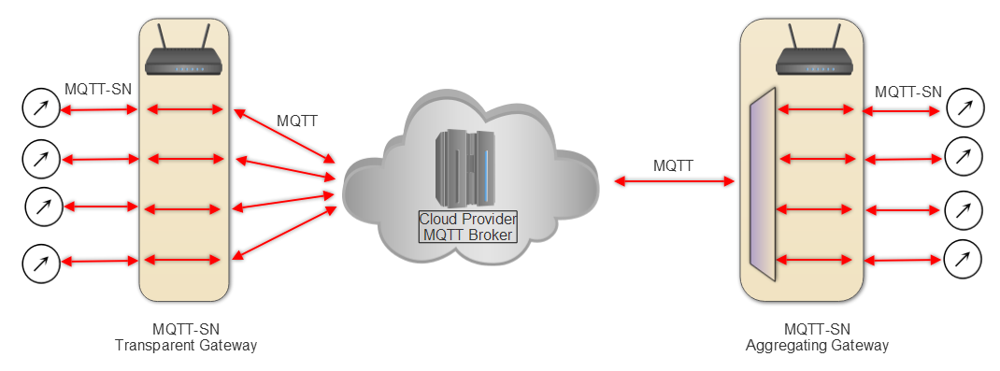

Configuraciones de puerta de enlace MQTT-SN. Una puerta de enlace transparente simplemente realiza una conversión de protocolo en cada flujo entrante MQTT-SN y tiene una relación de uno a uno con las conexiones MQTT-SN y las conexiones MQTT con el intermediario. Sin embargo, una puerta de enlace de agregación fusionará múltiples flujos MQTT-SN en una sola conexión MQTT al servidor.

# Anuncio y descubrimiento de pasarela

Dado que la topología de MQTT-SN es un poco más complicada que MQTT, se utiliza un proceso de descubrimiento para establecer rutas a través de múltiples puertas de enlace y nodos de reenvío. Las puertas de enlace que se unen a una topología MQTT-SN comienzan vinculando primero a un intermediario MQTT. Posteriormente, puede emitir un paquete ADVERTISE a los clientes conectados u otras puertas de enlace. Pueden existir varias puertas de enlace en la red, pero un cliente solo puede conectarse a una única puerta de enlace. El cliente tiene la responsabilidad de almacenar una lista de pasarelas activas y sus direcciones de red. Esta lista se construye a partir de los diversos mensajes ADVERTISEMENT y GWINFO que se transmiten. 

Debido a los nuevos tipos de puertas de enlace y topologías en MQTT-SN, hay varios mensajes nuevos disponibles para ayudar en el descubrimiento y la publicidad:

- **PUBLICIDAD** : Emite periódicamente desde una puerta de enlace para anunciar su presencia. 
- **SEARCHGW** : Emitido por un cliente cuando busca una puerta de enlace en particular. Parte del mensaje es un radiusparámetro, que indica cuántos saltos debe seguir el mensaje SEARCHGW en una topología de red. Por ejemplo, un valor de 1 indica un solo salto en una red muy densa donde cada cliente es accesible con un solo salto.
- **GWINFO** : esta es la respuesta de las puertas de enlace al recibir un mensaje SEARCHGW. Contiene el ID de la puerta de enlace y la dirección de la puerta de enlace, que solo se transmite cuando SEARCHGW se envía desde un cliente.

# Diferencias entre MQTT y MQTT-SN

Las principales diferencias entre MQTT-SN y MQTT son las siguientes:

- Hay tres mensajes CONNECT en MQTT-SN frente a uno en MQTT. Los dos adicionales se utilizan para transportar el tema Will y el mensaje Will explícitamente. 
- MQTT-SN puede ejecutarse en un medio simplificado y UDP.
- Los nombres de los temas se reemplazan por mensajes de ID de tema cortos de dos bytes de longitud. Esto es para ayudar con las limitaciones de ancho de banda en las redes inalámbricas. 
- Los ID de tema predefinidos y los nombres cortos de tema se pueden usar sin ningún registro. Para utilizar esta función, tanto el cliente como el servidor deben utilizar el mismo ID de tema. Los nombres breves de los temas son lo suficientemente cortos como para incluirlos en el mensaje PUBLICAR.
- Se introduce un procedimiento de descubrimiento para ayudar a los clientes y permitirles encontrar las direcciones de red de servidores y puertas de enlace. Pueden existir varias puertas de enlace en la topología y se pueden utilizar para cargar la comunicación compartida con los clientes.
- Se extiende a la función Will. La suscripción de un cliente puede conservarse y conservarse, pero ahora también se conservan los datos de Will. cleanSession 
- Se utiliza un procedimiento revisado en MQTT-SN. Esto es para admitir clientes durmientes en los que todos los mensajes destinados a ellos son almacenados en búfer por un servidor o enrutador de borde y entregados al despertar. keepAlive 

# Protocolo de aplicación restringido

El **Protocolo de aplicación** **restringida** ( **CoAP** ) es el producto del IETF (RFC7228). El grupo de trabajo de **entornos RESTful** **restringidos** ( **CoRE** ) del **IETF** creó el primer borrador del protocolo en junio de 2014, pero había trabajado durante varios años en su creación. Está diseñado específicamente como un protocolo de comunicación para dispositivos restringidos. El protocolo central ahora se basa en RFC7252. El protocolo es único, ya que se diseñó primero para la comunicación de **máquina a máquina** ( **M2M** ) entre los nodos de borde. También admite el mapeo a HTTP mediante el uso de proxies. Este mapeo HTTP es la función integrada para obtener datos a través de Internet. 

CoAP es excelente para proporcionar una estructura similar y fácil de direccionamiento de recursos familiar para cualquier persona con experiencia en el uso de la web pero con recursos reducidos y demandas de ancho de banda. Un estudio realizado por Colitti et. al demostró la eficiencia de CoAP sobre HTTP estándar ( *Colitti, Walter & Steenhaut, Kris & De, Niccolò. (2017). Integración de redes de sensores inalámbricos con la* *Web* ). CoAP proporciona una funcionalidad similar con significativamente menos gastos generales y requisitos de energía.

Además, algunas implementaciones de CoAP funcionan hasta 64 veces mejor que sus equivalentes HTTP en hardware similar. 

|          | **Bytes por transacción** | **Energía** | **Vida útil de la batería** |
| -------- | ------------------------- | ----------- | --------------------------- |
| **CoAP** | 154                       | 0,744 mW    | 151 días                    |
| **HTTP** | 1451                      | 1,333 mW    | 84 días                     |

# Detalles de la arquitectura CoAP

CoAP se basa en el concepto de imitar y reemplazar las grandes capacidades y el uso de HTTP con un equivalente ligero para IoT. No es un reemplazo de HTTP ya que carece de funciones; HTTP requiere sistemas más potentes y orientados a servicios. Las características de CoAP se pueden resumir de la siguiente manera:

- Similar a HTTP
- Protocolos sin conexión
- Seguridad a través de DTLS en lugar de TLS en una transmisión HTTP normal
- Intercambios de mensajes asincrónicos
- Diseño liviano y requisitos de recursos y baja sobrecarga de encabezado
- Soporte para URI y tipos de contenido
- Basado en UDP versus TCP / UDP para una sesión HTTP normal
- Un mapeo HTTP sin estado que permite el puente superior de proxies a sesiones HTTP

CoAP tiene dos capas básicas:

- **Capa de solicitud / respuesta** : responsable de enviar y recibir consultas basadas en RESTful. Las consultas REST se combinan con mensajes CON o NON. Una respuesta REST se suma al mensaje ACK correspondiente.
- **Capa transaccional** : maneja intercambios de mensajes únicos entre puntos finales utilizando uno de los cuatro tipos básicos de mensajes. La capa de transacciones también admite control de congestión y multidifusión:

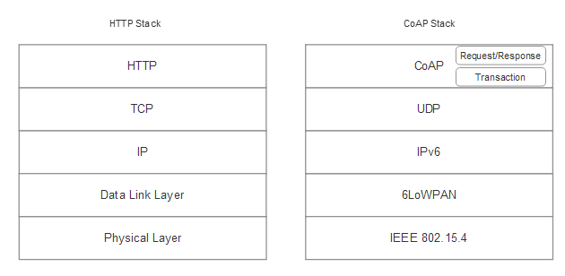

Pila HTTP en comparación con CoAP

CoAP comparte contexto, sintaxis y uso de manera similar a HTTP. El direccionamiento en CoAP también tiene el estilo HTTP. Una dirección se extiende a la estructura de URI. Al igual que en los URI de HTTP, el usuario debe conocer la dirección de antemano para obtener acceso a un recurso. En el nivel superior-más, coap utiliza solicitudes tales como GET, PUT, POST, y DELETE, como en HTTP. De manera similar, los códigos de respuesta imitan HTTP, como: 

- 2.01: Creado
- 2.02: Eliminado
- 2.04: Cambió
- 2.05: Contenido
- 4.04: No encontrado (recurso)
- 4.05: Método no permitido

La forma de un URI típico en CoAP sería:

```
coap: // host [: puerto] / [ruta] [? consulta]
```

Un sistema CoAP tiene siete actores principales:

- **Puntos** finales: estos son los orígenes y destinos de un mensaje CoAP. La definición específica de un punto final depende del transporte que se utilice. 
- **Proxies** : un punto final de CoAP al que los clientes de CoAP le asignan la tarea de realizar solicitudes en su nombre. Reducir la carga de la red, acceder a los nodos inactivos y proporcionar una capa de seguridad son algunas de las funciones de un proxy. Los servidores proxy pueden ser seleccionados explícitamente por un cliente (proxy directo) o pueden usarse como servidores in situ (proxy inverso). Alternativamente, un proxy puede mapear desde una solicitud CoAP a otra solicitud CoAP o incluso traducir a un protocolo diferente (cross-proxying). Una situación común es un enrutador de borde que se desplaza desde una red CoAP a servicios HTTP para conexiones a Internet basadas en la nube.
- **Cliente** : el originador de una solicitud. El punto final de destino de una respuesta.
- **Servidor** : el punto final de destino de una solicitud. El creador de una respuesta.
- **Intermediario** : un cliente que actúa como servidor y como cliente hacia un servidor de origen. Un proxy es un intermediario. 
- **Servidores de origen** : el servidor en el que reside un recurso determinado.
- **Observadores** : un cliente observador puede registrarse mediante un GETmensaje modificado . Luego, el observador se conecta a un recurso y si el estado de ese recurso cambia, el servidor enviará una notificación al observador. 

Los observadores son únicos en CoAP y permiten que un dispositivo observe cambios en un recurso en particular. En esencia, esto es similar al modelo de suscripción MQTT donde un nodo se suscribirá a un evento. 

A continuación se muestra un ejemplo de arquitectura CoAP. Al ser un sistema HTTP ligero, los clientes de CoAP pueden comunicarse entre sí o con servicios en la nube que admiten CoAP. Alternativamente, se puede usar un proxy para hacer un puente a un servicio HTTP en la nube. Los puntos finales de CoAP pueden establecer relaciones entre sí, incluso a nivel de sensor. Los observadores permiten atributos de suscripción a los recursos que cambian de manera similar a MQTT. El gráfico también ilustra los servidores de origen que contienen el recurso que se comparte.

Los dos proxies permiten que CoAP realice la traducción HTTP o permita el reenvío de solicitudes en nombre de un cliente. 

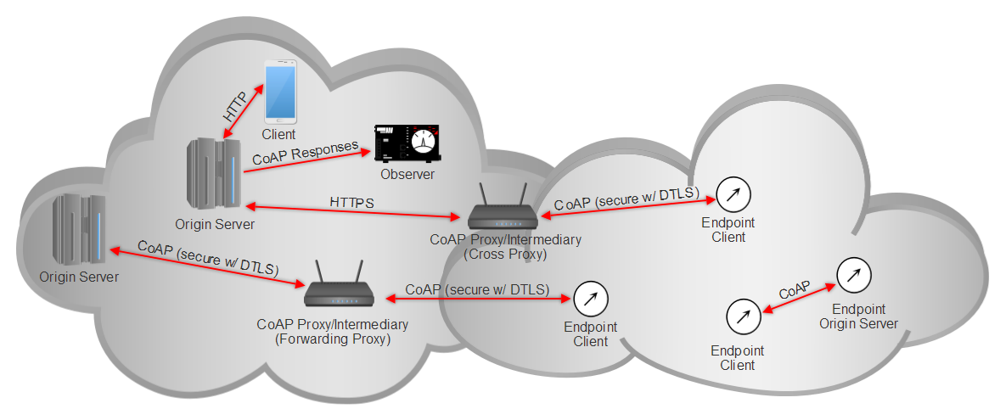

Arquitectura CoAP. 

CoAP hace uso del puerto 5683. Este puerto debe ser compatible con un servidor que ofrezca recursos, ya que el puerto se utiliza para el descubrimiento de recursos. El puerto 5684se usa cuando DTLS está habilitado.

- [Dupdo](https://learning.oreilly.com/library/view/internet-of-things/9781788470599/0573b3e8-1ca2-4f75-a3d9-537446e061ac.xhtml#)
- [Agregar resaltado](https://learning.oreilly.com/library/view/internet-of-things/9781788470599/0573b3e8-1ca2-4f75-a3d9-537446e061ac.xhtml#)
- [Añadir la nota](https://learning.oreilly.com/library/view/internet-of-things/9781788470599/0573b3e8-1ca2-4f75-a3d9-537446e061ac.xhtml#)

# Formatos de mensajería CoAP

Los protocolos basados en el transporte UDP implican que la conexión puede no ser intrínsecamente confiable. Para compensar los problemas de confiabilidad, CoAP presenta dos tipos de mensajes que se diferencian por requerir reconocimiento o no. Una característica adicional de este enfoque es que los mensajes pueden ser asincrónicos. 

En total, solo hay cuatro mensajes en CoAP:

- **Confirmable (CON)** : Requiere un ACK. Si se envía un mensaje CON, se debe recibir un ACK dentro de un intervalo de tiempo aleatorio entre ACK_TIMEOUTy ( ACK_TIMEOUT * ACK_RANDOM_FACTOR). Si no se recibe el ACK, el remitente transmite el mensaje CON una y otra vez a intervalos que aumentan exponencialmente hasta que recibe el ACK o un RST. Esta es esencialmente la forma CoAP de control de la congestión. Hay un número máximo de intentos establecido por MAX_RETRANSMIT. Este es el mecanismo de resiliencia para compensar la falta de resiliencia en UDP. 
- **No confirmable (NO)** : no requiere ACK. Esencialmente un mensaje o transmisión de disparar y olvidar.
- **Reconocimiento (ACK)** : Reconoce un mensaje CON. El mensaje ACK puede combinarse con otros datos.
- **Reset (RST)** : indica que se ha recibido un mensaje CON pero falta el contexto. El mensaje RST puede combinarse con otros datos.

CoAP es un diseño RESTful que utiliza mensajes de solicitud / respuesta acoplados a mensajes CoAP. Esto permite una mayor eficiencia y preservación del ancho de banda, como se muestra en la siguiente figura:


Mensajería CoAP NON y CON. 

El gráfico muestra tres ejemplos de transacciones de solicitud / respuesta no confirmables y confirmables de CoAP. Estos se enumeran y describen de la siguiente manera:

- **Solicitud / respuesta no confirmable (izquierda):**  un mensaje transmitido entre el cliente A y B utilizando la construcción HTTP GET típica. B se corresponde con los datos de contenido en algún momento posterior y devuelve la temperatura de 20 grados centígrados. 
- **Solicitud / respuesta confirmable (centro):**  Se incluye el ID del mensaje, un identificador único para cada mensaje. El Token representa un valor que debe coincidir durante la duración del intercambio. 
- **Solicitud / respuesta confirmable (derecha):** Aquí el mensaje es confirmable. Tanto el cliente A como el B esperarán un ACK después de cada intercambio de mensajes. Para optimizar la comunicación, el Cliente B puede optar por incorporar el ACK con los datos devueltos como se muestra en el extremo derecho.

El registro real de transacciones CoAP se puede ver en la extensión Copper Firefox en Firefox versión 55: 

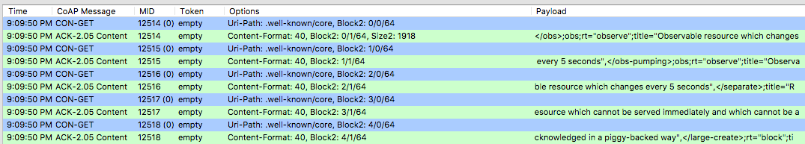

Registro CoAP de cobre. Aquí vemos varios mensajes iniciados por el cliente CON-GET a californium.eclipse.org:5683. La ruta del URI apunta a coap: //californium.eclipse.org: 5683 / .well-known / core. El MID aumenta con cada mensaje mientras el token no se usa y es opcional. 

El proceso de retransmisión se ilustra en la siguiente figura:

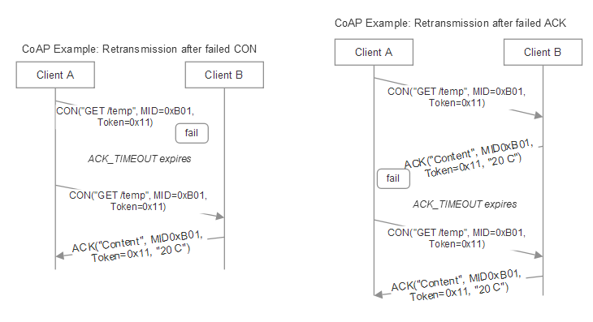

Mecanismo de retransmisión CoAP. Para tener en cuenta la falta de resistencia en UDP, CoAP utiliza un mecanismo de tiempo de espera cuando se comunica con mensajes confirmables. Si el tiempo de espera expira, ya sea enviando un mensaje CON o recibiendo el ACK, el remitente retransmitirá el mensaje. El remitente es responsable de administrar el tiempo de espera y retransmitir hasta un número máximo de retransmisiones. Tenga en cuenta que la retransmisión del ACK fallido reutiliza el mismo Message_ID.

Mientras que otra arquitectura de mensajería requiere un servidor central para propagar mensajes entre clientes, CoAP permite que los mensajes se envíen entre cualquier cliente CoAP, incluidos sensores y servidores. CoAP incluye un modelo de almacenamiento en caché simple. El almacenamiento en caché se controla mediante códigos de respuesta en el encabezado del mensaje. Una máscara de número de opción determinará si es una clave de caché. La Max_Ageopción se utiliza para controlar la vida útil de los elementos de la caché y garantizar la actualización de los datos. Es decir, Max_Ageestablece el tiempo máximo durante el que se puede almacenar en caché una respuesta antes de que deba actualizarse. Max_Ageel valor predeterminado es 60 segundos y puede extenderse hasta 136,1 años. Los proxies juegan un papel en el almacenamiento en caché; por ejemplo, un sensor de borde de suspensión puede usar un proxy para almacenar datos en caché y conservar energía. 

El encabezado del mensaje CoAP está diseñado exclusivamente para una máxima eficiencia y preservación del ancho de banda. El encabezado tiene cuatro bytes de longitud con un mensaje de solicitud típico que solo toma encabezados de 10 a 20 bytes. Suele ser 10 veces más pequeño que un encabezado HTTP. La estructura consta de identificadores de tipo de mensaje (T), que deben incluirse en cada encabezado junto con un ID de mensaje único asociado. El campo **Código** se utiliza para señalar errores o estados de éxito en todos los canales. Después del encabezado, todos los demás campos son opcionales e incluyen tokens de longitud variable, opciones y carga útil:

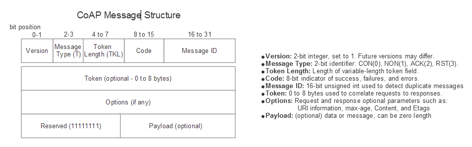

Estructura del mensaje CoAP

UDP también puede hacer que lleguen mensajes duplicados para transmisiones CON y NON. Si Message_IDs se entregan idénticos a un destinatario dentro de lo prescrito EXCHANGE_LIFETIME, se dice que existe un duplicado. Esto claramente puede ocurrir, como se muestra en las figuras anteriores, cuando un ACK falta o se descarta y el cliente retransmite el mensaje con el mismo Message_ID. La especificación CoAP establece que el destinatario debe ACK cada mensaje duplicado que recibe, pero solo debe procesar una solicitud o respuesta. Esta regla se puede relajar si un mensaje CON transporta una solicitud que es idempotente.

Como se mencionó, CoAP permite el papel de un observador en un sistema. Esto es único, ya que permite que CoAP se comporte de manera similar a MQTT. El proceso de observación permite que un cliente se registre para observación y el servidor notificará al cliente cada vez que el recurso que se está monitoreando cambie de estado. La duración de la observación se puede definir durante el registro. Además, la relación de observación finaliza cuando el cliente iniciador envía un RST u otro GETmensaje:


Proceso de registro y actualización de observadores de CoAP

Como se mencionó anteriormente, no hay autenticación o cifrado inherentes en el estándar CoAP, sino que el usuario debe confiar en DTLS para proporcionar ese nivel de seguridad. Si se usa DTLS, un URI de ejemplo sería:

```
    // 
    coap inseguro : //example.net: 1234 / ~ temperatura / value.xml 

    // 
    coaps seguro : //example.net: 1234 / ~ temperatura / value.xml
```

CoAP también ofrece mecanismos de descubrimiento de recursos. Simplemente enviar una GETsolicitud a /.well-known/corerevelará una lista de recursos conocidos en el dispositivo. Además, las cadenas de consulta se pueden utilizar en la solicitud para aplicar filtros específicos. 

# Ejemplo de uso de CoAP

CoAP es liviano y su implementación tanto en el cliente como en el servidor debería requerir pocos recursos. Aquí, usamos la biblioteca aiocoap basada en Python. Se puede leer más sobre aiocoap en:  *Amsüss, Christian y Wasilak, Maciej. aiocoap: Biblioteca CoAP de Python. Soluciones de captación de energía, 2013–. http://github.com/chrysn/aiocoap/.* Existen muchos otros clientes y servidores CoAP gratuitos con varios escritos en código C de bajo nivel para entornos de sensores extremadamente restringidos. Aquí, usamos un entorno Python por brevedad.

La implementación del cliente es:

```
# ! / usr / bin / env python3
 import asyncio #necesario para el procesamiento asincrónico en Python 
desde aiocoap import * #usando la biblioteca aiocoap
```

El siguiente es el bucle principal del cliente. El cliente utiliza PUT para transmitir la temperatura a un URI conocido:

```
async def main (): 
context = await Context.create_client_context () 

await asyncio.sleep (2) #esperar 2 segundos después de la inicialización 

payload = b "20.2 C" 
request = Message (code = PUT, payload = payload) 
 
request.opt. uri_host = '127.0.0.1' #URI para la dirección de localhost 
request.opt.uri_path = ("temp", "celcius") #URI para la ruta a / temp / celcius 

response = await context.request (request) .response   
print (' Resultado:% s \ n% r '% (response.code, response.payload)) 

if __name__ == "__main__": 
asyncio.get_event_loop (). Run_until_complete (main ())
```

La implementación del servidor es:

```
# ! / usr / bin / env python3 
import asyncio #necesario para el procesamiento asincrónico en Python 
import aiocoap.resource como recurso #usando la biblioteca 
aiocoap import aiocoap
```

El siguiente código ilustra los servicios PUTy GETmétodos:

```
class GetPutResource (resource.Resource): 

def __init __ (self): 
super () .__ init __ () 
self.set_content (b "Default Data (padded)" 


def set_content (self, content): #Apply padding 
self.content = content 
while len (self.content) & lt; = 1024: 
self.content = self.content + b "0123456789 \ n" 

async def render_get (self, request): #GET handler 
return aiocoap.Message (payload = self.content)     

async def render_put (self, request): #PUT handler 
print ('PUT payload:% s'% request.payload) 
self.set_content (request.payload) # reemplaza set_content con la carga recibida
 return aiocoap.Message (código = aiocoap.CHANGED, payload = self.content) # establecer el código de respuesta en 2.04
```

El bucle principal es:

```
def main (): 
root = resource.Site () # elemento raíz que contiene todos los recursos que se encuentran en el servidor 

root.add_resource (('. well-known', 'core'), #this es el típico .well-known / core 
resource.WKCResource (root.get_resources_as_linkheader)) # lista de recursos para .well-known / core 
root.add_resource (('temp', 'celcius'), GetPutResource ())) # agrega el recurso / tmp / celcius 

asyncio.Task ( aiocoap.Context.create_server_context (root)) 

asyncio.get_event_loop (). run_forever () 

if __name__ == "__main__": 
main ()
```

# STOMP

STOMP son las siglas de Simple (or Streaming) Text-Message-Oriented Middleware Protocol (Protocolo de middleware orientado a mensajes de texto simple). Es un protocolo basado en texto diseñado por Codehaus para operar con middleware orientado a mensajes. Un corredor desarrollado en un lenguaje de programación puede recibir mensajes de un cliente escritos en otro. El protocolo tiene similitudes con HTTP y opera sobre TCP. STOMP consta de un encabezado de marco y un cuerpo de marco. La especificación actual es STOMP 1.2, con fecha del 22 de octubre de 2012 y está disponible con una licencia gratuita.

Es diferente de muchos protocolos presentados, ya que no se ocupa de temas de suscripción o colas. Simplemente usa semántica similar a HTTP como SEND con una cadena de destino. Un corredor debe analizar el mensaje y asignarlo a un tema o cola para el cliente. Un consumidor de los datos se SUSCRIBIRÁ a los destinos proporcionados por el corredor.

STOMP tiene clientes escritos en python ( Stomp.py), TCL (tStomp) y Erlang ( stomp.erl). Varios servidores tienen soporte STOMP nativo, como RabbitMQ (a través de un complemento), y algunos servidores se han diseñado en idiomas específicos (Ruby, Perl u OCaml).

# AMQP

**AMQP son las** siglas de **Advanced Message Queue Server (Protocolo de cola de mensajes avanzado)** . Es un protocolo MOM reforzado y probado utilizado por fuentes de datos masivas como JP Morgan Chase para procesar más de mil millones de mensajes por día, y Ocean Observatory Initiative para recopilar más de 8 terabytes de datos oceanográficos cada día. Fue ideado originalmente en JP Morgan Chase en 2003, quien lideró la creación de un grupo de trabajo de 23 empresas en 2006 con la arquitectura y la gobernanza del protocolo. En 2011, el grupo de trabajo se fusionó con el grupo OASIS, donde se encuentra alojado actualmente.

Hoy en día está bien establecido en las industrias de transacciones bancarias y crediticias, pero también tiene un lugar en IoT. Además, AMQP está estandarizado por ISO e IEM como ISO / IEC 19464: 2014. Se puede encontrar un grupo de trabajo formal de AMQP en [www.amqp.org](http://amqp working group/) . 

El protocolo AMQP reside en la parte superior de la pila TCP y usa el puerto 5672para la comunicación. Los datos se serializan a través de AMQP, lo que significa que los mensajes se transmiten en tramas unitarias. Las tramas se transmiten en canales virtuales identificados con un único channel_id. Los marcos constan de encabezados, channel_idsinformación de carga útil y pies de página. Sin embargo, un canal solo se puede asociar con un único host. A los mensajes se les asigna un identificador global único. 

AMQP es un sistema de comunicación orientado a mensajes y controlado por flujo. Es un protocolo a nivel de cable y una interfaz de bajo nivel. Un protocolo de cable se refiere a las API inmediatamente por encima de la capa física de una red. Una API a nivel de cable permite que diferentes servicios de mensajería como .NET (NMS) y Java (JMS) se comuniquen entre sí. Del mismo modo, AMQP intenta desvincular a los editores de los suscriptores. A diferencia de MQTT, tiene mecanismos para el equilibrio de carga y la puesta en cola formal. Un protocolo muy utilizado que se basa en AMQP es RabbitMQ. RabbitMQ es un agente de mensajes AMQP escrito en Erlang. Además, varios clientes AMQP están disponibles, como el cliente RabbitMQ escrito en Java, C #, Javascript y Erlang, así como Apache Qpid escrito en Python, C ++, C #, Java y Ruby.

Uno o más hosts virtuales con sus propios espacios de nombres, intercambios y colas de mensajes residirán en un servidor central. Productores y consumidores se suscriben al servicio de intercambio. El servicio de intercambio recibe mensajes de un editor y enruta los datos a una cola asociada. Esta relación se denomina **enlace** y el enlace puede ser directo a una cola o distribuirse en múltiples colas (como en una transmisión). Alternativamente, el enlace puede asociar un intercambio con una cola usando una clave de enrutamiento; esto se denomina formalmente **intercambio directo** . Otro tipo de intercambio es el intercambio de temas .

Aquí se usa un patrón para comodín en una clave de enrutamiento (como *.temp.#coincidencias idaho.temp.celsiusy wisconsin.temp.fahrenheit): 

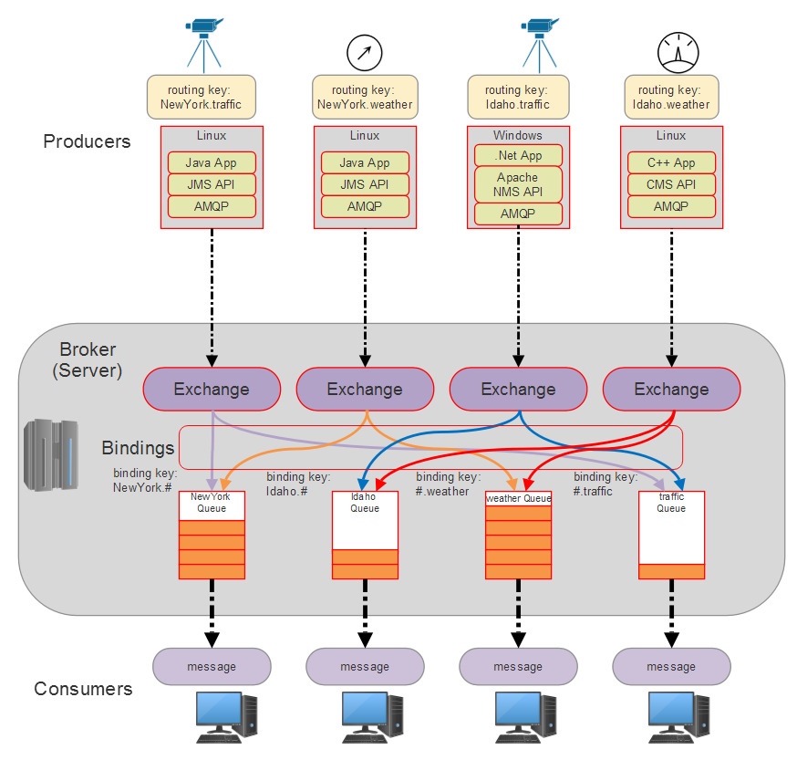

Topología arquitectónica AMQP. Hay productores y consumidores en una implementación típica de AMQP. Los productores pueden usar diferentes lenguajes y espacios de nombres, ya que AMQP es independiente del lenguaje dadas sus API y un protocolo de cable. El corredor reside en la nube y los proveedores intercambian para cada productor. Los intercambios enrutan los mensajes a las colas adecuadas según las reglas vinculantes. Las colas son búferes de mensajes que producen mensajes para los consumidores en espera.

La topología de red de una implementación de AMQP es concentrada y radial con la capacidad de que los concentradores se comuniquen entre sí. AMQP consta de nodos y enlaces. Un nodo es una fuente con nombre o un receptor de mensajes. Un marco de mensaje se mueve entre nodos a través de enlaces unidireccionales. Si un mensaje pasa a través de un nodo, el identificador global no cambia. Si el nodo realiza alguna transformación, se asigna una nueva ID. Un enlace tiene la capacidad de filtrar mensajes. Hay tres patrones de mensajería distintos que se pueden usar en AMQP:

- **Mensajes dirigidos asíncronos** : el mensaje se transmite sin necesidad de un reconocimiento del receptor.
- **Solicitud / Respuesta o Pub / Sub** : similar a MQTT con un servidor central que actúa como un servicio pub / sub.
- **Almacenar y reenviar** : se utiliza para la retransmisión de concentradores, donde un mensaje se envía a un concentrador intermedio y luego se envía hacia su destino.

Aquí se muestra un intercambio dirigido básico escrito en Python, usando RabbitMQ y las bibliotecas pike Python. Aquí creamos un intercambio directo simple llamado **Idaho** y lo vinculamos a una cola llamada **clima** :

```
#! / usr / bin / env python 
#AMQP ejemplo básico de Python la biblioteca pika Python 

de pika import BlockingConnection, BasicProperties, ConnectionParameters 

#initialize connections 
connection = BlockingConnection (ConnectionParameters ('localhost')) 
channel = connection.channel () 
channel.exchange_declare (exchange = 'Idaho', type = 'direct') #declare a direct exchange 
channel.queue_declare (queue = 'weather') #declare the queue 

channel.queue_bind (exchange = 'Idaho', queue = 'weather', routing_key = 'Idaho') #bindings 

#produce el mensaje 
channel.basic_publish (exchange = 'Idaho', routing_key = 'Idaho', body = 'new important task') 

#consume the message
method_frame, header_frame, body = ch.basic_get ('clima') 

#acknowledge 
channel.basic_ack (method_frame.delivery_tag)
```

# Resumen y comparación de protocolos

A continuación se ofrece un resumen y una comparación de los distintos protocolos. Cabe señalar que existen excepciones a algunas de estas categorías. Por ejemplo, si bien MQTT no ofrece un aprovisionamiento de seguridad integrado, puede colocarse en capas a nivel de la aplicación. En todos los casos, existen excepciones y la tabla se construye a partir de las especificaciones formales:

|                                   | **MQTT**       | **MQTT-SN**                | **CoAP**         | **AMQP**  | **PISAR MUY FUERTE** | **HTTP / RESTful** |
| --------------------------------- | -------------- | -------------------------- | ---------------- | --------- | -------------------- | ------------------ |
| **Modelo**                        | MOM pub / sub  | MOM pub / sub              | Sosegado         | MAMÁ      | MAMÁ                 | Sosegado           |
| **Protocolo de descubrimiento**   | No             | Sí (a través de pasarelas) | sí               | No        | No                   | sí                 |
| **Demandas de recursos**          | Bajo           | Muy bajo                   | Muy bajo         | Elevado   | Medio                | Muy alto           |
| **Tamaño del encabezado (bytes)** | 2              | 2                          | 4                | 8         | 8                    | 8                  |
| **Uso de energía promedio**       | Más bajo       | Bajo                       | Medio            | Elevado   | Medio                | Elevado            |
| **Autenticación**                 | No (SSL / TLS) | No (/ TLS)                 | No (DTLS)        | sí        | No                   | Sí (TLS)           |
| **Cifrado**                       | No (SSL / TLS) | No (SSL / TLS)             | No (DTLS)        | sí        | No                   | sí (TLS)           |
| **Controles de acceso**           | No             | No                         | No (proxy)       | sí        | No                   | sí                 |
| **Sobrecarga de comunicación**    | Bajo           | Muy bajo                   | Muy bajo         | Elevado   | Alto, detallado      | Elevado            |
| **Complejidad del protocolo**     | Bajo           | Bajo                       | Bajo             | Elevado   | Bajo                 | Muy alto           |
| **TCP / UDP**                     | TCP            | TCP / UDP                  | UDP              | TCP / UDP | TCP                  | TCP                |
| **Radiodifusión**                 | Indirecto      | Indirecto                  | sí               | No        | No                   | No                 |
| **Calidad de servicio**           | sí             | sí                         | Con mensajes CON | sí        | No                   | No                 |

# Resumen

MQTT, CoAP y HTTP son, con mucho, los protocolos de Internet de IoT predominantes en la industria con el apoyo de casi todos los proveedores de la nube. MQTT y MQTT-SN proporcionan un modelo pub / sub escalable y eficiente de comunicación de datos, mientras que CoAP proporciona todas las características relevantes de un modelo HTTP RESTful sin gastos generales. Un arquitecto debe considerar la sobrecarga, la potencia, el ancho de banda y los recursos necesarios para admitir un protocolo determinado y tener suficiente visión de futuro para garantizar que la solución se amplíe. Ahora que se ha definido un método de transporte para enviar datos a Internet, podemos examinar qué hacer con esos datos. El próximo capítulo se concentrará en la arquitectura de nubes y niebla, desde los principios fundadores hasta configuraciones más avanzadas. 

CAPITULO 2


¿Qué es un microservicio?

*La arquitectura es el resultado de un proceso de hacer preguntas y probarlas y volver a interrogar y cambiar de manera repetitiva* *.*

—Thom Mayne

El software como servicio ha surgido como un modelo para productos de software modernos que brindan a los clientes una gran experiencia y al negocio una plataforma dinámica.para campañas, comunicación y el lanzamiento de nuevas funciones a un ritmo frecuente. Aprendió en el último capítulo que Agile y Scrum, Lean Engineering y DevOps proporcionan una metodología y un marco de proceso para el desarrollo de productos de alta velocidad. Aprendió que las plataformas en la nube brindan una base excelente para las soluciones SaaS con su infraestructura bajo demanda y servicios de aplicaciones. Finalmente, identificó la arquitectura de microservicios como la arquitectura óptima para las soluciones alojadas en la nube. En este capítulo, definiremos los microservicios y discutiremos tanto los beneficios como los desafíos de este nuevo enfoque.

Los microservicios son ...

El término *microservicio* puede ser un poco engañoso. El prefijo "micro" implica que los microservicios son pequeñas entidades diminutas que corren haciendo tareas en nuestro nombre, como aspirar el piso o arreglar una llanta pinchada, o que forman un gran enjambre de dispositivos microscópicos similares a insectos que se auto-replican a través consumo de materia y energía, y son capaces de desintegrar cualquier sustancia que toquen. Los microservicios funcionan en nuestro nombre, pero no siempre son pequeños.

El "micro" en microserviciosen realidad, se refiere al alcance de la funcionalidad que proporciona el servicio. Un microservicio proporciona una capacidad empresarial o de plataforma a través de una API, un contrato de datos y una configuración bien definidos. Proporciona esta función y solo esta función. Hace una cosa y la hace bien. Este concepto simple proporciona la base para un marco que guiará el diseño, desarrollo e implementación de sus microservicios.

Dentro del contexto de hacer una cosa y hacerlo bien, los microservicios también exhiben una serie de otras propiedades y comportamientos; Son estos elementos los que diferencian a los microservicios de las encarnaciones anteriores de enfoques orientados a servicios. Estos elementos afectan todos los aspectos de cómo desarrollamos software en la actualidad, desde la estructura del equipo, la organización del código fuente y el control hasta la integración, el empaquetado y la implementación continuos.

Examinará estas propiedades y comportamientos; también verá los beneficios y los desafíos de este enfoque de microservicio. Junto con este examen, aprenderá cómo identificar microservicios y cómo determinar dónde están las costuras y los límites dentro de los dominios en los que está trabajando.

Autónomo y aislado

- **Autónomo** : existente o capaz de existir de forma independiente; responder, reaccionar o desarrollarse independientemente del todo.
- **Aislado** : Separado de los demás, sucediendo en diferentes lugares y en diferentes momentos.

Los microservicios son autónomos y aislados. Eso significa que los microservicios son unidades autónomas funcionalmente con dependencias poco acopladas de otros servicios y están diseñados, desarrollados, probados y lanzados de forma independiente.

Trascendencia

Durante los últimos años, hemos estado desarrollando estándares y prácticas para el desarrollo en equipo de sistemas grandes y complejos utilizando una arquitectura monolítica en capas. Esto se refleja en cómo nos organizamos en equipos, estructuramos nuestras soluciones y sistemas de control de código fuente, y empaquetamos y publicamos nuestro software.

Las soluciones monolíticas se crean, prueban e implementan como un gran cuerpo de código, generalmente en un conjunto de servidores o instancias de VM, con el fin de proporcionar escala y rendimiento. Si se corrige un error o se agrega una función o se actualiza el contenido, la solución completa se crea, prueba e implementa en la granja de servidores como una entidad grande. El proceso de construcción, implementación y prueba de regresión del monolito es costoso y requiere mucho tiempo. Con el tiempo, estos monolitos se convierten en sistemas grandes, complejos y estrechamente acoplados que son casi imposibles de mantener y evolucionar en nuevas direcciones.

Si desea adoptar una arquitectura de microservicios, sus estándares y prácticas deberán adaptarse a este nuevo patrón. Los equipos deberán organizarse de tal manera que respalden el desarrollo de microservicios como productos distintos e independientes. Los entornos de desarrollo, prueba y producción deberán organizarse para respaldar a estos equipos, desarrollando e implementando sus productos de microservicio por separado. Cuando se realizan cambios, solo el microservicio afectado debe pasar por la canalización de implementación, lo que simplifica el proceso de actualización del sistema y entrega nuevas características y funciones.

Al dividir la solución en sus componentes de microservicio y tratarlos como esfuerzos de desarrollo separados, la velocidad del desarrollo aumentará y el costo de realizar cambios disminuirá.

Elástico, resistente y receptivo

- **Elástico** : Capaz de volver a su longitud, forma, etc. originales, después de estirarlo, deformarlo, comprimirlo o expandirlo.
- **Resiliente** : Capaz de volverse fuerte, saludable o exitoso nuevamente después de que suceda algo malo.
- **Responsive** : Rápido para responder o reaccionar.

Los microservicios se reutilizan en muchas soluciones diferentes y, por lo tanto, deben poder escalar adecuadamente según el escenario de uso. Deben ser tolerantes a las fallas y proporcionar un período de tiempo razonable para la recuperación si algo sale mal. Finalmente, deben ser receptivos y brindar un desempeño razonable dado el escenario de ejecución.

Trascendencia

El entorno en el que implementa sus microservicios debe proporcionar escala dinámica y configuraciones de alta disponibilidad para servicios con y sin estado. Esto se logra aprovechando una plataforma en la nube moderna como Microsoft Azure.

Azure proporciona todas las capacidades necesarias para admitir escala elástica, tolerancia a fallas y alta disponibilidad, así como opciones de configuración que le permiten el tamaño adecuado para el rendimiento. Profundizará en cómo Azure es una plataforma de microservicios con mayor detalle en el [Capítulo 4](https://learning.oreilly.com/library/view/microservices-iot-and/9781484212752/9781484212769_Ch04.xhtml) .

Orientado a mensajes y programable

- **Orientado a mensajes** : software que conecta sistemas separados en una red llevando y distribuyendo mensajes entre ellos.
- **Programable** : Un plan de tareas que se realizan para lograr un resultado específico.

Los microservicios se basan en las API y los contratos de datos para definir cómo se logra la interacción con el servicio. La API define un conjunto de puntos finales visibles en la red y el contrato de datos define la estructura del mensaje que se envía o se devuelve.

Trascendencia

La definición de los puntos finales de los servicios y los contratos de datos no es nueva. La arquitectura de microservicio se basa en la evolución de los estándares de la industria para definir la semántica de interacción. Si estos estándares evolucionan o se introducen otros nuevos, evolucionará una arquitectura de microservicio para adoptar estos nuevos estándares.

Al momento de escribir este artículo, la industria generalmente se ha decidido por la Transferencia de Estado Representacional (ReST) a través de HTTP para definir puntos finales de API y notación de objetos JavaScript (JSON)para la definición de contratos de datos. Además, las capacidades del bus de servicio, como las colas de mensajes de almacenamiento y reenvío, se utilizan para proporcionar un acoplamiento flexible entre los componentes y un modelo de programación asíncrono.

Las API y los contratos de datos son el borde más externo de un microservicio y definen cómo un cliente del servicio puede invocar una función. Detrás de esta API puede haber un conjunto muy sofisticado de componentes de software, medios de almacenamiento y múltiples instancias de VM que brindan la función. Para el consumidor del servicio, todo esto es una caja negra, lo que significa que conocen las entradas y salidas publicadas, pero nada más sobre el funcionamiento interno. Como consumidor de ese servicio, tiene conocimiento de las entradas y salidas publicadas, y nada más. Lo que se espera es que se construya un mensaje, se invoque la API y se devuelva una respuesta. La interacción entre el consumidor y el servicio es finita y distinta.

Configurable

- **Configurable** : Diseñar o adaptar para formar una configuración específica o para algún propósito específico.

Los microservicios deben proporcionar algo más que una API y un contrato de datos. También deben ser configurables. Cada microservicio tendrá diferentes niveles de configuración y el acto de configurar puede tomar diferentes formas. El punto clave, para ser reutilizable y poder abordar las necesidades de cada sistema que elige emplear sus capacidades, es que un microservicio debe proporcionar un medio por el cual se pueda moldear adecuadamente al escenario de uso.

Trascendencia

Cuando comience el proceso de diseño de un microservicio, pronto descubrirá que surgirán varias API. Junto con la API de cara al público que desea exponer al mundo, aparecerán otros puntos finales que son más una función administrativa y se usarán para definir cómo arrancar, monitorear, administrar, escalar, configurar y realizar otras operaciones superficiales. en el servicio.

Como cualquier buen producto de software, un microservicio debe proporcionar una interfaz o consola fácil de usar para que las funciones administrativas configuren y administren instancias en ejecución. Detrás de la consola hay, por supuesto, un conjunto de API privadas a semiprivadas que brindan acceso a los datos subyacentes y los ajustes de configuración que impulsan el servicio.

Un microservicio, entonces, es más que solo su API ReST de cara al público y consta de varias API con diferentes niveles de acceso, consolas administrativas compatibles y una infraestructura de tiempo de ejecución para admitir todo lo anterior. Es un producto de software con todos los adornos.

Automatizado

- **Automatizado** : tener controles que permiten que algo funcione o suceda sin ser controlado directamente por una persona.

El ciclo de vida de un microservicio debe estar completamente automatizado, desde el diseño hasta la implementación.

Trascendencia

Mientras reflexiona sobre este nuevo mundo de desarrollo de productos de software compuesto por microservicios, puede que se le ocurra que todo este esfuerzo podría ser bastante complejo con una proliferación de productos de microservicios independientes y toda la complejidad que ello conlleva, y no estaría equivocado.

Este enfoque no debe emprenderse sin antes tener un control automatizado completo sobre el ciclo de vida del desarrollo de software. Se trata de tener el conjunto de herramientas adecuado para respaldar una canalización de desarrollo completamente automatizada, pero lo que es más importante, se trata de evolucionar hacia una cultura DevOps.

Una cultura DevOps es aquella que promueve la colaboración y la integración de los equipos de desarrollo y operaciones. Cuando forma un equipo que es responsable del diseño, la implementación y la implementación de un microservicio, ese equipo debe ser multifuncional, que consta de todas las habilidades necesarias para llevar el proceso desde el diseño hasta la implementación. Eso significa que los equipos de desarrollo tradicionales que consisten en arquitectos, desarrolladores y evaluadores deben expandirse para incluir operaciones.

Si bien los desarrolladores son tradicionalmente responsables de la automatización desde la construcción hasta la prueba, lo que se denomina integración continua, el grupo de operaciones es tradicionalmente responsable de la implementación en pruebas, etapas y producción. La combinación de estos equipos ofrece la oportunidad de hacer de la automatización de todo el proceso de desarrollo de productos, así como de las operaciones de monitoreo, diagnóstico y recuperación, una actividad de primera clase del equipo de productos. Este proceso se denomina automatización y todo el equipo asume la responsabilidad del buen funcionamiento de los lanzamientos de productos.

Los beneficios de Microservicios

Ahora que tiene una definición funcional de microservicios, examinemos los beneficios de este enfoque para la computación distribuida.

Evolutivo

Los días del desarrollo de productos de software del Big Bang han terminado. Ya no es posible pasar a un ciclo de desarrollo de varios meses o varios años antes de lanzar un producto porque cuando lo lanza, la ventana de oportunidad ha pasado y su competencia ya ha estado allí, lo hizo.

Puede ser responsable del mantenimiento y desarrollo continuos de un sistema monolítico, complejo y existente formado por millones de líneas de código. No habrá estómago para la completa reimplementación de tal sistema; el negocio no pudo sostenerlo.

Uno de los beneficios de la arquitectura de microservicio es que puede evolucionar hacia este enfoque un servicio a la vez, identificando una capacidad comercial, implementándola como un microservicio e integrándola mediante un patrón de acoplamiento flexible, con el monolito existente proporcionando un puente hacia lo nuevo. arquitectura.

Con el tiempo, se pueden migrar más y más capacidades, reduciendo el alcance del monolito hasta que sea solo una cáscara de su forma original. El paso a los microservicios abrirá la puerta a nuevas experiencias de usuario y nuevas oportunidades comerciales.

Abierto

Los microservicios están diseñados para exponer su funcionalidad a través de estándares de la industria para contratos de datos y API direccionables en red, y están alojados en plataformas en la nube altamente escalables, elásticas y resistentes. Esto permite que un equipo de microservicios elija el lenguaje de programación, el sistema operativo y el almacén de datos que mejor se adapte a las necesidades de su servicio y su conjunto de habilidades sin preocuparse por la interoperabilidad.

Es posible que algunos equipos de microservicios se desarrollen en Node.JS, otros en Java y otros en C #. Todos esos microservicios se pueden usar juntos en una solución porque la composición ocurre en el nivel de la API de ReST.

Esto puede ser una gran mejora para los equipos que están distribuidos por todo el mundo y que actualmente intentan trabajar juntos en una solución monolítica. Al crear equipos multifuncionales en cada geografía y darles la responsabilidad total sobre microservicios específicos, la necesidad de coordinarse las 24 horas del día desaparece y se reemplaza con la coordinación en la capa de API, que no tiene un límite de tiempo.

Alta velocidad

Los microservicios individuales tienen una pequeña superficie de funcionalidad. Con un equipo responsable del ciclo de vida del desarrollo y todos los componentes, la tecnología y la automatización que componen su implementación, la velocidad a la que se puede diseñar, desarrollar, implementar y actualizar un microservicio es mucho más rápido que intentar realizar las mismas operaciones. a través de una solución monolítica.

Reutilizable y compostable

Los microservicios por su propia naturaleza son reutilizables. No están en deuda con ninguna solución. Son entidades independientes que brindan una capacidad comercial o de plataforma y exponen esa funcionalidad a través de estándares abiertos de Internet.

Con el fin de crear una solución útil para un usuario final, se pueden componer varios microservicios juntos. Estas experiencias de usuario pueden implementarse como aplicaciones web y móviles o dirigirse a nuevos dispositivos, como wearables, que pueden volverse populares en el futuro.

Flexible

El despliegue de un microservicio se define a través de su automatización. Al definir escenarios de implementación y escala a través de herramientas de automatización, el equipo de microservicios puede ejercer un gran control. Existe una enorme flexibilidad en la forma en que el servicio se mueve a través del desarrollo, la prueba, la puesta en escena y la producción y, cuando está en producción, cómo se pueden modificar para adaptarse a diferentes escenarios de uso a través de la configuración.

La automatización de la implementación y las configuraciones de escala proporcionará el control necesario para definir el entorno de ejecución desde el contenedor en el que se ejecuta el servicio, las instancias en las que se implementan esos contenedores, las regiones geográficas en las que se instancian esas instancias y las configuraciones elásticas que definen escala.

Versátil y reemplazable

Dado que existe un control total sobre los escenarios de implementación de un microservicio, es posible tener varias versiones de un servicio ejecutándose una al lado de la otra, lo que proporciona compatibilidad con versiones anteriores y una migración sencilla.

El control de versiones generalmente se maneja a nivel de API, donde los números de versión se integran en la URL. Se puede lanzar una nueva versión de la API de microservicios sin afectar a los clientes que utilizan versiones anteriores de la API. También es posible proporcionar actualizaciones y mejoras continuas a los servicios existentes mientras están en producción.

Con este enfoque, los servicios se pueden reemplazar por completo mientras se mantiene la API actual o se pueden lanzar nuevas implementaciones con una nueva versión.

Propiedad de un equipo

Como se mencionó, un enfoque de arquitectura de microservicio requiere organizar equipos multifuncionales con el fin de poseer el ciclo de vida del producto de microservicio desde el diseño hasta la implementación. Si está en el camino de adoptar los principios ágiles y el proceso Scrum, está bien preparado para adoptar este patrón de arquitectura.

Los desafíos de los microservicios

Al igual que en el pasado, cuando realizó cambios en la forma en que diseñó y desarrolló el software, el cambio a los microservicios no estará exento de desafíos. Entra con los ojos y la mente bien abiertos.

[reorganización

Organizarse para admitir un enfoque de arquitectura de microservicio es uno de los desafíos más difíciles que tendrá. Si forma parte de una organización de comando y control que utiliza un enfoque de gestión de proyectos de software en cascada, tendrá dificultades porque no está orientado al desarrollo de productos de alta velocidad. Si carece de una cultura DevOps y no hay colaboración entre el desarrollo y las operaciones para automatizar la canalización de implementación, tendrá dificultades.

Si está buscando una oportunidad para adoptar este enfoque, se recomienda que no intente realizar cambios grandes y radicales en su organización. En su lugar, busque una oportunidad dentro del contexto de una iniciativa empresarial para probar esta nueva fórmula y luego siga estos pasos:

- Forme un pequeño equipo multifuncional.
- Brinde capacitación y orientación sobre la adopción de arquitectura Agile, Scrum, Azure y de microservicios.
- Proporcione una ubicación física separada para que este equipo trabaje para que no se vean afectados negativamente por la política interna y los viejos hábitos.
- Adopte un enfoque de producto mínimo viable y comience a entregar pequeñas versiones incrementales de un microservicio, llevando el proceso a lo largo del ciclo de vida.
- Integre este servicio con los sistemas existentes utilizando un enfoque de acoplamiento flexible.
- Realice el ciclo de vida de este microservicio varias veces hasta que se sienta cómodo con el proceso.
- Coloque al equipo central en posiciones de liderazgo a medida que forma nuevos equipos multifuncionales para difundir el conocimiento.

Plataforma

La creación del entorno de tiempo de ejecución para microservicios requiere una inversión significativa en infraestructura dinámica en centros de datos regionalmente dispersos. Si su plataforma de aplicaciones local actual no es compatible con la automatización, la infraestructura dinámica, la escala elástica y la alta disponibilidad, entonces tiene sentido considerar una plataforma en la nube.

Microsoft Azure es una plataforma de microservicio y proporciona una infraestructura dinámica totalmente automatizada, SDK y contenedores de tiempo de ejecución junto con una gran cartera de microservicios existentes que puede aprovechar, como DocumentDb, Redis In-Memory Cache y Service Bus, para crear su propio catálogo de microservicios.

Identificación

El diseño basado en dominios fue introducido por Eric Evans en su libro del mismo título. Eric esbozó un enfoque para describir modelos de dominio compuestos por entidades; sus atributos, roles y relaciones; y los contextos acotados, las áreas de capacidad empresarial donde se aplican estos modelos.

A partir de un diseño bien articulado y dirigido por dominios, puede formular una arquitectura en capas que proporcionará el marco para una solución monolítica (consulte la [Figura 2-1](https://learning.oreilly.com/library/view/microservices-iot-and/9781484212752/9781484212769_Ch02.xhtml#Fig1) ).

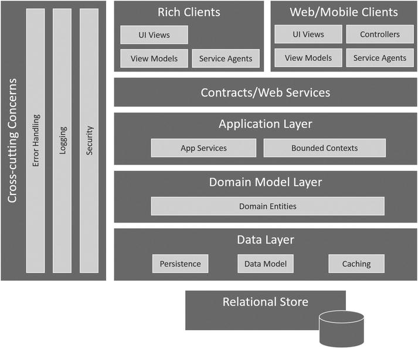

**[Figura 2-1](https://learning.oreilly.com/library/view/microservices-iot-and/9781484212752/9781484212769_Ch02.xhtml#_Fig1) .** Arquitectura en capas

El diseño impulsado por dominios nos ha servido bien y ha sobrevivido a la prueba del tiempo. El modelado de dominios sigue siendo una técnica relevante que podemos utilizar en la era de los microservicios. En lugar de mapear nuestros modelos y contextos delimitados a una arquitectura en capas, podemos encontrar las costuras y separar cada contexto delimitado junto con su modelo y usarlo como punto de partida para una arquitectura de microservicio.

Si actualmente está trabajando con una arquitectura compleja en capas y tiene un modelo de dominio razonable definido, el modelo de dominio proporcionará una hoja de ruta hacia un enfoque evolutivo para migrar a una arquitectura de microservicio.

Si no existe un modelo de dominio, puede aplicar el diseño impulsado por el dominio a la inversa para identificar los contextos delimitados, las capacidades dentro del sistema. Busque áreas del sistema donde cambia el idioma; esta es una costura de diseño. Estas costuras definen los límites de posibles candidatos para microservicios.

También puede buscar áreas del sistema que están cambiando rápidamente, que se está refactorizando mucho o que la tasa de cambio es muy lenta y los componentes del sistema son sólidos. Estas áreas pueden ser buenas candidatas para microservicios.

Finalmente, aquellas áreas del sistema que causan más dolor pueden ser buenas candidatas, así como un ejercicio terapéutico, ya que corta el apéndice afectado y lo reemplaza con un microservicio nuevo y brillante.

Pruebas

Los microservicios no alteran mucho la forma en que escribimos y probamos el código. El desarrollo impulsado por pruebas, las simulaciones, las pruebas unitarias, las pruebas funcionales y las pruebas de regresión están en juego. Estamos realizando un desarrollo orientado a objetos de componentes orientados a servicios, y todas las mejores prácticas, técnicas y herramientas que usamos en el pasado aún se aplican. Además de estos mecanismos de prueba tradicionales, debemos probar el microservicio a medida que avanza por la canalización de implementación.

- **Pruebas internas** : pruebe las funciones internas del servicio, incluido el uso del acceso a los datos, el almacenamiento en caché y otras preocupaciones transversales.
- **Prueba de servicio** : prueba la implementación del servicio de la API. Esta es una implementación interna privada de la API y sus modelos asociados.
- **Prueba de protocolo** : prueba el servicio a nivel de protocolo, llamando a la API a través del protocolo de cable especificado, generalmente HTTP (s).
- **Pruebas de composición** : pruebe el servicio en colaboración con otros servicios dentro del contexto de una solución.
- **Prueba de escalabilidad / rendimiento** : pruebe la escalabilidad y elasticidad del microservicio implementado.
- **Prueba de tolerancia a fallas / conmutación por error** : pruebe la capacidad del microservicio para recuperarse después de una falla.
- **Pruebas PEN** : trabaje con una empresa de seguridad de software de terceros para realizar pruebas de penetración. NOTA: Esto requerirá la cooperación de Microsoft si está probando microservicios implementados en Azure.

Al igual que la automatización, la prueba de un microservicio en cada fase del proceso de implementación es fundamental para entregar software de calidad a gran velocidad. La planificación cuidadosa, la disciplina y un enfoque de equipo para las pruebas harán que este aspecto de la adopción de microservicios funcione sin problemas.

Descubribilidad

La ubicación de servicios en un entorno distribuido se puede gestionar de tres formas:

- **Codifique las ubicaciones de los microservicios y resuelva todos los problemas que surgirán cuando los servicios se muevan o fallen con o sin previo aviso** : esto es similar a codificar una cadena de conexión de base de datos o una identificación de usuario y una contraseña. No es una buena idea.
- **Aproveche los mecanismos de configuración basados en archivos o en entornos de ejecución para almacenar y recuperar las ubicaciones de microservicios** : esta es una buena opción si se combina con un proceso automatizado para actualizar cuando cambian las ubicaciones.
- **Proporcionar un microservicio de ubicación dinámica para microservicios para que las aplicaciones y los servicios puedan buscar la ubicación actual en tiempo de ejecución** : este servicio de búsqueda también puede proporcionar comprobaciones de estado y avisos si los servicios fallan o funcionan mal.

Para proporcionar la capacidad de detección como servicio, es posible que sea necesario adquirir un producto de terceros, integrar una solución de código abierto o construirlo usted mismo. Examinará un microservicio de descubrimiento personalizado llamado ConfigM que proporciona ubicación dinámica y servicios de metadatos para microservicios que se ejecutan en sus entornos de implementación, incluidos prueba, ensayo y producción.

Resumen

Los microservicios hacen una cosa y lo hacen bien.

Representan capacidades comerciales definidas mediante un diseño dirigido por dominios, implementadas con las mejores prácticas orientadas a objetos, probadas en cada paso del proceso de implementación y desplegadas a través de la automatización como servicios autónomos, aislados, altamente escalables y resistentes en una infraestructura de nube distribuida. Son propiedad de un solo equipo que aborda el desarrollo de un microservicio como un producto, entregando software de alta calidad en un proceso iterativo y de alta velocidad con la participación y la satisfacción del cliente como las métricas clave del éxito.

En el próximo capítulo, compararemos arquitecturas de microservicio y en capas, y profundizaremos en la estructura interna de un microservicio.

CAPÍTULO 3


Arquitectura de microservicio

*La separación de preocupaciones, incluso si no es perfectamente posible, es todavía la única técnica disponible para ordenar eficazmente los pensamientos de uno que yo sepa.*

—Edsger W. Dijkstra

Separación de preocupaciones (SoC)es un principio de diseño para separar la implementación en capas distintas, de modo que cada capa aborde una preocupación por separado. La separación de preocupaciones se logra mediante la combinación de encapsulación de información e interfaces bien definidas para acceder a esa información. Hemos estado aplicando la separación de preocupaciones desde los primeros días de la programación. La programación funcional nació de este enfoque y hemos estado volviendo a aplicar este principio a medida que hemos evolucionado las herramientas, los lenguajes y las arquitecturas desde entonces.

La arquitectura en capas aplica SoC para identificar las uniones horizontales entre los niveles de presentación, aplicación y datos. Luego, este proceso continúa dentro de cada nivel de la arquitectura. El nivel de presentación puede usar Model-View-Controller (MVC)patrón para definir una separación de preocupaciones para la implementación de la interfaz de usuario. MVC define tres componentes cooperantes: el modelo, la vista y el controlador. El modelo define el comportamiento, las reglas y la lógica empresarial, y gestiona los datos de una aplicación. Una vista es el componente responsable de mostrar el modelo. Puede haber varias vistas en una aplicación porque los datos se pueden mostrar en varias formas, como tablas, gráficos, listas, etc. El controlador acepta la entrada del usuario y la convierte en comandos para el modelo o la vista. Este es un gran ejemplo de separación de preocupaciones.

MicroserviciosLa arquitectura utiliza SoC para encontrar las costuras en un diseño impulsado por dominios, identificando capacidades comerciales y preocupaciones transversales, cada una diseñada, implementada, probada y desplegada como servicios autónomos y aislados. Este capítulo compara la arquitectura en capas y de microservicios, y analiza cómo se usa el principio de Separación de preocupaciones para crear una arquitectura lógica para una solución de microservicios, así como la arquitectura interna de un microservicio individual.

Arquitectura en capas

Una arquitectura en capas utiliza una separación de preocupaciones para proporcionar una hoja de ruta para la implementación de aplicaciones simples y complejas. Considere la arquitectura de 3 niveles, una separación lógica entre la experiencia del usuario (capa de presentación), las capacidades comerciales (capa de aplicación) y la persistencia (capa de datos), como se muestra en la [Figura 3-1](https://learning.oreilly.com/library/view/microservices-iot-and/9781484212752/9781484212769_Ch03.xhtml#Fig1) .

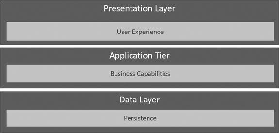

**[Figura 3-1](https://learning.oreilly.com/library/view/microservices-iot-and/9781484212752/9781484212769_Ch03.xhtml#_Fig1) .** Arquitectura de 3 niveles

Cuando aplica este modelo simple a escenarios del mundo real, las capas aumentan en complejidad y responsabilidad. Se introdujo el diseño impulsado por dominios, que presenta un amplio conjunto de mejores prácticas, técnicas y principios básicos que facilitan el diseño del sistema.

Las soluciones deben admitir un panorama de clientes en evolución de computadoras de escritorio, navegadores, teléfonos móviles y tabletas. La arquitectura orientada a servicios se introdujo para proporcionar disciplina y gobernanza a medida que se adoptaron servicios web y estándares abiertos para conectar estas diversas experiencias de usuario a la capa de aplicación (consulte la [Figura 3-2](https://learning.oreilly.com/library/view/microservices-iot-and/9781484212752/9781484212769_Ch03.xhtml#Fig2) ).

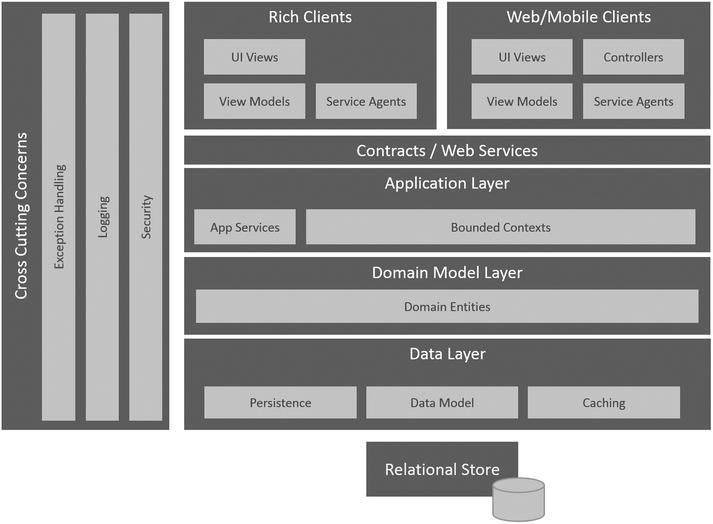

**[Figura 3-2](https://learning.oreilly.com/library/view/microservices-iot-and/9781484212752/9781484212769_Ch03.xhtml#_Fig2) .** Arquitectura en capas

La capa de aplicación, a la que se accede mediante SOAP o ReST, expone los servicios y contratos que definen las capacidades comerciales. La capa de modelo de dominio se agregó para capturar las reglas comerciales y los modelos de datos, y para encapsular el almacenamiento en caché en memoria, la persistencia y la naturaleza transaccional de las operaciones proporcionadas por la capa de datos.

Cuando se implementó e implementó, toda la funcionalidad del lado del servidor se construyó en un gran almacén relacional y, por lo general, se replicaba en una granja de servidores con equilibrio de carga para proporcionar escala y rendimiento.

Como se discutió, este enfoquetiene algunas dificultades para traducir a plataformas en la nube como Azure. Si bien es posible realizar un "levantamiento y cambio" de las cargas de trabajo locales al entorno de infraestructura como servicio de Azure, no podemos aprovechar al máximo lo que la plataforma tiene para ofrecer con respecto a la facilidad de implementación, escala elástica y adopción de otros servicios de plataforma. Para aprovechar al máximo la nube, debemos aprovechar lo que hemos aprendido y evolucionar hacia un nuevo modelo.

Un enfoque de microservicio

Una arquitectura de microservicios mantiene la separación lógica de las capas de presentación, negocios y datos. Donde se aparta la arquitectura de microservicios es desde una aplicación monolítica y una capa de datos hasta una colección de servicios distintos y aislados. Las capas de datos y negocios se dividen verticalmente a lo largo de costuras funcionales, cada una con su propio modelo de dominio y API.

La capa de servicios de datos es una colección de microservicios que proporciona varios tipos de servicios de persistencia, desde almacenamiento en caché, almacenes de documentos, bases de datos relacionales y almacenamiento en la nube en forma de blobs, tablas, colas y discos. Estos servicios se crean a pedido y proporcionan puntos finales seguros a los que se accede mediante una API invocada a través de un protocolo de red.

Las preocupaciones transversales tradicionales como el registro, la configuración, los datos de referencia y la capacidad de detección también existen dentro de esta arquitectura como microservicios. Puede aprovechar productos de terceros para estas capacidades o crearlos usted mismo (consulte la [Figura 3-3](https://learning.oreilly.com/library/view/microservices-iot-and/9781484212752/9781484212769_Ch03.xhtml#Fig3) ).

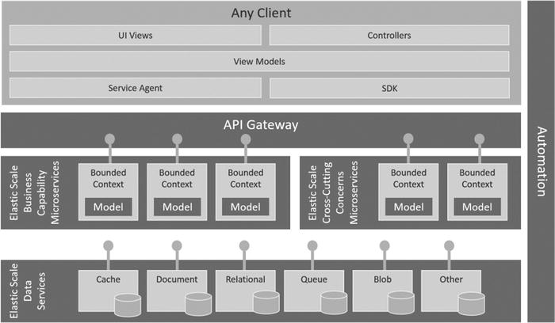

**[Figura 3-3](https://learning.oreilly.com/library/view/microservices-iot-and/9781484212752/9781484212769_Ch03.xhtml#_Fig3) .** Arquitectura de microservicios

Las capacidades comerciales de la solución se implementan y despliegan como microservicios aislados que, a su vez, aprovechan los microservicios transversales y de la capa de datos.

Computadoras de escritorio, navegadores, teléfonos móviles, tabletas, relojes de pulsera y cualquier dispositivo que conectemos a la nube, como máquinas expendedoras, robots, farolas, maquinaria industrial, etc. (lo que llamamos Internet de las cosas), pueden crear experiencias de usuario. de las API proporcionadas.

Para crear una vista coherente y segura de las API, se puede emplear un microservicio de puerta de enlace de API. Gateways proporciona registro, suscripción, inyección de políticas, documentación y análisis para sus API de microservicio.

Finalmente, todos los microservicios que se requieren para una solución se instancian, configuran y administran mediante herramientas y lenguajes de automatización. Por ejemplo, un microservicio implementado con Azure puede crear una instancia de SQL Database para las capacidades de bases de datos relacionales, una cola de bus de serviciopara almacenar y reenviar capacidades, y un contenedor de sitio web de Azure para hospedar la API ReST. La promesa de la entrega continua ahora es posible: la capacidad de proporcionar actualizaciones continuas y lanzamientos de nuevas funciones a un ritmo rápido sin afectar a toda la aplicación implementada.

Arquitectura lógica de microservicios

Los fractales son una figura curva o geométrica donde cada parte tiene muchas características como todo el objeto. Al igual que los fractales, si miramos dentro de un microservicio, veremos algo que parece muy familiar: una arquitectura en capas que proporciona una separación de preocupaciones desde el cliente hasta el almacén de datos. Los microservicios siguen las mismas mejores prácticas y enfoques para su diseño que hemos aplicado a aplicaciones monolíticas a gran escala, pero a una escala mucho menor. La diferencia es que el alcance de esta arquitectura se centra en hacer una cosa y hacer esa cosa bien (ver [Figura 3-4](https://learning.oreilly.com/library/view/microservices-iot-and/9781484212752/9781484212769_Ch03.xhtml#Fig4) ).

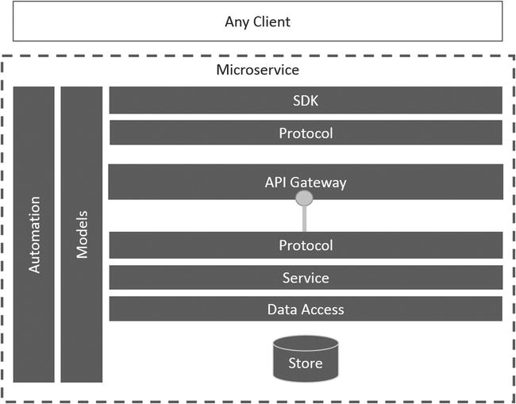

**[Figura 3-4](https://learning.oreilly.com/library/view/microservices-iot-and/9781484212752/9781484212769_Ch03.xhtml#_Fig4) .** Arquitectura lógica de microservicios

Modelos

Los modelos definen la estructura de los datos a medida que entran y salen de un microservicio. Los datos entran y salen de un microservicio a través del acceso a los datos y las capas de protocolo. En ambos casos, se realiza la serialización y deserialización. Dentro de la capa de servicio del microservicio, el modelo toma una forma en memoria, como un modelo de objetos.

Por ejemplo,

```
class UserProfile 
{ 
        string id {get; colocar; } 
        cadena primero {obtener; colocar; } 
        cadena última {obtener; colocar; } 
} 
... 
UserProfile user = new UserProfile (); 

user.id = "99999"; 
user.first = "Bob"; 
user.last = "Familiar";
```

define un modelo simple para un perfil de usuario y crea una instancia en memoria. Un ejemplo de este modelo deserializado a JSON se vería así:

```
{"id": "99999", "first": "Bob", "last": "Familiar"}
```

Capa SDK

Para facilitar la adopción de una API, puede ser conveniente crear SDK específicos del idioma. Los SDK pueden estar disponibles a través de administradores de paquetes como NuGet para que la detección y la instalación sean relativamente sencillas. NuGet es el administrador de paquetes de la plataforma de desarrollo de Microsoft. Las herramientas de cliente de NuGet le permiten crear y usar paquetes NuGet creados a partir de soluciones de biblioteca de clases. [El Capítulo 5](https://learning.oreilly.com/library/view/microservices-iot-and/9781484212752/9781484212769_Ch05.xhtml) cubrirá cómo usar NuGet para crear paquetes reutilizables para sus bibliotecas de clases y alojarlos localmente en su propio entorno de compilación.

Tenga en cuenta que existe la sobrecarga adicional de mantener los SDK para cada idioma admitido. Además, con los avances en la tecnología de puerta de enlace API, el código de muestra generado automáticamente e IntelliSense pueden llenar fácilmente el vacío de proporcionar documentación e instrucciones si opta por no proporcionar SDK.

Capa de puerta de enlace API

Las puertas de enlace API proporcionan un proxy para su API. Usted registra su API con el servicio de puerta de enlace y activa y desactiva las funciones de la puerta de enlace a través de la configuración. Estas características incluyen capas adicionales de seguridad, servicios de suscripción para que los desarrolladores proporcionen claves únicas requeridas en cada invocación de API, métricas y análisis de rendimiento, limitación, inyección de políticas como XML a JSON o transformaciones de JSON a XML, redireccionamiento y otras operaciones de filtrado. El servicio de administración de API proporciona estos servicios en Azure.

Capa de protocolo

La capa de protocolo define el protocolo de red y el mecanismo de comunicación que utilizará el microservicio, como HTTP o TCP para el protocolo de red y SOAP / WSDL o ReST para el mecanismo de comunicación.

Como se ha comentado, el protocolo y el estilo de comunicación predominantes en la actualidad es ReST sobre HTTP con JSON como formato de mensaje preferido. JSON ha reemplazado a XML debido a su formato más compacto y notación orientada a objetos.

Las API de ReST se definen como una colección de URL y los VERBOS HTTP correspondientes junto con los parámetros y mensajes de entrada y salida. Cada URL consta del protocolo de red (HTTP), una URL base (myapi.looksfamilar.com) y la ruta al recurso junto con los parámetros.

Hay dos formas de especificar parámetros en una URL. La primera forma utiliza el formato de ruta de recursos para devolver el perfil de usuario con la identificación de usuario 99999 en formato JSON.

***GetProfilesById***

```
OBTENGA  http://myapi.looksfamiliar.com/profiles/user/id/99999
```

La segunda técnica utiliza el formato de URL de los parámetros de consulta para devolver todos los perfiles de usuario cuya ubicación se establece en Massachusetts como una lista formateada como una matriz JSON.

***GetProfilesByLocation***

```
OBTENGA  http://myapi.looksfamiliar.com/profiles?location=Massachusetts
```

Las operaciones POST y PUT normalmente requerirán un mensaje JSON como entrada. El formato de JSON se basa en el modelo de ese microservicio. Por ejemplo, si definió una API para la creación de un perfil de usuario, la URL se definiría como

```
PUBLICAR  http://myapi.looksfamiliar.com/profiles/user
```

y el mensaje se pasaría como contenido con el formato de

```
{"id": "99999", "first": "Bob", "last": "Familiar"}
```

La capa de protocolo realiza el enrutamiento de estas solicitudes HTTP entrantes a la función apropiada proporcionada por la capa de servicio.

Capa de servicio

La capa de servicio es donde ocurre el trabajo real. Esta parte de la arquitectura define las reglas comerciales, los flujos de trabajo, los cálculos y cualquier otra operación necesaria para proporcionar la implementación del microservicio. Esta capa aprovecha la capa de acceso a datos para la persistencia, el almacenamiento en caché y otras operaciones orientadas a datos.

Tomando el ejemplo simple presentado anteriormente, una implementación de la capa de protocolo para GetProfileById usando ASP.NET Web API se vería así:

```
[Ruta ("perfil / usuarios / id / {id}")] 
[HttpGet] 
Public UserProfile GetById (string id) 
{ 
  UserProfileService profileService = new UserProfileService (); 
  return profileService.GetById (id); 
}
```

El atributo de ruta define la ruta de recursos y los parámetros esperados y el atributo HttpGet define el verbo HTTP admitido. El método definido en la capa de protocolo usa una clase que implementa el servicio llamado UserProfileService . La capa de protocolo en este ejemplo es muy delgada para ofrecer un camino fácil para adoptar nuevos protocolos en el futuro.

La implementación del servicio sin manejo de errores se vería así:

```
Public UserProfile GetById (string id) 
{ 
    UserProfile user = null; 
    DataAccess dac = new DataAccess (); 
    dac.Connect (_connectionString); 
    return dac.SelectById <UserProfile> (id); 
}
```

Se crea una instancia de una instancia de la clase DataAccess y se inicializa con una cadena de conexión. Esta clase contiene un método SelectById () que toma el ID de usuario y devuelve el modelo UserProfile para ese usuario.

Capa de acceso a datos

La capa de acceso a datos encapsula el uso de microservicios de la capa de datos, como almacenamiento en caché, relacionales, de documentos y de blobs, así como colas de mensajes y otros servicios de almacenamiento y reenvío.

Un patrón común proporcionado por una capa de acceso a datos es ocultar los detalles de la relación entre los servicios de almacenamiento en caché y el almacén de persistencia (consulte la [Figura 3-5](https://learning.oreilly.com/library/view/microservices-iot-and/9781484212752/9781484212769_Ch03.xhtml#Fig5) ).

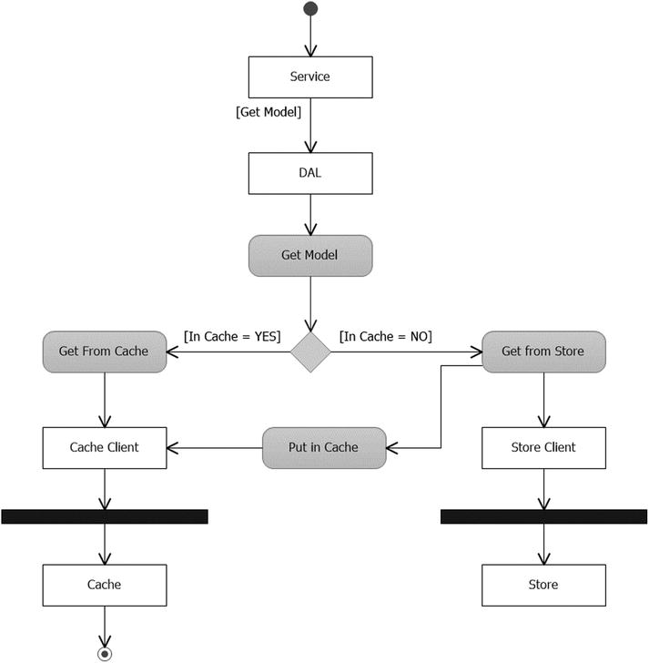

**[Figura 3-5](https://learning.oreilly.com/library/view/microservices-iot-and/9781484212752/9781484212769_Ch03.xhtml#_Fig5) .** Diagrama de actividad de obtención de capa de acceso a datos

El servicio solicita un modelo de la capa de acceso a datos (DAL). El DAL primero verifica el caché y, si lo encuentra, devuelve el modelo. La llamada a la caché se realiza a través de un cliente de caché que administra la invocación del protocolo de la API de caché. Si el modelo no se encuentra en la caché, el modelo se recupera de la tienda. La llamada a la tienda también se realiza a través de un cliente de la tienda que gestiona la invocación del protocolo de la API de la tienda. El modelo se coloca en la caché y se devuelve al servicio.

De manera similar, cuando el servicio quiere guardar un modelo, pasa el modelo al DAL, que lo guarda en la tienda usando el cliente de la tienda, y luego coloca o actualiza el modelo en la caché usando el cliente de caché (consulte la [Figura 3-6](https://learning.oreilly.com/library/view/microservices-iot-and/9781484212752/9781484212769_Ch03.xhtml#Fig6) ).

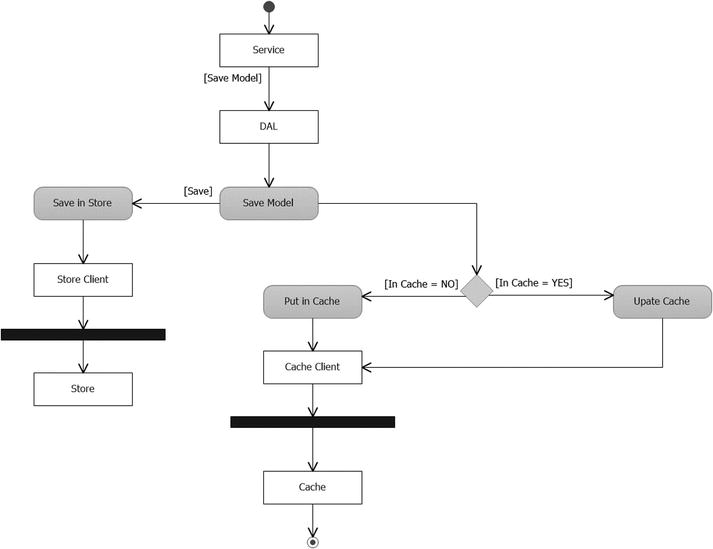

**[Figura 3-6](https://learning.oreilly.com/library/view/microservices-iot-and/9781484212752/9781484212769_Ch03.xhtml#_Fig6) .** Diagrama de actividad de guardado de la capa de acceso a datos

Tienda

Hay muchas opciones de almacenamiento al aprovechar una plataforma en la nube como Microsoft Azure. Cada uno se ofrece como un microservicio que se puede instanciar, configurar, escalar, asegurar y automatizar para satisfacer sus necesidades. Más adelante en este libro, analizará de cerca SQL Database, DocumentDb, Redis Cache, Service Bus Queues y Event Hubs, Stream Analytics y Azure Blobs and Tables.

Automatización

El componente de automatización de la arquitectura de microservicios es el reconocimiento de que el enfoque descrito en este libro no es posible sin la capacidad de automatizar el ciclo de vida de desarrollo de una solución basada en microservicios. Hay un nivel de complejidad que se introduce con este enfoque porque la solución completa involucra muchas partes y componentes móviles. Tratar de gestionar manualmente el cambio en este mundo es imposible. Se deben considerar herramientas como PowerShell, Chef y Puppet junto con la adición de experiencia en operaciones al equipo.

Una cultura DevOps es aquella en la que los equipos están formados por conjuntos de habilidades multifuncionales; contienen todas las habilidades necesarias para diseñar, implementar, probar, implementar y mantener el software. Esto significa que los desarrolladores y los ingenieros de operaciones trabajan juntos, uno al lado del otro, durante todo el ciclo de vida del producto. El buen funcionamiento de la práctica del desarrollo de software se convierte en responsabilidad de todos. Al igual que los trabajadores de una línea de montaje en un taller de fabricación ajustada, una interrupción en el flujo de una estación a otra detiene toda la línea. Es el trabajo de todos determinar cuál es el problema y cómo solucionarlo antes de que la línea comience nuevamente.

Los roles, responsabilidades, herramientas y lenguajes utilizados para implementar la automatización son opciones que quedan en manos del equipo. Ninguna herramienta o lenguaje por sí solo puede resolver este problema. Cada paso del proceso puede implementarse utilizando una herramienta o lenguaje de programación diferente, seleccionado y mantenido por el equipo en su conjunto. La automatización nunca es 100%. El objetivo debe ser automatizar el proceso tanto como sea posible para garantizar la coherencia, la calidad, la estabilidad y la recopilación de datos para medir el progreso y el éxito.

Resumen

La progresión de monolíticos en capas a microservicios no es un salto tan grande. Es simplemente la evolución del concepto de Separación de preocupaciones, un principio de diseño para separar la implementación en distintas capas, de modo que cada capa aborde una preocupación separada. El SoC se logra mediante la combinación de encapsulación e interfaces bien definidas.

La arquitectura de microservicios utiliza SoC para encontrar las costuras en un diseño impulsado por dominios con el fin de identificar las capacidades comerciales y las preocupaciones transversales. Luego, cada capacidad y preocupación se diseña, implementa, prueba y despliega como un servicio autónomo y aislado.

Ahora que tiene la definición de lo que desea construir, el próximo capítulo analizará en profundidad la plataforma, Microsoft Azure y sus capacidades, proporcionando la base para sus propios microservicios.

# Arquitectura de microservicio y sus 10 patrones de diseño más importantes

## Arquitectura de microservicio, base de datos por microservicio, abastecimiento de eventos, CQRS, Saga, BFF, puerta de enlace API, estrangulador, disyuntor, configuración de externalización, pruebas de contrato impulsadas por el consumidor


Imagen de [msandersmusic](https://pixabay.com/users/msandersmusic-1972097/?utm_source=link-attribution&utm_medium=referral&utm_campaign=image&utm_content=1181864) en [Pixabay](https://pixabay.com/?utm_source=link-attribution&utm_medium=referral&utm_campaign=image&utm_content=1181864)

Abordar la complejidad en los grandes sistemas de software siempre fue una tarea abrumadora desde los primeros días del desarrollo de software (década de 1960). A lo largo de los años, los ingenieros y arquitectos de software hicieron muchos intentos para abordar las complejidades de los sistemas de software: [**modularidad y ocultación de información**](https://www.win.tue.nl/~wstomv/edu/2ip30/references/criteria_for_modularization.pdf) por [***David Parnas\***](https://en.wikipedia.org/wiki/David_Parnas) (1972), [**Separación de preocupaciones**](https://www.cs.utexas.edu/users/EWD/transcriptions/EWD04xx/EWD447.html) por [***Edsger W. Dijkstra\***](https://en.wikipedia.org/wiki/Edsger_W._Dijkstra) (1974) ***,\*** [**Arquitectura orientada a servicios**](https://en.wikipedia.org/wiki/Service-oriented_architecture) (1998).

Todos ellos utilizan la edad de edad y probada tecnología n ique para hacer frente a la complejidad de un sistema grande: **divide y vencerás** . Desde la década de 2010, esas técnicas resultaron insuficientes para abordar las complejidades de las aplicaciones Web-Scale o las aplicaciones empresariales modernas a gran escala. Como resultado, los arquitectos e ingenieros desarrollaron un nuevo enfoque para abordar la complejidad de los sistemas de software en los tiempos modernos: la **arquitectura de microservicios** . También utiliza la misma vieja técnica de "Divide y vencerás", aunque de una manera novedosa.

[**Los patrones de diseño de software**](https://en.wikipedia.org/wiki/Software_design_pattern) son soluciones generales y reutilizables para los problemas que ocurren comúnmente en el diseño de software. Los patrones de diseño nos ayudan a compartir un vocabulario común y a utilizar una solución probada en batalla en lugar de reinventar la rueda. En un artículo anterior:[ **Microservicios efectivos: 10 mejores prácticas**](https://towardsdatascience.com/effective-microservices-10-best-practices-c6e4ba0c6ee2) , describí un conjunto de mejores prácticas para desarrollar microservicios efectivos. Aquí, describiré un conjunto de patrones de diseño para ayudarlo a implementar esas mejores prácticas. Si es nuevo en la Arquitectura de Microservicios, no se preocupe, le presentaré la Arquitectura de Microservicios.

Al leer este artículo, aprenderá:

- Arquitectura de microservicio
- Ventajas de la arquitectura de microservicios
- Desventajas de la arquitectura de microservicios
- Cuándo usar la arquitectura de microservicios
- Los patrones de diseño de arquitectura de microservicio más importantes, incluidas sus ventajas, desventajas, casos de uso, contexto, ejemplo de pila tecnológica y recursos útiles.

Tenga en cuenta que la mayoría de los patrones de diseño de esta lista tienen varios contextos y se pueden utilizar en arquitectura que no sea de microservicio. Pero los describiré en el contexto de la arquitectura de microservicios.

# Arquitectura de microservicio

He cubierto la arquitectura de microservicio en detalle en mis publicaciones de blog anteriores: [**Arquitectura de microservicio: una breve descripción general y por qué debería usarla en su próximo proyecto**](https://towardsdatascience.com/microservice-architecture-a-brief-overview-and-why-you-should-use-it-in-your-next-project-a17b6e19adfd) y [**¿Está realmente muerta la arquitectura de software monolítica modular?** ](https://towardsdatascience.com/looking-beyond-the-hype-is-modular-monolithic-software-architecture-really-dead-e386191610f8)**.** Si está interesado, puede leerlos para tener una mirada más profunda.

¿Qué es una arquitectura de microservicio? Hay muchas definiciones de Arquitectura de microservicio. [Aquí está mi definición](https://towardsdatascience.com/looking-beyond-the-hype-is-modular-monolithic-software-architecture-really-dead-e386191610f8) :

> ***La arquitectura de microservicio consiste en dividir un sistema grande y complejo verticalmente (según los requisitos funcionales o comerciales) en subsistemas más pequeños que son procesos (por lo tanto, implementables de forma independiente) y estos subsistemas se comunican entre sí a través de llamadas de red livianas, independientes del lenguaje, ya sea sincrónicas. (por ejemplo, REST, gRPC) o asincrónica (a través de mensajería).\***

Aquí está la vista de componentes de una aplicación web empresarial con arquitectura de microservicio:


[Arquitectura de microservicio](https://towardsdatascience.com/looking-beyond-the-hype-is-modular-monolithic-software-architecture-really-dead-e386191610f8) por [Md Kamaruzzaman](https://medium.com/@md.kamaruzzaman)

**Características importantes de la arquitectura de microservicios:**

- Toda la aplicación se divide en procesos separados donde cada proceso puede contener múltiples módulos internos.
- A diferencia de los monolitos modulares o SOA, una aplicación de microservicio se divide verticalmente (según la capacidad comercial o los dominios)
- El límite del microservicio es externo. Como resultado, los microservicios se comunican entre sí a través de llamadas de red (RPC o mensaje).
- Como los microservicios son procesos independientes, se pueden implementar de forma independiente.
- Se comunican de forma ligera y no necesitan ningún canal de comunicación inteligente.

**Ventajas de la arquitectura de microservicios:**

- Mejor escalamiento del desarrollo.
- Mayor velocidad de desarrollo.
- Apoya la modernización iterativa o incremental.
- Aproveche el moderno ecosistema de desarrollo de software (nube, contenedores, DevOps, sin servidor).
- Admite escalado horizontal y granular.
- Pone poca complejidad cognitiva en la cabeza del desarrollador gracias a su tamaño más pequeño.

**Desventajas de la arquitectura de microservicios:**

- Mayor número de partes móviles (servicios, bases de datos, procesos, contenedores, marcos).
- La complejidad pasa del Código a la Infraestructura.
- La proliferación de llamadas RPC y tráfico de red.
- Administrar la seguridad de todo el sistema es un desafío.
- Diseñar todo el sistema es más difícil.
- Introduzca las complejidades de los sistemas distribuidos.

**Cuándo utilizar la arquitectura de microservicio:**

- Desarrollo de aplicaciones a escala web.
- Desarrollo de aplicaciones empresariales cuando varios equipos trabajan en la aplicación.
- Se prefiere la ganancia a largo plazo a la ganancia a corto plazo.
- El equipo cuenta con Arquitectos de Software o Ingenieros Senior capaces de diseñar Arquitectura de Microservicios.

# Patrones de diseño para la arquitectura de microservicios

## Base de datos por microservicio

Una vez que una empresa reemplaza el gran sistema monolítico con muchos microservicios más pequeños, la decisión más importante a la que se enfrenta es la relativa a la base de datos. En una arquitectura monolítica, se utiliza una gran base de datos central. Muchos arquitectos prefieren mantener la base de datos tal como está, incluso cuando pasan a la arquitectura de microservicio. Si bien brinda algún beneficio a corto plazo, es un anti-patrón, especialmente en un sistema a gran escala, ya que los microservicios estarán estrechamente acoplados en la capa de la base de datos. Todo el objeto de pasar al microservicio fallará (por ejemplo, empoderamiento del equipo, desarrollo independiente).

Un mejor enfoque es proporcionar a cada microservicio su propio almacén de datos, de modo que no haya un acoplamiento fuerte entre los servicios en la capa de la base de datos. Aquí estoy usando el término base de datos para mostrar una separación lógica de datos, es decir, los microservicios pueden compartir la misma base de datos física, pero deben usar esquema / colección / tabla separados. También asegurará que los microservicios estén correctamente segregados de acuerdo con el [diseño](https://en.wikipedia.org/wiki/Domain-driven_design) controlado por [dominio](https://en.wikipedia.org/wiki/Domain-driven_design) .


Base de datos por microservicio de [Md Kamaruzzaman](https://medium.com/@md.kamaruzzaman)

**Pros**

- Propiedad completa de los datos de un servicio.
- Acoplamiento flojo entre equipos que desarrollan los servicios.

**Contras**

- Compartir datos entre servicios se convierte en un desafío.
- Dar garantía transaccional ACID en toda la aplicación se vuelve mucho más difícil.
- La descomposición de la base de datos Monolith en piezas más pequeñas requiere un diseño cuidadoso y es una tarea desafiante.

**Cuándo usar la base de datos por microservicio**

- En aplicaciones empresariales a gran escala.
- Cuando el equipo necesita la propiedad completa de sus microservicios para escalar y acelerar el desarrollo.

**Cuándo no usar la base de datos por microservicio**

- En aplicaciones a pequeña escala.
- Si un equipo desarrolla todos los microservicios.

**Ejemplos de tecnología habilitadora**

Todas las bases de datos SQL, NoSQL ofrecen separación lógica de datos (por ejemplo, tablas separadas, colecciones, esquemas, bases de datos).

**Otras lecturas**

[Patrón de microservicios: base de datos por servicioImaginemos que está desarrollando una aplicación de tienda en línea utilizando el patrón de arquitectura de microservicio. La mayoría de los servicios ...microservices.io](https://microservices.io/patterns/data/database-per-service.html)

[Datos distribuidosComo hemos visto a lo largo de este libro, un enfoque nativo de la nube cambia la forma en que diseña, implementa y administra ...docs.microsoft.com](https://docs.microsoft.com/en-us/dotnet/architecture/cloud-native/distributed-data)

## Abastecimiento de eventos

En una arquitectura de microservicio, especialmente con **base de datos por microservicio,** los microservicios necesitan intercambiar datos. Para sistemas resistentes, altamente escalables y tolerantes a fallas, deben comunicarse de forma asincrónica mediante el intercambio de eventos. En tal caso, es posible que desee tener operaciones atómicas, por ejemplo, actualizar la base de datos y enviar el mensaje. Si tiene bases de datos SQL y desea tener transacciones distribuidas para un gran volumen de datos, no puede usar el [bloqueo de dos fases](https://en.wikipedia.org/wiki/Two-phase_locking) (2PL) ya que no se escala. Si usa bases de datos NoSQL y desea tener una transacción distribuida, no puede usar 2PL ya que muchas bases de datos NoSQL no admiten el bloqueo de dos fases.

En tales escenarios, utilice la Arquitectura basada en eventos con Event Sourcing. En las bases de datos tradicionales, la Entidad Comercial con el "estado" actual se almacena directamente. En Event Sourcing, cualquier evento de cambio de estado u otros eventos importantes se almacenan en lugar de las entidades. Significa que las modificaciones de una entidad comercial se guardan como una serie de eventos inmutables. El estado de una entidad comercial se deduce reprocesando todos los eventos de esa entidad comercial en un momento dado. Debido a que los datos se almacenan como una serie de eventos en lugar de a través de actualizaciones directas a los almacenes de datos, varios servicios pueden reproducir eventos del almacén de eventos para calcular el estado apropiado de sus respectivos almacenes de datos.


Suministro de eventos por [Md Kamaruzzaman](https://medium.com/@md.kamaruzzaman)

**Pros**

- Proporcionar atomicidad a sistemas altamente escalables.
- Historial automático de las entidades, incluida la funcionalidad de viaje en el tiempo.
- Microservicios débilmente acoplados y controlados por eventos.

**Contras**

- La lectura de entidades del almacén de eventos se vuelve un desafío y, por lo general, se necesita un almacén de datos adicional ( patrón **CQRS** )
- La complejidad general del sistema aumenta y, por lo general, necesita [un diseño](https://en.wikipedia.org/wiki/Domain-driven_design) basado en [dominios](https://en.wikipedia.org/wiki/Domain-driven_design) .
- El sistema necesita manejar eventos duplicados (idempotentes) o eventos faltantes.
- La migración del esquema de eventos se convierte en un desafío.

**Cuándo utilizar el abastecimiento de eventos**

- Sistemas transaccionales altamente escalables con bases de datos SQL.
- Sistemas transaccionales con bases de datos NoSQL.
- Arquitectura de microservicio altamente escalable y resistente.
- Sistemas típicos basados en mensajes o basados en eventos (comercio electrónico, reservas y sistemas de reservas).

**Cuando no utilizar Event Sourcing**

- Sistemas transaccionales de escasa escalabilidad con bases de datos SQL.
- En una arquitectura de microservicio simple donde los microservicios pueden intercambiar datos de forma síncrona (por ejemplo, a través de API).

**Ejemplos de tecnología habilitadora**

*Tienda de eventos:* [EventStoreDB](https://www.eventstore.com/) , [Apache Kafka](https://kafka.apache.org/) , [Confluent Cloud](https://www.confluent.io/confluent-cloud) , [AWS Kinesis](https://aws.amazon.com/kinesis/) , [Azure Event Hub](https://azure.microsoft.com/en-us/services/event-hubs/) , [GCP Pub / Sub](https://cloud.google.com/pubsub) , [Azure Cosmos DB](https://docs.microsoft.com/en-us/azure/cosmos-db/introduction) , [MongoDB](https://www.mongodb.com/) , [Cassandra](https://cassandra.apache.org/) . [Amazon DynamoDB](https://aws.amazon.com/dynamodb/?trk=ps_a134p000004f2XeAAI&trkCampaign=acq_paid_search_brand&sc_channel=PS&sc_campaign=acquisition_EMEA&sc_publisher=Google&sc_category=Database&sc_country=EMEA&sc_geo=EMEA&sc_outcome=acq&sc_detail=amazon dynamodb&sc_content=DynamoDB_e&sc_matchtype=e&sc_segment=468764879940&sc_medium=ACQ-P|PS-GO|Brand|Desktop|SU|Database|DynamoDB|EMEA|EN|Text|xx|EU&s_kwcid=AL!4422!3!468764879940!e!!g!!amazon dynamodb&ef_id=CjwKCAiAq8f-BRBtEiwAGr3DgRRqVmhD5PL323QFmdBJvvOwzxU1nvrGFdbM8ra-DQViD8jjGn-PGBoCWJYQAvD_BwE:G:s&s_kwcid=AL!4422!3!468764879940!e!!g!!amazon dynamodb) ,

*Marcos:* [Lagom](https://www.lagomframework.com/) , [Akka](https://akka.io/) , [Spring](https://spring.io/) , [akkatecture](https://akkatecture.net/) , [Axon](https://axoniq.io/) , [Eventuate](https://eventuate.io/)

**Otras lecturas**

[Abastecimiento de eventosLa idea fundamental de Event Sourcing es garantizar que todos los cambios en el estado de una aplicación se capturen en ...martinfowler.com](https://martinfowler.com/eaaDev/EventSourcing.html)

[Patrón de abastecimiento de eventos: patrones de diseño en la nubeEn lugar de almacenar solo el estado actual de los datos en un dominio, use un almacén de solo adición para registrar la serie completa ...docs.microsoft.com](https://docs.microsoft.com/en-us/azure/architecture/patterns/event-sourcing)

[Patrón de microservicios: abastecimiento de eventosUn comando de servicio normalmente necesita actualizar la base de datos y enviar mensajes / eventos. Por ejemplo, un servicio que ...microservices.io](https://microservices.io/patterns/data/event-sourcing.html)

## Segregación de responsabilidad de consultas de comando (CQRS)

Si usamos Event Sourcing, la lectura de datos de Event Store se vuelve un desafío. Para obtener una entidad del almacén de datos, necesitamos procesar todos los eventos de la entidad. Además, a veces tenemos diferentes requisitos de consistencia y rendimiento para las operaciones de lectura y escritura.

En tales casos de uso, podemos utilizar el patrón CQRS. En el patrón CQRS, la parte de modificación de datos del sistema (comando) está separada de la parte de lectura de datos (consulta). El patrón CQRS tiene dos formas: simple y avanzado, lo que genera cierta confusión entre los ingenieros de software.

En su forma simple, se utilizan modelos de entidad distinta u ORM para lectura y escritura, como se muestra a continuación:


CQRS (simple) por [Md Kamaruzzaman](https://medium.com/@md.kamaruzzaman)

Ayuda a hacer cumplir el principio de responsabilidad única y la separación de preocupaciones, que conducen a un diseño más limpio.

En su forma avanzada, se utilizan diferentes almacenes de datos para operaciones de lectura y escritura. El CQRS avanzado se utiliza con Event Sourcing. Dependiendo del caso de uso, se utilizan diferentes tipos de almacenamiento de datos de escritura y almacenamiento de datos de lectura. El Write Data Store es el "Sistema de registros", es decir, la fuente de oro de todo el sistema.


CQRS (avanzado) por [Md Kamaruzzaman](https://medium.com/@md.kamaruzzaman)

Para las aplicaciones de lectura pesada o la arquitectura de microservicios, la base de datos OLTP (cualquier base de datos SQL o NoSQL que ofrezca garantía de transacción ACID) o la plataforma de mensajería distribuida se utiliza como almacén de escritura. Para las aplicaciones de escritura pesada (alta escalabilidad de escritura y rendimiento), se utiliza una base de datos escalable de escritura horizontal (bases de datos globales de nube pública). Los datos normalizados se guardan en Write Data Store.

La base de datos NoSQL optimizada para búsquedas (por ejemplo, Apache Solr, Elasticsearch) o lectura (almacén de datos de valor clave, almacén de datos de documentos) se utiliza como almacén de lectura. En muchos casos, las bases de datos SQL escalables para lectura se utilizan cuando se desea una consulta SQL. Los datos desnormalizados y optimizados se guardan en Read Store.

Los datos se copian del almacén de escritura al almacén de lectura de forma asincrónica. Como resultado, el almacén de lectura se retrasa que el almacén de escritura y es **eventualmente coherente** .

## **Pros**

- Lectura más rápida de datos en microservicios controlados por eventos.
- Alta disponibilidad de los datos.
- Los sistemas de lectura y escritura pueden escalar de forma independiente.

**Contras**

- El almacén de datos de lectura es poco consistente (consistencia eventual)
- La complejidad general del sistema aumenta. El CQRS de corte de carga puede poner en peligro significativamente el proyecto completo.

**Cuando usar CQRS**

- En una arquitectura de microservicio altamente escalable donde se utiliza el abastecimiento de eventos.
- En un modelo de dominio complejo donde la lectura de datos necesita consulta en múltiples Almacenes de datos.
- En sistemas donde las operaciones de lectura y escritura tienen una carga diferente.

**Cuando no usar CQRS**

- En la arquitectura de microservicio, donde el volumen de eventos es insignificante, tomar la instantánea del almacén de eventos para calcular el estado de la entidad es una mejor opción.
- En sistemas donde las operaciones de lectura y escritura tienen una carga similar.

**Ejemplos de tecnología habilitadora**

*Tienda de escritura:* [EventStoreDB](https://www.eventstore.com/) , [Apache Kafka](https://kafka.apache.org/) , [Confluent Cloud](https://www.confluent.io/confluent-cloud) , [AWS Kinesis](https://aws.amazon.com/kinesis/) , [Azure Event Hub](https://azure.microsoft.com/en-us/services/event-hubs/) , [GCP Pub / Sub](https://cloud.google.com/pubsub) , [Azure Cosmos DB](https://docs.microsoft.com/en-us/azure/cosmos-db/introduction) , [MongoDB](https://www.mongodb.com/) , [Cassandra](https://cassandra.apache.org/) . [Amazon DynamoDB](https://aws.amazon.com/dynamodb/)

*Leer tienda:* [Elastic Search](https://www.elastic.co/) , [Solr](https://lucene.apache.org/solr/features.html) , [Cloud Spanner](https://cloud.google.com/spanner) , [Amazon Aurora](https://aws.amazon.com/rds/aurora/) , [Azure Cosmos DB](https://docs.microsoft.com/en-us/azure/cosmos-db/introduction) , [Neo4j](https://neo4j.com/)

*Marcos:* [Lagom](https://www.lagomframework.com/) , [Akka](https://akka.io/) , [Spring](https://spring.io/) , [akkatecture](https://akkatecture.net/) , [Axon](https://axoniq.io/) , [Eventuate](https://eventuate.io/)

**Otras lecturas**

[bliki: CQRSCQRS son las siglas de Command Query Responsibility Segregation. Es un patrón que escuché por primera vez descrito por Greg Young. A…martinfowler.com](https://martinfowler.com/bliki/CQRS.html)

[Patrón CQRS: Centro de arquitectura de AzureEl patrón de segregación de responsabilidad de consultas y comandos (CQRS) separa las operaciones de lectura y actualización para un almacén de datos ...docs.microsoft.com](https://docs.microsoft.com/en-us/azure/architecture/patterns/cqrs)

[Patrón de microservicios: Segregación de responsabilidad de consultas de comandos (CQRS)Ha aplicado el patrón de arquitectura de microservicios y el patrón de base de datos por servicio. Como resultado, no es ...microservices.io](https://microservices.io/patterns/data/cqrs.html)

## Saga

Si utiliza la arquitectura de microservicio con **base de datos por microservicio** , la gestión de la coherencia a través de transacciones distribuidas es un desafío. No puede utilizar el [protocolo de confirmación de dos fases](https://en.wikipedia.org/wiki/Two-phase_commit_protocol) tradicional , ya que no se escala (bases de datos SQL) o no es compatible (muchas bases de datos NoSQL).

Puede utilizar el patrón Saga para transacciones distribuidas en Arquitectura de microservicio. Saga es un patrón antiguo desarrollado en 1987 como una alternativa conceptual para transacciones de bases de datos de larga duración en bases de datos SQL. Pero una variación moderna de este patrón también funciona asombrosamente para la transacción distribuida. El patrón de saga es una secuencia de transacción local en la que cada transacción actualiza los datos en el almacén de datos dentro de un único microservicio y publica un evento o mensaje. La primera transacción de una saga se inicia mediante una solicitud externa (Evento o Acción). Una vez que se completa la transacción local (los datos se almacenan en Data Store y se publica el mensaje o evento), el mensaje / evento publicado desencadena la siguiente transacción local en la Saga.


Saga de [Md Kamaruzzaman](https://medium.com/@md.kamaruzzaman)

Si la transacción local falla, Saga ejecuta una serie de transacciones compensatorias que deshacen los cambios de las transacciones locales anteriores.

Existen principalmente dos variaciones de las coordinaciones de transacciones de Saga:

- *Coreografía* : Coordinaciones descentralizadas donde cada microservicio produce y escucha los eventos / mensajes de otros microservicios y decide si se debe tomar una acción o no.
- *Orquestación* : Coordinaciones centralizadas donde un orquestador le dice a los microservicios participantes qué transacción local debe ejecutarse.

## Pros

- Proporcione consistencia a través de transacciones en una arquitectura de microservicio impulsada por eventos, altamente escalable o débilmente acoplada.
- Proporcione consistencia a través de transacciones en la arquitectura de microservicio donde se utilizan bases de datos NoSQL sin soporte 2PC.

**Contras**

- Necesita manejar fallas transitorias y debe proporcionar idempotencia.
- Difícil de depurar y la complejidad crece a medida que aumenta la cantidad de microservicios.

**Cuando usar Saga**

- En arquitectura de microservicio altamente escalable y débilmente acoplada donde se utiliza el abastecimiento de eventos.
- En sistemas donde se utilizan bases de datos NoSQL distribuidas.

**Cuando no usar Saga**

- Sistemas transaccionales de escasa escalabilidad con bases de datos SQL.
- En sistemas donde existe dependencia cíclica entre servicios.

**Ejemplos de tecnología habilitadora**

[Axon](https://axoniq.io/) , [Eventuate](https://eventuate.io/) , [Narayana](https://narayana.io/)

**Otras lecturas**

[Transacciones distribuidas de Saga: patrones de diseño de AzureEl patrón de diseño de la saga es una forma de administrar la coherencia de los datos entre microservicios en escenarios de transacciones distribuidas ...docs.microsoft.com](https://docs.microsoft.com/en-us/azure/architecture/reference-architectures/saga/saga)

[Patrón de microservicios: SagasHa aplicado el patrón Base de datos por servicio. Cada servicio tiene su propia base de datos. Algunas transacciones comerciales ...microservices.io](https://microservices.io/patterns/data/saga.html)

[Patrón de Saga: transacciones de aplicaciones mediante microserviciosLas transacciones son una parte esencial de las aplicaciones. Sin ellos, sería imposible mantener la coherencia de los datos ...blog.couchbase.com](https://blog.couchbase.com/saga-pattern-implement-business-transactions-using-microservices-part/)

## Backends para Frontends (BFF)

En los desarrollos de aplicaciones comerciales modernas y especialmente en la Arquitectura de Microservicio, las aplicaciones Frontend y Backend son Servicios desacoplados y separados. Están conectados a través de API o GraphQL. Si la aplicación también tiene un cliente de aplicación móvil, entonces usar el mismo microservicio de backend tanto para la Web como para el cliente móvil se vuelve problemático. Los requisitos de la API del cliente móvil suelen ser diferentes de los del cliente web, ya que tienen diferentes tamaños de pantalla, visualización, rendimiento, fuente de energía y ancho de banda de red.

El patrón Backends for Frontends podría usarse en escenarios donde cada UI obtiene un backend separado personalizado para la UI específica. También proporciona otras ventajas, como actuar como una fachada para los microservicios descendentes, reduciendo así la comunicación habladora entre la interfaz de usuario y los microservicios descendentes. Además, en un escenario de alta seguridad donde los microservicios descendentes se implementan en una red DMZ, los BFF se utilizan para brindar mayor seguridad.


Backends para Frontends por [Md Kamaruzzaman](https://medium.com/@md.kamaruzzaman)

## Pros

- Separación de preocupaciones entre los mejores amigos. Podemos optimizarlos para una interfaz de usuario específica.
- Brinda mayor seguridad.
- Proporcione una comunicación menos habladora entre la interfaz de usuario y los microservicios posteriores.

**Contras**

- Duplicación de código entre BFF's.
- La proliferación de BFF en caso de que se utilicen muchas otras UI (por ejemplo, Smart TV, Web, Mobile, Desktop).
- Necesita un diseño e implementación cuidadosos, ya que los BFF no deben contener ninguna lógica comercial y solo deben contener lógica y comportamiento específicos del cliente.

**Cuándo usar backends para frontends**

- Si la aplicación tiene varias IU con diferentes requisitos de API.
- Si se necesita una capa adicional entre la interfaz de usuario y los microservicios posteriores por razones de seguridad.
- Si se utilizan micro-frontends en el desarrollo de UI.

**Cuándo no usar backends para frontends**

- Si la aplicación tiene varias IU, pero consumen la misma API.
- Si los microservicios centrales no se implementan en DMZ.

**Ejemplos de tecnología habilitadora**

Cualquier marco de backend (Node.js, Spring, Django, Laravel, Flask, Play,… ..) lo admite.

**Otras lecturas**

[Sam Newman - Backends para frontendsCon la llegada y el éxito de la web, la forma de facto de ofrecer interfaces de usuario ha pasado de ser cliente pesado ...samnewman.io](https://samnewman.io/patterns/architectural/bff/)

[Patrón de backends para frontends: patrones de diseño en la nubeCree servicios de backend independientes para que los consuman aplicaciones o interfaces de frontend específicas. Este patrón es útil ...docs.microsoft.com](https://docs.microsoft.com/en-us/azure/architecture/patterns/backends-for-frontends)

[Patrón de microservicios: patrón de puerta de enlace APIImaginemos que está construyendo una tienda en línea que utiliza el patrón de arquitectura de microservicio y que está ...microservices.io](https://microservices.io/patterns/apigateway.html)

## Puerta de enlace API

En la arquitectura de microservicios, la interfaz de usuario generalmente se conecta con varios microservicios. Si los microservicios son finos (FaaS), es posible que el cliente deba conectarse con muchos microservicios, lo que se vuelve conversador y desafiante. Además, los servicios, incluidas sus API, pueden evolucionar. Las grandes empresas querrán tener otras preocupaciones transversales (terminación SSL, autenticación, autorización, limitación, registro, etc.).

Una forma posible de resolver estos problemas es utilizar API Gateway. API Gateway se encuentra entre la aplicación cliente y los microservicios de backend y actúa como una fachada. Puede funcionar como un proxy inverso, enrutando la solicitud del Cliente al Microservicio Backend apropiado. También puede admitir la distribución de la solicitud del cliente a varios microservicios y luego devolver las respuestas agregadas al cliente. Además, respalda preocupaciones transversales esenciales.


API Gateway de [Md Kamaruzzaman](https://medium.com/@md.kamaruzzaman)

## Pros

- Ofrezca un acoplamiento flexible entre microservicios frontend y backend.
- Reduzca la cantidad de llamadas de ida y vuelta entre el cliente y los microservicios.
- Alta seguridad mediante terminación SSL, autenticación y autorización.
- Asuntos transversales gestionados de forma centralizada, por ejemplo, registro y supervisión, regulación, equilibrio de carga.

**Contras**

- Puede conducir a un solo punto de falla en la arquitectura de microservicio.
- Mayor latencia debido a la llamada de red adicional.
- Si no se escala, pueden convertirse fácilmente en el cuello de botella de toda la empresa.
- Costo adicional de mantenimiento y desarrollo.

**Cuándo usar API Gateway**

- En la arquitectura de microservicios compleja, es casi obligatorio.
- En las grandes corporaciones, API Gateway es obligatorio para centralizar la seguridad y las preocupaciones transversales.

**Cuando no usar API Gateway**

- En proyectos privados o pequeñas empresas donde la seguridad y la gestión centralizada no es la máxima prioridad.
- Si la cantidad de microservicios es bastante pequeña.

**Ejemplos de tecnología habilitadora**

[Amazon API Gateway](https://aws.amazon.com/api-gateway/) , [Azure API Management](https://docs.microsoft.com/en-us/azure/api-management/) , [Apigee](https://cloud.google.com/apigee) , [Kong](https://konghq.com/kong/) , [WSO2 API Manager](https://wso2.com/api-management/)

**Otras lecturas**

[Patrón de microservicios: patrón de puerta de enlace APIImaginemos que está construyendo una tienda en línea que utiliza el patrón de arquitectura de microservicio y que está ...microservices.io](https://microservices.io/patterns/apigateway.html)

[Puertas de enlace de API: Centro de arquitectura de AzureEn una arquitectura de microservicios, un cliente puede interactuar con más de un servicio de front-end. Dado este hecho, ¿cómo ...docs.microsoft.com](https://docs.microsoft.com/en-us/azure/architecture/microservices/design/gateway)

## Estrangulador

Si queremos utilizar la Arquitectura de Microservicios en un proyecto de brownfield, necesitamos migrar aplicaciones Monolíticas existentes o heredadas a Microservicios. Mover una gran aplicación monolítica existente en producción a microservicios es bastante desafiante, ya que puede interrumpir la disponibilidad de la aplicación.

Una solución es utilizar el patrón Strangler. El patrón estrangulador significa migrar gradualmente una aplicación monolítica a la arquitectura de microservicios reemplazando gradualmente una funcionalidad específica con nuevos microservicios. Además, las nuevas funcionalidades solo se agregan en microservicios, sin pasar por la aplicación monolítica heredada. Luego, se configura una fachada (puerta de enlace API) para enrutar las solicitudes entre el monolito heredado y los microservicios. Una vez que la funcionalidad se migra de Monolith a Microservices, Facade intercepta la solicitud del cliente y la enruta a los nuevos Microservicios. Una vez que se migran todas las funcionalidades del monolito heredado, la aplicación monolítica heredada se "estrangula", es decir, se retira de servicio.


Estrangulador de [Md Kamaruzzaman](https://medium.com/@md.kamaruzzaman)

## Pros

- Migración segura de aplicaciones monolíticas a microservicios.
- La migración y el desarrollo de nuevas funcionalidades pueden ir en paralelo.
- El proceso de migración puede tener su propio ritmo.

**Contras**

- Compartir el almacén de datos entre el Monolith existente y los nuevos microservicios se convierte en un desafío.
- Agregar una fachada (API Gateway) aumentará la latencia del sistema.
- Las pruebas de un extremo a otro se vuelven difíciles.

**Cuando usar Strangler**

- Migración incremental de una gran aplicación Backend Monolithic a Microservices.

**Cuando no usar Strangler**

- Si el Backend Monolith es pequeño, el reemplazo al por mayor es una mejor opción.
- Si la solicitud del cliente a la aplicación monolítica heredada no se puede interceptar.

**Tecnología habilitadora**

Marcos de aplicaciones backend con API Gateway.

**Otras lecturas**

[bliki: StranglerFigApplicationCuando Cindy y yo fuimos a Australia, pasamos un tiempo en las selvas tropicales de la costa de Queensland. Uno de los naturales ...martinfowler.com](https://martinfowler.com/bliki/StranglerFigApplication.html)

[Patrón estrangulador - Patrones de diseño de nubesMigre gradualmente un sistema heredado reemplazando gradualmente piezas específicas de funcionalidad con nuevas aplicaciones y ...docs.microsoft.com](https://docs.microsoft.com/en-us/azure/architecture/patterns/strangler)

[Patrón de microservicios: aplicación estranguladora¿Cómo se migra una aplicación monolítica heredada a una arquitectura de microservicio? Modernizar una aplicación mediante ...microservices.io](https://microservices.io/patterns/refactoring/strangler-application.html)

## Cortacircuitos

En la Arquitectura de Microservicios, donde los Microservicios se comunican sincrónicamente, un Microservicio generalmente llama a otros servicios para cumplir con los requisitos comerciales. La llamada a otro servicio puede fallar debido a fallas transitorias (conexión de red lenta, tiempos de espera o indisponibilidad temporal). En tales casos, reintentar las llamadas puede solucionar el problema. Sin embargo, si hay un problema grave (falla total del microservicio), el microservicio no estará disponible durante más tiempo. Reintentar no tiene sentido y desperdicia recursos valiosos (el hilo está bloqueado, desperdicio de ciclos de CPU) en tales escenarios. Además, la falla de un servicio puede provocar fallas en cascada en toda la aplicación. En tales escenarios, fallar inmediatamente es un mejor enfoque.

El patrón de disyuntor puede acudir al rescate para tales casos de uso. Un microservicio debe solicitar otro microservicio a través de un proxy que funcione de manera similar a un **disyuntor eléctrico.** El proxy debe contar el número de fallas recientes que han ocurrido y usarlo para decidir si permitir que la operación continúe o simplemente devolver una excepción inmediatamente.


Disyuntor de [Md Kamaruzzaman](https://medium.com/@md.kamaruzzaman)

El disyuntor puede tener los siguientes tres estados:

- *Cerrado:* el disyuntor enruta las solicitudes al microservicio y cuenta el número de fallas en un período de tiempo determinado. Si el número de fallas en un cierto período de tiempo excede un umbral, entonces se dispara y pasa al estado abierto.
- *Abierto* : la solicitud del microservicio falla inmediatamente y se devuelve una excepción. Después de un tiempo de espera, el disyuntor pasa a un estado semiabierto.
- *Semiabierto* : solo un número limitado de solicitudes del microservicio pueden pasar e invocar la operación. Si estas solicitudes tienen éxito, el disyuntor pasa a un estado Cerrado. Si falla alguna solicitud, el disyuntor pasa al estado Abierto.

## Pros

- Mejore la tolerancia a fallos y la resistencia de la arquitectura de microservicios.
- Detiene la cascada de fallas en otros microservicios.

**Contras**

- Necesita un manejo sofisticado de excepciones.
- Registro y seguimiento.
- Debería soportar el reinicio manual.

**Cuándo usar el disyuntor**

- En una arquitectura de microservicios estrechamente acoplada donde los microservicios se comunican sincrónicamente.
- Si un microservicio depende de varios otros microservicios.

**Cuándo no usar el disyuntor**

- Arquitectura de microservicio impulsada por eventos y poco acoplada.
- Si un microservicio no depende de otros microservicios.

**Tecnología habilitadora**

API Gateway, Service Mesh, varias bibliotecas de disyuntores ( [Hystrix](https://github.com/Netflix/Hystrix/wiki/How-it-Works) , [Reselience4J](https://github.com/resilience4j/resilience4j) , [Polly](http://www.thepollyproject.org/) .

**Otras lecturas**

[bliki: CircuitBreakerEs común que los sistemas de software realicen llamadas remotas al software que se ejecuta en diferentes procesos, probablemente en diferentes ...martinfowler.com](https://martinfowler.com/bliki/CircuitBreaker.html)

[Patrón de disyuntor: patrones de diseño en la nubeManejar fallas que pueden tomar una cantidad variable de tiempo para recuperarse, cuando se conecta a un servicio remoto o ...docs.microsoft.com](https://docs.microsoft.com/en-us/azure/architecture/patterns/circuit-breaker)

[Patrón de microservicios: disyuntorHa aplicado la arquitectura de microservicio. Los servicios a veces colaboran cuando se gestionan las solicitudes. Cuando un servicio ...microservices.io](https://microservices.io/patterns/reliability/circuit-breaker.html)

## Configuración externalizada

Cada aplicación comercial tiene muchos parámetros de configuración para varias infraestructuras (por ejemplo, base de datos, red, direcciones de servicio conectadas, credenciales, ruta del certificado). Además, en un entorno empresarial, la aplicación generalmente se implementa en **varios tiempos de ejecución (Local, Dev, Prod)** . Una forma de lograr esto es a través de la configuración interna, que es una mala práctica fatal. Puede generar un grave riesgo de seguridad, ya que las credenciales de producción pueden verse comprometidas fácilmente. Además, cualquier cambio en el parámetro de configuración debe reconstruir la aplicación. Esto es aún más crítico en la arquitectura de microservicios, ya que potencialmente tenemos cientos de servicios.

El mejor enfoque es externalizar todas las configuraciones. Como resultado, el proceso de construcción se separa del entorno de ejecución. Además, minimiza el riesgo de seguridad ya que el archivo de configuración de producción solo se usa durante el tiempo de ejecución o mediante variables de entorno.

## Pros

- Las configuraciones de producción no forman parte de Codebase y, por lo tanto, minimizan la vulnerabilidad de seguridad.
- Los parámetros de configuración se pueden cambiar sin una nueva compilación.

**Contras**

- Necesitamos elegir un marco que admita la configuración externalizada.

**Cuándo utilizar la configuración externalizada**

- Cualquier aplicación de producción seria debe utilizar la configuración externalizada.

**Cuándo no utilizar la configuración externalizada**

- En prueba de desarrollo de concepto.

**Tecnología habilitadora**

Casi todos los marcos modernos de nivel empresarial admiten la configuración externa.

**Otras lecturas**

[Patrón de microservicios: configuración externalizadaUna aplicación suele utilizar una o más infraestructura y servicios de terceros. Ejemplos de servicios de infraestructura ...microservices.io](https://microservices.io/patterns/externalized-configuration.html)

[Construya una vez, ejecute en cualquier lugar: externalice su configuraciónLa mayoría del software que hace más que un "hola mundo" debe configurarse de una forma u otra para funcionar en ...reflectoring.io](https://reflectoring.io/externalize-configuration/)

## Pruebas de contrato impulsadas por el consumidor

En la Arquitectura de Microservicios, hay muchos Microservicios desarrollados a menudo por equipos separados. Estos microservicios funcionan juntos para cumplir con un requisito comercial (por ejemplo, solicitud del cliente) y se comunican entre sí de forma sincrónica o asincrónica. Las pruebas de integración de un microservicio de **consumidor** son un desafío. Por lo general, **TestDouble** se usa en tales escenarios para una ejecución de prueba más rápida y económica. Pero TestDouble a menudo no representa el Microservicio de **Proveedor** real . Además, si el microservicio del proveedor cambia su API o mensaje, TestDouble no reconoce eso. La otra opción es realizar pruebas de extremo a extremo. Si bien las pruebas de extremo a extremo son obligatorias antes de la producción, son frágiles, lentas, costosas y no reemplazan las pruebas de integración ( [Pirámide de pruebas](https://martinfowler.com/articles/practical-test-pyramid.html) ).

Las pruebas de contrato impulsadas por el consumidor pueden ayudarnos en este sentido. Aquí, el equipo propietario del microservicio de consumidor escribe un conjunto de pruebas que contiene su solicitud y respuesta esperada (para comunicación síncrona) o mensajes esperados (para comunicación asíncrona) para un microservicio de proveedor particular. Estos conjuntos de pruebas se denominan **contratos** explícitos . Para un microservicio de proveedor, todos los conjuntos de pruebas de contrato de sus consumidores se agregan en su prueba automatizada. Cuando se realiza la prueba automatizada para un Microservicio de Proveedor en particular, ejecuta sus propias pruebas y los Contratos y verifica el Contrato. De esta manera, la prueba de contrato puede ayudar a mantener la integridad de la comunicación de microservicio de forma automatizada.

## Pros

- Si el proveedor cambia la API o el mensaje de forma inesperada, se encuentra de forma autónoma en poco tiempo.
- Menos sorpresas y más robustez, especialmente una aplicación empresarial que contiene muchos microservicios.
- Autonomía mejorada del equipo.

**Contras**

- Necesita trabajo adicional para desarrollar e integrar pruebas de contrato en Provider Microservice, ya que pueden usar herramientas de prueba completamente diferentes.
- Si la prueba del contrato no coincide con el consumo real del servicio, puede provocar un fallo de producción.

**Cuándo utilizar las pruebas de contrato impulsadas por el consumidor**

- En aplicaciones de negocios empresariales a gran escala, donde típicamente, diferentes equipos desarrollan diferentes servicios.

**Cuándo no utilizar las pruebas de contrato impulsadas por el consumidor**

- Aplicaciones relativamente más simples y más pequeñas donde un equipo desarrolla todos los microservicios.
- Si los microservicios del proveedor son relativamente estables y no están en desarrollo activo.

**Tecnología habilitadora**

[Pacto](https://docs.pact.io/) , [cartero](https://www.postman.com/) , [contrato de Spring Cloud](https://spring.io/guides/gs/contract-rest/)

**Otras lecturas**

[Contratos impulsados por el consumidor: un patrón de evolución del servicioIan Robinson Para ilustrar algunos de los problemas que encontramos durante la evolución de los servicios, considere una simple búsqueda de productos ...martinfowler.com](https://martinfowler.com/articles/consumerDrivenContracts.html)

[Patrón de microservicios: prueba de contrato de integración de serviciosHa aplicado el patrón de arquitectura de microservicio. La aplicación consta de numerosos servicios. Servicios a menudo ...microservices.io](https://microservices.io/patterns/testing/service-integration-contract-test.html)

[¿Qué son las pruebas de contrato impulsadas por el consumidor?La prueba de contrato impulsada por el consumidor es un tipo de prueba de contrato [/ what-is-contract-testing-page\] que garantiza que un…pactflow.io](https://pactflow.io/what-is-consumer-driven-contract-testing/)

# Conclusión

En el desarrollo de software empresarial moderno a gran escala, la arquitectura de microservicio puede ayudar a escalar el desarrollo con muchos beneficios a largo plazo. Pero la arquitectura de microservicio no es una bala de plata que se pueda utilizar en todos los casos de uso. Si se utiliza en el tipo de aplicación incorrecto, la arquitectura de microservicio puede generar más problemas como ganancias. El equipo de desarrollo que quiera adoptar la Arquitectura de Microservicio debe seguir un conjunto de mejores prácticas y utilizar un conjunto de patrones de diseño reforzados y reutilizables.

El patrón de diseño más importante en la arquitectura de microservicio es la **base de datos por microservicio** . La implementación de este patrón de diseño es un desafío y necesita varios otros patrones de diseño estrechamente relacionados ( **Event Sourcing, CQRS, Saga** ). En aplicaciones comerciales típicas con múltiples Clientes (Web, Móvil, Escritorio, Dispositivos Inteligentes), las comunicaciones entre el Cliente y los Microservicios pueden ser comunicativas y pueden requerir un control central con seguridad adicional. Los patrones de diseño **Backends para Frontends** y **API Gateway** son muy útiles en tales escenarios. Además, el **disyuntor**El patrón puede ayudar enormemente a manejar escenarios de error en tales aplicaciones. La migración de una aplicación monolítica heredada a microservicios es bastante desafiante, y el patrón **Strangler** puede ayudar a la migración. La **prueba de contrato impulsada por el consumidor** es un patrón instrumental para la prueba de integración de microservicios. Al mismo tiempo, **Externalize Configuration** es un patrón obligatorio en cualquier desarrollo de aplicaciones modernas.

Esta lista no es exhaustiva y, según su caso de uso, es posible que necesite otros patrones de diseño. Pero esta lista le brindará una excelente introducción a los patrones de diseño de arquitectura de microservicio.